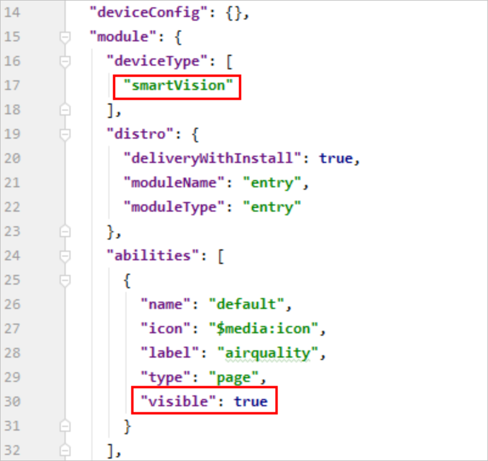

# Preparations

## Building the Development Environment

Set up the environment by performing operations provided in  **Environment Setup**  of the  [DevEco Studio User Guide](https://developer.harmonyos.com/en/docs/documentation/doc-guides/tools_overview-0000001053582387).

## Creating a Project

The DevEco Studio provides only basic development functions. GUI preview and code commissioning will be provided in the next version.

Perform the following steps to create a project. Currently, projects of the  **smartVision**  type cannot be created directly.

1.  Start the DevEco Studio, choose  **File**  \>  **Project**  and select  **Lite Wearable**  for  **Device**  and  **Empty Feature Ability**  for  **Template**.

    **Figure  1**  Selecting project template  
    

2.  After the creation is successful, modify the  **config.json**  file in  **entry**  \>  **src**  \>  **main**.
    1.  Change the value of  **"deviceType"**  to  **"smartVision"**.
    2.  Add the  **"visible"**  attribute to the  **"abilities"**  array and set the attribute value to  **true**.

        **Figure  2**  Modifying the template  
        

