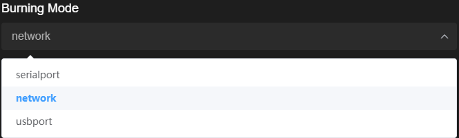

# Developing the First Example Program Running on Hi3516<a name="EN-US_TOPIC_0000001052906247"></a>

-   [Acquiring Source Code](#section215953714245)
-   [Modifying a Program](#s8efc1952ebfe4d1ea717182e108c29bb)
-   [Building](#section1077671315253)
-   [Burning](#section08153912587)
-   [Running an Image](#section380511712615)
-   [Running a Program](#section5276734182615)

This section describes how to modify, compile, burn, and run the first program, and finally print  **Hello OHOS!**  on the develop board.

## Acquiring Source Code<a name="section215953714245"></a>

You need to acquire  [Hi3516 source code](https://repo.huaweicloud.com/harmonyos/os/1.0/code-1.0.tar.gz), download it on a Linux server, and decompress it. For more obtaining methods, see  [Source Code Acquisition](../get-code/source-code-acquisition.md).

## Modifying a Program<a name="s8efc1952ebfe4d1ea717182e108c29bb"></a>

The code of  **helloworld.c**  in the  **applications/sample/camera/app/src**  directory is shown in the following example. You can customize the content to be printed. For example, you can change  **OHOS**  to  **World**. You can use either C or C++ to develop a program.

```
#include <stdio.h>
#include "los_sample.h"

int main(int argc, char **argv)
{
    printf("\n************************************************\n");
    printf("\n\t\tHello OHOS!\n");
    printf("\n************************************************\n\n");

    LOS_Sample(g_num);

    return 0;
}
```

## Building<a name="section1077671315253"></a>

If the Linux environment is installed using Docker, perform the compilation by referring to  [Using Docker to Prepare the Build Environment](../get-code/tool-acquisition.md). If the Linux environment is installed using a software package, go to the root directory of the source code and run the following command for source code compilation:

```
python build.py ipcamera_hi3516dv300 -b debug
```

The result files are generated in the  **out/ipcamera\_hi3518ev300**  directory.

## Burning<a name="section08153912587"></a>

The Hi3516 development board allows you to burn flash memory over the USB port, serial port, or network port. The following uses the network port burning as an example.

1.  Connect the PC and the target development board through the power port, serial port, and network port. In this section, the Hi3516DV300 is used as an example. For details, please refer to  [Introduction to the Hi3516 Development Board](https://device.harmonyos.com/en/docs/start/introduce/oem_camera_start_3516-0000001052670587).
2.  <a name="en-us_topic_0000001071634529_li142386399535"></a>Open Device Manager, then check and record the serial port number corresponding to the development board.

    > **NOTE:** 
    >If the serial port number is not displayed correctly, follow the steps described in  [Installing the Serial Port Driver on the Hi3516 or Hi3518 Series Development Boards](https://device.harmonyos.com/en/docs/ide/user-guides/hi3516_hi3518-drivers-0000001050743695).

    

3.  Go to  **Configure**  \>  **Burn**. On the displayed page, set the programming information.

    

4.  Set  **Burning Mode**  to  **network**.

    

5.  Set the programming parameters.
    -   Set  **Port number**  to the serial port number recorded in  [2](#en-us_topic_0000001071634529_li142386399535).
    -   Retain the default values for the baud rate and data bits, which have been adapted for the development board.
    -   Set network connection parameters.

        -   **Host IP address**: IP address of the local PC. You can run the  **ipconfig**  command in the CLT to view the IP address.
        -   **Remote IP address**: IP address of the development board, which is automatically populated.
        -   **Gateway**: gateway of the development board, which is automatically populated.
        -   **Subnet mask**: subnet mask, which is automatically populated.
        -   **MAC address of board**: physical address of the development board. Retain the default value.

        

    -   Set the memory type. The settings are related to the receive type of the hardware. For details, please refer to the user guide delivered with the hardware. For example, the value is fixed at EMMC for Hi3516DV300.
    -   Set the information about the files to be written according to the following table. The U-Boot file is not supported for programming through the network port.

        <a name="en-us_topic_0000001071634529_table833816126143"></a>
        <table><thead align="left"><tr id="en-us_topic_0000001071634529_row123381912111410"><th class="cellrowborder" valign="top" width="25%" id="mcps1.1.5.1.1"><p id="en-us_topic_0000001071634529_p933816122140"><a name="en-us_topic_0000001071634529_p933816122140"></a><a name="en-us_topic_0000001071634529_p933816122140"></a>File Name</p>
        </th>
        <th class="cellrowborder" valign="top" width="25%" id="mcps1.1.5.1.2"><p id="en-us_topic_0000001071634529_p1533819122144"><a name="en-us_topic_0000001071634529_p1533819122144"></a><a name="en-us_topic_0000001071634529_p1533819122144"></a>Start Address</p>
        </th>
        <th class="cellrowborder" valign="top" width="24.98%" id="mcps1.1.5.1.3"><p id="en-us_topic_0000001071634529_p1733831231411"><a name="en-us_topic_0000001071634529_p1733831231411"></a><a name="en-us_topic_0000001071634529_p1733831231411"></a>File Size</p>
        </th>
        <th class="cellrowborder" valign="top" width="25.019999999999996%" id="mcps1.1.5.1.4"><p id="en-us_topic_0000001071634529_p1433851211145"><a name="en-us_topic_0000001071634529_p1433851211145"></a><a name="en-us_topic_0000001071634529_p1433851211145"></a>Enable</p>
        </th>
        </tr>
        </thead>
        <tbody><tr id="en-us_topic_0000001071634529_row6339412101413"><td class="cellrowborder" valign="top" width="25%" headers="mcps1.1.5.1.1 "><p id="en-us_topic_0000001071634529_p14339131221416"><a name="en-us_topic_0000001071634529_p14339131221416"></a><a name="en-us_topic_0000001071634529_p14339131221416"></a>OHOS_Image.bin</p>
        </td>
        <td class="cellrowborder" valign="top" width="25%" headers="mcps1.1.5.1.2 "><p id="en-us_topic_0000001071634529_p133901211419"><a name="en-us_topic_0000001071634529_p133901211419"></a><a name="en-us_topic_0000001071634529_p133901211419"></a>1M</p>
        </td>
        <td class="cellrowborder" valign="top" width="24.98%" headers="mcps1.1.5.1.3 "><p id="en-us_topic_0000001071634529_p1533951261412"><a name="en-us_topic_0000001071634529_p1533951261412"></a><a name="en-us_topic_0000001071634529_p1533951261412"></a>9M</p>
        </td>
        <td class="cellrowborder" valign="top" width="25.019999999999996%" headers="mcps1.1.5.1.4 "><p id="en-us_topic_0000001071634529_p2574183818223"><a name="en-us_topic_0000001071634529_p2574183818223"></a><a name="en-us_topic_0000001071634529_p2574183818223"></a>Select the check box if this is the first time you are programing flash memory on the development board or if the content related to the kernel and driver is modified.</p>
        </td>
        </tr>
        <tr id="en-us_topic_0000001071634529_row533914120143"><td class="cellrowborder" valign="top" width="25%" headers="mcps1.1.5.1.1 "><p id="en-us_topic_0000001071634529_p8339112111412"><a name="en-us_topic_0000001071634529_p8339112111412"></a><a name="en-us_topic_0000001071634529_p8339112111412"></a>rootfs.img</p>
        </td>
        <td class="cellrowborder" valign="top" width="25%" headers="mcps1.1.5.1.2 "><p id="en-us_topic_0000001071634529_p733921271410"><a name="en-us_topic_0000001071634529_p733921271410"></a><a name="en-us_topic_0000001071634529_p733921271410"></a>10M</p>
        </td>
        <td class="cellrowborder" valign="top" width="24.98%" headers="mcps1.1.5.1.3 "><p id="en-us_topic_0000001071634529_p13339181214145"><a name="en-us_topic_0000001071634529_p13339181214145"></a><a name="en-us_topic_0000001071634529_p13339181214145"></a>15M</p>
        </td>
        <td class="cellrowborder" rowspan="2" valign="top" width="25.019999999999996%" headers="mcps1.1.5.1.4 "><p id="en-us_topic_0000001071634529_p233901211146"><a name="en-us_topic_0000001071634529_p233901211146"></a><a name="en-us_topic_0000001071634529_p233901211146"></a>Select the check boxes if this is the first time you are programing flash memory on the development board or if the files have been modified. It is recommended that you always select these check boxes.</p>
        </td>
        </tr>
        <tr id="en-us_topic_0000001071634529_row1333901281418"><td class="cellrowborder" valign="top" headers="mcps1.1.5.1.1 "><p id="en-us_topic_0000001071634529_p53391912131416"><a name="en-us_topic_0000001071634529_p53391912131416"></a><a name="en-us_topic_0000001071634529_p53391912131416"></a>userfs.img</p>
        </td>
        <td class="cellrowborder" valign="top" headers="mcps1.1.5.1.2 "><p id="en-us_topic_0000001071634529_p193391612161414"><a name="en-us_topic_0000001071634529_p193391612161414"></a><a name="en-us_topic_0000001071634529_p193391612161414"></a>25M</p>
        </td>
        <td class="cellrowborder" valign="top" headers="mcps1.1.5.1.3 "><p id="en-us_topic_0000001071634529_p433918121148"><a name="en-us_topic_0000001071634529_p433918121148"></a><a name="en-us_topic_0000001071634529_p433918121148"></a>50M</p>
        </td>
        </tr>
        </tbody>
        </table>

        


6.  When you have done, click  **Save**  at the bottom to save the settings.
7.  Click    next to  **Burn**  to start programming.

    

8.  Restart the development board within 15 seconds.
9.  Wait until the programming is complete. If the following information is displayed on the console, it indicates that the programming is successful.

    

10. If this is the first time you use the development board, use the  [serial port tool](https://device.harmonyos.com/en/docs/ide/user-guides/serial_port-0000001057649420)  to modify the bootcmd and bootargs contents of U-Boot. For details, please refer to  [Running an Image on the Hi3516](https://device.harmonyos.com/en/docs/start/introduce/oem_camera_start_first_example-0000001051610926#EN-US_TOPIC_0000001052906247__section380511712615).

## Running an Image<a name="section380511712615"></a>

1.  Connect to a serial port.

    > **NOTICE:** 
    >If the connection fails, rectify the fault by referring to  [What should I do when no command output is displayed?](faq-on-hi3516.md#section14871149155911).

    **Figure  1**  Serial port connection<a name="fig056645018495"></a>  
    

    

    1.  Click  **Serial port**  to enable it.
    2.  Enter the serial port number queried in the "Burning" section \(COM11 is used in this example\) and press  **Enter**  until  **hisillicon**  is displayed.
    3.  Go to step  [2](#l5b42e79a33ea4d35982b78a22913b0b1)  if the board is started for the first time or the startup parameters need to be modified; go to step  [3](#ld26f18828aa44c36bfa36be150e60e49)  otherwise.

2.  <a name="l5b42e79a33ea4d35982b78a22913b0b1"></a>\(Mandatory when the board is started for the first time\) Modify the bootcmd and bootargs parameters of U-boot. You need to perform this step only once if the parameters need not to be modified during the operation. The board automatically starts after it is reset.

    > **NOTICE:** 
    >The default waiting time in the U-boot is 2s. You can press  **Enter**  to interrupt the waiting and run the  **reset**  command to restart the system after "hisillicon" is displayed.

    **Table  1**  Parameters of the U-boot

    <a name="table1323441103813"></a>
    <table><thead align="left"><tr id="row1423410183818"><th class="cellrowborder" valign="top" width="50%" id="mcps1.2.3.1.1"><p id="p623461163818"><a name="p623461163818"></a><a name="p623461163818"></a>Command</p>
    </th>
    <th class="cellrowborder" valign="top" width="50%" id="mcps1.2.3.1.2"><p id="p42341014388"><a name="p42341014388"></a><a name="p42341014388"></a>Description</p>
    </th>
    </tr>
    </thead>
    <tbody><tr id="row1623471113817"><td class="cellrowborder" valign="top" width="50%" headers="mcps1.2.3.1.1 "><p id="p102341719385"><a name="p102341719385"></a><a name="p102341719385"></a>setenv bootcmd "mmc read 0x0 0x80000000 0x800 0x4800; go 0x80000000";</p>
    </td>
    <td class="cellrowborder" valign="top" width="50%" headers="mcps1.2.3.1.2 "><p id="p92347120389"><a name="p92347120389"></a><a name="p92347120389"></a>Run this command to read content that has a size of 0x4800 (9 MB) and a start address of 0x800 (1 MB) to the memory address 0x80000000. The file size must be the same as that of the <strong id="b9140538191313"><a name="b9140538191313"></a><a name="b9140538191313"></a>OHOS_Image.bin</strong> file in the IDE.</p>
    </td>
    </tr>
    <tr id="row12234912381"><td class="cellrowborder" valign="top" width="50%" headers="mcps1.2.3.1.1 "><p id="p172306219392"><a name="p172306219392"></a><a name="p172306219392"></a>setenv bootargs "console=ttyAMA0,115200n8 root=emmc fstype=vfat rootaddr=10 M rootsize=15 M rw";</p>
    </td>
    <td class="cellrowborder" valign="top" width="50%" headers="mcps1.2.3.1.2 "><p id="p13489329396"><a name="p13489329396"></a><a name="p13489329396"></a>Run this command to set the output mode to serial port output, baud rate to <strong id="b1378372812210"><a name="b1378372812210"></a><a name="b1378372812210"></a>115200</strong>, data bit to <strong id="b27871628822"><a name="b27871628822"></a><a name="b27871628822"></a>8</strong>, <strong id="b678811281528"><a name="b678811281528"></a><a name="b678811281528"></a>rootfs</strong> to be mounted to the <strong id="b978813281220"><a name="b978813281220"></a><a name="b978813281220"></a>emmc</strong> component, and file system type to <strong id="b12788132814217"><a name="b12788132814217"></a><a name="b12788132814217"></a>vfat</strong>.</p>
    <p id="p12481832163913"><a name="p12481832163913"></a><a name="p12481832163913"></a><strong id="b965011165313"><a name="b965011165313"></a><a name="b965011165313"></a>rootaddr=10 M, rootsize=15 M rw</strong> indicates the start address and size of the rootfs.img file to be burnt, respectively. The file size must be the same as that of the <strong id="b69061726113015"><a name="b69061726113015"></a><a name="b69061726113015"></a>rootfs.img</strong> file in the IDE.</p>
    </td>
    </tr>
    <tr id="row18234161153820"><td class="cellrowborder" valign="top" width="50%" headers="mcps1.2.3.1.1 "><p id="p823417118386"><a name="p823417118386"></a><a name="p823417118386"></a>saveenv</p>
    </td>
    <td class="cellrowborder" valign="top" width="50%" headers="mcps1.2.3.1.2 "><p id="p32341616389"><a name="p32341616389"></a><a name="p32341616389"></a><strong id="b16238195319315"><a name="b16238195319315"></a><a name="b16238195319315"></a>saveenv</strong> means to save the current configuration.</p>
    </td>
    </tr>
    <tr id="row192345113811"><td class="cellrowborder" valign="top" width="50%" headers="mcps1.2.3.1.1 "><p id="p7235111183819"><a name="p7235111183819"></a><a name="p7235111183819"></a>reset</p>
    </td>
    <td class="cellrowborder" valign="top" width="50%" headers="mcps1.2.3.1.2 "><p id="p123781411114016"><a name="p123781411114016"></a><a name="p123781411114016"></a><strong id="b32719232420"><a name="b32719232420"></a><a name="b32719232420"></a>reset</strong> means to reset the board.</p>
    </td>
    </tr>
    </tbody>
    </table>

    > **NOTICE:** 
    >**go 0x80000000**  \(optional\) indicates that the command is fixed in the startup parameters by default and the board automatically starts after it is reset. If you want to manually start the board, press  **Enter**  in the countdown phase of the U-boot startup to interrupt the automatic startup.

3.  <a name="ld26f18828aa44c36bfa36be150e60e49"></a>Run the  **reset**  command and press  **Enter**  to restart the board. After the board is restarted,  **OHOS**  is displayed when you press  **Enter**.

    **Figure  2**  System startup<a name="fig10181006376"></a>  
    

    


## Running a Program<a name="section5276734182615"></a>

In the root directory, run the  **./bin/camera\_app**  command to operate the demo program. The compilation result is shown in the following example.

**Figure  3**  Program started successfully<a name="fig36537913815"></a>  


