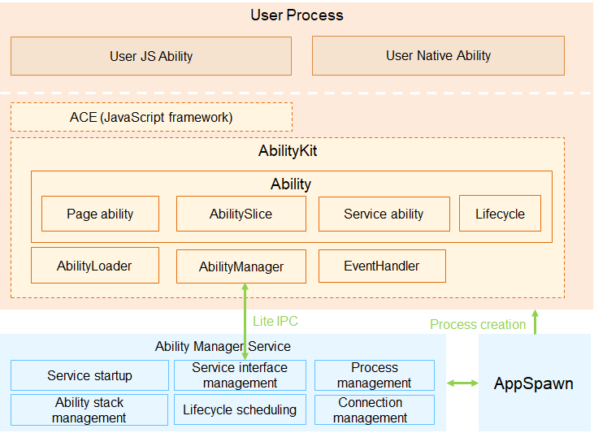

# Application Framework<a name="EN-US_TOPIC_0000001052619284"></a>

## Overview<a name="section11660541593"></a>

The application framework of OpenHarmony consists of two modules:  **ability management framework**  and  **bundle management framework**.

**1. Ability management framework**: This framework is provided by OpenHarmony for you to develop OpenHarmony applications. The following figure shows the modules in the ability management framework.

**Figure  1**  Architecture of the Ability management framework<a name="fig18932193213292"></a>  


-   **AbilityKit**  is a development kit provided by the ability management framework. You can use this kit to develop applications based on the  **Ability**  component. There are two types of applications developed based on the  **Ability**  component:  **JS Ability**  developed using the JavaScript language and  **Native Ability**  developed using the C/C++ language. The  **ACE**  framework encapsulates JavaScript UI components on the basis of the AbilityKit and is used to help you quickly develop JS Ability-based applications.
-   **Ability**  is the minimum unit for the system to schedule applications. It is a component that can implement an independent functionality. An application can contain one or more  **Ability**  instances. There are two types of templates that you can use to create an  **Ability**  instance: Page and Service.
    -   An  **Ability using the Page template**  \(Page ability for short\) provides a UI for interacting with users.
    -   An  **Ability using the Service template**  does not have a UI and is used for running background tasks.

-   An  **AbilitySlice**  represents a single screen and its control logic. It is specific to Page abilities. A Page ability may contain one ability slice or multiple ability slices that provide highly relevant capabilities. The following figure shows the relationship between a Page ability and its ability slices.

    **Figure  2**  Relationship between a Page ability and its ability slices<a name="fig121541746182919"></a>  
    


-   **Lifecycle**  is a general term for all states of an ability, including  **UNINITIALIZED**,  **INITIAL**,  **INACTIVE**,  **ACTIVE**, and  **BACKGROUND**. The following figure shows the lifecycle state transition of an ability.

    **Figure  3**  Lifecycle state transition of a Page ability<a name="fig4915165922910"></a>  
    

    Description of ability lifecycle states:

    -   **UNINITIALIZED**: The ability is not initialized. This state is a temporary state. An ability changes directly to the  **INITIAL**  state upon its creation.

    -   **INITIAL**: This state refers to the initial or stopped state. The ability in this state is not running. The ability enters the  **INACTIVE**  state after it is started.

    -   **INACTIVE**: The ability is visible but does not gain focus. This state is the same as the  **ACTIVE**  state because the concept of window focus is not supported currently.

    -   **ACTIVE**: The ability is in the foreground and has focus. The ability changes from the  **ACTIVE**  state to the  **INACTIVE**  state before returning to the background.

    -   **BACKGROUND**: The ability returns to the background. After being re-activated, the ability enters the  **ACTIVE**  state. After being destroyed, the ability enters the  **INITIAL**  state.


-   **AbilityLoader**  is used to register and load  **Ability**  classes. After creating an  **Ability**  class, you should first call the registration API defined in  **AbilityLoader**  to register the  **Ability**  class name with the ability management framework so that this  **Ability**  can be instantiated when being started.
-   **AbilityManager**  enables inter-process communication \(IPC\) between the AbilityKit and Ability Manager Service.
-   **EventHandler**  is provided by the AbilityKit to enable inter-thread communication between abilities.
-   The  **Ability Manager Service**  is a system service used to coordinate the running relationships and lifecycle states of  **Ability**  instances. It consists of the following modules:
    -   The  **service startup module**  starts and registers the Ability Manager Service.
    -   The  **service interface management module**  manages external capabilities provided by the Ability Manager Service.
    -   The  **process management module**  starts and destroys processes where  **Ability**  instances are running, and maintains the process information.
    -   The  **ability stack management module**  maintains the presentation sequence of abilities in the stack.
    -   The  **lifecycle scheduling module**  changes an ability to a particular state based on the current operation of the system.
    -   The  **connection management module**  manages connections to Service abilities.

-   The  **AppSpawn**  is a system service used to create the process for running an ability. This service has high permissions. It sets permissions for  **Ability**  instances and pre-loads some common modules to accelerate application startup.

**2. Bundle management framework**: This framework is provided by OpenHarmony for you to manage application bundles. The following figure shows the modules in the bundle management framework.

**Figure  4**  Architecture of the bundle management framework<a name="fig1047932418305"></a>  


-   **BundleKit**: includes external APIs provided by the Bundle Manager Service, including the APIs for application installation and uninstallation, bundle information query, and bundle state change listeners.
-   **Bundle scanning module**: parses pre-installed or installed bundles on the local device and extracts information from them for the bundle management module to manage and make the information persistent for storage.

-   **Bundle installation module**: installs, uninstalls, and updates a bundle. The  **Bundle installation service**  is an independent process used to create or delete installation directories and has high permissions.

-   **Bundle management module**: manages information related to application bundles and stores persistent bundle information.

-   **Bundle security management module**: verifies signatures, and grants and manages permissions.

## Directory Structure<a name="section1464106163817"></a>

The following table describes the source code directory structure of the application framework.

**Table  1**  Source code directory structure of the application framework

<a name="table2977131081412"></a>
<table><thead align="left"><tr id="row7977610131417"><th class="cellrowborder" valign="top" width="36.18%" id="mcps1.2.3.1.1"><p id="p18792459121314"><a name="p18792459121314"></a><a name="p18792459121314"></a>Directory</p>
</th>
<th class="cellrowborder" valign="top" width="63.82%" id="mcps1.2.3.1.2"><p id="p77921459191317"><a name="p77921459191317"></a><a name="p77921459191317"></a>Description</p>
</th>
</tr>
</thead>
<tbody><tr id="row17977171010144"><td class="cellrowborder" valign="top" width="36.18%" headers="mcps1.2.3.1.1 "><p id="p2793159171311"><a name="p2793159171311"></a><a name="p2793159171311"></a>foundation/aafwk/frameworks/ability_lite</p>
</td>
<td class="cellrowborder" valign="top" width="63.82%" headers="mcps1.2.3.1.2 "><p id="p879375920132"><a name="p879375920132"></a><a name="p879375920132"></a>Core code of the ability management framework</p>
</td>
</tr>
<tr id="row6978161091412"><td class="cellrowborder" valign="top" width="36.18%" headers="mcps1.2.3.1.1 "><p id="p0780163617556"><a name="p0780163617556"></a><a name="p0780163617556"></a>foundation/aafwk/frameworks/abilitymgr_lite</p>
</td>
<td class="cellrowborder" valign="top" width="63.82%" headers="mcps1.2.3.1.2 "><p id="p6793059171318"><a name="p6793059171318"></a><a name="p6793059171318"></a>Client code for managing the communication between the AbilityKit and Ability Manager Service</p>
</td>
</tr>
<tr id="row6978201031415"><td class="cellrowborder" valign="top" width="36.18%" headers="mcps1.2.3.1.1 "><p id="p991413565611"><a name="p991413565611"></a><a name="p991413565611"></a>foundation/aafwk/frameworks/want_lite</p>
</td>
<td class="cellrowborder" valign="top" width="63.82%" headers="mcps1.2.3.1.2 "><p id="p0793185971316"><a name="p0793185971316"></a><a name="p0793185971316"></a>Implementation code of the information carrier used for interaction between abilities</p>
</td>
</tr>
<tr id="row1897841071415"><td class="cellrowborder" valign="top" width="36.18%" headers="mcps1.2.3.1.1 "><p id="p20749155715720"><a name="p20749155715720"></a><a name="p20749155715720"></a>foundation/aafwk/interfaces/kits/abilitykit_lite</p>
</td>
<td class="cellrowborder" valign="top" width="63.82%" headers="mcps1.2.3.1.2 "><p id="p14793959161317"><a name="p14793959161317"></a><a name="p14793959161317"></a>External APIs of the ability management framework</p>
</td>
</tr>
<tr id="row965423512587"><td class="cellrowborder" valign="top" width="36.18%" headers="mcps1.2.3.1.1 "><p id="p12654103516589"><a name="p12654103516589"></a><a name="p12654103516589"></a>foundation/aafwk/interfaces/innerkits/abilitymgr_lite</p>
</td>
<td class="cellrowborder" valign="top" width="63.82%" headers="mcps1.2.3.1.2 "><p id="p12658142611466"><a name="p12658142611466"></a><a name="p12658142611466"></a>APIs provided by the Ability Manager Service to other subsystems</p>
</td>
</tr>
<tr id="row673463115813"><td class="cellrowborder" valign="top" width="36.18%" headers="mcps1.2.3.1.1 "><p id="p127343312581"><a name="p127343312581"></a><a name="p127343312581"></a>foundation/aafwk/interfaces/kits/want_lite</p>
</td>
<td class="cellrowborder" valign="top" width="63.82%" headers="mcps1.2.3.1.2 "><p id="p191041469363"><a name="p191041469363"></a><a name="p191041469363"></a>External APIs of the information carrier used for interaction between abilities</p>
</td>
</tr>
<tr id="row164593855812"><td class="cellrowborder" valign="top" width="36.18%" headers="mcps1.2.3.1.1 "><p id="p1864523835812"><a name="p1864523835812"></a><a name="p1864523835812"></a>foundation/aafwk/services/abilitymgr_lite</p>
</td>
<td class="cellrowborder" valign="top" width="63.82%" headers="mcps1.2.3.1.2 "><p id="p4645133805811"><a name="p4645133805811"></a><a name="p4645133805811"></a>Implementation code of the Ability Manager Service</p>
</td>
</tr>
<tr id="row1869744111581"><td class="cellrowborder" valign="top" width="36.18%" headers="mcps1.2.3.1.1 "><p id="p10698114117583"><a name="p10698114117583"></a><a name="p10698114117583"></a>foundation/appexecfwk/interfaces/kits/bundle_lite</p>
</td>
<td class="cellrowborder" valign="top" width="63.82%" headers="mcps1.2.3.1.2 "><p id="p1169814112585"><a name="p1169814112585"></a><a name="p1169814112585"></a>External bundle management APIs provided by the bundle management framework</p>
</td>
</tr>
<tr id="row106931420217"><td class="cellrowborder" valign="top" width="36.18%" headers="mcps1.2.3.1.1 "><p id="p86931748213"><a name="p86931748213"></a><a name="p86931748213"></a>foundation/appexecfwk/interfaces/innerkits/bundlemgr_lite</p>
</td>
<td class="cellrowborder" valign="top" width="63.82%" headers="mcps1.2.3.1.2 "><p id="p12693148215"><a name="p12693148215"></a><a name="p12693148215"></a>APIs provided by the Bundle Manager Service to other subsystems</p>
</td>
</tr>
<tr id="row58381913213"><td class="cellrowborder" valign="top" width="36.18%" headers="mcps1.2.3.1.1 "><p id="p11839171152117"><a name="p11839171152117"></a><a name="p11839171152117"></a>foundation/appexecfwk/frameworks/bundle_lite</p>
</td>
<td class="cellrowborder" valign="top" width="63.82%" headers="mcps1.2.3.1.2 "><p id="p158391810217"><a name="p158391810217"></a><a name="p158391810217"></a>Client code for managing the communication between the BundleKit and Bundle Manager Service</p>
</td>
</tr>
<tr id="row1786831216357"><td class="cellrowborder" valign="top" width="36.18%" headers="mcps1.2.3.1.1 "><p id="p1686820126359"><a name="p1686820126359"></a><a name="p1686820126359"></a>foundation/appexecfwk/utils/bundle_lite</p>
</td>
<td class="cellrowborder" valign="top" width="63.82%" headers="mcps1.2.3.1.2 "><p id="p88681125351"><a name="p88681125351"></a><a name="p88681125351"></a>Tool code used in the implementation of the Bundle Manager Service</p>
</td>
</tr>
<tr id="row841015115218"><td class="cellrowborder" valign="top" width="36.18%" headers="mcps1.2.3.1.1 "><p id="p14119113219"><a name="p14119113219"></a><a name="p14119113219"></a>foundation/appexecfwk/services/bundlemgr_lite</p>
</td>
<td class="cellrowborder" valign="top" width="63.82%" headers="mcps1.2.3.1.2 "><p id="p64110114210"><a name="p64110114210"></a><a name="p64110114210"></a>Implementation code of the Bundle Manager Service</p>
</td>
</tr>
</tbody>
</table>

## Constraints<a name="section1718733212019"></a>

-   Language version
    -   C++11 or later

-   The specifications of the application framework vary depending on the System-on-a-Chip \(SoC\) and underlying OS capabilities.
    -   Cortex-M RAM and ROM:
        -   RAM: greater than 20 KB \(recommended\)
        -   ROM: greater than 300 KB \(for the ACE framework and related subsystems, such as UIKit and engine\)

    -   Cortex-A RAM and ROM
        -   RAM: greater than 2 MB \(recommended\)
        -   ROM: greater than 2 MB \(for the ACE framework and related subsystems, such as UIKit and engine\)


## Compiling the Application Framework<a name="section6514141420509"></a>

-   Add the configuration for application framework compilation. The following section uses  **hi3516dv300\_liteos\_a**  as an example:

    -   Add the configuration of  **appexecfwk**  and  **aafwk**  under the  **subsystem\_list**  field in the  **build/lite/platform/hi3516dv300\_liteos\_a/platform.json**  file. The sample code is as follows:

    ```
    {
         "name":"aafwk",
         "project":"hmf/aafwk/services/abilitymgr_lite",
         "path":"build/lite/config/subsystem/aafwk",
         "dir":"foundation/aafwk/services/abilitymgr_lite",
         "desc":"Ability Services Manager",
         "requirement":"yes",
         "default":"yes",
         "selected":"yes"
    },
    {
         "name":"appexecfwk",
         "project": "hmf/appexecfwk/services/bundlemgr_lite",
         "path": "build/lite/config/subsystem/appexecfwk",
         "dir": "foundation/appexecfwk/services/bundlemgr_lite",
         "desc":"Bundle Services Manager",
         "requirement":"yes",
         "default":"yes",
         "selected":"yes"
    },
    ```

    -   Add the configuration of  **appexecfwk**  and  **aafwk**  under the  **template\_subsystem\_list**  field in the  **build/lite/platform/hi3516dv300\_liteos\_a/template/ipcamera.json**  file. The sample code is as follows:

    ```
    "template_subsystem_list" : [
         ......
         "distributedschedule",
         "aafwk",
         "appexecfwk",
         "communication",
         ......
    ],
    ```

    -   Add the configuration of particular application framework components for compilation in  **build/lite/config/subsystem/aafwk/BUILD.gn**  and  **/build/lite/config/subsystem/appexecfwk/BUILD.gn**. The sample code is as follows:

    ```
    import("//build/lite/config/subsystem/lite_subsystem.gni")
    
    lite_subsystem("aafwk") {
        subsystem_components = [
            "//foundation/aafwk/frameworks/kits/ability_lite:aafwk_abilitykit_lite",
            "//foundation/aafwk/frameworks/kits/ability_lite:aafwk_abilityMain_lite",
            "//foundation/aafwk/services/abilitymgr_lite:aafwk_services_lite",
            "//foundation/aafwk/frameworks/kits/tools_lite:tools_lite",
            "//foundation/aafwk/frameworks/kits/ability_lite/test:aafwk_testapp_lite",
        ]
    }
    ```

    ```
    import("//build/lite/config/subsystem/lite_subsystem.gni")
    
    lite_subsystem("appexecfwk") {
        subsystem_components = [
            "//foundation/appexecfwk/kits/appkit_lite:appexecfwk_kit_lite",
            "//foundation/appexecfwk/services/bundlemgr_lite:appexecfwk_services_lite",
        ]
    }
    ```

    -   Add the configuration of service modules for compilation in  **foundation/aafwk**  and  **foundation/appexecfwk**. Each module has its own  **BUILD.gn**  file.

-   After the preceding configurations are complete, run the following command to compile the entire system:

```
python build.py ipcamera -p hi3516dv300_liteos_a -b debug
```

## Running the Two Services in the Application Framework<a name="section1048719468503"></a>

-   The application framework has two system services  **Ability Manager Service**  and  **Bundle Manager Service**. They are running in the foundation process.
-   **Ability Manager Service**  and  **Bundle Manager Service**  are registered with  **sa\_manager**.  **sa\_manager**  runs in the foundation process and sets up a thread runtime environment for the two services. For details about how to create and use  **Ability Manager Service**  and  **Bundle Manager Service**, see  [Service Framework](en-us_topic_0000001051589563.md).
-   Add the configuration of  **abilityms**  and  **bundlems**  for compilation in  **foundation/distributedschedule/services/safwk\_lite/BUILD.gn**. The sample code is as follows:

```
deps = [
    "//foundation/distributedschedule/services/samgr_lite/samgr_server:server",
    "//base/dfx/lite/liteos-a/source/log:hilog_a_shared",
    "//foundation/aafwk/services/abilitymgr_lite:abilityms",
    "//foundation/appexecfwk/services/bundlemgr_lite:bundlems",
    "//base/security/services/iam_lite:pms_target",
    "//foundation/distributedschedule/services/dtbschedmgr_lite:dtbschedmgr",
]
```

## Running an Ability Developed Based on AbilityKit<a name="section16249444135119"></a>

-   The demo code of the ability developed based on AbilityKit is stored in the  **foundation/aafwk/frameworks/kits/ability\_lite/test**  directory. If you need to modify the functionality, modify the code in the  **unittest**  file or add a code file, and update the configuration in  **BUILD.gn**  accordingly.
-   Run the following command in the shell to compile the demo. After the compilation is successful, the  **libLauncher.so**  file is generated in  **out/ipcamera\_hi3516dv300\_liteos\_a**.

    ```
    python build.py ipcamera -p hi3516dv300_liteos_a -T //foundation/aafwk/frameworks/kits/ability_lite/test:Launcher
    ```

-   Modify the  **config.json**  file. The example content is as follows:

```
{
    "app": {
        "bundleName": "com.huawei.launcher",
        "vendor": "huawei",
        "version": {
            "code": 1,
            "name": "1.0"
        },
       "apiVersion": {
          "compatible": 3,
          "target": 3
       }
    },
    "deviceConfig": {
        "default": {
            "keepAlive": false
        },
    },
    "module": {
        "deviceType": [
            "smartVision"
        ], 
        "distro": {
            "deliveryWithInstall": true, 
            "moduleName": "Launcher", 
            "moduleType": "entry"
        },
        "abilities": [{
            "name": "MainAbility",
            "icon": "assets/entry/resources/base/media/icon.png",
            "label": "test app 1", 
            "launchType": "standard",
            "type": "page",
            "visible": true
        },
        {
            "name": "SecondAbility",
            "icon": "assets/entry/resources/base/media/icon.png",
            "label": "test app 2", 
            "launchType": "standard",
            "type": "page",
            "visible": true
        },
        {
            "name": "ServiceAbility",
            "icon": "",
            "label": "test app 2", 
            "launchType": "standard",
            "type": "service",
            "visible": true
        }
        ]
    }
}
```

-   Generate a HAP.
    -   Add resource files to the  **assets/entry/resources/base/media**  directory based on the following directory structure.

        

    -   Compress the preceding files into a ZIP package and change the file name extension to  **.hap**, for example,  **Launcher.hap**.

-   Install the HAP.

    -   Place the preceding HAP file in a particular directory \(**/nfs/hap/**  in this example\).
    -   Run the following command to install the HAP:

    ```
    ./bin/bm install -p /nfs/hap/Launcher.hap
    ```

-   After the installation is complete, run the following command to run the demo:

```
./bin/aa start -p com.huawei.launcher -n MainAbility
```

## Repositories Involved<a name="section93061357133720"></a>

aafwk\_frameworks\_kits\_ability\_lite

aafwk\_interfaces\_innerkits\_abilitykit\_lite

aafwk\_frameworks\_kits\_content\_lite

aafwk\_interfaces\_innerkits\_abilitymgr\_lite

aafwk\_interfaces\_innerkits\_intent\_lite

aafwk\_interfaces\_kits\_ability\_lite

aafwk\_services\_abilitymgr\_lite

appexecfwk\_frameworks\_bundle\_lite

appexecfwk\_interfaces\_innerkits\_bundlemgr\_lite

appexecfwk\_interfaces\_innerkits\_appexecfwk\_lite

appexecfwk\_services\_bundlemgr\_lite

appexecfwk\_kits\_appkit\_lite

