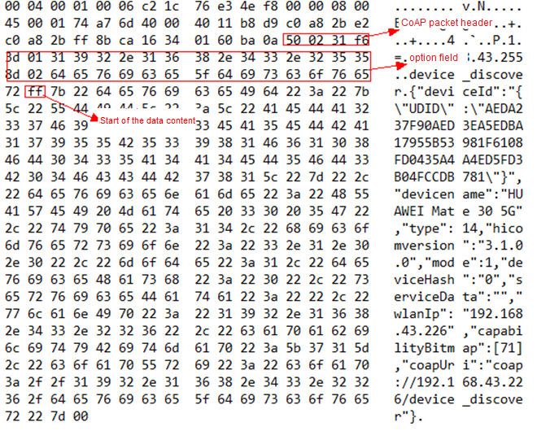

# Distributed Communication Subsystem<a name="EN-US_TOPIC_0000001051344287"></a>

## Overview<a name="section11660541593"></a>

The use of different communication modes \(such as USB, WLAN, and Bluetooth\) varies greatly and is complex. In addition, the convergence, sharing, and conflicts between communication links cannot be resolved, and communication security is difficult to guarantee. The distributed communication subsystem manages unified distributed communication between near-field devices and provides device discovery and data transmission APIs that apply to all links. Currently, the following features are available:

-   Service publishing: After a service is published, peripheral devices can discover and use it.
-   Data transmission: A session is established based on the service name and device ID to transmit data between services.
-   Security: Communication data is encrypted.

You can use APIs of the distributed communication subsystem to implement fast and secure communication between devices without caring about management of communication details, thereby achieving cross-platform development.

## Directory Structure<a name="section1464106163817"></a>

The following figure shows the softbus\_lite source code directory structure.

**Table 1**  softbus\_lite source code directory structure

<a name="table1843451445317"></a>
<table><thead align="left"><tr id="row16552191445314"><th class="cellrowborder" valign="top" width="50%" id="mcps1.1.3.1.1"><p id="p75521114125314"><a name="p75521114125314"></a><a name="p75521114125314"></a>Name</p>
</th>
<th class="cellrowborder" valign="top" width="50%" id="mcps1.1.3.1.2"><p id="p2055231419539"><a name="p2055231419539"></a><a name="p2055231419539"></a>Description</p>
</th>
</tr>
</thead>
<tbody><tr id="row15552151465314"><td class="cellrowborder" valign="top" width="50%" headers="mcps1.1.3.1.1 "><p id="p255221425316"><a name="p255221425316"></a><a name="p255221425316"></a>authmanager</p>
</td>
<td class="cellrowborder" valign="top" width="50%" headers="mcps1.1.3.1.2 "><p id="p11552114135313"><a name="p11552114135313"></a><a name="p11552114135313"></a>Provides the device authentication mechanism and manages device knowledge libraries.</p>
</td>
</tr>
<tr id="row1755251416537"><td class="cellrowborder" valign="top" width="50%" headers="mcps1.1.3.1.1 "><p id="p455231495317"><a name="p455231495317"></a><a name="p455231495317"></a>discovery</p>
</td>
<td class="cellrowborder" valign="top" width="50%" headers="mcps1.1.3.1.2 "><p id="p15531214115319"><a name="p15531214115319"></a><a name="p15531214115319"></a>Provides a device discovery mechanism that is based on the Constrained Application Protocol (CoAP).</p>
</td>
</tr>
<tr id="row155534148533"><td class="cellrowborder" valign="top" width="50%" headers="mcps1.1.3.1.1 "><p id="p1252015524711"><a name="p1252015524711"></a><a name="p1252015524711"></a>trans_service</p>
</td>
<td class="cellrowborder" valign="top" width="50%" headers="mcps1.1.3.1.2 "><p id="p1752055220713"><a name="p1752055220713"></a><a name="p1752055220713"></a>Provides authentication and transmission channels.</p>
</td>
</tr>
</tbody>
</table>

## Constraints<a name="section1718733212019"></a>

-   Language: C
-   Networking: Devices must be in the same LAN.

## Usage<a name="section167037358130"></a>

1.  Discover devices.

When using device discovery, ensure that the device to perform a discovery and the discovered device are in the same LAN and the devices can receive packets from each other.

a. After a device sends a discovery request, it uses CoAP to send a broadcast packet in the LAN. The following figure shows the request packet.



b. The discovered device uses the  **PublishService**  API to publish services. After receiving the broadcast packet, the device sends a CoAP unicast packet to the device that performs the discovery. The following figure shows the packet example.


c. After receiving the packet, the device that performs the discovery updates device information.

The following is an example of how to use device discovery:

```
// Declare the callback function.
void onSuccess(int publishId)
{
    printf("public success,publishId = %d\r\n", publishId);
}
void onFail(int publishId, PublishFailReason reason)
{
    printf("publish failed, publishId = %d, reason = %d\r\n", publishId, reason);
}
// Publish services.
PublishInfo info = {0};
IPublishCallback cb = {0};
cb.onPublishSuccess = onSuccess;
cb.onPublishFail = onFail;
char a[] = "456";
info.capabilityData = a;
info.capability = "ddmpCapability";
info.dataLen = strlen("456");
info.medium = 2;
info.publishId = 1;
PublishService("cxx", &info, &cb);
```

2. Transmit data.

The soft bus provides unified session-based transmission. Services can receive and send data or obtain basic attributes through  **sessionId**. Currently, services can determine whether to accept a received session based on the service requirements and session attributes. Currently, sessions cannot be enabled.

The sample code for data transmission is as follows:

```
// Define the service name, session name, and related callback.
const char *g_pkgName = "BUSINESS_NAME";
const char *g_sessionName = "SESSION_NAME";
struct ISessionListener * g_sessionCallback= NULL;

// Implement the callback: After receiving data sent by the peer end using SendBytes, return a fixed message.
void OnBytesReceivedTest(int sessionId, const void* data, unsigned int dataLen)
{
    printf("OnBytesReceivedTest\n");
    printf("Recv Data: %s\n", (char *)data);
    printf("Recv Data dataLen: %d\n", dataLen);
    char *testSendData = "Hello World, Hello!";
    SendBytes(sessionId, testSendData, strlen(testSendData));
    return;
}

// Implement the callback: Perform relevant operations after the session is closed, for example, releasing service resources related to the current session. The session does not need to be released by the service.
void OnSessionClosedEventTest(int sessionId)
{
    printf("Close session successfully, sessionId=%d\n", sessionId);
}

// Implement the callback: Perform relevant operations after a session is opened. The return value 0 means to accept the session, and other values mean to reject the session. In the following example, only sessions with the same name from other devices are accepted.
int OnSessionOpenedEventTest(int sessionId)
{
    if (strcmp(GetPeerSessionName(sessionId), SESSION_NAME) != 0) {
        printf("Reject the session which name is different from mine, sessionId=%d\n", sessionId);
        return -1;
    }
    printf("Open session successfully, sessionId=%d\n", sessionId);
    return 0;
}

// Register the service session service and its callbacks with the soft bus.
int StartSessionServer()
{
    if (g_sessionCallback != NULL) {
        g_sessionCallback = (struct ISessionListener*)malloc(sizeof(struct ISessionListener));
    }
    if (g_sessionCallback == NULL) {
        printf("Failed to malloc g_sessionCallback!\n");
        return -1;
    }
    g_sessionCallback->onBytesReceived = OnBytesReceivedTest;
    g_sessionCallback->onSessionOpened = OnSessionOpenedEventTest;
    g_sessionCallback->onSessionClosed = OnSessionClosedEventTest;
    int ret = CreateSessionServer(g_pkgName, g_sessionName, g_sessionCallback);
    if (ret < 0) {
        printf("Failed to create session server!\n");
        free(g_sessionCallback);
        g_sessionCallback = NULL;
    }
    return ret;
}

// Delete the service session service and its callbacks from the soft bus.
void StopSessionServer()
{
    int ret = RemoveSessionServer(g_pkgName, g_sessionName);
    if (ret < 0) {
        printf("Failed to remove session server!\n");
        return;
    }
    if (g_sessionCallback != NULL) {
        free(g_sessionCallback);
        g_sessionCallback = NULL;
    }
}
```

## Repositories Involved<a name="section4499619123117"></a>

communication\_frameworks\_wifi\_lite

communication\_frameworks\_ipc\_lite

communication\_hals\_wifi\_lite

communication\_interfaces\_kits\_ipc\_lite

communication\_interfaces\_kits\_softbuskit\_lite

communication\_interfaces\_kits\_wifi\_lite

communication\_services\_softbus\_lite

