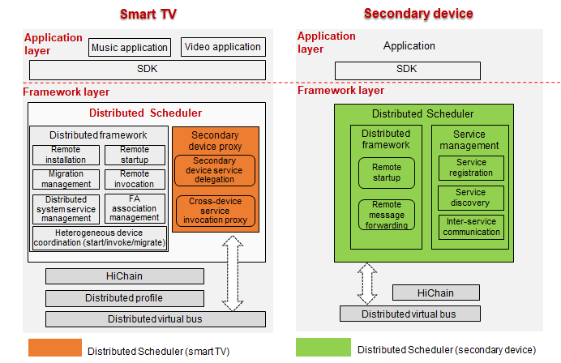

# Distributed Scheduler<a name="EN-US_TOPIC_0000001051983009"></a>

## Overview<a name="section11660541593"></a>

The Distributed Scheduler sets up a distributed service platform in OpenHarmony by using a proxy between the primary and secondary devices. With the distributed scheduler, the primary device \(OpenHarmony-powered smart TV\) can start a Feature Ability \(FA\) deployed on the secondary device \(a memory-constrained OpenHarmony device such as a lite wearable\). The following figure shows the components of the Distributed Scheduler.



## Directory Structure<a name="section1464106163817"></a>

The following table describes the directory structure of the Distributed Scheduler.

**Table 1**  Directory structure of the major source code

<a name="table43531856201716"></a>
<table><thead align="left"><tr id="row20416556201718"><th class="cellrowborder" valign="top" width="50%" id="mcps1.1.3.1.1"><p id="p10416456121716"><a name="p10416456121716"></a><a name="p10416456121716"></a>Directory</p>
</th>
<th class="cellrowborder" valign="top" width="50%" id="mcps1.1.3.1.2"><p id="p1841645631717"><a name="p1841645631717"></a><a name="p1841645631717"></a>Description</p>
</th>
</tr>
</thead>
<tbody><tr id="row64161056151718"><td class="cellrowborder" valign="top" width="50%" headers="mcps1.1.3.1.1 "><p id="p9416656181720"><a name="p9416656181720"></a><a name="p9416656181720"></a>dtbschedmgr_lite</p>
</td>
<td class="cellrowborder" valign="top" width="50%" headers="mcps1.1.3.1.2 "><p id="p541645611177"><a name="p541645611177"></a><a name="p541645611177"></a>Implementation logic of the Distributed Scheduler</p>
</td>
</tr>
<tr id="row104169564177"><td class="cellrowborder" valign="top" width="50%" headers="mcps1.1.3.1.1 "><p id="p17416125614179"><a name="p17416125614179"></a><a name="p17416125614179"></a>safwk_lite</p>
</td>
<td class="cellrowborder" valign="top" width="50%" headers="mcps1.1.3.1.2 "><p id="p04163569170"><a name="p04163569170"></a><a name="p04163569170"></a>Implementation logic of system service processes</p>
</td>
</tr>
<tr id="row04161056121719"><td class="cellrowborder" valign="top" width="50%" headers="mcps1.1.3.1.1 "><p id="p13416165621713"><a name="p13416165621713"></a><a name="p13416165621713"></a>samgr_lite</p>
</td>
<td class="cellrowborder" valign="top" width="50%" headers="mcps1.1.3.1.2 "><p id="p13417125611175"><a name="p13417125611175"></a><a name="p13417125611175"></a>Implementation logic of local service management</p>
</td>
</tr>
</tbody>
</table>

The source code directory structure of the Distributed Scheduler is as follows:

```
├── BUILD.gn
├── include
│  ├── distributed_schedule_service.h        # Header file for the open APIs provided by the Distributed Scheduler
│  ├── dmslite_check_remote_permission.h     # Header file for the permission management module of the Distributed Scheduler
│  ├── dmslite_famgr.h                       # Header file for the FA management module of the Distributed Scheduler
│  ├── dmslite_inner_common.h                # Header file for the service files of the Distributed Scheduler
│  ├── dmslite.h                             # Header file for the implementation of the Distributed Scheduler
│  ├── dmslite_log.h                         # Header file for the log module
│  ├── dmslite_msg_parser.h                  # Header file for communication data deserialization
│  ├── dmslite_tlv_common.h                  # Header file for the TLV data parsing module
│  └── dmslite_session.h                     # Header file for enabling cross-device communication
├── README.md
├── LICENSE
├── source
    ├── distributed_schedule_service.c
    ├── dmslite.c
    ├── dmslite_check_remote_permission.c
    ├── dmslite_famgr.c
    ├── dmslite_msg_parser.c
    ├── dmslite_tlv_common.c
    └── dmslite_session.c
```

## Constraints<a name="section1718733212019"></a>

-   Language: C
-   Networking: Devices must be on the same LAN.
-   Operating system: OpenHarmony

**Limitations and constraints on remote startup**:

-   Only FAs can be started remotely. Remote startup is unavailable to abilities using the Service template.
-   Before the remote startup, ensure that the primary and secondary devices are on the same network segment and can ping each other. Otherwise, the remote startup fails.

## Usage<a name="section10729231131110"></a>

**Compiling the Distributed Scheduler**

The distributed scheduler uses some feature macros to customize the function code to be compiled on different platforms. The function code is stored in  **build\\lite\\config\\subsystem\\distributedschedule\\**. The directory structure is as follows:

```
build/lite/config/subsystem/distributedschedule
├── BUILD.gn
```

Modify the  **BUILD.gn**  file when compiling code for different platforms. The following code snippet uses code compilation for the Hi3518EV300 and Hi3516DV300 development boards as an example:

```
zlite_subsystem("distributedschedule") {
    subsystem_components = [
        "//foundation/distributedschedule/services/samgr_lite:samgr",
    ]
    if (board_name == "hi3518ev300" || board_name == "hi3516dv300") {
        subsystem_components += [
            "//foundation/distributedschedule/services/safwk_lite:safwk_lite",
            "//foundation/distributedschedule/services/dtbschedmgr_lite:dtbschedmgr", // Configure the distributed scheduler.
        ]
    }
}
```

**\* Primary device development**  \(taking FA startup as an example\)

Create a  **Want**  instance. You should first create an  **ElementName**  object with  **deviceId**,  **bundleName**, and  **abilityName**  specified and add this object to the  **Want**  instance. Then, set the multi-device startup flag  **Want.FLAG\_ABILITYSLICE\_MULTI\_DEVICE**  to the  **Want**  instance to enable remote FA startup.

```
// Import related header files.
import ohos.aafwk.ability.Ability;
import ohos.aafwk.content.Want;
import ohos.bundle.ElementName;

// Start the remote FA on the secondary device.
Want want = new Want(); // Create a Want instance that encapsulates information about the remote FA to start.
ElementName name = new ElementName("remote_device_id", "com.huawei.remote_package_name", "remote_class_name"); 
want.setElement(name); // Add information about the target FA for startup to the Want instance.
want.setFlags(Want.FLAG_ABILITYSLICE_MULTI_DEVICE); // Set the multi-device startup flag. If this flag is not set, remote FA startup will be unavailable.
startAbility(want); // Start the specified FA based on the want parameter. If the name and type of the want parameter are different from those used in the IDE, use the parameter name and type in the IDE.
```

**\* Prerequisites**

**Networking between the primary and secondary devices**: Before the remote startup, ensure that the two devices are on the same network segment and can ping each other. Otherwise, the remote startup fails.

**FA installation on the secondary device**: Before the remote startup, ensure that the target FA has been installed on the secondary device.

**\* Execution**  \(taking FA startup as an example\)

Call  **startAbility**  on the primary device \(smart TV\) to start the FA of the secondary device \(memory-constrained device such as a lite wearable\).

## Repositories Involved<a name="section176111311166"></a>

distributedschedule\_interfaces\_kits\_samgr\_lite

distributedschedule\_services\_dtbschedmgr\_lite

distributedschedule\_services\_safwk\_lite

