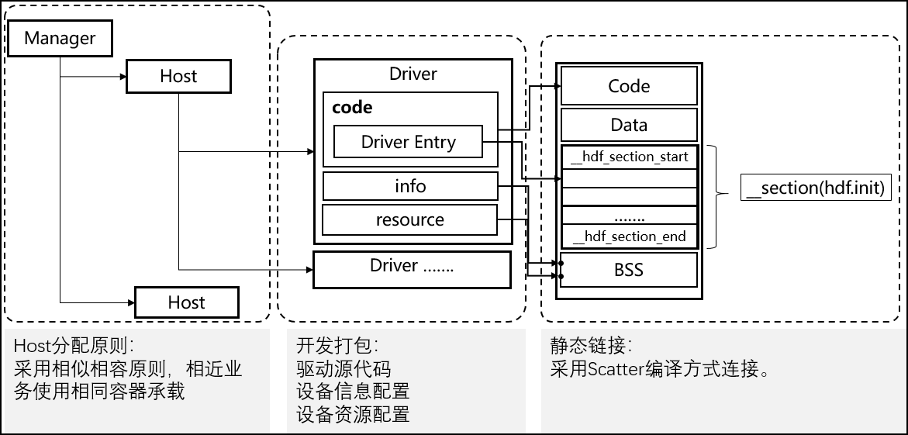

# Driver Subsystem<a name="EN-US_TOPIC_0000001052619216"></a>

## Overview<a name="section11660541593"></a>

The OpenHarmony driver subsystem is constructed using the C object-oriented programming \(OOP\). It provides a unified driver platform through platform decoupling, kernel decoupling, and compatible kernels. This unified driver architecture platform is designed to provide a more precise and efficient development environment, where you develop a driver that can be deployed on different systems supporting HDF.

The OpenHarmony driver subsystem provides the following key features and capabilities to shorten the driver development period and make third-party device driver integration much easier:

-   Flexible framework capabilities

    Based on the traditional driver framework, the OpenHarmony driver subsystem builds flexible framework capabilities to deploy terminal products with the capacity ranging from hundreds KB to hundreds MB of memory.


-   Standardized driver APIs

    The OpenHarmony driver subsystem provides you with abundant and stable driver APIs, which are compatible with those of future-proof smartphones, tablets, smart TVs.


-   Component-based driver models

    The OpenHarmony driver subsystem supports component-based driver models. It provides more refined driver management to dismantle components, enabling you to focus on the interaction between the hardware and driver.

    The subsystem also presets some template-based driver model components, such as the network device models.


-   Normalized configuration GUIs

    The OpenHarmony driver subsystem provides a unified configuration GUI and a cross-platform tool for configuration conversion and generation to implement seamless switchover across platforms.


You can use DevEco to manage driver projects, generate driver templates, and manage settings to make the development of OpenHarmony drivers easier.

## Architecture<a name="section101721227145613"></a>

The OpenHarmony driver framework adopts the primary/secondary mode and is developed based on the framework, model, competence library, and tool.

**Figure  1**  Interaction between the driver and framework<a name="fig2213154653916"></a>  


-   Driver framework stored in the  **frameworks/core**  directory
    -   Loads and starts drivers.
    -   Deploys and expands the driver framework flexibly through the object manager.

-   Driver models stored in the  **frameworks/model**  directory
    -   Provides model-based driving capabilities, such as network device models.

-   Driver capability library stored in the  **frameworks/ability**  directory
    -   Provides basic driver models, such as the I/O communication model.

-   Driver tools stored in the  **frameworks\\tools**  directory
    -   Provides tools for HDI API conversion, and driver configuration and driver compilation.

-   Driver APIs stored in the  **lite\\hdi**  directory
    -   Provides normalized driver APIs.

-   Support stored in the  **frameworks/support**  directory
    -   Provides platform driver APIs and system APIs with normalized abstraction capabilities.


## Directory Structures<a name="section1464106163817"></a>

**Table  1**  Directory structure of the OpenHarmony driver framework

<a name="table2977131081412"></a>
<table><thead align="left"><tr id="row7977610131417"><th class="cellrowborder" valign="top" width="30.34%" id="mcps1.2.3.1.1"><p id="p18792459121314"><a name="p18792459121314"></a><a name="p18792459121314"></a>Directory</p>
</th>
<th class="cellrowborder" valign="top" width="69.66%" id="mcps1.2.3.1.2"><p id="p77921459191317"><a name="p77921459191317"></a><a name="p77921459191317"></a>Description</p>
</th>
</tr>
</thead>
<tbody><tr id="row17666001869"><td class="cellrowborder" valign="top" width="30.34%" headers="mcps1.2.3.1.1 "><p id="p4667601064"><a name="p4667601064"></a><a name="p4667601064"></a>hdf</p>
</td>
<td class="cellrowborder" valign="top" width="69.66%" headers="mcps1.2.3.1.2 "><p id="p154741318610"><a name="p154741318610"></a><a name="p154741318610"></a>Indicates the OpenHarmony driver framework.</p>
</td>
</tr>
<tr id="row17977171010144"><td class="cellrowborder" valign="top" width="30.34%" headers="mcps1.2.3.1.1 "><p id="p2793159171311"><a name="p2793159171311"></a><a name="p2793159171311"></a>hdf\frameworks</p>
</td>
<td class="cellrowborder" valign="top" width="69.66%" headers="mcps1.2.3.1.2 "><p id="p879375920132"><a name="p879375920132"></a><a name="p879375920132"></a>Provides the source code to develop the driver frameworks, driver models, and capability model libraries.</p>
</td>
</tr>
<tr id="row258624313915"><td class="cellrowborder" valign="top" width="30.34%" headers="mcps1.2.3.1.1 "><p id="p858718432912"><a name="p858718432912"></a><a name="p858718432912"></a>hdf\frameworks\ability</p>
</td>
<td class="cellrowborder" valign="top" width="69.66%" headers="mcps1.2.3.1.2 "><p id="p1866016071012"><a name="p1866016071012"></a><a name="p1866016071012"></a>Provides functional capabilities for the driver development, such as the message model libraries.</p>
</td>
</tr>
<tr id="row6978161091412"><td class="cellrowborder" valign="top" width="30.34%" headers="mcps1.2.3.1.1 "><p id="p37931659101311"><a name="p37931659101311"></a><a name="p37931659101311"></a>hdf\frameworks\core</p>
</td>
<td class="cellrowborder" valign="top" width="69.66%" headers="mcps1.2.3.1.2 "><p id="p6793059171318"><a name="p6793059171318"></a><a name="p6793059171318"></a>Provides the core code to implement the OpenHarmony driver framework.</p>
</td>
</tr>
<tr id="row6978201031415"><td class="cellrowborder" valign="top" width="30.34%" headers="mcps1.2.3.1.1 "><p id="p117935599130"><a name="p117935599130"></a><a name="p117935599130"></a>hdf\frameworks\core\host</p>
</td>
<td class="cellrowborder" valign="top" width="69.66%" headers="mcps1.2.3.1.2 "><p id="p53051522133"><a name="p53051522133"></a><a name="p53051522133"></a>Provides functions of the driver host environment framework, including:</p>
<p id="p168291956191214"><a name="p168291956191214"></a><a name="p168291956191214"></a>1. Loading and starting a driver, and dispatching device nodes.</p>
<p id="p945834131310"><a name="p945834131310"></a><a name="p945834131310"></a>2. Dispatching events.</p>
<p id="p1365513245138"><a name="p1365513245138"></a><a name="p1365513245138"></a>3. Managing the internal power status.</p>
<p id="p113814121414"><a name="p113814121414"></a><a name="p113814121414"></a>4. Managing the common driver resource configurations.</p>
</td>
</tr>
<tr id="row138241821218"><td class="cellrowborder" valign="top" width="30.34%" headers="mcps1.2.3.1.1 "><p id="p1138321861211"><a name="p1138321861211"></a><a name="p1138321861211"></a>hdf\frameworks\core\manager</p>
</td>
<td class="cellrowborder" valign="top" width="69.66%" headers="mcps1.2.3.1.2 "><p id="p103831518181211"><a name="p103831518181211"></a><a name="p103831518181211"></a>Provides the management modules of the driver framework, including:</p>
<p id="p1125114971315"><a name="p1125114971315"></a><a name="p1125114971315"></a>1. Driver API management module.</p>
<p id="p419655510136"><a name="p419655510136"></a><a name="p419655510136"></a>2. Driver configuration management module.</p>
<p id="p95776361144"><a name="p95776361144"></a><a name="p95776361144"></a>3. Device node management module.</p>
<p id="p75789456140"><a name="p75789456140"></a><a name="p75789456140"></a>4. Security management module.</p>
<p id="p183476761517"><a name="p183476761517"></a><a name="p183476761517"></a>5. Fault management module.</p>
</td>
</tr>
<tr id="row116251627171512"><td class="cellrowborder" valign="top" width="30.34%" headers="mcps1.2.3.1.1 "><p id="p76251275152"><a name="p76251275152"></a><a name="p76251275152"></a>hdf\frameworks\core\shared</p>
</td>
<td class="cellrowborder" valign="top" width="69.66%" headers="mcps1.2.3.1.2 "><p id="p56256278150"><a name="p56256278150"></a><a name="p56256278150"></a>Provides shared code for the host and manager.</p>
</td>
</tr>
<tr id="row2306123015162"><td class="cellrowborder" valign="top" width="30.34%" headers="mcps1.2.3.1.1 "><p id="p10306143019164"><a name="p10306143019164"></a><a name="p10306143019164"></a>hdf\frameworks\model</p>
</td>
<td class="cellrowborder" valign="top" width="69.66%" headers="mcps1.2.3.1.2 "><p id="p1030713021612"><a name="p1030713021612"></a><a name="p1030713021612"></a>Provides a universal framework model for drivers.</p>
</td>
</tr>
<tr id="row2021312310176"><td class="cellrowborder" valign="top" width="30.34%" headers="mcps1.2.3.1.1 "><p id="p421315312177"><a name="p421315312177"></a><a name="p421315312177"></a>hdf\frameworks\model\network</p>
</td>
<td class="cellrowborder" valign="top" width="69.66%" headers="mcps1.2.3.1.2 "><p id="p421313113179"><a name="p421313113179"></a><a name="p421313113179"></a>Provides network device models for drivers.</p>
</td>
</tr>
<tr id="row2167642189"><td class="cellrowborder" valign="top" width="30.34%" headers="mcps1.2.3.1.1 "><p id="p21683416181"><a name="p21683416181"></a><a name="p21683416181"></a>hdf\frameworks\support\</p>
</td>
<td class="cellrowborder" valign="top" width="69.66%" headers="mcps1.2.3.1.2 "><p id="p71681548183"><a name="p71681548183"></a><a name="p71681548183"></a>Provides drivers with system APIs and hardware, such as GPIO, I2C, and SPI capabilities.</p>
<p id="p19848191416195"><a name="p19848191416195"></a><a name="p19848191416195"></a>Some interfaces can be migrated across platforms.</p>
</td>
</tr>
<tr id="row15342553171918"><td class="cellrowborder" valign="top" width="30.34%" headers="mcps1.2.3.1.1 "><p id="p434255301916"><a name="p434255301916"></a><a name="p434255301916"></a>hdf\frameworks\support\osal</p>
</td>
<td class="cellrowborder" valign="top" width="69.66%" headers="mcps1.2.3.1.2 "><p id="p1234211535198"><a name="p1234211535198"></a><a name="p1234211535198"></a>Provides platforms with common adaptation interfaces, such as memory, thread, and mutex.</p>
</td>
</tr>
<tr id="row116634294203"><td class="cellrowborder" valign="top" width="30.34%" headers="mcps1.2.3.1.1 "><p id="p1866392919204"><a name="p1866392919204"></a><a name="p1866392919204"></a>hdf\frameworks\support\platform</p>
</td>
<td class="cellrowborder" valign="top" width="69.66%" headers="mcps1.2.3.1.2 "><p id="p5663329202017"><a name="p5663329202017"></a><a name="p5663329202017"></a>Provides APIs that support the common hardware of platforms, such as GPIO, I2C, and SPI capabilities.</p>
</td>
</tr>
<tr id="row193157275210"><td class="cellrowborder" valign="top" width="30.34%" headers="mcps1.2.3.1.1 "><p id="p1331513279211"><a name="p1331513279211"></a><a name="p1331513279211"></a>hdf\frameworks\tools</p>
</td>
<td class="cellrowborder" valign="top" width="69.66%" headers="mcps1.2.3.1.2 "><p id="p131542762113"><a name="p131542762113"></a><a name="p131542762113"></a>Provides the driver capability libraries, such as the tool that configures and compiles the HCS (HDF Configuration Source).</p>
</td>
</tr>
<tr id="row66349163223"><td class="cellrowborder" valign="top" width="30.34%" headers="mcps1.2.3.1.1 "><p id="p2634161611224"><a name="p2634161611224"></a><a name="p2634161611224"></a>hdf\frameworks\utils</p>
</td>
<td class="cellrowborder" valign="top" width="69.66%" headers="mcps1.2.3.1.2 "><p id="p26341516202215"><a name="p26341516202215"></a><a name="p26341516202215"></a>Provides basic data structures and algorithms.</p>
</td>
</tr>
<tr id="row1897841071415"><td class="cellrowborder" valign="top" width="30.34%" headers="mcps1.2.3.1.1 "><p id="p16793185961315"><a name="p16793185961315"></a><a name="p16793185961315"></a>hdf\lite\adapter</p>
</td>
<td class="cellrowborder" valign="top" width="69.66%" headers="mcps1.2.3.1.2 "><p id="p14793959161317"><a name="p14793959161317"></a><a name="p14793959161317"></a>Adapts to kernel operation APIs and provides abstract APIs.</p>
</td>
</tr>
<tr id="row16448173512518"><td class="cellrowborder" valign="top" width="30.34%" headers="mcps1.2.3.1.1 "><p id="p644893514514"><a name="p644893514514"></a><a name="p644893514514"></a>hdf\lite\include</p>
</td>
<td class="cellrowborder" valign="top" width="69.66%" headers="mcps1.2.3.1.2 "><p id="p1744933517511"><a name="p1744933517511"></a><a name="p1744933517511"></a>Provides driver APIs for lightweight devices.</p>
</td>
</tr>
<tr id="row192731625216"><td class="cellrowborder" valign="top" width="30.34%" headers="mcps1.2.3.1.1 "><p id="p10281116185217"><a name="p10281116185217"></a><a name="p10281116185217"></a>hdf\lite\hdi</p>
</td>
<td class="cellrowborder" valign="top" width="69.66%" headers="mcps1.2.3.1.2 "><p id="p7286165524"><a name="p7286165524"></a><a name="p7286165524"></a>Provides APIs of the OpenHarmony driver.</p>
</td>
</tr>
</tbody>
</table>

## Constraints<a name="section1718733212019"></a>

None

## Use<a name="section8496817141616"></a>

**Figure  2**  Interaction between the driver and framework<a name="fig1254113325118"></a>  


Driver loading is mostly done by the driver framework, and you only need to register and configure required APIs. The driver framework will load and initialize the driver based on the parsing result.

Driver development based on the HDF consists of the following three parts:

1. Driver: develop the functions.

2. Information configuration: present the loading information of the driver.

3. Resource configuration: configure the hardware information of the driver.

The driver mainly aims to develop the functions.

The first part that catches your eyes is the driver entry, which is described through  **DriverEntry**  alignment.

Three APIs are available, namely  **bind**,  **init**, and  **release**.

```
struct HdfDriverEntry g_deviceSample = {
    .moduleVersion = 1,
    .moduleName = "sample_driver", 
    .Bind = SampleDriverBind,
    .Init = SampleDriverInit,
    .Release = SampleDriverRelease,
};
```

**Bind**: This API is used to bind driver devices and its functions.

```
int32_t SampleDriverBind(struct HdfDeviceObject *deviceObject)
{
    // TODO: Bind device service to device object.
    // And you can also initialize device resources here.
    return HDF_SUCCESS;
}
```

**Init**: When devices are successfully bound, the framework calls  **Init**  to initialize the driver. After initialization is complete, the driver framework will determine whether to create external service APIs based on the configuration file.

If the driver fails to be initialized, the driver framework will automatically release the created device API.

```
int32_t SampleDriverInit(struct HdfDeviceObject *deviceObject)
{
    // TODO: Init hardware or other resources here.
    return HDF_SUCCESS;
}
```

**Release**: When you need to uninstall a driver, the drive framework calls this function to release the driver resources. Then, other internal resources will be released.

```
void SampleDriverRelease(struct HdfDeviceObject *deviceObject)
{
    // Release all resources.
    return;
}
```

## Installation<a name="section14778154275818"></a>

The OpenHarmony driver is mainly deployed in the kernel space using the static link mode. It is compiled and packed with the kernel subsystem and system image.

**Figure  3**  OpenHarmony driver installation<a name="fig675692712"></a>  




## Repositories Involved<a name="section134812226297"></a>

drivers\_hdf\_frameworks

drivers\_hdf\_lite

