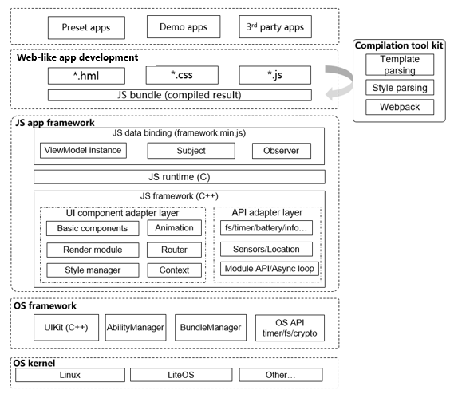

# JS Application Framework<a name="EN-US_TOPIC_0000001052342972"></a>

## Introduction<a name="section11660541593"></a>

The JS application framework allows you to develop web-like applications across platforms. The framework uses Toolkit to pack your  **.hml**,  **.css**, and  **.js**  files to a JavaScript bundle, parses the bundle, and renders it with view components of the C++ native UI. You can use the declarative APIs to develop applications. This allows data to drive view changes and avoids a large number of view operations, greatly simplifying application development.

The following figure shows the framework modules.



## Directory Structure<a name="section1464106163817"></a>

The source code of the framework is stored in  **/foundation/ace**. The following shows the directory structure.

```
/foundation/ace
├── frameworks #Framework code
│   └── lite
│       ├── examples #Sample code
│       ├── include #Exposed header files
│       ├── packages #JavaScript implementation
 │       ├── src #Source code
│       ├── targets #Configuration file of each target device
 │       └── tools #Tool code
├── interfaces #APIs exposed externally
│   └── innerkits #Header files of internal subsystems
│       └── builtin #JavaScript third-party module APIs exposed by the JS application framework
```

## Constraints<a name="section1718733212019"></a>

-   Language version
    -   C++11 or later
    -   JavaScript ES5.1 or later


-   Framework runtime memory consists of:
    -   Pre-allocated memory for running the JavaScript engine. The memory size is adjustable and depends on the complexity of the device application. Generally, 64 KB to 512 KB is recommended.
    -   Memory for the framework itself. For devices whose memory capacity exceeds 100 KB, the framework memory can be managed by a pre-allocated memory pool, which can be shared with the native UI framework. The memory pool manages objects and heap memory in a unified manner.

-   The framework provides different specifications for various chip platforms and underlying OS capabilities.
    -   Cortex-M RAM and ROM
        -   JavaScript engine memory pool: greater than 48 KB \(recommended\)
        -   RAM: memory pool shared with the native UI \(recommended\). The size must be greater than 80 KB.
        -   ROM: greater than 300 KB \(for the JS application framework and related subsystems, such as native UI and JavaScript engine\)

    -   Cortex-A RAM and ROM
        -   JavaScript engine memory pool: greater than 128 KB \(recommended\)
        -   RAM: greater than 512 KB \(recommended\)
        -   ROM: greater than 2 MB \(for the JS application framework and related subsystems, such as native UI and JavaScript engine\)


## Using targets<a name="section1460013282612"></a>

The implementation of the JS application framework consists of two parts: native and JavaScript. The native part is developed by C++ and is the main body of the framework. The JavaScript part supports the runtime environment of JavaScript files, and supports the interaction between the JavaScript runtime and native framework through some global functions or objects exposed to the JavaScript engine.

The framework uses feature macros to customize function code to be compiled on different platforms. The feature macros are stored in header files in  **foundation/ace/frameworks/lite/targets**. The directory structure is as follows:

```
/foundation/ace/frameworks/lite/targets
├── default/
│   └── acelite_config.h
├── linux/ #Linux environment configuration files
│   └── acelite_config.h
├── liteos_a/ #Environment configuration files for LiteOS Cortex-A
│   └── acelite_config.h
├── liteos_m/ #Environment configuration files for LiteOS Cortex-M
│   └── acelite_config.h
├── platform_adapter.cpp
├── platform_adapter.h
└── simulator/ #Simulator environment configuration files
    └── win/
        └── acelite_config.h*
```

When compiling for different platform targets, use the  **acelite\_config.h**  file in the corresponding platform directory. You can configure the header file searching path for compilation to locate the file to use. The following takes  **ninja**  and  **cmake**  build tools as examples:

ninja:

```
  if (hos_kernel_type == "liteos_a" || hos_kernel_type == "liteos_m" ||
      hos_kernel_type == "liteos_riscv") {// Select different header file searching paths based on the target kernel platform.
    include_dirs += [ "targets/liteos-a" ]
  } else if (hos_kernel_type == "linux") {
    include_dirs += [ "targets/linux" ]
  }
```

cmake:

```
......
set(ACE_LITE_CONFIG_PATH "${CMAKE_CURRENT_SOURCE_DIR}/targets/simulator/win")
set(JSFWK_INCLUDE_PATH "${CMAKE_CURRENT_SOURCE_DIR}/include")
set(JSFWK_SOURCE_PATH "${CMAKE_CURRENT_SOURCE_DIR}/src/core")
set(UIKIT_PATH "${CMAKE_CURRENT_SOURCE_DIR}/../ui")
set(THIRTY_PATH "${CMAKE_CURRENT_SOURCE_DIR}/../../../third_party")
set(JSFWK_SIMULATOR_PATH "${CMAKE_CURRENT_SOURCE_DIR}/../tools/simulator")
set(JS_API_PATH "${CMAKE_CURRENT_SOURCE_DIR}/../../api/emui_band/MoltenCore/application/framework/ace/api")
set(JSFWK_SIMULATOR_PATH "${CMAKE_CURRENT_SOURCE_DIR}/../tools/simulator")
set(AAFWK_PATH "${CMAKE_CURRENT_SOURCE_DIR}/../../../aafwk")

# header files
include_directories(
    ${ACE_LITE_CONFIG_PATH}
    ${JSFWK_INCLUDE_PATH}/async
    ${JSFWK_INCLUDE_PATH}/base
    ${JSFWK_INCLUDE_PATH}/context
    ${JSFWK_INCLUDE_PATH}/jsi
    ${JSFWK_SOURCE_PATH}
    ......
```

The  **acelite\_config.h**  file is used to enable or disable the feature macros of different platforms. It can also be used to define constants for shielding platform differences. For example, platform file systems are different, and the names of some fixed directories might be different. These constants can be defined as follows:

**liteos-a/acelite\_config.h**

```
#define JS_FRAMEWORK_PATH "//system/ace/bin/"
```

**simulator/win/acelite\_config.h**

```
#define JS_FRAMEWORK_PATH "..\\..\\..\\jsfwk\\packages\\runtime-core\\build"
```

## Using Runtime-core<a name="section1460223932718"></a>

Runtime-core is a JavaScript-based simple data hijacking framework provided by the JS application framework to implement unidirectional data binding. The directory structure is as follows:

```
/foundation/ace/frameworks/lite/packages
└── runtime-core
    ├── .babelrc #Babel configuration file
    ├── .editorconfig #IDE configuration file
    ├── .eslintignore #Configuration file of the ESLint tool. You can set a directory or files that will not be scanned by the ESLint tool.
    ├── .eslintrc.js #ESLint configuration file for scanning rules.
    ├── .gitignore
    ├── package.json #NPM file
    ├── package-lock.json #NPM dependency lock file
    ├── .prettierrc #Configuration file for code formatting rules
    ├── scripts #Directory for compilation scripts
    │   ├── build.js #Compilation script
    │   └── configs.js #Rollup configuration file
    ├── .size-snapshot.json
    └── src #Source code
         ├── core #ViewModel core implementation code
        │   └── index.js
        ├── index.js
        ├── observer #Data hijacking implementation code
        │   ├── index.js
        │   ├── observer.js
        │   ├── subject.js
        │   └── utils.js
        ├── profiler #profiler directory
        │   └── index.js
        └── __test__ #Test cases
            └── index.test.js
```

The following NPM commands are supported:

-   **npm run build**

    The JavaScript engine integrated in the JS application framework supports ES5.1 syntax only. However, the runtime-core is implemented using JavaScript ES6. Therefore, you should use Babel for ES6 code degradation and use Rollup to package the code. Run the  **npm run build**  command, and the packaged files are output to the  **build**  directory. 

    ```
    build/
    ├── framework-dev.js // Framework code used by the development environment (uncompressed and obfuscated)
    ├── framework-dev.min.js // Framework code used in the development environment (compressed and obfuscated)
    ├── framework-dev.js // Framework code used by the production environment (uncompressed and obfuscated)
    ├── framework-dev.min.js // Framework code used in the production environment (compressed and obfuscated)
    ```

-   **npm run test**

    Runtime-core uses Jest for unit testing. Run the  **npm run test**  command to start the unit test.


## Repositories Involved<a name="section11703194974217"></a>

ace\_lite\_jsfwk

ace\_interfaces\_innerkits\_builtin

