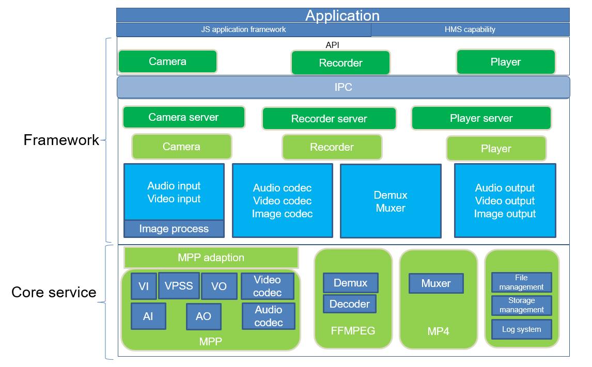

# Media Subsystem<a name="EN-US_TOPIC_0000001051344264"></a>

## Overview<a name="section38510214395"></a>

This repository stores source code information of the multimedia subsystem. It provides unified interfaces for you to develop media applications. With this repository, you can easily obtain media resources and focus on service development.

Based on code information about this repository, the device configuration file is stored in  **test\\lite\\devini**. When using the configuration file, you can place it in the  **/data**  directory of the development board in use. You use the configuration file for the adaption to the sensor, resolution, frame rate, and more.

Subsystem architecture



Service process


As shown in these figures, the multimedia subsystem consists of camera, recorder, and player modules. The camera module provides YUV or RGB, JPEG, and H.264 or H.265 data, which is stored in the surface \(shared memory\); the recorder module packs H.264 or H.265 and AAC data in the surface into MP4 files; the player module demultiplexes the MP4 files into audio and video data, sends the data to corresponding decoders, and then plays the audio and video.

## Directory Structure<a name="section1937963913399"></a>

**Table  1**  Directory structure of multimedia source code \(native APIs\)

<a name="table2977131081412"></a>
<table><thead align="left"><tr id="row7977610131417"><th class="cellrowborder" valign="top" width="40.71%" id="mcps1.2.3.1.1"><p id="p18792459121314"><a name="p18792459121314"></a><a name="p18792459121314"></a>Directory</p>
</th>
<th class="cellrowborder" valign="top" width="59.29%" id="mcps1.2.3.1.2"><p id="p77921459191317"><a name="p77921459191317"></a><a name="p77921459191317"></a>Description</p>
</th>
</tr>
</thead>
<tbody><tr id="row17977171010144"><td class="cellrowborder" valign="top" width="40.71%" headers="mcps1.2.3.1.1 "><p id="p13476517134113"><a name="p13476517134113"></a><a name="p13476517134113"></a>foundation\multimedia\frameworks</p>
</td>
<td class="cellrowborder" valign="top" width="59.29%" headers="mcps1.2.3.1.2 "><p id="p879375920132"><a name="p879375920132"></a><a name="p879375920132"></a>Internal framework implementation, including <strong id="b1696433143010"><a name="b1696433143010"></a><a name="b1696433143010"></a>Audio</strong>, <strong id="b19075193012"><a name="b19075193012"></a><a name="b19075193012"></a>Camera</strong>, and <strong id="b19889207193019"><a name="b19889207193019"></a><a name="b19889207193019"></a>Player.Recorder</strong></p>
</td>
</tr>
<tr id="row6978161091412"><td class="cellrowborder" valign="top" width="40.71%" headers="mcps1.2.3.1.1 "><p id="p167373014417"><a name="p167373014417"></a><a name="p167373014417"></a>foundation\multimedia\interfaces\kits</p>
</td>
<td class="cellrowborder" valign="top" width="59.29%" headers="mcps1.2.3.1.2 "><p id="p6793059171318"><a name="p6793059171318"></a><a name="p6793059171318"></a>External header files</p>
</td>
</tr>
<tr id="row6978201031415"><td class="cellrowborder" valign="top" width="40.71%" headers="mcps1.2.3.1.1 "><p id="p1639221134214"><a name="p1639221134214"></a><a name="p1639221134214"></a>foundation\multimedia\services\media_lite</p>
</td>
<td class="cellrowborder" valign="top" width="59.29%" headers="mcps1.2.3.1.2 "><p id="p182076317465"><a name="p182076317465"></a><a name="p182076317465"></a>Underlying service implementation</p>
</td>
</tr>
<tr id="row1420633124613"><td class="cellrowborder" valign="top" width="40.71%" headers="mcps1.2.3.1.1 "><p id="p1569213233619"><a name="p1569213233619"></a><a name="p1569213233619"></a>foundation\multimedia\utils\lite</p>
</td>
<td class="cellrowborder" valign="top" width="59.29%" headers="mcps1.2.3.1.2 "><p id="p069215273618"><a name="p069215273618"></a><a name="p069215273618"></a>Common module implementation</p>
</td>
</tr>
<tr id="row1679114715461"><td class="cellrowborder" valign="top" width="40.71%" headers="mcps1.2.3.1.1 "><p id="p0295211184214"><a name="p0295211184214"></a><a name="p0295211184214"></a>foundation\multimedia\test\lite</p>
</td>
<td class="cellrowborder" valign="top" width="59.29%" headers="mcps1.2.3.1.2 "><p id="p1279144754611"><a name="p1279144754611"></a><a name="p1279144754611"></a>API testing code</p>
</td>
</tr>
</tbody>
</table>

## Constraints<a name="section722512541395"></a>

-   C++11 or later
-   Currently, Hi3516DV300 and Hi3518EV300 are supported, and only Hi3516DV300 supports the playback function.

## Installation<a name="section11914418405"></a>

-   Load the kernel and related drivers before installing the repository. For details, see readme files of kernel and driver subsystems.
-   Modify required configuration files, such as those in  **test/devini**. For details, see the  _Configuration File Description_. Currently, only IMX335 and IMX327 sensors are supported. For other sensors, seek help from the open source community.
-   For details about how to invoke native APIs, see the demonstration in the  **test**  directory.

## Use Case<a name="section1467220266400"></a>

You can use media APIs to record, preview, and play audios and videos. Before using these resources, create a  **CameraKit**  object and register various callbacks to respond to many events in the media module. You create a  **Camera**  object to operate camera resources, for example, to start preview, recording, and stream capturing, and set related parameters.

The following example overrides the event class:

```
/*
 * Copyright (c) 2020 Huawei Device Co., Ltd.
 * Licensed under the Apache License, Version 2.0 (the "License");
 * you may not use this file except in compliance with the License.
 * You may obtain a copy of the License at
 *
 *     http://www.apache.org/licenses/LICENSE-2.0
 *
 * Unless required by applicable law or agreed to in writing, software
 * distributed under the License is distributed on an "AS IS" BASIS,
 * WITHOUT WARRANTIES OR CONDITIONS OF ANY KIND, either express or implied.
 * See the License for the specific language governing permissions and
 * limitations under the License.
 */

#include "camera_kit.h"
#include "recorder.h"

#include <sys/time.h>
#include <algorithm>
#include <fstream>
#include <iostream>
#include <sstream>

using namespace std;
using namespace OHOS;
using namespace OHOS::Media;

static void SampleSaveCapture(const char *p, uint32_t size)
{
    cout << "Start saving picture" << endl;
    struct timeval tv;
    gettimeofday(&tv, NULL);
    struct tm *ltm = localtime(&tv.tv_sec);
    if (ltm != nullptr) {
        ostringstream ss("Capture_");
        ss << "Capture" << ltm->tm_hour << "-" << ltm->tm_min << "-" << ltm->tm_sec << ".jpg";

        ofstream pic("/sdcard/" + ss.str(), ofstream::out | ofstream::trunc);
        cout << "write " << size << " bytes" << endl;
        pic.write(p, size);
        cout << "Saving picture end" << endl;
    }
}

Recorder *SampleCreateRecorder()
{
    int ret = 0;
    int32_t sampleRate = 48000;
    int32_t channelCount = 1;
    AudioCodecFormat audioFormat = AAC_LC;
    AudioSourceType inputSource = AUDIO_MIC;
    int32_t audioEncodingBitRate = sampleRate;
    VideoSourceType source = VIDEO_SOURCE_SURFACE_ES;
    int32_t frameRate = 30;
    float fps = 30;
    int32_t rate = 4096;
    int32_t sourceId = 0;
    int32_t audioSourceId = 0;
    int32_t width = 1920;
    int32_t height = 1080;
    VideoCodecFormat encoder;
    encoder = HEVC;
    width = 1920;
    height = 1080;
    Recorder *recorder = new Recorder();
    if ((ret = recorder->SetVideoSource(source, sourceId)) != SUCCESS) {
        cout << "SetVideoSource failed." << ret << endl;
        delete recorder;
        return nullptr;
    }
    if ((ret = recorder->SetVideoEncoder(sourceId, encoder)) != SUCCESS) {
        cout << "SetVideoEncoder failed." << ret << endl;
        delete recorder;
        return nullptr;
    }
    if ((ret = recorder->SetVideoSize(sourceId, width, height)) != SUCCESS) {
        cout << "SetVideoSize failed." << ret << endl;
        delete recorder;
        return nullptr;
    }
    if ((ret = recorder->SetVideoFrameRate(sourceId, frameRate)) != SUCCESS) {
        cout << "SetVideoFrameRate failed." << ret << endl;
        delete recorder;
        return nullptr;
    }
    if ((ret = recorder->SetVideoEncodingBitRate(sourceId, rate)) != SUCCESS) {
        cout << "SetVideoEncodingBitRate failed." << ret << endl;
        delete recorder;
        return nullptr;
    }
    if ((ret = recorder->SetCaptureRate(sourceId, frameRate)) != SUCCESS) {
        cout << "SetCaptureRate failed." << ret << endl;
        delete recorder;
        return nullptr;
    }
    if ((ret = recorder->SetAudioSource(inputSource, audioSourceId)) != SUCCESS) {
        cout << "SetAudioSource failed." << ret << endl;
        delete recorder;
        return nullptr;
    }
    if ((ret = recorder->SetAudioEncoder(audioSourceId, audioFormat)) != SUCCESS) {
        cout << "SetAudioEncoder failed." << ret << endl;
        delete recorder;
        return nullptr;
    }
    if ((ret = recorder->SetAudioSampleRate(audioSourceId, sampleRate)) != SUCCESS) {
        cout << "SetAudioSampleRate failed." << ret << endl;
        delete recorder;
        return nullptr;
    }
    if ((ret = recorder->SetAudioChannels(audioSourceId, channelCount)) != SUCCESS) {
        cout << "SetAudioChannels failed." << ret << endl;
        delete recorder;
        return nullptr;
    }
    if ((ret = recorder->SetAudioEncodingBitRate(audioSourceId, audioEncodingBitRate)) != SUCCESS) {
        cout << "SetAudioEncodingBitRate failed." << ret << endl;
        delete recorder;
        return nullptr;
    }
    return recorder;
}

class SampleFrameStateCallback : public FrameStateCallback {
    void OnFrameFinished(Camera &camera, FrameConfig &fc, FrameResult &result) override
    {
        cout << "Receive frame complete inform." << endl;
        if (fc.GetFrameConfigType() == FRAME_CONFIG_CAPTURE) {
            cout << "Capture frame received." << endl;
            list<Surface *> surfaceList = fc.GetSurfaces();
            for (Surface *surface : surfaceList) {
                SurfaceBuffer *buffer = surface->AcquireBuffer();
                if (buffer != nullptr) {
                    char *virtAddr = static_cast<char *>(buffer->GetVirAddr());
                    if (virtAddr != nullptr) {
                        SampleSaveCapture(virtAddr, buffer->GetSize());
                    }
                    surface->ReleaseBuffer(buffer);
                }
                delete surface;
            }
            delete &fc;
        }
    }
};

class SampleCameraStateMng : public CameraStateCallback {
public:
    SampleCameraStateMng() = delete;
    SampleCameraStateMng(EventHandler &eventHdlr) : eventHdlr_(eventHdlr) {}
    ~SampleCameraStateMng()
    {
        if (recorder_ != nullptr) {
            recorder_->Release();
            delete recorder_;
        }
    }
    void OnCreated(Camera &c) override
    {
        cout << "Sample recv OnCreate camera." << endl;
        auto config = CameraConfig::CreateCameraConfig();
        config->SetFrameStateCallback(&fsCb_, &eventHdlr_);
        c.Configure(*config);
        cam_ = &c;
    }
    void OnCreateFailed(const std::string cameraId, int32_t errorCode) override {}
    void OnReleased(Camera &c) override {}

    void StartRecord()
    {
        int ret;
        if (isRecording_) {
            cout << "Camera is already recording." << endl;
            return;
        }
        if (recorder_ == nullptr) {
            recorder_ = SampleCreateRecorder();
        }
        if (recorder_ == nullptr) {
            cout << "Recorder not available" << endl;
            return;
        }
        string path = "/sdcard";
        ret = recorder_->SetOutputPath(path);
        if (ret != SUCCESS) {
            cout << "SetOutputPath fialed :" << ret << std::endl;
            return;
        }
        ret = recorder_->Prepare();
        if (ret != SUCCESS) {
            cout << "Prepare failed.=" << ret << endl;
            return;
        }
        Surface *surface = (recorder_->GetSurface(0)).get();
        surface->SetWidthAndHeight(1920, 1080);
        surface->SetQueueSize(3);
        surface->SetSize(1024 * 1024);
        FrameConfig *fc = new FrameConfig(FRAME_CONFIG_RECORD);
        fc->AddSurface(*surface);
        ret = recorder_->Start();
        if (ret != SUCCESS) {
            delete fc;
            cout << "recorder start failed. ret=" << ret << endl;
            return;
        }
        ret = cam_->TriggerLoopingCapture(*fc);
        if (ret != 0) {
            delete fc;
            cout << "camera start recording failed. ret=" << ret << endl;
            return;
        }
        isRecording_ = true;
        cout << "camera start recording succeed." << endl;
    }
    void StartPreview()
    {
        if (isPreviewing_) {
            cout << "Camera is already previewing." << endl;
            return;
        }
        FrameConfig *fc = new FrameConfig(FRAME_CONFIG_PREVIEW);
        Surface *surface = Surface::CreateSurface();
        if (surface == nullptr) {
            delete fc;
            cout << "CreateSurface failed" << endl;
            return;
        }
        surface->SetWidthAndHeight(1920, 1080); /* 1920:width,1080:height */
        surface->SetUserData("region_position_x", "0");
        surface->SetUserData("region_position_y", "0");
        surface->SetUserData("region_width", "480");
        surface->SetUserData("region_height", "480");
        fc->AddSurface(*surface);
        int32_t ret = cam_->TriggerLoopingCapture(*fc);
        if (ret != 0) {
            delete fc;
            cout << "camera start preview failed. ret=" << ret << endl;
            return;
        }
        delete surface;
        isPreviewing_ = true;
        cout << "camera start preview succeed." << endl;
    }
    void Capture()
    {
        if (cam_ == nullptr) {
            cout << "Camera is not ready." << endl;
            return;
        }
        FrameConfig *fc = new FrameConfig(FRAME_CONFIG_CAPTURE);
        Surface *surface = Surface::CreateSurface();
        if (surface == nullptr) {
            delete fc;
            cout << "CreateSurface failed" << endl;
            return;
        }
        surface->SetWidthAndHeight(1920, 1080); /* 1920:width,1080:height */
        fc->AddSurface(*surface);
        cam_->TriggerSingleCapture(*fc);
    }
    void Stop()
    {
        if (cam_ == nullptr) {
            cout << "Camera is not ready." << endl;
            return;
        }
        if (recorder_ != nullptr) {
            recorder_->Stop(false);
        }
        cam_->StopLoopingCapture();
        isPreviewing_ = false;
        isRecording_ = false;
    }

private:
    bool isPreviewing_ = false;
    bool isRecording_ = false;
    EventHandler &eventHdlr_;
    Camera *cam_ = nullptr;
    Recorder *recorder_ = nullptr;
    SampleFrameStateCallback fsCb_;
};

class SampleCameraDeviceCallback : public CameraDeviceCallback {};

void SampleHelp()
{
    cout << "*******************************************" << endl;
    cout << "Select the behavior of avrecorder." << endl;
    cout << "1: Capture" << endl;
    cout << "2: Record(Press s or S to stop)" << endl;
    cout << "3: Preview(Press s or S to stop)" << endl;
    cout << "q: quit the sample." << endl;
    cout << "*******************************************" << endl;
}

int main()
{
    cout << "Camera sample begin." << endl;
    SampleHelp();
    CameraKit *camKit = CameraKit::GetInstance();
    if (camKit == nullptr) {
        cout << "Can not get CameraKit instance" << endl;
        return 0;
    }
    list<string> camList = camKit->GetCameraIds();
    string camId;
    for (auto &cam : camList) {
        cout << "camera name:" << cam << endl;
        const CameraAbility *ability = camKit->GetCameraAbility(cam);
        /* Find the camera that fits your ability. */
        list<CameraPicSize> sizeList = ability->GetSupportedSizes(0);
        if (find(sizeList.begin(), sizeList.end(), CAM_PIC_1080P) != sizeList.end()) {
            camId = cam;
            break;
        }
    }

    if (camId.empty()) {
        cout << "No available camera.(1080p wanted)" << endl;
        return 0;
    }

    EventHandler eventHdlr; // Create a thread to handle callback events
    SampleCameraStateMng CamStateMng(eventHdlr);

    camKit->CreateCamera(camId, CamStateMng, eventHdlr);

    char input;
    while (cin >> input) {
        switch (input) {
            case '1':
                CamStateMng.Capture();
                break;
            case '2':
                CamStateMng.StartRecord();
                break;
            case '3':
                CamStateMng.StartPreview();
                break;
            case 's':
                CamStateMng.Stop();
                break;
            case 'q':
                CamStateMng.Stop();
                goto EXIT;
            default:
                SampleHelp();
                break;
        }
    }
EXIT:
    cout << "Camera sample end." << endl;
    return 0;
}
```

## Repositories Involved<a name="section7666411192217"></a>

multimedia\_frameworks\_camera\_lite

multimedia\_frameworks\_audio\_lite

multimedia\_frameworks\_player\_lite

multimedia\_frameworks\_recorder\_lite

multimedia\_hals\_camera\_lite

multimedia\_interfaces\_kits\_recorder\_lite

multimedia\_interfaces\_kits\_audio\_lite

multimedia\_interfaces\_kits\_camera\_lite

multimedia\_interfaces\_kits\_player\_lite

multimedia\_services\_media\_lite

multimedia\_utils\_lite

