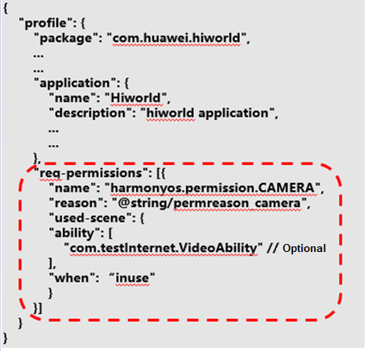
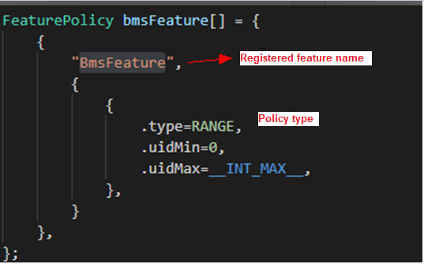
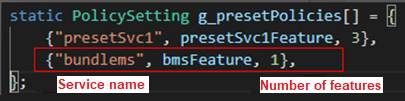
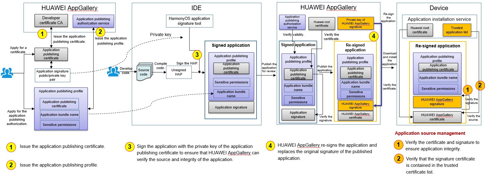

# Security Subsystem<a name="EN-US_TOPIC_0000001051982984"></a>

## Overview<a name="section6309125817418"></a>

This section provides samples about how to use existing security mechanisms to improve system security features, including secure boot, application permission management, inter-process communication \(IPC\) authentication, Huawei Universal Keystore Service \(HUKS\), HiChain, and application signature verification.

## Directory Structure<a name="section5614117756"></a>

**Directory 1**

```
security
├── framework
│     ├── appverify    Application signature verification
│     ├── crypto_lite    Encryption and decryption
│     ├── hichainsdk_lite    Device authentication
│     ├── huks_lite    Key and certificate management
│     ├── secure_os    Secure OS
├── interface    Interface directory
│     ├── innerkits    Internal kit directory
│     │     ├── appverify    Application signature verification
│     │     ├── crypto_lite    Encryption and decryption
│     │     ├── hichainsdk_lite    Device authentication
│     │     ├── huks_lite    Key and certificate management
│     │     ├── iam_lite    Application permission management
│     │     ├── secure_os    Secure OS
│     ├── kits    External kit directory
│     │     ├── iam_lite    Application permission management
├── services    Implementation
│     ├── iam_lite    Application permission management
│     ├── secure_os    Secure OS
```

**Directory 2**

```
kernel/liteos-a/security/
├── cap Capability mechanism
│   ├── BUILD.gn
│   ├── capability_api.h
│   ├── capability.c
│   ├── capability_type.h
│   └── Makefile
```

## Constraints<a name="section14134111467"></a>

C programming language is used. The preceding security features are mainly used on Cortex-A or devices with equivalent processing capabilities. On Cortex-M or devices with equivalent processing capabilities, only HUKS and HiChain are available.

## Secure Boot<a name="section10750510104718"></a>

To generate a x509 image package, perform compilation to generate the required binary images, including kernel images  **kernel.bin**  \(liteos/OHOS\_Image\) and  **rootfs.img**. If the Hi3516DV300 chip is used, the generated images are stored in the  **out\\ipcamera\_hi3516dv300\_liteos\_a**  directory. Copy the binary images and the secure uboot private keys \(in the  **vendor\\hisi\\hi35xx\\hi3516dv300\\uboot\\secureboot\_release**  directory\) to the  **secureboot\_ohos**  directory \(in the  **vendor\\hisi\\hi35xx\\hi3516dv300\\uboot**  directory\). Go to the  **x509\_creater**  directory, run the  **./creater.sh**  command, and generate the x509 certificate as prompted. Return to the  **secureboot\_ohos**  directory and run  **./sec\_os.sh**  to generate the x509 image package.

## Application Permission Management<a name="section20822104317111"></a>

Application permissions are used to control access to system resources and features. These include personal privacy-related features or data in some scenarios, for example, hardware features of personal devices such as cameras and microphones, and personal data such as contacts and calendar data. OpenHarmony protects such data and features through application permission management.

To declare the permissions required by an application, edit  **req-permissions**  in the  **HarmonyProfile.json**  file in the installation bundle. The following figure shows an example.

**Figure  1**  Declaring permissions<a name="fig1168867141611"></a>  


Field descriptions

<a name="table1073153511418"></a>
<table><thead align="left"><tr id="row11107193541417"><th class="cellrowborder" valign="top" width="22.220000000000002%" id="mcps1.1.4.1.1"><p id="p6107535141420"><a name="p6107535141420"></a><a name="p6107535141420"></a>Field</p>
</th>
<th class="cellrowborder" valign="top" width="35.099999999999994%" id="mcps1.1.4.1.2"><p id="p111080352143"><a name="p111080352143"></a><a name="p111080352143"></a>Value</p>
</th>
<th class="cellrowborder" valign="top" width="42.68%" id="mcps1.1.4.1.3"><p id="p161080358141"><a name="p161080358141"></a><a name="p161080358141"></a>Description</p>
</th>
</tr>
</thead>
<tbody><tr id="row151081735111418"><td class="cellrowborder" valign="top" width="22.220000000000002%" headers="mcps1.1.4.1.1 "><p id="p1108193521417"><a name="p1108193521417"></a><a name="p1108193521417"></a>name</p>
</td>
<td class="cellrowborder" valign="top" width="35.099999999999994%" headers="mcps1.1.4.1.2 "><p id="p131081435151413"><a name="p131081435151413"></a><a name="p131081435151413"></a>String</p>
</td>
<td class="cellrowborder" valign="top" width="42.68%" headers="mcps1.1.4.1.3 "><p id="p0108235141411"><a name="p0108235141411"></a><a name="p0108235141411"></a>Permission name</p>
</td>
</tr>
<tr id="row19108143516148"><td class="cellrowborder" valign="top" width="22.220000000000002%" headers="mcps1.1.4.1.1 "><p id="p51081355145"><a name="p51081355145"></a><a name="p51081355145"></a>reason</p>
</td>
<td class="cellrowborder" valign="top" width="35.099999999999994%" headers="mcps1.1.4.1.2 "><p id="p01082358147"><a name="p01082358147"></a><a name="p01082358147"></a>Multi-language string ID</p>
</td>
<td class="cellrowborder" valign="top" width="42.68%" headers="mcps1.1.4.1.3 "><p id="p191081235171414"><a name="p191081235171414"></a><a name="p191081235171414"></a>Purpose of requesting the permission.</p>
<p id="p3108193571412"><a name="p3108193571412"></a><a name="p3108193571412"></a>The purposes include reviewing requests for publishing applications, pop-up authorization, and permission management by users.</p>
</td>
</tr>
<tr id="row13108123516145"><td class="cellrowborder" valign="top" width="22.220000000000002%" headers="mcps1.1.4.1.1 "><p id="p18109835101415"><a name="p18109835101415"></a><a name="p18109835101415"></a>used-scene{</p>
<p id="p910913358146"><a name="p910913358146"></a><a name="p910913358146"></a>ability,</p>
<p id="p11109235181420"><a name="p11109235181420"></a><a name="p11109235181420"></a>when</p>
<p id="p16109193531417"><a name="p16109193531417"></a><a name="p16109193531417"></a>}</p>
</td>
<td class="cellrowborder" valign="top" width="35.099999999999994%" headers="mcps1.1.4.1.2 "><p id="p4109123511420"><a name="p4109123511420"></a><a name="p4109123511420"></a><strong id="b1164855864917"><a name="b1164855864917"></a><a name="b1164855864917"></a>ability</strong>: string of the component class name</p>
<p id="p19109133531410"><a name="p19109133531410"></a><a name="p19109133531410"></a><strong id="b12827212500"><a name="b12827212500"></a><a name="b12827212500"></a>when</strong>: <strong id="b4362946506"><a name="b4362946506"></a><a name="b4362946506"></a>inuse</strong> and <strong id="b182868713508"><a name="b182868713508"></a><a name="b182868713508"></a>always</strong></p>
</td>
<td class="cellrowborder" valign="top" width="42.68%" headers="mcps1.1.4.1.3 "><p id="p31091835151413"><a name="p31091835151413"></a><a name="p31091835151413"></a>Scene where the APIs controlled by this permission are called.</p>
<p id="p910943517141"><a name="p910943517141"></a><a name="p910943517141"></a>This field declares the components that call the APIs controlled by this permission and whether the APIs are called from the foreground or from both the foreground and background.</p>
</td>
</tr>
</tbody>
</table>

## IPC Authentication<a name="section156859591110"></a>

-   If system services registered with Samgr provide APIs for other processes to access the services through IPC, access control policies must be configured; otherwise, access to the system services will be denied.
-   You can configure access control policies in  **base/security/services/iam\_lite/include/policy\_preset.h**. You need to configure the policy for each feature and then add the policies of features to the global policy.

For example, to configure an access policy for the BMS service, whose service registered with Samgr is  **bundlems**  and whose registered feature is  **BmsFeature**, perform the following operations:

1. Define the feature policy. You can configure multiple features and configure multiple access policies for each feature.

**Figure  2**  Example feature policy<a name="fig715515221920"></a>  


There are three types of access policies:

**Figure  3**  Access policy structure<a name="fig1848524515915"></a>  


-   **RANGE**: Processes with a UID within a specified range are allowed to access  **BmsFeature**.  **uidMin**  and  **uidMax**  need to be specified.
-   **FIXED**: Processes with specified UIDs are allowed to access  **BmsFeature**.  **fixedUid**  needs to be specified. A maximum number of eight UIDs can be configured.
-   **BUNDLENAME**: Only a specified application is allowed to access  **BmsFeature**.  **bundleName**  needs to be specified.

2. Add the defined feature policy to the global policy. You need to configure the number of features.

**Figure  4**  Registering a feature policy<a name="fig1181753551014"></a>  


UID allocation rules:

Init/foundation process: 0

appspawn process: 1

Shell process: 2

kitfw process: 3

Other built-in services: 4–99

System applications \(such as settings\): 100–999

Preset applications \(such as Wallet and Taobao\): 1000–9999

Common third-party applications: 10000 to  **INT\_MAX**

## HUKS<a name="section9819115764715"></a>

In distributed scenarios, trust relationships need to be established between devices with varied hardware capabilities and system environments. A typical application is HiChain for trusted interconnection between devices. In this case, a unified key management service is required to ensure consistent APIs and key data formats, and provide industry-standard encryption/decryption algorithms. HUKS is such a service that provides unified key management and encryption/decryption.

HUKS consists of native APIs, the hardware abstraction layer \(HAL\), and Core Module.

1.  Native APIs are implemented using the C language to ensure consistency among all devices, and include the APIs for key generation, encryption, and decryption.
2.  Core Module depends on the HAL and provides core functions such as encryption and decryption, signature verification, and key storage.
3.  HAL shields differences between hardware and OSs and defines the unified APIs for HUKS. It contains platform algoIOrithm libraries, file systems, and logs.

## HiChain<a name="section19390142934814"></a>

**Device Interconnection Security**

To transmit user data securely between devices, ensure that the devices are trusted by each other. A trust relationship and a secure data transmission channel must be established between the devices. This section describes how an IoT controller and IoT device establish a trust relationship.


-   **IoT device interconnection security**


A trust relationship can be established between an IoT device that runs OpenHarmony \(such as the AI speaker, smart home device, and wearable device\) and an IoT controller \(such as the smartphone and tablet\). Encrypted user data can be transmitted between the IoT device and IoT controller through a secure connection.

-   **IoT service identifier of the IoT controller**


An IoT controller generates different identifiers for different IoT device management services to isolate these services. The identifier can be used for authentication and communication between an IoT controller and an IoT device. It is an Ed25519 public/private key pair generated using the elliptic curve cryptography.

-   **IoT device identifier**


An IoT device can generate its own device identifier for communicating with the IoT controller. It is also an Ed25519 public/private key pair generated using elliptic curve cryptography, with the private key stored on the IoT device. Each time the device is restored to factory settings, the public/private key pair will be reset.

The identifier can be used for secure communication between the IoT controller and IoT device. After the devices exchange the service identifier or device identifier, they can negotiate the key and establish a secure communication channel.

-   **P2P trusted binding between devices**


When an IoT controller and an IOT device establish a trust relationship, they exchange identifiers.

During this process, the user needs to enter or scan the PIN provided by the IoT device on the IoT controller. PIN is either dynamically generated if the IoT device has a screen, or preset by the manufacturer if it does not have a screen. A PIN can be a number or a QR code. Then the IoT controller and IoT device perform authentication and session key exchange based on password authenticated key exchange \(PAKE\), and use the session key to encrypt the channel for exchanging identity public keys.

**Secure communication between the IoT controller and IoT device**

When an IoT controller and an IoT device communicate with each other after establishing a trust relationship, they authenticate each other by using the locally stored identity public key of the peer. Bidirectional identity authentication and session key exchange are performed using the Station-to-Station \(STS\) protocol during each communication. The session key is used to encrypt the data transmission channel between the devices.

## Application Signature Verification<a name="section15468226154919"></a>

To ensure the integrity of application content, HarmonyOS uses application signatures and profiles to manage application sources. Only pre-installed applications and applications from HUAWEI AppGallery can be installed on devices.

**Basic Concepts**

-   **Developer certificate**


Identity digital certificate of a developer, which is used to sign local debugging software

-   **Application debugging profile**


Application debugging authorization file that allows you to install and debug an application on a specified device

-   **Application publishing certificate**


Identity digital certificate of an application publisher, which is used to sign an application to be published or preset

-   **Application publishing profile**


Description file of an application, which is used for reviewing an application to be published or preset

-   **APPID**


Unique identifier of an application, which consists of the application bundle name and the public key of the application publishing certificate

**How Application Signature Verification Works**

1.  Apply for becoming an authorized application developer on HUAWEI AppGallery.
2.  Install and debug an application on a specified device.
3.  Publish the application.

## **Signature of an Application Published on HUAWEI AppGallery**<a name="section1273895216490"></a>

-   **Application debugging scenario**

To develop and debug applications for HarmonyOS devices, you need to apply for becoming an authorized application developer on HUAWEI AppGallery. You need to generate a public/private key pair and upload the public key to HUAWEI AppGallery. HUAWEI AppGallery creates a developer certificate based on your identity information and the uploaded public key, and issues the certificate through the developer certificate CA. You also need to upload the application information and debugging device ID for creating an application debugging profile, which contains the HUAWEI AppGallery signature and cannot be tampered with. Upon obtaining the developer certificate and application debugging profile, you can install and debug applications signed with the private key on a specified HarmonyOS device.

The application installation service of HarmonyOS verifies the application signature to ensure application integrity. In addition, the service verifies the developer certificate, application debugging profile, and the mapping between them to ensure the validity of your identity and the application.


-   **Application publishing**

    To publish applications in HUAWEI AppGallery, you need to use the application publishing certificate and profile issued by HUAWEI AppGallery to sign the applications. As shown in the following figure, the procedure of applying for the application publishing certificate and profile is similar to that of applying for the developer certificate and application debugging profile \(you can use the same public/private key pair\). Applications signed by the application publishing certificate cannot be directly installed on devices. Instead, the applications must be published in HUAWEI AppGallery for review. After the applications are reviewed and approved, HUAWEI AppGallery uses the publishing certificate to re-sign the applications. The re-signed applications can be downloaded and installed by users.

    The application installation service of HarmonyOS verifies the application signature to ensure application integrity. In addition, the service checks whether the signature certificate is from HUAWEI AppGallery to ensure that the application is trusted.

    


## Repositories Involved<a name="section1665013282177"></a>

security\_services\_app\_verify

security\_frameworks\_crypto\_lite

security\_services\_hichainsdk\_lite

security\_services\_huks\_lite

security\_frameworks\_secure\_os

security\_interfaces\_innerkits\_hichainsdk\_lite

security\_interfaces\_innerkits\_iam\_lite

security\_interfaces\_innerkits\_huks\_lite

security\_interfaces\_innerkits\_app\_verify

security\_interfaces\_innerkits\_crypto\_lite

security\_interfaces\_innerkits\_secure\_os

security\_interfaces\_kits\_iam\_lite

security\_services\_iam\_lite

security\_services\_secure\_os

