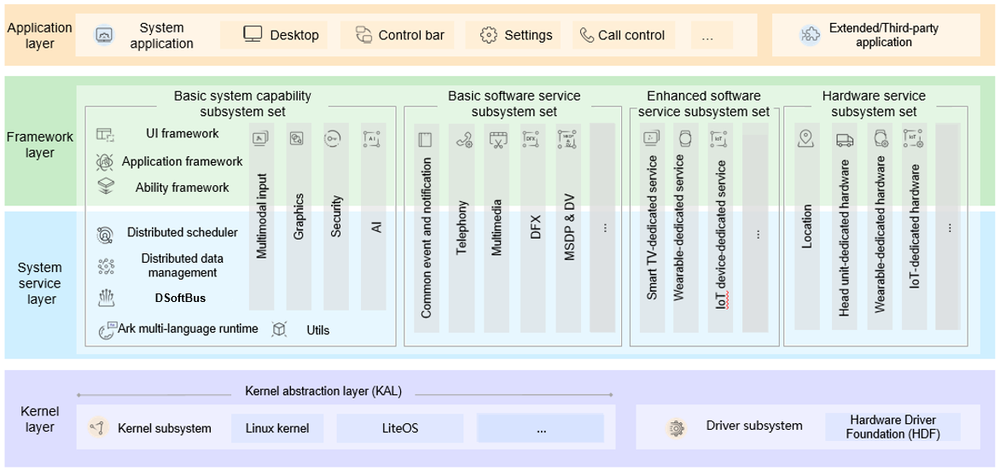

# OpenHarmony Project

## Introduction

OpenHarmony is an open-source project incubated and operated by the OpenAtom Foundation. The purpose of this project is to build an open-source, distributed operating system (OS) framework for smart devices in all scenarios of a fully-connected world.

## Technical Architecture

OpenHarmony is designed with a layered architecture, which consists of the kernel layer, system service layer, framework layer, and application layer from the bottom up. System functions are expanded by levels, from system to subsystem, and further to component. In a multi-device deployment scenario, unnecessary components can be excluded from the system as required. The following figure shows the technical architecture of OpenHarmony.

**Kernel layer**

-   Kernel subsystem: OpenHarmony uses a multi-kernel design (Linux or LiteOS) so that different kernels can be selected for devices with different resource limitations. The kernel abstraction layer (KAL) hides differences in kernel implementations and provides the upper layer with basic kernel capabilities, including process and thread management, memory management, file system, network management, and peripheral management.

-   Driver subsystem: Hardware Driver Foundation (HDF) lays the foundation for an open OpenHarmony hardware ecosystem. It allows for unified access from peripheral devices and provides foundation for driver development and management.

**System service layer**

The system service layer provides a complete set of capabilities essential for OpenHarmony to offer services for applications through the framework layer. This layer consists of the following parts:

-   Basic system capability subsystem set: Implements distributed application running, scheduling, and migration across OpenHarmony devices. This subsystem set provides the following basic capabilities: Distributed Soft Bus (DSoftBus), distributed data management, Distributed Scheduler, Utils, multimodal input, graphics, security, and AI.

-   Basic software service subsystem set: Provides OpenHarmony with common universal software services, including common event and notification, telephony, multimedia, and Design For X (DFX).

-   Enhanced software service subsystem set: Provides OpenHarmony with differentiated enhanced software services, including those dedicated to smart TVs, wearables, IoT devices, and more.

-   Hardware service subsystem set: Provides OpenHarmony with hardware services, including location, user IAM, as well as those dedicated to wearables and IoT devices.

The basic software service, enhanced software service, and hardware service subsystem sets can be tailored by subsystems, and each subsystem can be tailored by functions, depending on the deployment scenario for a particular device form.

**Framework layer**

This layer provides with what you need to develop OpenHarmony applications: application framework and ability framework specific to multiple languages (like C, C++, and JS), JS-specific ArkUI framework, as well as multi-language APIs for hardware and software services. The APIs designed for different OpenHarmony devices vary according to the components in use.

**Application layer**

This layer consists of system applications and third-party applications. Each OpenHarmony application is powered by one or more Feature Abilities (FAs) or Particle Abilities (PAs). An FA provides a UI for user interaction. A PA has no UI and provides background task processing as well as data access. Applications developed based on FAs and PAs provide specific service characteristics and enable cross-device scheduling and distribution, delighting users with consistent and efficient experience.

## Technical Features

**Hardware collaboration and resource sharing**

This feature is implemented through the following modules:

-   DSoftBus

    DSoftBus is a unified base for seamless interconnection among devices. It powers OpenHarmony with distributed communication capabilities to quickly discover and connect devices, and efficiently transmit data.

-   Distributed data management
    
    Distributed data management leverages DSoftBus to manage application data and user data distributed on different devices. Under such management, user data is no longer bound to a single physical device, and service logic is decoupled from storage. As your applications are running across devices, their data is seamlessly transmitted from one device to another, creating a foundation for a user experience that is smooth and consistent.

-   Distributed Scheduler
    
    Distributed Scheduler is designed based on technical features such as DSoftBus, distributed data management, and distributed profile. It builds a unified distributed service management mechanism (including service discovery, synchronization, registration, and invocation), and supports remote startup, remote invocation, binding/unbinding, and migration of applications across devices. This way, your application can select the most suitable device to perform distributed tasks based on the capabilities, locations, running status, and resource usage of different devices, as well as user habits and intentions.

-   Device virtualization
    
    A distributed device virtualization platform enables cross-device resource convergence, device management, and data processing so that virtual peripherals can function as capability extensions of smartphones to form a Super Device.

**One-time development for multi-device deployment**

OpenHarmony provides you with the application, ability, and UI frameworks. With these frameworks, you can develop your applications once, and then flexibly deploy them across a broad range of different devices. One-time development for multi-device deployment

Consistent APIs ensure the operational compatibility of applications across devices.

-   Adaptation of device capabilities (including CPU, memory, peripheral, and software resources) can be previewed.
-   Resources can be scheduled based on the compatibility between applications and the software platform.

**A unified OS for flexible deployment**

OpenHarmony enables hardware resources to be scaled with its component-based and small-scale designs. It can be deployed on demand for a diverse range of devices, including ARM, RISC-V, and x86 architectures, and providing RAM volumes ranging from hundreds of KiB to GiB.

## System Types

OpenHarmony supports the following system types:

-   Mini system

    A mini system fits into devices that come with Micro Controller Units (MCUs), such as Arm Cortex-M and 32-bit RISC-V processors, and memory greater than or equal to 128 KiB. This system provides multiple lightweight network protocols, a lightweight graphics framework, and a wide range of read/write components with the IoT bus. Typical products include connection modules, sensors, and wearables for smart home.

-   Small system

    A small system runs on devices whose memory is greater than or equal to 1 MiB and that are equipped with application processors such as Arm Cortex-A. This system provides higher security capabilities, standard graphics frameworks, and video encoding and decoding capabilities. Typical products include smart home IP cameras, electronic cat eyes, and routers, and event data recorders (EDRs) for easy travel.

-   Standard system

    A standard system runs on devices whose memory is greater than or equal to 128 MiB and that are equipped with application processors such as Arm Cortex-A. This system provides a complete application framework supporting the enhanced interaction, 3D GPU, hardware composer, diverse components, and rich animations. This system applies to high-end refrigerator displays.

## Subsystems

You need to understand the following basic concepts related to OpenHarmony:

-   Subsystem

    OpenHarmony is designed with a layered architecture, which consists of the kernel layer, system service layer, framework layer, and application layer from the bottom up. System functions are expanded by levels, from system to subsystem, and further to component. In a multi-device deployment scenario, unnecessary components can be excluded from the system as required. A subsystem, as a logical concept, consists of the least required components.

-   Components

    A component is a reusable software binary unit that contains source code, configuration files, resource files, and build scripts. A component can be built independently, integrated in binary mode, and then tested independently.

The following table describes the subsystems of OpenHarmony. For details about the readme files of these subsystems, see [https://gitee.com/openharmony/docs/tree/master/en/readme](https://gitee.com/openharmony/docs/tree/master/en/readme).

| Subsystem       | Description                                                       | Application Scope        |
| -------- | -------- | -------- |
| Kernel          | Supports small-sized LiteOS kernels that provide high performance and low power consumption for embedded devices and devices with limited resources, and supports Linux kernels that are applicable to the standard system.| Small System Standard System|
| Distributed File System    | Provides APIs for synchronizing local JS files.                                    | Standard system        |
| Graphics          | Consists of user interface (UI) components, layout, animator, font, input event, window management, and rendering modules. It is an application framework that can be built on the LiteOS to develop OpenHarmony applications for IoT devices with limited hardware resources or on the standard OS to develop OpenHarmony applications for standard- and large-system devices (for example, tablet and lite smart devices).| All systems        |
| Driver          | Constructed using the C object-oriented programming (OOP) language. It provides a unified driver platform and is compatible with different kernels by means of platform decoupling and kernel decoupling. This unified driver platform is designed to provide a more precise and efficient development environment, where you develop a driver that can be deployed on different systems supporting HDF.| All systems        |
| Power Management  | Provides the following functions: restarting the system, managing running locks, managing and querying the system power status, querying and reporting the charging and battery status, and turning on/off the device screen, including adjusting the screen brightness.| Standard system        |
| Pan-sensor  | Contains sensors and misc devices. A sensor is a device to detect events or changes in an environment and send messages about the events or changes to another electronic device. Misc devices, including vibrators and LED lights, are used to send signals externally. You can call APIs to control the vibration of vibrators and lighting-on and lighting-off of LED lights.| Small system        |
| Multimodal Input      | OpenHarmony provides a Natural User Interface (NUI) for you to interact with your users. Unlike conventional categorization of input methods, OpenHarmony combines input methods of different dimensions into multimodal inputs, so you can easily arm your application with multi-dimensional, natural interaction features by using the application framework and system built-in UI components or APIs. Specifically, OpenHarmony currently supports traditional input methods such as key and touch inputs.| Standard system        |
| Startup      | Starts the OS middle layer between the time the kernel is started and the time applications are started. In addition, you can query and modify system attributes and restore factory settings.| All systems        |
| Update      | Supports over the air (OTA) update of OpenHarmony devices.            | Standard system        |
| Account          | Provides interconnection with vendors' cloud account applications on the device side, and query and update of the cloud account login status.| Standard system        |
| Build      | Provides a compilation and building framework based on Generate Ninja (GN) and Ninja.       | All systems        |
| Test          | The test-driven development mode is used during the development process. You can develop new cases or modify existing cases to test new or enhanced system features. The test helps you develop high-quality code in the development phase.| All systems        |
| Data Management      | Provides local data management and distributed data management: - Local application data management for lightweight preference databases and relational databases - Distributed data service to provide applications with the capability to store data in the databases of different devices| Standard system        |
| Compiler and Runtime | Provides the compilation and execution environment for programs developed with JavaScript or C/C++, basic libraries that support the runtime, and the runtime-associated APIs, compilers, and auxiliary tools.| All systems        |
| Distributed Scheduler| Starts, registers, queries, and manages system services.                  | All systems        |
| JS UI Framework     | OpenHarmony JS UI framework supports web-development-like paradigm.      | All systems        |
| Multimedia          | Provides easy-to-use APIs for developing multimedia components such as audio, video, and camera, and enables applications to use multimedia resources of the system.| All systems        |
| Common Event and Notification      | Provides the common event management capabilities that allow applications to subscribe to, unsubscribe from, publish, and receive common events (such as screen-on/off events and USB device attachment/detachment events).| Standard system        |
| Misc Services  | Provides the function of setting the time.                                        | Standard system        |
| Bundle Management  | Provides bundle installation, uninstall, update, and query capabilities.                        | All systems        |
| Telephony      | Provides basic communication capabilities of the cellular network, such as SIM cards, network search, cellular data, cellular calls, SMS, and MMS, as well as easy-to-use APIs for you to manage multiple types of calls and data network connections.| Standard system        |
| Utils  | Stores basic components of OpenHarmony, which can be used by OpenHarmony subsystems and upper-layer applications.| All systems        |
| Development Tools    | Provides a performance profiler platform for you to analyze system issues such as memory and performance, including hdc used for device debugging, APIs for performance tracing, and a performance profiler framework.| Standard system        |
| DSoftBus  | Provides cross-process or cross-device communication capabilities for the OpenHarmony system and consists of the DSoftBus and IPC modules. The DSoftBus module enables distributed communication between near-field devices and provides device discovery, connection, networking, and data transmission functions, regardless of the communication mode. The IPC module enables communication between processes on a device or across devices.| All systems        |
| XTS            | Provides a set of OpenHarmony compatibility test suites, including the currently supported application compatibility test suite (ACTS) and the device compatibility test suite (DCTS) that will be supported in the future.| All systems        |
| System Apps      | Provides system apps that are applicable to the OpenHarmony standard system, such as Home Screen, SystemUI, and Settings. It also provides specific examples for you to build standard-system applications, which can be installed on all devices running the standard system.| Standard system        |
| DFX            | Provides non-functional capabilities of OpenHarmony. It provides a logging system, application and system event logging APIs, the event log subscription service, and fault information generation and collection capabilities.| All systems        |
| Globalization        | If OpenHarmony devices and applications need to be used globally, they must meet the requirements of users in different regions on languages and cultures. The Globalization subsystem provides multi-language and multi-cultural capabilities for global use, including resource management and internationalization (i18n).| All systems        |
| Security          | Provides system, data, and application security capabilities to protect system and user data of OpenHarmony. Its functions include application integrity verification, application permission management, device authentication, and key management.| All systems        |

## Supported Development Boards

Currently, the OpenHarmony community supports 22 types of development boards, which are listed in [Development Boards Supported](device-dev/dev-board-on-the-master.md). The following table describes three of them, which are the first three integrated into the OpenHarmony master.  You can visit http://ci.openharmony.cn/workbench/cicd/dailybuild/dailylist to obtain daily builds. 

| System Type| Board Model| Chip Model| 
Function Description and Use Case
 | Application Scenario| Code Repository |
| -------- | -------- | -------- | -------- | -------- | -------- |
| Standard system| Runhe HH-SCDAYU200| RK3568 | 
Function description: Bolstered by the Rockchip RK3568, the HH-SCDAYU200 development board integrates the dual-core GPU and efficient NPU. Its quad-core 64-bit Cortex-A55 processor uses the advanced 22 nm fabrication process and is clocked at up to 2.0 GHz. The board is packed with Bluetooth, Wi-Fi, audio, video, and camera features, with a wide range of expansion ports to accommodate various video input and outputs. It comes with dual GE auto-sensing RJ45 ports, so it can be used in multi-connectivity products, such as network video recorders (NVRs) and industrial gateways.
 | Entertainment, easy travel, and smart home, such as kitchen hoods, ovens, and treadmills.| [device_soc_rockchip](https://gitee.com/openharmony/device_soc_rockchip) [device_board_hihope](https://gitee.com/openharmony/device_board_hihope) [vendor_hihope](https://gitee.com/openharmony/vendor_hihope)   |
| Small system| Hispark_Taurus | Hi3516DV300 | 
Function Description: Hi3516D V300 is the next-generation system on chip (SoC) for smart HD IP cameras. It integrates the next-generation image signal processor (ISP), H.265 video compression encoder, and high-performance NNIE engine, and delivers high performance in terms of low bit rate, high image quality, intelligent processing and analysis, and low power consumption.
 | Smart device with screens, such as refrigerators with screens and head units.| [device_soc_hisilicon](https://gitee.com/openharmony/device_soc_hisilicon) [device_board_hisilicon](https://gitee.com/openharmony/device_board_hisilicon) [vendor_hisilicon](https://gitee.com/openharmony/vendor_hisilicon)   |
| Mini system| Multi-modal V200Z-R | BES2600 | 
Function description: The multi-modal V200Z-R development board is a high-performance, multi-functional, and cost-effective AIoT SoC powered by the BES2600WM chip of Bestechnic. It integrates a quad-core ARM processor with a frequency of up to 1 GHz as well as dual-mode Wi-Fi and dual-mode Bluetooth. The board supports the 802.11 a/b/g/n/ and BT/BLE 5.2 standards. It is able to accommodate RAM of up to 42 MB and flash memory of up to 32 MB, and supports the MIPI display serial interface (DSI) and camera serial interface (CSI). It is applicable to various AIoT multi-modal VUI and GUI interaction scenarios. Use case: [Multi-modal V200Z-R Use Case](device-dev/porting/porting-bes2600w-on-minisystem-display-demo.md)
 | Smart hardware, and smart devices with screens, such as speakers and watches.| [device_soc_bestechnic](https://gitee.com/openharmony/device_soc_bestechnic) [device_board_fnlink](https://gitee.com/openharmony/device_board_fnlink) [vendor_bestechnic](https://gitee.com/openharmony/vendor_bestechnic)   |

## Getting Started

- [Getting Started for Device Development](device-dev/quick-start/quickstart-overview.md)
- [Getting Started for Application Development](application-dev/quick-start/start-overview.md)

## Code Repository Addresses

OpenHarmony project: [https://gitee.com/openharmony](https://gitee.com/openharmony)

OpenHarmony SIGs: [https://gitee.com/openharmony-sig](https://gitee.com/openharmony-sig)

OpenHarmony third-party components: [https://gitee.com/openharmony-tpc](https://gitee.com/openharmony-tpc)

OpenHarmony archived projects: [https://gitee.com/openharmony-retired](https://gitee.com/openharmony-retired)

## OpenHarmony Documentation

[Official website](https://www.openharmony.cn/)

[Chinese version](https://gitee.com/openharmony/docs/tree/master/zh-cn)

[English version](https://gitee.com/openharmony/docs/tree/master/en)

## Source Code Downloading

For details about how to obtain the source code of OpenHarmony, see [Source Code Acquisition](https://gitee.com/openharmony/docs/blob/master/en/device-dev/get-code/sourcecode-acquire.md)

## Hands-On Tutorials

[Samples](https://gitee.com/openharmony/applications_app_samples)

[Codelabs](https://gitee.com/openharmony/codelabs)

## How to Participate

For details about how to join in the OpenHarmony community, see [OpenHarmony Community](https://gitee.com/openharmony/community/blob/master/README_EN.md)

For details about how to contribute, see [How to contribute](contribute/how-to-contribute.md).

## License Agreement

OpenHarmony complies with Apache License Version 2.0. For details, see the LICENSE in each repository.

OpenHarmony uses third-party open-source software and licenses. For details, see [Open Source Software and License Notice](https://gitee.com/openharmony/docs/blob/master/en/contribute/open-source-software-and-license-notice.md).

## Contact Info

Website:

[https://openharmony.gitee.com](https://openharmony.gitee.com/)

Email:

contact@openharmony.io
