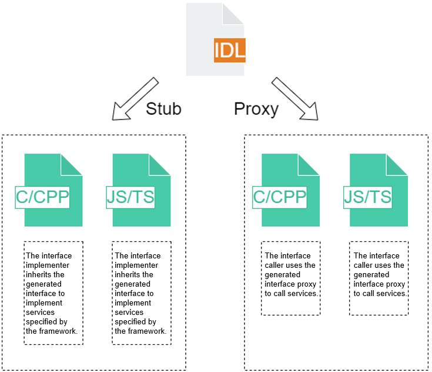
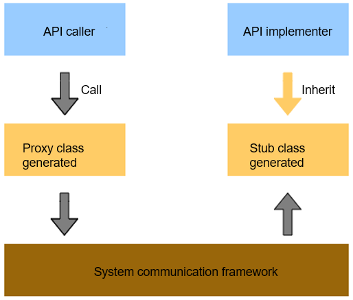

# IDL Specifications and User Guide (for System Applications Only)

## IDL Overview
To ensure successful communications between the client and server, interfaces recognized by both parties must be defined. The OpenHarmony Interface Definition Language (IDL) is a tool for defining such interfaces. IDL decomposes objects into primitives that can be understood by the operating system and encapsulates cross-boundary objects based on your requirements.

**Figure 1** IDL interface description



**IDL provides the following functions:**

- Declares interfaces provided by system services for external systems, and based on the interface declaration, generates C, C++, JS, or TS code for inter-process communication (IPC) or remote procedure call (RPC) proxies and stubs during compilation.

- Declares interfaces provided by abilities for external systems, and based on the interface declaration, generates C, C++, JS, or TS code for IPC or RPC proxies and stubs during compilation.

**Figure 2** IPC/RPC communication model



**IDL has the following advantages:**

- Services are defined in the form of interfaces in IDL. Therefore, you do not need to focus on implementation details.

- Interfaces defined by IDL can be used in IPC or RPC scenarios. The information or code generated based on the definitions in IDL simplifies IPC or RPC implementation.

## IDL File Structure

### Data Types

#### Primitive Type
| IDL Primitive Type| C++ Primitive Type| TS Primitive Type|
|   --------    |  --------     | --------     |
|void           | void          | void         |
|boolean        | bool          | boolean      |
|byte           | int8_t        | number       |
|short          | int16_t       | number       |
|int            | int32_t       | number       |
|long           | int64_t       | number       |
|float          | float         | number       |
|double         | double        | number       |
|String         | std::string   | string       |

The preceding table lists the primitive types supported by IDL and the mappings to the C++ and TS primitive types.

#### sequenceable Type
The sequenceable type is declared using the keyword **sequenceable**. This type can be passed during IPC or RPC through **Parcel** objects. The declaration mode of the sequenceable type in C++ is different from that in TS.

In C++, the declaration is placed in the file header in the format of **sequenceable includedir..namespace.typename**.  It can be in any of the following forms:

```cpp
sequenceable includedir..namespace.typename
sequenceable includedir...typename
sequenceable namespace.typename
```

In the preceding information, **includedir** indicates the directory where the header file of the type is located, and the dot (.) is used as the separator. **namespace** indicates the namespace where the type is located, and the dot (.) is used as the separator. **typename** indicates the data type, which can contain only English characters. **includedir** and **namespace** are separated by two dots (..). If the declaration statement does not contain two dots, all characters except the last typename will be parsed as a namespace. Example:

```cpp
sequenceable a.b..C.D
```

The preceding statement is parsed into the following code in the C++ header file:

```cpp
#include "a/b/d.h"
using C::D;
```

In TS, the declaration is placed in the file header in the format of **sequenceable namespace.typename;**. An example is provided below, where **idl** is the namespace and **MySequenceable** is the type name:

```ts
sequenceable idl.MySequenceable
```

In the preceding information, **namespace** indicates the namespace to which the data type belongs, **typename** indicates the data type name, and **MySequenceable** indicates that data can be passed during IPC using **Parcel** objects. The sequenceable type is not defined in the IDL file, but in the .ts file. Therefore, IDL adds the following statement to the generated .ts file based on the declaration:

```ts
import MySequenceable from "./my_sequenceable"
```

Note that IDL does not implement code for this type. It only imports the header file in the specified format or imports the specified module and uses the type. Therefore, you must ensure that the imported directory, namespace, and type are correct.

#### Interface Type
The interface type refers to interfaces defined in IDL files. The interfaces defined in an IDL file can be directly used as the parameter type or return value type of a method declared in the file. If an IDL file attempts to use interfaces defined in other IDL files, forward declaration must be contained in the header of that IDL file.

The declaration form in C++ is similar to that of the sequenceable type. The declaration form is as follows:

```cpp
interface includedir..namespace.typename
```

In TS, the declaration form is as follows:

```ts
interface namespace.interfacename
```

In the preceding information, **namespace** indicates the namespace to which the interface belongs, and **interfacename** indicates the name of the interface. For example, **interface OHOS.IIdlTestObserver;** declares the **IIdlTestObserver** interface defined in another IDL file. This interface can be used as the parameter type or return value type of a method in the current file. IDL adds the following statement to the generated .ts file based on the statement:

```ts
import IIdlTestObserver from "./i_idl_test_observer"
```

#### Array Type
The array type is represented by T[], where **T** can be the primitive, sequenceable, interface, or array type. In C++, this type is generated as **std::vector&lt;T&gt;**.
The table below lists the mappings between the IDL array type and TS and C++ data types.

|IDL Data Type | C++ Data Type          | TS Data Type    |
|   -------              |  --------            |  --------    |
|T[]                     | std::vector&lt;T&gt; | T[]          |

#### Container Type
IDL supports two container types: List and Map. The List container is represented in the format of **List&lt;T&gt;**. The Map container is represented in the format of **Map<KT,VT>**, where **T**, **KT**, and **VT** can be of the primitive, sequenceable, interface, array, or container type.

In C++, the List container type is generated as **std::list**, and the Map container type is generated as **std::map**.

In TS, the List container type is not supported, and the Map container type is generated as **Map**.

The table below lists the mappings between the IDL container type and TS and C++ data types.

|IDL Data Type | C++ Data Type      | TS Data Type    |
|   --------             |  --------        |  -------     |
|List&lt;T&gt;           | std::list        | Not supported       |
|Map<KT,VT>              | std::map         | Map          |


### Specifications for Compiling IDL Files
Only one interface type can be defined in an IDL file, and the interface name must be the same as the file name. The interface definition of the IDL file is described in Backus-Naur form (BNF). The basic definition format is as follows:

```
[<*interface_attr_declaration*>]interface<*interface_name_with_namespace*>{<*method_declaration*>}
```

In the preceding information, <*interface_attr_declaration*> declares interface attributes. Currently, only the **oneway** attribute is supported, indicating that all methods in the interface are unidirectional. Such a method returns value without waiting for the execution to complete. This attribute is optional. If this attribute is not set, synchronous call is used. The interface name must contain the complete interface header file directory, namespace, and method declaration. Null interfaces are not allowed.
The method declaration format in the interface is as follows:

```
[<*method_attr_declaration*>]<*result_type*><*method_declaration*>
```

In the preceding information, <*method_attr_declaration*> describes the interface attributes. Currently, only the **oneway** attribute is supported, indicating that the method is unidirectional. Such a method returns value without waiting for the execution to complete. This attribute is optional. If this attribute is not set, synchronous call is used. <*result_type*> indicates the type of the return value, and <*method_declaration*> indicates the method name and parameter declaration.
The parameter declaration format is as follows:

```
[<*formal_param_attr*>]<*type*><*identifier*>
```

The value of <*formal_param_attr*> can be **in**, **out**, or **inout**, indicating that the parameter is an input parameter, an output parameter, or both an input and an output parameter, respectively. A **oneway** method does not allow **output** or **inout** parameters or return values.

## How to Develop

### Obtaining IDL
#### Method 1 (Recommended)
1. On Linux, download two OpenHarmony repositories: ability_idl_tool and third_party_bounds_checking_function.
2. Go to the ability_idl_tool repository, and run the **make** command in the directory where **Makefile** is located. (Modify the relative position of **bounds_checking_function** in **MakefileLinux**.)
3. Find the idl-gen executable file generated in the current directory to debug local IDL files.

#### Method 2
On DevEco Studio, choose **Tools > SDK Manager** to view the local installation path of the OpenHarmony SDK. The following figure uses DevEco Studio 3.0.0.993 as an example.


Go to the local installation path, choose **toolchains > 3.x.x.x** (the folder named after the version number), and check whether the executable file of IDL exists.

> **NOTE**
> 
> Use the SDK of the latest version. The use of an earlier version may cause errors in some statements.

If the executable file does not exist, download the SDK package from the mirror as instructed in the [Release Notes](../../release-notes). The following uses [3.2 Beta3](../../release-notes/OpenHarmony-v3.2-beta3.md) as an example.

For details about how to replace the SDK package, see [Full SDK Compilation Guide](../faqs/full-sdk-compile-guide.md).

After obtaining the executable file, perform subsequent development steps based on your scenario.

### Development Using TS

#### Creating an IDL File

You can use TS to create IDL files.

For example, create a file named **IIdlTestService.idl** with the following content:

```cpp
  interface OHOS.IIdlTestService {
      int TestIntTransaction([in] int data);
      void TestStringTransaction([in] String data);
      void TestMapTransaction([in] Map<int, int> data);
      int TestArrayTransaction([in] String[] data);
  }
```

Run the **idl -gen-ts -d *dir* -c dir/IIdlTestService.idl** command in the folder where the executable file is located.

-*dir* next to **d** is the target output folder. For example, if the target output folder is **IIdlTestServiceTs**, run the **idl -gen-ts -d IIdlTestServiceTs -c IIdlTestServiceTs/IIdlTestService.idl** command in the folder where the executable file is located. The interface file, stub file, and proxy file are generated in the *dir* directory (**IIdlTestServiceTs** directory in this example) in the execution environment.

> **NOTE**
>
> The generated interface class file name must be the same as that of the .idl file. Otherwise, an error occurs during code generation.

For example, for an .idl file named **IIdlTestService.idl** and target output directory named **IIdlTestServiceTs**, the directory structure is similar to the following:

```
├── IIdlTestServiceTs  # IDL code output folder
│   ├── i_idl_test_service.ts  # File generated
│   ├── idl_test_service_proxy.ts  # File generated
│   ├── idl_test_service_stub.ts  # File generated
│   └── IIdlTestService.idl  # Constructed .idl file
└── idl.exe  # Executable file of IDL
```

#### Exposing Interfaces on the Server

The stub class generated by IDL is an abstract implementation of the interface class and declares all methods in the IDL file.

```ts
import {testIntTransactionCallback} from "./i_idl_test_service";
import {testStringTransactionCallback} from "./i_idl_test_service";
import {testMapTransactionCallback} from "./i_idl_test_service";
import {testArrayTransactionCallback} from "./i_idl_test_service";
import IIdlTestService from "./i_idl_test_service";
import rpc from "@ohos.rpc";

export default class IdlTestServiceStub extends rpc.RemoteObject implements IIdlTestService {
    constructor(des: string) {
        super(des);
    }
    
    async onRemoteMessageRequest(code: number, data: rpc.MessageSequence, reply: rpc.MessageSequence,
        option: rpc.MessageOption): Promise<boolean> {
        console.log("onRemoteMessageRequest called, code = " + code);
        if (code == IdlTestServiceStub.COMMAND_TEST_INT_TRANSACTION) {
            let _data = data.readInt();
            this.testIntTransaction(_data, (errCode: number, returnValue: number) => {
                reply.writeInt(errCode);
                if (errCode == 0) {
                    reply.writeInt(returnValue);
                }
            });
            return true;
        } else if (code == IdlTestServiceStub.COMMAND_TEST_STRING_TRANSACTION) {
            let _data = data.readString();
            this.testStringTransaction(_data, (errCode: number) => {
                reply.writeInt(errCode);
            });
            return true;
        } else if (code == IdlTestServiceStub.COMMAND_TEST_MAP_TRANSACTION) {
            let _data: Map<number, number> = new Map();
            let _dataSize = data.readInt();
            for (let i = 0; i < _dataSize; ++i) {
                let key = data.readInt();
                let value = data.readInt();
                _data.set(key, value);
            }
            this.testMapTransaction(_data, (errCode: number) => {
                reply.writeInt(errCode);
            });
            return true;
        } else if (code == IdlTestServiceStub.COMMAND_TEST_ARRAY_TRANSACTION) {
            let _data = data.readStringArray();
            this.testArrayTransaction(_data, (errCode: number, returnValue: number) => {
                reply.writeInt(errCode);
                if (errCode == 0) {
                    reply.writeInt(returnValue);
                }
            });
            return true;
        } else {
            console.log("invalid request code" + code);
        }
        return false;
    }
    
    testIntTransaction(data: number, callback: testIntTransactionCallback): void{}
    testStringTransaction(data: string, callback: testStringTransactionCallback): void{}
    testMapTransaction(data: Map<number, number>, callback: testMapTransactionCallback): void{}
    testArrayTransaction(data: string[], callback: testArrayTransactionCallback): void{}

    static readonly COMMAND_TEST_INT_TRANSACTION = 1;
    static readonly COMMAND_TEST_STRING_TRANSACTION = 2;
    static readonly COMMAND_TEST_MAP_TRANSACTION = 3;
    static readonly COMMAND_TEST_ARRAY_TRANSACTION = 4;
}
```

You need to inherit the interface class defined in the IDL file and implement the methods in the class. The following code snippet shows how to inherit the **IdlTestServiceStub** interface class and implement the **testIntTransaction**, **testStringTransaction**, **testMapTransaction**, and **testArrayTransaction** methods.  

```ts
import {testIntTransactionCallback} from "./i_idl_test_service"
import {testStringTransactionCallback} from "./i_idl_test_service"
import {testMapTransactionCallback} from "./i_idl_test_service";
import {testArrayTransactionCallback} from "./i_idl_test_service";
import IdlTestServiceStub from "./idl_test_service_stub"


class IdlTestImp extends IdlTestServiceStub {

    testIntTransaction(data: number, callback: testIntTransactionCallback): void
    {
        callback(0, data + 1);
    }
    testStringTransaction(data: string, callback: testStringTransactionCallback): void
    {
        callback(0);
    }
    testMapTransaction(data: Map<number, number>, callback: testMapTransactionCallback): void
    {
        callback(0);
    }
    testArrayTransaction(data: string[], callback: testArrayTransactionCallback): void
    {
        callback(0, 1);
    }
}
```

After the service implements the interface, the interface needs to be exposed to the client for connection. If your service needs to expose this interface, extend **Ability** and implement **onConnect()** to return **IRemoteObject** so that the client can interact with the service process. The following code snippet shows how to expose the **IRemoteAbility** interface to the client:

```ts
import Want from '@ohos.app.ability.Want';
import rpc from "@ohos.rpc";

class ServiceAbility {
  onStart() {
    console.info('ServiceAbility onStart');
  }
  onStop() {
    console.info('ServiceAbility onStop');
  }
  onCommand(want: Want, startId: number) {
    console.info('ServiceAbility onCommand');
  }
  onConnect(want: Want) {
    console.info('ServiceAbility onConnect');
    try {
      console.log('ServiceAbility want:' + typeof(want));
      console.log('ServiceAbility want:' + JSON.stringify(want));
      console.log('ServiceAbility want name:' + want.bundleName)
    } catch(err) {
      console.log('ServiceAbility error:' + err)
    }
    console.info('ServiceAbility onConnect end');
    return new IdlTestImp('connect') as rpc.RemoteObject;
  }
  onDisconnect(want: Want) {
    console.info('ServiceAbility onDisconnect');
    console.info('ServiceAbility want:' + JSON.stringify(want));
  }
}

export default new ServiceAbility()
```

#### Calling Methods from the Client for IPC

When the client calls **connectServiceExtensionAbility()** to connect to a ServiceAbility, the **onConnect** callback in **onAbilityConnectDone** of the client receives the **IRemoteObject** instance returned by the **onConnect()** method of the ServiceAbility. The client and ServiceAbility are in different applications. Therefore, the directory of the client application must contain a copy of the .idl file (the SDK automatically generates the proxy class). The **onConnect** callback then uses the **IRemoteObject** instance to create the **testProxy** instance of the **IdlTestServiceProxy** class and calls the related IPC method. The sample code is as follows:

```ts
import common from '@ohos.app.ability.common';
import Want from '@ohos.app.ability.Want';
import IdlTestServiceProxy from './idl_test_service_proxy'

function callbackTestIntTransaction(result: number, ret: number): void {
  if (result == 0 && ret == 124) {
    console.log('case 1 success');
  }
}

function callbackTestStringTransaction(result: number): void {
  if (result == 0) {
    console.log('case 2 success');
  }
}

function callbackTestMapTransaction(result: number): void {
  if (result == 0) {
    console.log('case 3 success');
  }
}

function callbackTestArrayTransaction(result: number, ret: number): void {
  if (result == 0 && ret == 124) {
    console.log('case 4 success');
  }
}

let onAbilityConnectDone: common.ConnectOptions = {
  onConnect: (elementName, proxy) => {
    let testProxy: IdlTestServiceProxy = new IdlTestServiceProxy(proxy);
    let testMap: Map<number, number> = new Map();
    testMap.set(1, 1);
    testMap.set(1, 2);
    testProxy.testIntTransaction(123, callbackTestIntTransaction);
    testProxy.testStringTransaction('hello', callbackTestStringTransaction);
    testProxy.testMapTransaction(testMap, callbackTestMapTransaction);
    testProxy.testArrayTransaction(['1','2'], callbackTestMapTransaction);
  },
  onDisconnect: (elementName) => {
    console.log('onDisconnectService onDisconnect');
  },
  onFailed: (code) => {
    console.log('onDisconnectService onFailed');
  }
};

let context: common.UIAbilityContext = this.context;

function connectAbility(): void {
    let want: Want = {
        bundleName: 'com.example.myapplicationidl',
        abilityName: 'com.example.myapplicationidl.ServiceAbility'
    };
    let connectionId = -1;
    connectionId = context.connectServiceExtensionAbility(want, onAbilityConnectDone);
}


```

#### Transferring a sequenceable Object During IPC

You can send a class from one process to another through IPC interfaces. However, you must ensure that the peer can use the code of this class and this class supports the **marshalling** and **unmarshalling** methods. The system uses **marshalling** and **unmarshalling** to serialize and deserialize objects into objects that can be identified by each process.

**To create a class that supports the sequenceable type, perform the following operations:**

1. Implement the **marshalling** method, which obtains the current state of the object and serializes the object into a **Parcel** object.
2. Implement the **unmarshalling** method, which deserializes the object from a **Parcel** object.

The following is an example of the **MySequenceable** class code:

```ts
import rpc from '@ohos.rpc';
export default class MySequenceable implements rpc.Sequenceable {
    constructor(num: number, str: string) {
        this.num = num;
        this.str = str;
    }
    getNum() : number {
        return this.num;
    }
    getString() : string {
        return this.str;
    }
    marshalling(messageParcel: rpc.MessageParcel) {
        messageParcel.writeInt(this.num);
        messageParcel.writeString(this.str);
        return true;
    }
    unmarshalling(messageParcel: rpc.MessageParcel) {
        this.num = messageParcel.readInt();
        this.str = messageParcel.readString();
        return true;
    }
    private num: number;
    private str: string;
}
```

### Development Using C++ (Automatically Generating ServiceAbility Interface Template Code During Compilation)

#### Creating an IDL File

You can use C++ to create IDL files.

For example, create a file named **IQuickFixManager.idl** with the following content:

```
/*
 * Copyright (c) 2023 Huawei Device Co., Ltd.
 * Licensed under the Apache License, Version 2.0 (the "License");
 * you may not use this file except in compliance with the License.
 * You may obtain a copy of the License at
 *
 *     http://www.apache.org/licenses/LICENSE-2.0
 *
 * Unless required by applicable law or agreed to in writing, software
 * distributed under the License is distributed on an "AS IS" BASIS,
 * WITHOUT WARRANTIES OR CONDITIONS OF ANY KIND, either express or implied.
 * See the License for the specific language governing permissions and
 * limitations under the License.
 */

sequenceable QuickFixInfo..OHOS.AAFwk.ApplicationQuickFixInfo;
interface OHOS.AAFwk.IQuickFixManager {
    void ApplyQuickFix([in] String[] quickFixFiles, [in] boolean isDebug);
    void GetApplyedQuickFixInfo([in] String bundleName, [out] ApplicationQuickFixInfo quickFixInfo);
    void RevokeQuickFix([in] String bundleName);
}
```

#### Modifying the BUILD.gn File
Two methods are available for modification.

##### Method 1 (Recommended. IDL Files Can Be Processed in Batches and Compiled into .so Files)

1. Import the IDL tool template to the current **BUILD.gn** file.

   ```bash
   # Copy the line below to the .gn file.
   import("//foundation/ability/idl_tool/idl_config.gni")
   ```

2. Invoke the IDL tool to generate a C++ template file.

   ```bash
   
   # Use idl_gen_interface to generate a template file. The value passed in will be used in deps.
   idl_gen_interface("EEEFFFGGG") {
     # Name of your .idl file, which must be in the same path as the .gn file.
     sources = [
      "IAxxBxxCxx.idl",
      "IAxxBxxCxx2.idl",
     ]

     # Based on the usage of user-defined objects in the IDL file, you must add the compilation of the corresponding .cpp file when compiling the .so file. The default value is null.
     sources_cpp = []

     # Add configs during .so file compilation.
     configs = []

     # Add public_deps during .so file compilation.
     sequenceable_pub_deps = []

     # Add external_deps during .so file compilation.
     sequeceable_ext_deps = []

     # Add innerapi_tags during .so file compilation.
     innerapi_tags = ""

     # Add sanitize during .so file compilation.
     sanitize = ""
   
     # Enable hitrace. The value is the uint64_t type identifier defined in the hitrace_meter.h file. You need to enter the variable name of the constant.
     hitrace = "HITRACE_TAG_ABILITY_MANAGER"
        
     # Enable hilog. The domain ID is a hexadecimal integer.
     log_domainid = "0xD003900"
     # Enable hilog. The tag name is a string, which is generally a subsystem name.
     log_tag = "QuickFixManagerService"
       
     # (Mandatory) Add subsystem_name during .so file compilation. The value must be the same as the actual subsystem name. For example, use the following in quick_fix:
     subsystem_name = "ability"
     # (Mandatory) Add part_name during .so file compilation. The value must be the same as the actual part name. For example, use the following in quick_fix:
     part_name = "ability_runtime"
   }
   ```
   
   Configure hilog. The log_domainid and log_tag parameters must appear in pairs; otherwise, a compilation error occurs. For example, use the following in quick_fix:
   
   ```bash
      idl_gen_interface("quickfix_manager_interface") {
        sources = [
         "IQuickFixManager.idl"
        ]
        hitrace = "HITRACE_TAG_ABILITY_MANAGER"
        log_domainid = "0xD003900"
        log_tag = "QuickFixManagerService" # An error occurs during compilation if only log_tag or log_domainid is included.
      }
   ```
   
3. Add the dependency **EEEFFFGGG** to **BUILD.gn**.

   ```bash
   deps = [
      # Use the value passed in idl_gen_interface, prefixed with lib and suffixed with _proxy or _stub to obtain the generated .so file name.
      ":libEEEFFFGGG_proxy", # Add this dependency if the proxy .so file is required.
      ":libEEEFFFGGG_stub", # Add this dependency if the stub .so file is required.
     ]
   ```

   The name of the dependency added to **deps** must be the same as the value passed in **idl_gen_interface**. For example, use the following in quick_fix:

   ```bash
   idl_gen_interface("quickfix_manager_interface") {
     sources = [
      "IQuickFixManager.idl"
     ]
     hitrace = "HITRACE_TAG_ABILITY_MANAGER"
     log_domainid = "0xD003900"
     log_tag = "QuickFixManagerService"
   }
   deps = [
    "${ability_runtime_innerkits_path}/app_manager:app_manager",
    ":libquickfix_manager_interface_proxy", # Value passed in idl_gen_interface, prefixed with lib and suffixed with _proxy.
    ":libquickfix_manager_interface_stub", # Value passed in idl_gen_interface, prefixed with lib and suffixed with _stub.
   ]
   ```

4. Add external dependencies of the template file to **BUILD.gn**.

   Add the external dependencies of the template file to **external_deps**.

   If a dependency already exists, you do not need to add it again; otherwise, compilation errors may occur.

   ```bash
     external_deps = [
     # Mandatory dependency of the template file
     "c_utils:utils",
     # Mandatory dependency of the hilog output
     "hilog:libhilog",
     # Mandatory dependency of hitrace output (not required if hitrace is not configured in idl_gen_interface.)
     "hitrace:hitrace_meter",
     # Mandatory dependency of the template file
     "ipc:ipc_core",
   ]
   ```

##### Method 2

1. Import the IDL tool template to the current **BUILD.gn** file.

   ```bash
   # Copy the line below to the .gn file.
   import("//foundation/ability/idl_tool/idl_config.gni")
   ```

2. Invoke the IDL tool to generate a C++ template file.

   Replace *axx_bxx_cxx* in the code below with the .cpp file names of the generated stub and proxy.

   ```bash
   idl_interface_sources = [
     # Change axx_bxx_cxx to the name of the .cpp file of the generated proxy.
     "${target_gen_dir}/axx_bxx_cxx_proxy.cpp",                                            
     # Change axx_bxx_cxx to the name of the .cpp file of the generated stub.
     "${target_gen_dir}/axx_bxx_cxx_stub.cpp",
   ]
   
   # Use idl_gen_interface to generate a template file. You need to enter the parameter name, which will be used in deps.
   idl_gen_interface("EEEFFFGGG") {
     # Name of your .idl file, which is in the same path as the .gn file.
     src_idl = rebase_path("IAxxBxxCxx.idl")
     # The template file .cpp of the proxy and stub. You can copy the line below to the .gn file.
     dst_file = string_join(",", idl_interface_sources)
     # Enable hitrace. The value is the uint64_t type identifier defined in the hitrace_meter.h file. You need to enter the variable name of the constant.
     hitrace = "HITRACE_TAG_ABILITY_MANAGER"
     # Enable hilog. The domain ID is a hexadecimal integer.
     log_domainid = "0xD003900"
     # Enable hilog. The tag name is a string, which is generally a subsystem name.
     log_tag = "QuickFixManagerService"
   }
   ```

   The names of ***axx_bxx_cxx_*proxy.cpp** and ***axx_bxx_cxx_*stub.cpp** are the same as the corresponding .idl file names in lowercase, with an underscore (_) added for each CamelCase segment.

   ```bash
   # For example, if the .idl file is IQuickFixManager.idl,
   then axx_bxx_cxx_proxy.cpp is quick_fix_manager_proxy.cpp
   and axx_bxx_cxx_stub.cpp is quick_fix_manager_stub.cpp.
   ```

   If the name of the template file to be generated starts with I, add one **I** before the interface name.

   ```bash
   # For example, if the generated template file is **quick_fix_manager_proxy.cpp**, the interface name is **IQuickFixManager**.
   # Definition in the .idl file
   interface OHOS.AAFwk.IQuickFixManager {
       void ApplyQuickFix([in] String[] quickFixFiles, [in] boolean isDebug);
       void GetApplyedQuickFixInfo([in] String bundleName, [out] ApplicationQuickFixInfo quickFixInfo);
       void RevokeQuickFix([in] String bundleName);
   }
   ```

   Configure hilog. The log_domainid and log_tag parameters must appear in pairs; otherwise, a compilation error occurs.

   ```bash
   idl_gen_interface("quickfix_manager_interface") {
     src_idl = rebase_path("IQuickFixManager.idl")
     dst_file = string_join(",", idl_interface_sources)
     hitrace = "HITRACE_TAG_ABILITY_MANAGER"
     log_domainid = "0xD003900"
     log_tag = "QuickFixManagerService" # An error occurs during compilation if only log_tag or log_domainid is included.
   }
   ```

3. Add the header file path of the template file to **BUILD.gn**.

   You only need to add **${target_gen_dir}** to **include_dirs**.

   ```bash
   include_dirs = [
     "aaa/bbb/ccc",        # Path of the original header file
     "${target_gen_dir}",  # Path of the template header file
   ]
   ```

4. Add the path of the template file .cpp to **BUILD.gn**.

   If **sources** contain ***axx_bxx_cxx_*proxy.cpp** and ***axx_bxx_cxx_*stub.cpp**, delete them and add **sources += filter_include(output_values, [ "*.cpp" ])**.

   ```bash
   output_values = get_target_outputs(":EEEFFFGGG") # Return the output file list of the target tag. Replace EEEFFFGGG.
   sources = [ "axx_bxx_cxx_proxy.cpp" ] # Delete axx_bxx_cxx_proxy.cpp.
   sources += filter_include(output_values, [ "*.cpp" ]) # filter_include selects the list that meets the requirements. You can copy this line directly.
   ```

5. Add the dependency **EEEFFFGGG** to **BUILD.gn**.

   ```bash
   deps = [
       ":EEEFFFGGG",
     ]
   ```

   The name of the dependency added to **deps** must be the same as the parameter name of the **idl_gen_interface** function.

   ```bash
   idl_gen_interface("quickfix_manager_interface") {
     src_idl = rebase_path("IQuickFixManager.idl")
     dst_file = string_join(",", idl_interface_sources)
     hitrace = "HITRACE_TAG_ABILITY_MANAGER"
     log_domainid = "0xD003900"
     log_tag = "QuickFixManagerService"
   }
   deps = [
    "${ability_runtime_innerkits_path}/app_manager:app_manager",
    ":quickfix_manager_interface"] # Same as the parameter name of the idl_gen_interface function.
   ```

6. Add external dependencies of the template file to **BUILD.gn**.

   Add the external dependencies of the template file to **external_deps**.

   If a dependency already exists, you do not need to add it again; otherwise, compilation errors may occur.

   ```bash
     external_deps = [
     # Mandatory dependency of the template file
     "c_utils:utils",
     # Mandatory dependency of the hilog output
     "hilog:libhilog",
     # Mandatory dependency of the hitrace output
     "hitrace:hitrace_meter",
     # Mandatory dependency of the template file
     "ipc:ipc_core",
   ]
   ```

#### Example

The following uses the quick fix service as an example:

1. Create the **IQuickFixManager.idl** file.

   When creating the .idl file, ensure that the interface name is the same as the .idl file name; otherwise, an error occurs during code generation.

   The path of the .idl file must be the same as that of the **BUILD.gn** file of the function code.

   In the example, the file is in **foundation/ability/ability_runtime/interfaces/inner_api/quick_fix/**.

   ```bash
   /*
    * Copyright (c) 2023 Huawei Device Co., Ltd.
    * Licensed under the Apache License, Version 2.0 (the "License");
    * you may not use this file except in compliance with the License.
    * You may obtain a copy of the License at
    *
    *     http://www.apache.org/licenses/LICENSE-2.0
    *
    * Unless required by applicable law or agreed to in writing, software
    * distributed under the License is distributed on an "AS IS" BASIS,
    * WITHOUT WARRANTIES OR CONDITIONS OF ANY KIND, either express or implied.
    * See the License for the specific language governing permissions and
    * limitations under the License.
    */
   
   sequenceable QuickFixInfo..OHOS.AAFwk.ApplicationQuickFixInfo;
   interface OHOS.AAFwk.IQuickFixManager {
       void ApplyQuickFix([in] String[] quickFixFiles, [in] boolean isDebug);
       void GetApplyedQuickFixInfo([in] String bundleName, [out] ApplicationQuickFixInfo quickFixInfo);
       void RevokeQuickFix([in] String bundleName);
   }
   ```

   When creating the .idl file, change the return value of the function from int to void.

   ```bash
   # Functions in quick_fix_manager_client.h
       int32_t ApplyQuickFix(const std::vector<std::string> &quickFixFiles);
       int32_t GetApplyedQuickFixInfo(const std::string &bundleName, ApplicationQuickFixInfo &quickFixInfo);
       int32_t RevokeQuickFix(const std::string &bundleName);
   # Definition in the .idl file
   interface OHOS.AAFwk.QuickFixManager {
       void ApplyQuickFix([in] String[] quickFixFiles);
       void GetApplyedQuickFixInfo([in] String bundleName, [out] ApplicationQuickFixInfo quickFixInfo);
       void RevokeQuickFix([in] String bundleName);
   }
   ```

2. Modify the BUILD.gn file.

   ```bash
   # Copyright (c) 2023 Huawei Device Co., Ltd.
   # Licensed under the Apache License, Version 2.0 (the "License");
   # you may not use this file except in compliance with the License.
   # You may obtain a copy of the License at
   #
   #     http://www.apache.org/licenses/LICENSE-2.0
   #
   # Unless required by applicable law or agreed to in writing, software
   # distributed under the License is distributed on an "AS IS" BASIS,
   # WITHOUT WARRANTIES OR CONDITIONS OF ANY KIND, either express or implied.
   # See the License for the specific language governing permissions and
   # limitations under the License.
   
   import("//build/ohos.gni")
   import("//foundation/ability/ability_runtime/ability_runtime.gni")
   import("//foundation/ability/idl_tool/idl_config.gni")
   
   idl_interface_sources = [
     "${target_gen_dir}/quick_fix_manager_proxy.cpp",
     "${target_gen_dir}/quick_fix_manager_stub.cpp",
   ]
   
   idl_gen_interface("quickfix_manager_interface") {
     src_idl = rebase_path("IQuickFixManager.idl")
     dst_file = string_join(",", idl_interface_sources)
     hitrace = "HITRACE_TAG_ABILITY_MANAGER"
     log_domainid = "0xD003900"
     log_tag = "QuickFixManagerService"
   }
   
   config("quickfix_config") {
     visibility = [ ":*" ]
     include_dirs = [
       "include",
       "${target_gen_dir}",
     ]
     cflags = []
     if (target_cpu == "arm") {
       cflags += [ "-DBINDER_IPC_32BIT" ]
     }
   }
   
   ohos_shared_library("quickfix_manager") {
     configs = [ "${ability_runtime_services_path}/common:common_config" ]
     public_configs = [ ":quickfix_config" ]
   
     output_values = get_target_outputs(":quickfix_manager_interface")
     sources = [
       "src/quick_fix_error_utils.cpp",
       "src/quick_fix_info.cpp",
       "src/quick_fix_load_callback.cpp",
       "src/quick_fix_manager_client.cpp",
       "src/quick_fix_utils.cpp",
     ]
     sources += filter_include(output_values, [ "*.cpp" ])
     defines = [ "AMS_LOG_TAG = \"QuickFixService\"" ]
     deps = [
       ":quickfix_manager_interface",
       "${ability_runtime_innerkits_path}/app_manager:app_manager",
     ]
   
     external_deps = [
       "ability_base:want",
       "bundle_framework:appexecfwk_base",
       "bundle_framework:appexecfwk_core",
       "c_utils:utils",
       "hilog:libhilog",
       "hitrace:hitrace_meter",
       "ipc:ipc_single",
       "safwk:system_ability_fwk",
       "samgr:samgr_proxy",
     ]
   
     innerapi_tags = [ "platformsdk" ]
     subsystem_name = "ability"
     part_name = "ability_runtime"
   }
   ```

3. Specify the path and directory structure of the generated template file.

   Take rk3568 as an example. The path of the template file generated in the instance is **out/rk3568/gen/foundation/ability/ability_runtime/interfaces/inner_api/quick_fix/**,

   where **foundation/ability/ability_runtime/interfaces/inner_api/quick_fix/** is the relative path of the .idl file.

   The directory structure of the template file generated is as follows:

   ```bash
   |-- out/rk3568/gen/foundation/ability/ability_runtime/interfaces/inner_api/quick_fix/
      |-- iquick_fix_manager.h
      |-- quick_fix_manager_stub.h
      |-- quick_fix_manager_stub.cpp
      |-- quick_fix_manager_proxy.h
      |-- quick_fix_manager_proxy.cpp
   ```

