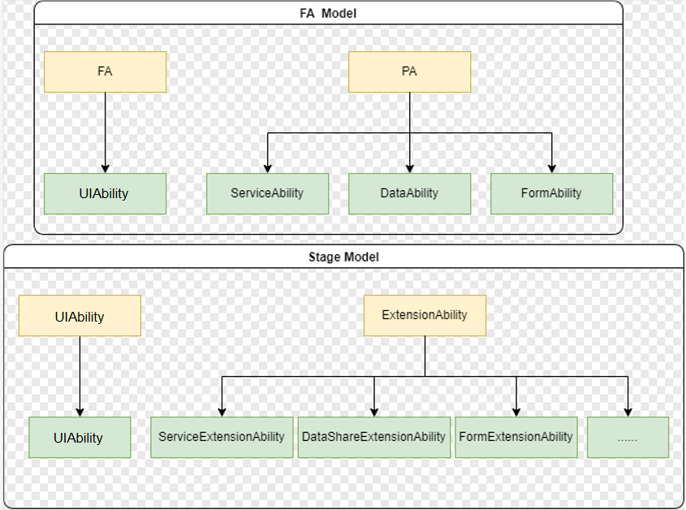

# Ability Framework Overview

An ability is the abstraction of a functionality that an application can provide. It is the minimum unit for the system to schedule applications. An application can contain one or more `Ability` instances.

The ability framework model has two forms:

- FA model, which applies to application development using API version 8 and earlier versions. In the FA model, there is Feature Ability (FA) and Particle Ability (PA). The FA supports Page abilities, and the PA supports Service, Data, and Form abilities. 
- Stage model, which is introduced since API version 9. In the stage model, there is `PageAbility` and `ExtensionAbility`. `ExtensionAbility` is further extended to `ServiceExtensionAbility`, `FormExtensionAbility`, `DataShareExtensionAbility`, and more.

The stage model is designed to make it easier to develop complex applications in the distributed environment. The table below lists the design differences between the two models.

| Item          | FA Model                                                      | Stage Model                                               |
| -------------- | ------------------------------------------------------------ | -------------------------------------------------------- |
| Development mode      | Web-like APIs are provided. The UI development is the same as that of the stage model.                    | Object-oriented development mode is provided. The UI development is the same as that of the FA model.            |
| Engine instance      | Each ability in a process exclusively uses a JS VM engine instance.              | Multiple abilities in a process share one JS VM engine instance.      |
| Intra-process object sharing| Not supported.                                                  | Supported.                                                 |
| Bundle description file    | The `config.json` file is used to describe the HAP and component information. Each component must use a fixed file name.| The `module.json5` file is used to describe the HAP and component information. The entry file name can be specified.|
| Component          | Four types of components are provided: Page ability (used for UI page display), Service ability (used to provide services), Data ability (used for data sharing), and Form ability (used to provide widgets).| Two types of components are provided: Ability (used for UI page display) and Extension (scenario-based service extension).  |

In addition, the following differences exist in the development process:

* Different ability types

  

* Different ability lifecycles

  

For details about the two models, see [FA Model Overview](fa-brief.md) and [Stage Model Overview](stage-brief.md).
