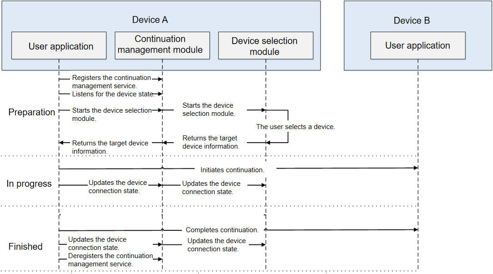

# ContinuationManager Development

> **NOTE**
>
> Currently, the **ContinuationManager** module is not available for application development. Its APIs are mainly used to start the device selection module.

## When to Use
Users are using two or more devices to experience an all-scenario, multi-device lifestyle. Each type of device has its unique advantages and disadvantages specific to scenarios. The ability continuation capability breaks boundaries of devices and enables multi-device collaboration, achieving precise control, universal coordination, and seamless hops of user applications.

As the entry of the ability continuation capability, **continuationManager** is used to start the device selection module for the user to select the target device. After a device is selected, information about the selected device is returned to the user. The user can then initiate cross-device continuation or collaboration based on the device information.



## Available APIs
| API                                                                                         | Description|
| ---------------------------------------------------------------------------------------------- | ----------- |
| registerContinuation(callback: AsyncCallback\<number>): void | Registers the continuation management service and obtains a token. This API does not involve any filter parameters and uses an asynchronous callback to return the result.|
| registerContinuation(options: ContinuationExtraParams, callback: AsyncCallback\<number>): void | Registers the continuation management service and obtains a token. This API uses an asynchronous callback to return the result.|
| registerContinuation(options?: ContinuationExtraParams): Promise\<number> | Registers the continuation management service and obtains a token. This API uses a promise to return the result.|
| on(type: "deviceSelected", token: number, callback: Callback\<Array\<ContinuationResult>>): void | Subscribes to device connection events. This API uses an asynchronous callback to return the result.|
| on(type: "deviceUnselected", token: number, callback: Callback\<Array\<ContinuationResult>>): void | Subscribes to device disconnection events. This API uses an asynchronous callback to return the result.|
| off(type: "deviceSelected", token: number): void | Unsubscribes from device connection events.|
| off(type: "deviceUnselected", token: number): void | Unsubscribes from device disconnection events.|
| startContinuationDeviceManager(token: number, callback: AsyncCallback\<void>): void | Starts the device selection module to show the list of available devices. This API does not involve any filter parameters and uses an asynchronous callback to return the result.|
| startContinuationDeviceManager(token: number, options: ContinuationExtraParams, callback: AsyncCallback\<void>): void | Starts the device selection module to show the list of available devices. This API uses an asynchronous callback to return the result.|
| startContinuationDeviceManager(token: number, options?: ContinuationExtraParams): Promise\<void> | Starts the device selection module to show the list of available devices. This API uses a promise to return the result.|
| updateContinuationState(token: number, deviceId: string, status: DeviceConnectState, callback: AsyncCallback\<void>): void | Instructs the device selection module to update the device connection state. This API uses an asynchronous callback to return the result.|
| updateContinuationState(token: number, deviceId: string, status: DeviceConnectState): Promise\<void> | Instructs the device selection module to update the device connection state. This API uses a promise to return the result.|
| unregisterContinuation(token: number, callback: AsyncCallback\<void>): void | Deregisters the continuation management service. This API uses an asynchronous callback to return the result.|
| unregisterContinuation(token: number): Promise\<void> | Deregisters the continuation management service. This API uses a promise to return the result.|

## How to Develop
1. Import the **continuationManager** module.

    ```ts
    import continuationManager from '@ohos.continuation.continuationManager';
    ```

2. Apply for the **DISTRIBUTED_DATASYNC** permission.

    The permission application operation varies according to the ability model in use. In the FA mode, add the required permission in the `config.json` file, as follows:

    ```json
    {
        "module": {
            "reqPermissions": [
                {
                    "name": "ohos.permission.DISTRIBUTED_DATASYNC"
                }
            ]
        }
    }
    ```

    This permission must also be granted by the user through a dialog box when the application is started for the first time. The sample code is as follows:

    ```ts
    import abilityAccessCtrl from "@ohos.abilityAccessCtrl";
    import bundle from '@ohos.bundle';
    import featureAbility from '@ohos.ability.featureAbility';

    async function requestPermission() {
        let permissions: Array<string> = [
            "ohos.permission.DISTRIBUTED_DATASYNC"
        ];
        let needGrantPermission: boolean = false;
        let atManager: abilityAccessCtrl.AtManager = abilityAccessCtrl.createAtManager();
        let applicationInfo = await bundle.getApplicationInfo('ohos.samples.etsDemo', 0, 100);
        for (let i = 0; i < permissions.length; i++) {
            let result = await atManager.verifyAccessToken(applicationInfo.accessTokenId, permissions[i]);
            // Check whether the permission is granted.
            if (result == abilityAccessCtrl.GrantStatus.PERMISSION_GRANTED) {
                needGrantPermission = true;
                break;
            }
        }
        // If the permission is not granted, call requestPermissionsFromUser to apply for the permission.
        if (needGrantPermission) {
            await featureAbility.getContext().requestPermissionsFromUser(permissions, 1);
        } else {
            console.info('app permission already granted');
        }
    }
    ```

    In the stage model, add the required permission in the `module.json5` file. The sample code is as follows:

    ```json
    {
        "module": {
            "requestPermissions": [
                {
                    "name": "ohos.permission.DISTRIBUTED_DATASYNC"
                }
            ]
        }
    }
    ```

    ```ts
    import abilityAccessCtrl from "@ohos.abilityAccessCtrl";
    import bundle from '@ohos.bundle';

    async function requestPermission() {
        let permissions: Array<string> = [
            "ohos.permission.DISTRIBUTED_DATASYNC"
        ];
        let needGrantPermission: boolean = false;
        let atManger: abilityAccessCtrl.AtManager = abilityAccessCtrl.createAtManager();
        let applicationInfo = await bundle.getApplicationInfo('ohos.samples.continuationmanager', 0, 100);
        for (const permission of permissions) {
            try {
                let grantStatus = await atManger.verifyAccessToken(applicationInfo.accessTokenId, permission);
                // Check whether the permission is granted.
                if (grantStatus === abilityAccessCtrl.GrantStatus.PERMISSION_DENIED) {
                    needGrantPermission = true;
                    break;
                }
            } catch (err) {
                console.error('app permission query grant status error' + JSON.stringify(err));
                needGrantPermission = true;
                break;
            }
        }
        // If the permission is not granted, call requestPermissionsFromUser to apply for the permission.
        if (needGrantPermission) {
            try {
                // globalThis.context is Ability.context, which must be assigned a value in the MainAbility.ts file in advance.
                await globalThis.context.requestPermissionsFromUser(permissions);
            } catch (err) {
                console.error('app permission request permissions error' + JSON.stringify(err));
            }
        } else {
            console.info('app permission already granted');
        }
    }
    ```

3. Register the continuation management service and obtain a token.

    The sample code is as follows:

    ```ts
    let token: number = -1; // Used to save the token returned after the registration. The token will be used when listening for device connection/disconnection events, starting the device selection module, and updating the device connection state.
    try {
        continuationManager.registerContinuation().then((data) => {
            console.info('registerContinuation finished, ' + JSON.stringify(data));
            token = data; // Obtain a token and assign a value to the token variable.
        }).catch((err) => {
            console.error('registerContinuation failed, cause: ' + JSON.stringify(err));
        });
    } catch (err) {
        console.error('registerContinuation failed, cause: ' + JSON.stringify(err));
    }
    ```

4. Listen for the device connection/disconnection state.

    The sample code is as follows:

    ```ts
    let remoteDeviceId: string = ""; // Used to save the information about the remote device selected by the user, which will be used for cross-device continuation or collaboration.

    try {
        // The token parameter is the token obtained during the registration.
        continuationManager.on("deviceSelected", token, (continuationResults) => {
            console.info('registerDeviceSelectedCallback len: ' + continuationResults.length);
            if (continuationResults.length <= 0) {
                console.info('no selected device');
                return;
            }
            remoteDeviceId = continuationResults[0].id; // Assign the deviceId of the first selected remote device to the remoteDeviceId variable.

            // Pass the remoteDeviceId parameter to want.
            let want = {
                deviceId: remoteDeviceId,
                bundleName: 'ohos.samples.continuationmanager',
                abilityName: 'MainAbility'
            };
            globalThis.abilityContext.startAbility(want).then((data) => {
                console.info('StartRemoteAbility finished, ' + JSON.stringify(data));
            }).catch((err) => {
                console.error('StartRemoteAbility failed, cause: ' + JSON.stringify(err));
            });
        });
    } catch (err) {
        console.error('on failed, cause: ' + JSON.stringify(err));
    }
    ```

    The preceding multi-device collaboration operation is performed across devices in the stage model. For details about this operation in the FA model, see [Page Ability Development](fa-pageability.md).

    You can also instruct the device selection module to update the device connection state. The sample code is as follows:

    ```ts
    // Set the device connection state.
    let deviceConnectStatus: continuationManager.DeviceConnectState = continuationManager.DeviceConnectState.CONNECTED;

    // The token parameter is the token obtained during the registration, and the remoteDeviceId parameter is the remoteDeviceId obtained.
    try {
        continuationManager.updateContinuationState(token, remoteDeviceId, deviceConnectStatus).then((data) => {
            console.info('updateContinuationState finished, ' + JSON.stringify(data));
        }).catch((err) => {
            console.error('updateContinuationState failed, cause: ' + JSON.stringify(err));
        });
    } catch (err) {
        console.error('updateContinuationState failed, cause: ' + JSON.stringify(err));
    }
    ```

    Listen for the device disconnection state so that the user can stop cross-device continuation or collaboration in time. The sample code is as follows:

    ```ts
    try {
        // The token parameter is the token obtained during the registration.
        continuationManager.on("deviceUnselected", token, (continuationResults) => {
            console.info('onDeviceUnselected len: ' + continuationResults.length);
            if (continuationResults.length <= 0) {
                console.info('no unselected device');
                return;
            }

            // Update the device connection state.
            let unselectedDeviceId: string = continuationResults[0].id; // Assign the deviceId of the first deselected remote device to the unselectedDeviceId variable.
            let deviceConnectStatus: continuationManager.DeviceConnectState = continuationManager.DeviceConnectState.DISCONNECTING; // Device disconnected.

            // The token parameter is the token obtained during the registration, and the unselectedDeviceId parameter is the unselectedDeviceId obtained.
            continuationManager.updateContinuationState(token, unselectedDeviceId, deviceConnectStatus).then((data) => {
                console.info('updateContinuationState finished, ' + JSON.stringify(data));
            }).catch((err) => {
                console.error('updateContinuationState failed, cause: ' + JSON.stringify(err));
            });
        });
    } catch (err) {
        console.error('updateContinuationState failed, cause: ' + JSON.stringify(err));
    }
    ```

5. Start the device selection module to show the list of available devices on the network.

    The sample code is as follows:

    ```ts
    // Filter parameters.
    let continuationExtraParams = {
        deviceType: ["00E"], // Device type.
        continuationMode: continuationManager.ContinuationMode.COLLABORATION_SINGLE // Single-choice mode of the device selection module.
    };

    try {
        // The token parameter is the token obtained during the registration.
        continuationManager.startContinuationDeviceManager(token, continuationExtraParams).then((data) => {
            console.info('startContinuationDeviceManager finished, ' + JSON.stringify(data));
        }).catch((err) => {
            console.error('startContinuationDeviceManager failed, cause: ' + JSON.stringify(err));
        });
    } catch (err) {
        console.error('startContinuationDeviceManager failed, cause: ' + JSON.stringify(err));
    }
    ```

6. If you do not need to perform cross-device migration or collaboration operations, you can deregister the continuation management service, by passing the token obtained during the registration.

    The sample code is as follows:

    ```ts
    try {
        // The token parameter is the token obtained during the registration.
        continuationManager.unregisterContinuation(token).then((data) => {
            console.info('unregisterContinuation finished, ' + JSON.stringify(data));
        }).catch((err) => {
            console.error('unregisterContinuation failed, cause: ' + JSON.stringify(err));
        });
    } catch (err) {
        console.error('unregisterContinuation failed, cause: ' + JSON.stringify(err));
    }
    ```
