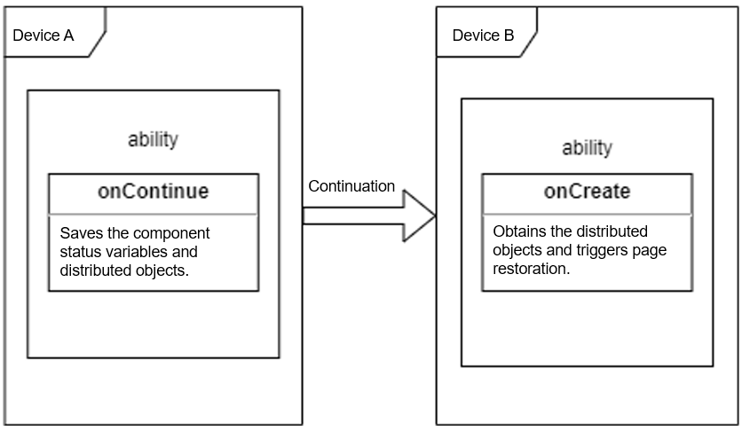

# Ability Continuation Development

## When to Use

Ability continuation is to continue the current mission of an application, including the UI component state variables and distributed objects, on another device. The UI component state variables are used to synchronize UI data, and the distributed objects are used to synchronize memory data.

## Available APIs

The following table lists the APIs used for ability continuation. For details about the APIs, see [Ability](../reference/apis/js-apis-application-ability.md).

**Table 1** Ability continuation APIs

|API| Description|
|:------ | :------|
| onContinue(wantParam : {[key: string]: any}): OnContinueResult | Called by the initiator to store the data required for continuation. The return value indicates whether the continuation request is accepted. The value **AGREE** means that the continuation request is accepted, **REJECT** means that the continuation request is rejected, and **MISMATCH** means a version mismatch.|
| onCreate(want: Want, param: AbilityConstant.LaunchParam): void; | Called by the target to restore the data and UI page in the multi-instance ability scenario.|
| onNewWant(want: Want, launchParams: AbilityConstant.LaunchParam): void; | Called by the target to restore the data and UI page in the singleton ability scenario.|


**Figure 1** Ability continuation development



In effect, ability continuation is a cross-device ability startup that carries data. When a continuation action is initiated, the system on device A calls back **onContinue()** of the application. You must implement storage of the current data in this API. Then, the system initiates a cross-device ability startup on device B and transmits the data to device B. The system on device B calls back **onCreate()** or **onNewWant()**. You must implement restoration of the transmitted data in this API.

## How to Develop

The code snippets provided below are all from [Sample](https://gitee.com/openharmony/ability_dmsfwk/tree/master/services/dtbschedmgr/test/samples/continuationManualTestSuite).

### Application Continuation

1. Modify the configuration file.

   - Configure the application to support ability continuation.

     Set the **continuable** field in the **module.json5** file to **true**. The default value is **false**. If this parameter is set to **false**, the application cannot be continued on another device.
   
     ```javascript
     {
       "module": {
         "abilities": [
           {
             "continuable": true
           }
         ]
       }
     }
     ```
     


   - Configure the application startup type.

     If **launchType** is set to **standard** in the **module.json5** file, the application is of the multi-instance launch type. During ability continuation, regardless of whether the application is already open, the target starts the application and restores the UI page. If **launchType** is set to **singleton**, the application is of the singleton launch type. If the application is already open, the target clears the existing page stack and restores the UI page. For more information, see "Launch Type" in [Ability Development](./stage-ability.md).
     
     Configure a multi-instance application as follows:
     
     ```javascript
     {
       "module": {
         "abilities": [
           {
             "launchType": "standard"
           }
         ]
       }
     }
     ```
     
     Configure a singleton application as follows or retain the default settings of **launchType**:
     
     ```javascript
     {
       "module": {
         "abilities": [
           {
             "launchType": "singleton"
           }
         ]
       }
     }
     ```
     
     
     
   - Apply for the distributed permissions.

     Declare the **DISTRIBUTED_DATASYNC** permission in the **module.json5** file for the application.

     ```javascript
     "requestPermissions": [
            {
                "name": "ohos.permission.DISTRIBUTED_DATASYNC"
            },
     ```

     

     This permission must be granted by the user in a dialog box when the application is started for the first time. To enable the application to display a dialog box to ask for the permission, add the following code to **onWindowStageCreate** of the **Ability** class:

     ```javascript
        requestPermissions = async () => {
            let permissions: Array<string> = [
                "ohos.permission.DISTRIBUTED_DATASYNC"
            ];
            let needGrantPermission = false
            let accessManger = accessControl.createAtManager()
            Logger.info("app permission get bundle info")
            let bundleInfo = await bundle.getApplicationInfo(BUNDLE_NAME, 0, 100)
            Logger.info(`app permission query permission ${bundleInfo.accessTokenId.toString()}`)
            for (const permission of permissions) {
                Logger.info(`app permission query grant status ${permission}`)
                try {
                    let grantStatus = await accessManger.verifyAccessToken(bundleInfo.accessTokenId, permission)
                    if (grantStatus === PERMISSION_REJECT) {
                        needGrantPermission = true
                        break;
                    }
                } catch (err) {
                    Logger.error(`app permission query grant status error ${permission} ${JSON.stringify(err)}`)
                    needGrantPermission = true
                    break;
                }
            }
            if (needGrantPermission) {
                Logger.info("app permission needGrantPermission")
                try {
                    await this.context.requestPermissionsFromUser(permissions)
                } catch (err) {
                    Logger.error(`app permission ${JSON.stringify(err)}`)
                }
            } else {
                Logger.info("app permission already granted")
            }
        }
     ```


2. Implement the **onContinue()** API.

   The **onContinue()** API is called by the initiator to save the UI component state variables and memory data and prepare for continuation. After the application completes the continuation preparation, the system must return either **OnContinueResult.AGREE(0)** to accept the continuation request or an error code to reject the request. If this API is not implemented, the system rejects the continuation request by default.

   Modules to import:

   ```javascript
   import Ability from '@ohos.application.Ability';
   import AbilityConstant from '@ohos.application.AbilityConstant';
   ```

   To implement ability continuation, you must implement this API and have the value **AGREE** returned.

   You can obtain the target device ID (identified by the key **targetDevice**) and the version number (identified by the key **version**) of the application installed on the target device from the **wantParam** parameter of this API. The version number can be used for compatibility check. If the current application version is incompatible with that on the target device, **OnContinueResult.MISMATCH** can be returned to reject the continuation request.

   Example

   ```javascript
        onContinue(wantParam : {[key: string]: any}) {
            Logger.info(`onContinue version = ${wantParam.version}, targetDevice: ${wantParam.targetDevice}`)
            let workInput = AppStorage.Get<string>('ContinueWork');
            // Set the user input data into wantParam.
            wantParam["work"] = workInput // set user input data into want params
            Logger.info(`onContinue input = ${wantParam["input"]}`);
            return AbilityConstant.OnContinueResult.AGREE
        }
   ```

   

3. Implement the continuation logic in the **onCreate()** or **onNewWant()** API.

   The **onCreate()** API is called by the target. When the ability is started on the target device, this API is called to instruct the application to synchronize the memory data and UI component state, and triggers page restoration after the synchronization is complete. If the continuation logic is not implemented, the ability will be started in common startup mode and the page cannot be restored.

   The target device determines whether the startup is **LaunchReason.CONTINUATION** based on **launchReason** in **onCreate()**.
   
   After data restore is complete, call **restoreWindowStage** to trigger page restoration.
   
   

   You can also use **want.parameters.version** in the **want** parameter to obtain the application version number of the initiator.
   
   Example
   
   ```javascript
    import Ability from '@ohos.application.Ability';
    import distributedObject from '@ohos.data.distributedDataObject';
    
    export default class MainAbility extends Ability {
        storage : LocalStorag;

        onCreate(want, launchParam) {
            Logger.info(`MainAbility onCreate ${AbilityConstant.LaunchReason.CONTINUATION}`)
            if (launchParam.launchReason == AbilityConstant.LaunchReason.CONTINUATION) {
                // Obtain the user data from the want parameter.
                let workInput = want.parameters.work
                Logger.info(`work input ${workInput}`)
                AppStorage.SetOrCreate<string>('ContinueWork', workInput)
   
                this.storage = new LocalStorage();
                this.context.restoreWindowStage(this.storage);
            }
        }
    }
   ```
For a singleton ability, use **onNewWant()** to achieve the same implementation.


### Data Continuation

Use distributed objects.

Distributed objects allow cross-device data synchronization like local variables. For two devices that form a Super Device, when data in the distributed data object of an application is added, deleted, or modified on a device, the data for the same application is also updated on the other device. Both devices can listen for the data changes and online and offline states of the other. For details, see [Distributed Data Object Development](../database/database-distributedobject-guidelines.md).

In the ability continuation scenario, the distributed data object is used to synchronize the memory data from the local device to the target device.

- In **onContinue()**, the initiator saves the data to be migrated to the distributed object, calls the **save()** API to save the data and synchronize the data to the target device, sets the session ID, and sends the session ID to the target device through **wantParam**.

  ```javascript
     import Ability from '@ohos.application.Ability';
     import distributedObject from '@ohos.data.distributedDataObject';
  
     var g_object = distributedObject.createDistributedObject({data:undefined});
  
     export default class MainAbility extends Ability {
         sessionId : string;
  
      onContinue(wantParam : {[key: string]: any}) {
        Logger.info(`onContinue version = ${wantParam.version}, targetDevice: ${wantParam.targetDevice}`)

        if (g_object.__sessionId === undefined) {
            this.sessionId = distributedObject.genSessionId()
            Logger.info(`onContinue generate new sessionId`)
        }
        else {
            this.sessionId = g_object.__sessionId;
        }

        wantParam["session"] = this.sessionId
        g_object.data = AppStorage.Get<string>('ContinueStudy');
        Logger.info(`onContinue sessionId = ${this.sessionId}, name = ${g_object.data}`)
        g_object.setSessionId(this.sessionId);
        g_object.save(wantParam.targetDevice, (result, data)=>{
            Logger.info("save callback");
            Logger.info("save sessionId " + data.sessionId);
            Logger.info("save version " + data.version);
            Logger.info("save deviceId " + data.deviceId);
        });
  ```

  

- The target device obtains the session ID from **onCreate()**, creates a distributed object, and associates the distributed object with the session ID. In this way, the distributed object can be synchronized. Before calling **restoreWindowStage**, ensure that all distributed objects required for continuation have been associated.

  ```javascript
     import Ability from '@ohos.application.Ability';
     import distributedObject from '@ohos.data.distributedDataObject';
  
     var g_object = distributedObject.createDistributedObject({data:undefined});
  
     export default class MainAbility extends Ability {
         storage : LocalStorag;
  
  
         onCreate(want, launchParam) {
             Logger.info(`MainAbility onCreate ${AbilityConstant.LaunchReason.CONTINUATION}`)
             if (launchParam.launchReason == AbilityConstant.LaunchReason.CONTINUATION) {
                 // Obtain the session ID of the distributed data object from the want parameter.
                 this.sessionId = want.parameters.session
                 Logger.info(`onCreate for continuation sessionId:  ${this.sessionId}`)
  
                // Before fetching data from the remote device, reset g_object.data to undefined.
                g_object.data = undefined;
                // Set the session ID, so the target will fetch data from the remote device.
                g_object.setSessionId(this.sessionId);
  
                AppStorage.SetOrCreate<string>('ContinueStudy', g_object.data)
                this.storage = new LocalStorage();
                this.context.restoreWindowStage(this.storage);
             }
             
         }
     }
  ```
  
   
  
### More Information

1. Timeout

   - If the application to be continued is not installed on the target device, the system checks whether the application can be installed on it and waits for a response for 4 seconds. If no response is received within 4 seconds, the caller receives a timeout error code, which means that the application cannot be installed on the target device. If the application can be installed, the system prompts the consumer to install the application on the target device. The consumer can initiate the continuation again after the installation.
   -  If the application to be continued has been installed on the target device, the system waits for a response to the continuation request for 20 seconds. If no response is received within 20 seconds, the caller receives a timeout error code, which means that the continuation fails.

2. By default, the system supports page stack information migration, which means that the page stack of the initiator will be automatically migrated to the target device. No adaptation is required.


### Restrictions

1.   The continuation must be performed between the same ability, which means the same bundle name, module name, and ability name. For details, see [Application Package Structure Configuration File](../quick-start/module-configuration-file.md).
2.    Currently, the application can only implement the continuation capability. The continuation action must be initiated by the system.


### Best Practice

For better user experience, you are advised to use the **wantParam** parameter to transmit data smaller than 100 KB and use distributed objects to transmit data larger than 100 KB.

 <!--no_check--> 