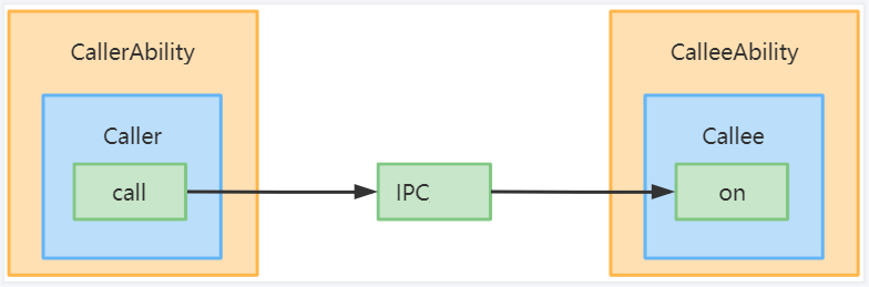

# Ability Call Development
## When to Use
Ability call is an extension of the ability capability. It enables an ability to be invoked by and communicate with external systems. The ability invoked can be either started in the foreground or created and run in the background. You can use the ability call to implement data sharing between two abilities (caller ability and callee ability) through inter-process communication (IPC).

The core API used for the ability call is **startAbilityByCall**, which differs from **startAbility** in the following ways:
 - **startAbilityByCall** supports ability startup in the foreground and background, whereas **startAbility** supports ability startup in the foreground only.
 - The caller ability can use the **Caller** object returned by **startAbilityByCall** to communicate with the callee ability, but **startAbility** does not provide the communication capability.

Ability call is usually used in the following scenarios:
- Communicating with the callee ability
- Starting the callee ability in the background

**Table 1** Terms used in the ability call
|Term|Description|
|:------|:------|
|Caller ability|Ability that triggers the ability call.|
|Callee ability|Ability invoked by the ability call.|
|Caller       |Object returned by **startAbilityByCall** and used by the caller ability to communicate with the callee ability.|
|Callee       |Object held by the callee ability to communicate with the caller ability.|
|IPC          |Inter-process communication.|

The ability call process is as follows:
 - The caller ability uses **startAbilityByCall** to obtain a **Caller** object and uses **call()** of the **Caller** object to send data to the callee ability.
 - The callee ability, which holds a **Callee** object, uses **on()** of the **Callee** object to register a callback. This callback is invoked when the callee ability receives data from the caller ability.


> **NOTE**<br/>
> The launch type of the callee ability must be **singleton**.
> Currently, only system applications can use the ability call.

## Available APIs
The table below describes the ability call APIs. For details, see [Ability](../reference/apis/js-apis-application-ability.md#caller).

**Table 2** Ability call APIs
|API|Description|
|:------|:------|
|startAbilityByCall(want: Want): Promise\<Caller>|Starts an ability in the foreground (through the **want** configuration) or background (default) and obtains the **Caller** object for communication with the ability. For details, see [AbilityContext](../reference/apis/js-apis-ability-context.md#abilitycontextstartabilitybycall) or [ServiceExtensionContext](../reference/apis/js-apis-inner-application-serviceExtensionContext.md#serviceextensioncontextstartabilitybycall).|
|on(method: string, callback: CalleeCallBack): void|Callback invoked when the callee ability registers a method.|
|off(method: string): void|Callback invoked when the callee ability deregisters a method.|
|call(method: string, data: rpc.Sequenceable): Promise\<void>|Sends agreed sequenceable data to the callee ability.|
|callWithResult(method: string, data: rpc.Sequenceable): Promise\<rpc.MessageParcel>|Sends agreed sequenceable data to the callee ability and obtains the agreed sequenceable data returned by the callee ability.|
|release(): void|Releases the **Caller** object.|
|on(type: "release", callback: OnReleaseCallback): void|Callback invoked when the **Caller** object is released.|

## How to Develop
The procedure for developing the ability call is as follows:
1. Create a callee ability.

2. Access the callee ability.

### Creating a Callee Ability
For the callee ability, implement the callback to receive data and the methods to marshal and unmarshal data. When data needs to be received, use **on()** to register a listener. When data does not need to be received, use **off()** to deregister the listener.
**1. Configure the ability launch type.**

  Set **launchType** of the callee ability to **singleton** in the **module.json5** file.

|JSON Field|Description|
|:------|:------|
|"launchType"|Ability launch type. Set this parameter to **singleton**.|

An example of the ability configuration is as follows:
```json
"abilities":[{
    "name": ".CalleeAbility",
    "srcEntrance": "./ets/CalleeAbility/CalleeAbility.ts",
    "launchType": "singleton",
    "description": "$string:CalleeAbility_desc",
    "icon": "$media:icon",
    "label": "$string:CalleeAbility_label",
    "visible": true
}]
```
**2. Import the Ability module.**
```ts
import Ability from '@ohos.app.ability.UIAbility'
```
**3. Define the agreed sequenceable data.**

  The data formats sent and received by the caller and callee abilities must be consistent. In the following example, the data formats are number and string. The code snippet is as follows:
```ts
export default class MySequenceable {
    num: number = 0
    str: string = ""

    constructor(num, string) {
        this.num = num
        this.str = string
    }

    marshalling(messageParcel) {
        messageParcel.writeInt(this.num)
        messageParcel.writeString(this.str)
        return true
    }

    unmarshalling(messageParcel) {
        this.num = messageParcel.readInt()
        this.str = messageParcel.readString()
        return true
    }
}
```
**4. Implement Callee.on and Callee.off.**

  The time to register a listener for the callee ability depends on your application. The data sent and received before the listener is registered and that after the listener is deregistered are not processed. In the following example, the **MSG_SEND_METHOD** listener is registered in **onCreate** of the ability and deregistered in **onDestroy**. After receiving sequenceable data, the application processes the data and returns the data result. You need to implement processing based on service requirements. The code snippet is as follows:
```ts
const TAG: string = '[CalleeAbility]'
const MSG_SEND_METHOD: string = 'CallSendMsg'

function sendMsgCallback(data) {
    console.log('CalleeSortFunc called')

    // Obtain the sequenceable data sent by the caller ability.
    let receivedData = new MySequenceable(0, '')
    data.readSequenceable(receivedData)
    console.log(`receiveData[${receivedData.num}, ${receivedData.str}]`)

    // Process the data.
    // Return the sequenceable data result to the caller ability.
    return new MySequenceable(receivedData.num + 1, `send ${receivedData.str} succeed`)
}

export default class CalleeAbility extends Ability {
    onCreate(want, launchParam) {
        try {
            this.callee.on(MSG_SEND_METHOD, sendMsgCallback)
        } catch (error) {
            console.log(`${MSG_SEND_METHOD} register failed with error ${JSON.stringify(error)}`)
        }
    }

    onDestroy() {
        try {
            this.callee.off(MSG_SEND_METHOD)
        } catch (error) {
            console.error(TAG, `${MSG_SEND_METHOD} unregister failed with error ${JSON.stringify(error)}`)
        }
    }
}
```

### Accessing the Callee Ability
**1. Import the Ability module.**
```ts
import Ability from '@ohos.app.ability.UIAbility'
```
**2. Obtain the Caller object.**

  The **context** attribute of the ability implements **startAbilityByCall** to obtain the **Caller** object for communication. The following example uses **this.context** to obtain the **context** attribute of the ability, uses **startAbilityByCall** to start the callee ability, obtain the **Caller** object, and register the **onRelease** listener of the caller ability. You need to implement processing based on service requirements. The code snippet is as follows:
```ts
// Register the onRelease listener of the caller ability.
private regOnRelease(caller) {
    try {
        caller.on("release", (msg) => {
            console.log(`caller onRelease is called ${msg}`)
        })
        console.log('caller register OnRelease succeed')
    } catch (error) {
        console.log(`caller register OnRelease failed with ${error}`)
    }
}

async onButtonGetCaller() {
    try {
        this.caller = await context.startAbilityByCall({
            bundleName: 'com.samples.CallApplication',
            abilityName: 'CalleeAbility'
        })
        if (this.caller === undefined) {
            console.log('get caller failed')
            return
        }
        console.log('get caller success')
        this.regOnRelease(this.caller)
    } catch (error) {
        console.log(`get caller failed with ${error}`)
    }
}
```
  In the cross-device scenario, you need to specify the ID of the peer device. The code snippet is as follows:
```ts
async onButtonGetRemoteCaller() {
    var caller = undefined
    var context = this.context

    context.startAbilityByCall({
        deviceId: getRemoteDeviceId(),
        bundleName: 'com.samples.CallApplication',
        abilityName: 'CalleeAbility'
    }).then((data) => {
        if (data != null) {
            caller = data
            console.log('get remote caller success')
            // Register the onRelease listener of the caller ability.
            caller.on("release", (msg) => {
                console.log(`remote caller onRelease is called ${msg}`)
            })
            console.log('remote caller register OnRelease succeed')
        }
    }).catch((error) => {
        console.error(`get remote caller failed with ${error}`)
    })
}
```
  Obtain the ID of the peer device from **DeviceManager**. Note that the **getTrustedDeviceListSync** API is open only to system applications. The code snippet is as follows:
```ts
import deviceManager from '@ohos.distributedHardware.deviceManager';
var dmClass;
function getRemoteDeviceId() {
    if (typeof dmClass === 'object' && dmClass != null) {
        var list = dmClass.getTrustedDeviceListSync()
        if (typeof (list) == 'undefined' || typeof (list.length) == 'undefined') {
            console.log("MainAbility onButtonClick getRemoteDeviceId err: list is null")
            return
        }
        console.log("MainAbility onButtonClick getRemoteDeviceId success:" + list[0].deviceId)
        return list[0].deviceId
    } else {
        console.log("MainAbility onButtonClick getRemoteDeviceId err: dmClass is null")
    }
}
```
  In the cross-device scenario, your application must also apply for the data synchronization permission from end users. The code snippet is as follows:
```ts
requestPermission() {
    let context = this.context
    let permissions: Array<string> = ['ohos.permission.DISTRIBUTED_DATASYNC']
    context.requestPermissionsFromUser(permissions).then((data) => {
        console.log("Succeed to request permission from user with data: "+ JSON.stringify(data))
    }).catch((error) => {
        console.log("Failed to request permission from user with error: "+ JSON.stringify(error))
    })
}
```
**3. Send agreed sequenceable data.**

  The sequenceable data can be sent to the callee ability with or without a return value. The method and sequenceable data must be consistent with those of the callee ability. The following example describes how to send data to the callee ability. The code snippet is as follows:
```ts
const MSG_SEND_METHOD: string = 'CallSendMsg'
async onButtonCall() {
    try {
        let msg = new MySequenceable(1, 'origin_Msg')
        await this.caller.call(MSG_SEND_METHOD, msg)
    } catch (error) {
        console.log(`caller call failed with ${error}`)
    }
}
```

  In the following, **CallWithResult** is used to send data **originMsg** to the callee ability and assign the data processed by the **CallSendMsg** method to **backMsg**. The code snippet is as follows:
```ts
const MSG_SEND_METHOD: string = 'CallSendMsg'
originMsg: string = ''
backMsg: string = ''
async onButtonCallWithResult(originMsg, backMsg) {
    try {
        let msg = new MySequenceable(1, originMsg)
        const data = await this.caller.callWithResult(MSG_SEND_METHOD, msg)
        console.log('caller callWithResult succeed')

        let result = new MySequenceable(0, '')
        data.readSequenceable(result)
        backMsg(result.str)
        console.log(`caller result is [${result.num}, ${result.str}]`)
    } catch (error) {
        console.log(`caller callWithResult failed with ${error}`)
    }
}
```
**4. Release the Caller object.**

  When the **Caller** object is no longer required, use **release()** to release it. The code snippet is as follows:
```ts
releaseCall() {
    try {
        this.caller.release()
        this.caller = undefined
        console.log('caller release succeed')
    } catch (error) {
        console.log(`caller release failed with ${error}`)
    }
}
```
