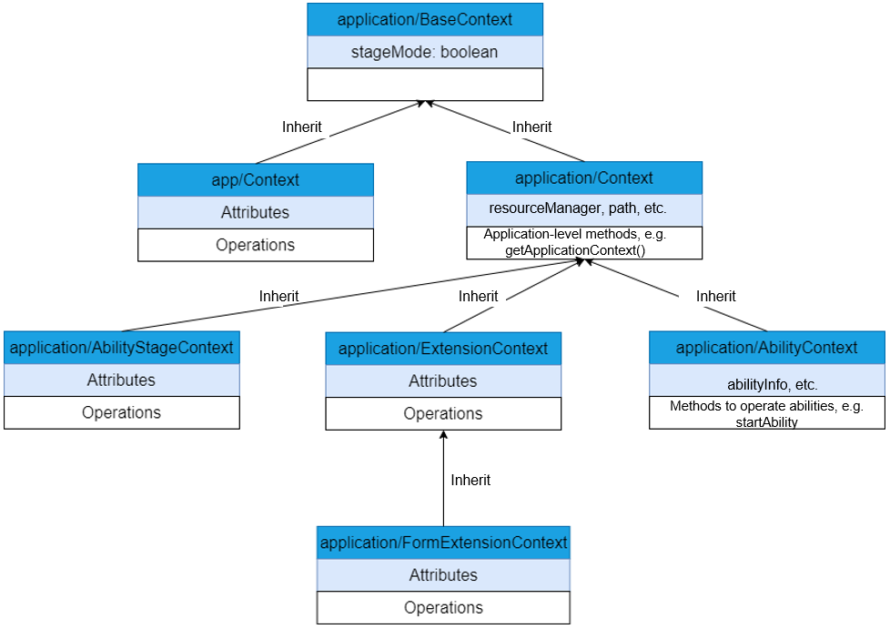

# Context Usage

## Context Overview

**Context** provides the capability of obtaining contextual information of an application.

The OpenHarmony application framework has two models: Feature Ability (FA) model and stage model. Correspondingly, there are two sets of context mechanisms. **application/BaseContext** is a common context base class. It uses the **stageMode** attribute to specify whether the context is used for the stage model.

- FA Model

  Only the methods in **app/Context** can be used for the context in the FA model. Both the application-level context and ability-level context are instances of this type. If an ability-level method is invoked in the application-level context, an error occurs. Therefore, you must pay attention to the actual meaning of the **Context** instance.

- Stage Model

  The stage model has the following types of contexts: **application/Context**, **application/ApplicationContext**, **application/AbilityStageContext**, **application/ExtensionContext**, **application/AbilityContext**, and **application/FormExtensionContext**. For details about these contexts and how to use them, see [Context in the Stage Model](#context-in-the-stage-model).



## Context in the FA Model

Only the methods in **app/Context** can be used for the context in the FA model.

The FA model has only one context definition. All capabilities in the context are provided through methods. The context uses these methods to extend the capabilities of the FA.

**d.ts statement**

https://gitee.com/openharmony/interface_sdk-js/blob/master/api/app/context.d.ts

**Example**

```javascript
import featureAbility from '@ohos.ability.featureAbility'
export default {
  onCreate() {
    // Obtain the context and call related APIs.
    let context = featureAbility.getContext();
    context.getBundleName((data, bundleName)=>{
      console.info("ability bundleName:" + bundleName)
    });
    console.info('Application onCreate')
  },
  onDestroy() {
    console.info('Application onDestroy')
  },
}
```

## Context in the Stage Model

The following describes the contexts provided by the stage model in detail.

### application/Context

**application/Context** is the base class context that provides basic application information such as **resourceManager**, **applicationInfo**, **cacheDir**, and **area**. It also provides basic application methods such as **createBundleContext**.

**d.ts statement**

https://gitee.com/openharmony/interface_sdk-js/blob/master/api/application/Context.d.ts

### application/ApplicationContext

**application/ApplicationContext** is an application-level context. In addition to the capabilities provided by the base class context, the application-level context provides **registerAbilityLifecycleCallback** and **unregisterAbilityLifecycleCallback** to monitor the ability lifecycle in a process.

**How to Obtain**

Obtain the context by calling **context.getApplicationContext()** in **Ability**.

**Example**

```javascript
import AbilityStage from "@ohos.application.AbilityStage";

var lifecycleid;

export default class MyAbilityStage extends AbilityStage {
    onCreate() {
        console.log("MyAbilityStage onCreate")
        let AbilityLifecycleCallback  =  {
            onAbilityCreate(ability){
                console.log("AbilityLifecycleCallback onAbilityCreate ability:" + JSON.stringify(ability));        
            },
            onAbilityWindowStageCreate(ability){
                console.log("AbilityLifecycleCallback onAbilityWindowStageCreate ability:" + JSON.stringify(ability));           
            },
            onAbilityWindowStageDestroy(ability){
                console.log("AbilityLifecycleCallback onAbilityWindowStageDestroy ability:" + JSON.stringify(ability));
            },
            onAbilityDestroy(ability){
                console.log("AbilityLifecycleCallback onAbilityDestroy ability:" + JSON.stringify(ability));             
            },
            onAbilityForeground(ability){
                console.log("AbilityLifecycleCallback onAbilityForeground ability:" + JSON.stringify(ability));             
            },
            onAbilityBackground(ability){
                console.log("AbilityLifecycleCallback onAbilityBackground ability:" + JSON.stringify(ability));              
            },
            onAbilityContinue(ability){
                console.log("AbilityLifecycleCallback onAbilityContinue ability:" + JSON.stringify(ability));
            }
        }
        // 1. Obtain applicationContext through the context attribute.
        let applicationContext = this.context.getApplicationContext();
        // 2. Use applicationContext to register and listen for the ability lifecycle in the application.
        lifecycleid = applicationContext.registerAbilityLifecycleCallback(AbilityLifecycleCallback);
        console.log("registerAbilityLifecycleCallback number: " + JSON.stringify(lifecycleid));       
    }
    onDestroy() {
        let applicationContext = this.context.getApplicationContext();
        applicationContext.unregisterAbilityLifecycleCallback(lifecycleid, (error, data) => {
        console.log("unregisterAbilityLifecycleCallback success, err: " + JSON.stringify(error));
        });
    }
}
```

**d.ts statement**

https://gitee.com/openharmony/interface_sdk-js/blob/master/api/application/ApplicationContext.d.ts

### application/AbilityStageContext

**application/AbilityStageContext** is the context for the HAP file. In addition to those provided by the base class **application/Context**, this context contains **HapModuleInfo** and **Configuration**.

**How to Obtain**

Obtain the context from the **context** attribute in **AbilityStage**.

**Example**

```javascript
export default class MyAbilityStage extends AbilityStage {
  onCreate() {
    // The context attribute is of the AbilityStageContext type.
    console.log('HapModuleInfo is ' + this.context.currentHapModuleInfo);
  }
}
```

**d.ts statement**

https://gitee.com/openharmony/interface_sdk-js/blob/master/api/application/AbilityStageContext.d.ts

### application/AbilityContext

In the stage model, each ability has a context attribute.

**Ability** provides methods to manage the ability lifecycle, and **AbilityContext** provides methods to operate abilities (such as **startAbility** and **connectAbility**).

**How to Obtain**

Obtain the context from the **context** attribute in **Ability**.

**Example**

```javascript
import Ability from '@ohos.application.Ability'

export default class MainAbility extends Ability {
    onCreate(want, launchParam) {
        console.log("[Demo] MainAbility onCreate")
        globalThis.abilityWant = want;
    }

    onDestroy() {
        console.log("[Demo] MainAbility onDestroy")
    }

    onWindowStageCreate(windowStage) {
        // Set the main page for this ability when the main window is created.
        console.log("[Demo] MainAbility onWindowStageCreate")

        // Obtain AbilityContext and print the ability information.
        let context = this.context;
        console.log("[Demo] MainAbility bundleName " + context.abilityInfo.bundleName)

        windowStage.setUIContent(this.context, "pages/index", null)
    }

    onWindowStageDestroy() {
        // Release the UI related resources when the main window is destroyed.
        console.log("[Demo] MainAbility onWindowStageDestroy")
    }

    onForeground() {
        // The ability is switched to run in the foreground.
        console.log("[Demo] MainAbility onForeground")
    }

    onBackground() {
        // The ability is switched to run in the background.
        console.log("[Demo] MainAbility onBackground")
    }
};
```

### application/FormExtensionContext

For details, see [FormExtensionContext](../reference/apis/js-apis-formextensioncontext.md).

## Common Incorrect Usage

**Error 1: Use globalThis to obtain the context in the stage model.**

**Reason**

In the FA model, each ability instance has a JS VM instance. Therefore, a global ability instance can be obtained from the **global** object of the JS engine. In the stage model, where all the processes of an application share a JS VM instance, there is no global ability instance, and using **globalThis** may cause an error or crash.
