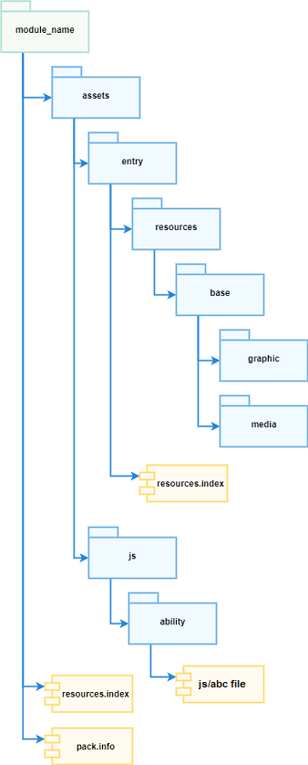

# FA Model Overview

## Overall Architecture
The development of an OpenHarmony application is essentially the development of one or more abilities. By scheduling abilities and managing their lifecycle, OpenHarmony implements application scheduling. In the FA model, three types of abilities are provided: Page, Service, and Data. The Page ability has the ArkUI and therefore provides the capability of interacting with users. The Service ability does not have a UI. It runs in the background and provides custom services for other abilities to invoke. The Data ability does not have a UI. It also runs in the background and enables other abilities to insert, delete, and query data.

## Application Package Structure
**The following figure shows the application package structure.**

## Lifecycle

**The following figure shows the lifecycle of the Page ability.**

You can override lifecycle functions in **app.js/app.ets** to process application logic.

## Process and Thread Model
An application exclusively uses an independent process, and an ability exclusively uses an independent thread. An application process is created when an ability is started for the first time, and a thread is created for this ability too. After the application is started, other abilities in the application are started, and a thread is created for every of these started abilities. Each ability is bound to an independent JSRuntime instance. Therefore, abilities are isolated from each other.

