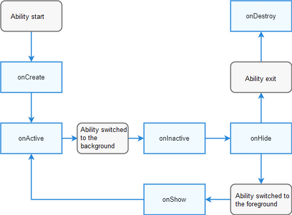

# FA Model Overview

## Overall Architecture

Ability is the entry for application development in OpenHarmony.

The core of ability development is the processing on ability lifecycle callbacks.

The Feature Ability (FA) model can be used only for application development using API version 8 and earlier versions. In this model, there are PageAbility, ServiceAbility, DataAbility, and FormAbility.  
- PageAbility implements the ArkUI and provides the capability for interacting with users.
- ServiceAbility does not have a UI. It runs in the background and provides custom services for other abilities to invoke.
- DataAbility does not have a UI. It runs in the background and enables other abilities to insert, delete, and query data.
- FormAbility is used to implement widgets, a new UI display form available on OpenHarmony devices.

> Note: Starting from API version 9, the stage model is recommended for application development.

## Lifecycle

Among all abilities, PageAbility has the most complex lifecycle, because it has a UI and acts as a touchpoint for interacting with users.
**The following figure shows the lifecycle of PageAbility.**

The other abilities do not involve foreground and background switch or the **onShow** and **onHide** callbacks.
You can override the lifecycle callbacks in **app.js** or **app.ets** to process application logic.

The **app.js** file provides only the **onCreate** and **onDestroy** callbacks, and the **app.ets** file provides the callbacks covering the entire lifecycle.

## Process and Thread Model

Each application runs in a process. In the FA model, each ability runs in an independent VM.

When an ability is started, an application process as well as a thread for this ability is created. For an application that has multiple abilities, each ability runs in an independent thread. In the FA model, each ability is bound to an independent VM instance. In this way, abilities are isolated from each other.

## Application Package Structure

For details about the project directory structure of the FA model, see [OpenHarmony Project Overview](https://developer.harmonyos.com/en/docs/documentation/doc-guides/ohos-project-overview-0000001218440650#section4154183910141).

For details about how to configure the application package structure of the FA model, see [Application Package Structure Configuration File](../quick-start/package-structure.md).
