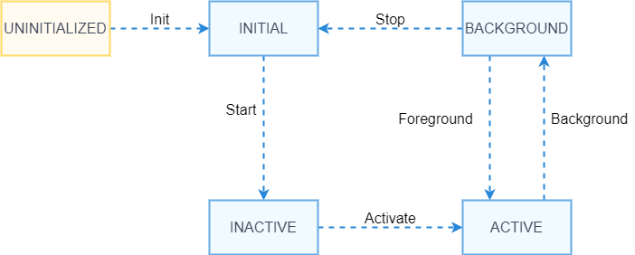

# Page Ability Development

## Overview
### Concepts
The Page ability implements the ArkUI and therefore provides the capability of interacting with users. When you create an ability in the integrated development environment (IDE), the IDE automatically creates template code. The capabilities related to the Page ability are exposed through the singleton **featureAbility**, and the lifecycle callbacks are exposed through the callbacks in **app.js/app.ets**.

### Page Ability Lifecycle

**Ability Lifecycle**

The ability lifecycle is a general term for all states of an ability, such as **INACTIVE**, **ACTIVE**, and **BACKGROUND**. The following figure shows the lifecycle state transition of the Page ability.




Description of ability lifecycle states:

  - **UNINITIALIZED**: The ability is not initialized. This is a temporary state. An ability changes directly to the **INITIAL** state upon its creation.

  - **INITIAL**: This state refers to the initial or stopped state. The ability in this state is not running. The ability enters the **INACTIVE** state after it is started.

  - **INACTIVE**: The ability is visible but does not gain focus.

  - **ACTIVE**: The ability runs in the foreground and gains focus.

  - **BACKGROUND**: The ability returns to the background. After being re-activated, the ability enters the **ACTIVE** state. After being destroyed, the ability enters the **INITIAL** state.

**The following figure shows the relationship between lifecycle callbacks and lifecycle states of the Page ability.**


You can override the lifecycle callbacks provided by the Page ability in the **app.js/app.ets** file. Currently, the **app.js** file provides only the **onCreate** and **onDestroy** callbacks, and the **app.ets** file provides the full lifecycle callbacks.

## Development Guidelines
### Available APIs

**Table 1** APIs provided by featureAbility

| API                                             | Description           |
| --------------------------------------------------- | --------------- |
| void startAbility(parameter: StartAbilityParameter) | Starts an ability.    |
| Context getContext():                               | Obtains the application context.|
| void terminateSelf()                                | Terminates the ability.    |
| bool hasWindowFocus()                               | Checks whether the ability gains focus.   |


### Starting a Local Page Ability

**Modules to Import**

```js
  import featureAbility from '@ohos.ability.featureAbility'
```

**Example**

```javascript
  import featureAbility from '@ohos.ability.featureAbility'
  featureAbility.startAbility({
  want:
  {
    action: "",
    entities: [""],
    type: "",
    options: {
      // Grant the permission to perform read operations on the URI.
      authReadUriPermission: true,
      // Grant the permission to perform write operations on the URI.
      authWriteUriPermission: true,
      // Support forwarding the intent result to the ability.
      abilityForwardResult: true,
      // Enable abiligy continuation.
      abilityContinuation: true,
      // Specify that a component does not belong to ohos.
      notOhosComponent: true,
      // Specify that an ability is started.
      abilityFormEnabled: true,
      // Grant the permission for possible persisting on the URI.
      authPersistableUriPermission: true,
      // Grant the permission for possible persisting on the prefix URI.
      authPrefixUriPermission: true,
      // Support distributed scheduling system startup on multiple devices.
      abilitySliceMultiDevice: true,
      // A service ability is started regardless of whether the host application has been started.
      startForegroundAbility: true,
      // Install the specified ability if it is not installed.
      installOnDemand: true,
      // Return the result to the ability slice.
      abilitySliceForwardResult: true,
      // Install the specified ability with background mode if it is not installed.
      installWithBackgroundMode: true
    },
    deviceId: "",
    bundleName: "com.example.startability",
    abilityName: "com.example.startability.MainAbility",
    uri: ""
  },
  },
  );
```

You can also include **parameters** in the **want** parameter and set its value in the key-value format.
**Example**

```javascript
  import featureAbility from '@ohos.ability.featureAbility'
  featureAbility.startAbility({
    want:
    {
        bundleName: "com.example.startability",
        uri: "",
        parameters: {
            abilityName: "com.example.startability.MainAbility"
        }
    },
  },
  );
```
### Starting a Remote Page Ability (Applying only to System Applications)
>Note: The **getTrustedDeviceListSync** API of the **DeviceManager** class is open only to system applications. Therefore, remote Page ability startup applies only to system applications.

**Modules to Import**

```
  import featureAbility from '@ohos.ability.featureAbility'
  import deviceManager from '@ohos.distributedHardware.deviceManager';
```

**Example**
```ts
  function onStartRemoteAbility() {
  console.info('onStartRemoteAbility begin');
  let params;
  let wantValue = {
    bundleName: 'ohos.samples.etsDemo',
    abilityName: 'ohos.samples.etsDemo.RemoteAbility',
    deviceId: getRemoteDeviceId(),
    parameters: params
  };
  console.info('onStartRemoteAbility want=' + JSON.stringify(wantValue));
  featureAbility.startAbility({
    want: wantValue
  }).then((data) => {
    console.info('onStartRemoteAbility finished, ' + JSON.stringify(data));
  });
  console.info('onStartRemoteAbility end');
  }
```

Obtain **deviceId** from **DeviceManager**. The sample code is as follows:
```ts
  import deviceManager from '@ohos.distributedHardware.deviceManager';
  let dmClass;
  function getRemoteDeviceId() {
    if (typeof dmClass === 'object' && dmClass != null) {
        let list = dmClass.getTrustedDeviceListSync();
        if (typeof (list) == 'undefined' || typeof (list.length) == 'undefined') {
            console.log("MainAbility onButtonClick getRemoteDeviceId err: list is null");
            return;
        }
        console.log("MainAbility onButtonClick getRemoteDeviceId success:" + list[0].deviceId);
        return list[0].deviceId;
    } else {
        console.log("MainAbility onButtonClick getRemoteDeviceId err: dmClass is null");
    }
  }
```

In the cross-device scenario, the application must also apply for the data synchronization permission from end users. The sample code is as follows:
```ts
  import abilityAccessCtrl from "@ohos.abilityAccessCtrl";
  import bundle from '@ohos.bundle';
  async function RequestPermission() {
  console.info('RequestPermission begin');
  let array: Array<string> = ["ohos.permission.DISTRIBUTED_DATASYNC"];
  let bundleFlag = 0;
  let tokenID = undefined;
  let userID = 100;
  let  appInfo = await bundle.getApplicationInfo('ohos.samples.etsDemo', bundleFlag, userID);
  tokenID = appInfo.accessTokenId;
  let atManager = abilityAccessCtrl.createAtManager();
  let requestPermissions: Array<string> = [];
  for (let i = 0;i < array.length; i++) {
    let result = await atManager.verifyAccessToken(tokenID, array[i]);
    console.info("verifyAccessToken result:" + JSON.stringify(result));
    if (result == abilityAccessCtrl.GrantStatus.PERMISSION_GRANTED) {
    } else {
      requestPermissions.push(array[i]);
    }
  }
  console.info("requestPermissions:" + JSON.stringify(requestPermissions));
  if (requestPermissions.length == 0 || requestPermissions == []) {
    return;
  }
  let context = featureAbility.getContext();
  context.requestPermissionsFromUser(requestPermissions, 1, (data)=>{
    console.info("data:" + JSON.stringify(data));
    console.info("data requestCode:" + data.requestCode);
    console.info("data permissions:" + data.permissions);
    console.info("data authResults:" + data.authResults);
  });
  console.info('RequestPermission end');
  }
```

### Lifecycle APIs
**Table 2** Lifecycle callbacks

| API      | Description                                                        |
| ------------ | ------------------------------------------------------------ |
| onShow()     | Called when the ability is switched from the background to the foreground. In this case, the ability is visible to users.|
| onHide()     | Called when the ability is switched from the foreground to the background. In this case, the ability is invisible.|
| onDestroy()  | Called when the ability is destroyed. In this callback, you can make preparations for app exit, such as recycling resources and clearing the cache.|
| onCreate()   | Called when the ability is created for the first time. You can initialize the application in this callback.|
| onInactive() | Called when the ability loses focus. An ability loses focus before entering the background state.|
| onActive()   | Called when the ability is switched to the foreground and gains focus.     |

**Example**
You need to override the lifecycle callbacks in **app.js/app.ets**. The IDE template generates **onCreate()** and **onDestroy()** by default. You need to override the other callbacks.

```javascript
export default {
  onCreate() {
    console.info('Application onCreate')
  },
  onDestroy() {
    console.info('Application onDestroy')
  },
  onShow(){
    console.info('Application onShow')
  },
  onHide(){
    console.info('Application onHide')
  },
  onInactive(){
    console.info('Application onInactive')
  },
  onActive(){
    console.info('Application onActive')
  },
}
```
### Development Example
The following sample is provided to help you better understand how to develop a Page ability:

[DMS](https://gitee.com/openharmony/app_samples/tree/master/ability/DMS)

This sample describes how to start a local ability and remote ability.
