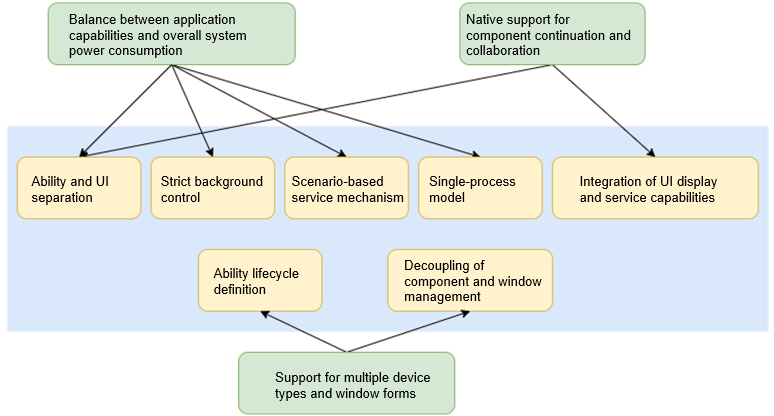
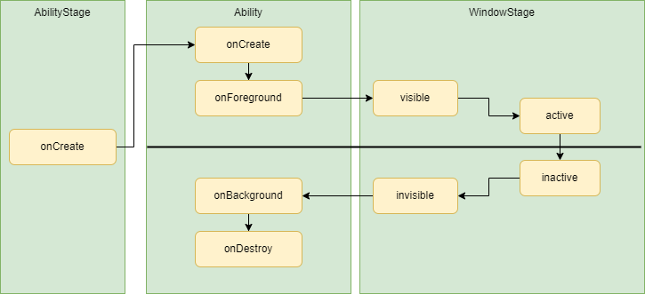

# Stage Model Overview

## Design Ideas

The stage model is designed to make it easier to develop complex applications in the distributed environment.

The following figure shows the design ideas of the stage model.

The stage model is designed based on the following considerations:

- **Balance between application capabilities and overall system power consumption**

  On a running device, resources are preferentially guaranteed for foreground applications, on the prerequisites that the overall power consumption requirements of the system are met. The stage model balances the application capabilities and overall system power consumption through ability and UI separation, strict background control, scenario-based service mechanism, and single-process model.

- **Native support for component continuation and collaboration**

  OpenHarmony natively supports distributed deployment. Therefore, its application framework must be designed for easier component migration and collaboration. The stage model achieves this design objective by providing features such as separation between ability and UI as well as integration of UI display and service capabilities.

- **Support for multiple device types and window forms**

  To support multiple device types and facilitate the implementation of different window forms, the component manager and window manager must be decoupled at the architecture layer for easier tailoring. To achieve this goal, the stage model redefines the ability lifecycle and implements unidirectional dependency for the component manager and window manager.

## Basic Concepts

The following figure shows the basic concepts in the stage model.

-  **HAP**: Harmony Ability Package, also called module, which is the basic unit for building, distributing, and loading OpenHarmony applications. Each HAP has a unique name, which is called **moduleName**, in an application.
-  **Bundle**: an OpenHarmony application identified by **appid**. A bundle can contain multiple HAP files. Each application has a **bundleName**. However, **bundleName** must be used together with **appid** and other information to uniquely identify an application.
-  **AbilityStage**: runtime class of an HAP. It is created when the HAP is loaded to the process for the first time and is visible to developers in the runtime.
-  **Application**: runtime class of a bundle, which is invisible to developers in the runtime.
-  **Context**: base class that the context classes of **Ability** and **ExtensionAbility** classes inherit. This class provides various capabilities that can be invoked by developers in the runtime, and various information such as the bundle name, module name, and path.
-  **Ability**: class that provides lifecycle callbacks, holds the **AbilityContext** class, and supports component continuation and collaboration.
-  **ExtensionAbility**: general name of scenario-based service extension abilities. The system defines multiple scenario-based **ExtensionAbility** classes, each of which has its own **ExtensionContext**.
-  **WindowStage**: local window manager.
-  **Window**: basic unit managed by the window manager. It has an ArkUI engine instance.
-  **ArkUI Page**: ArkUI development framework page.

## Lifecycle

The ability and ability stage lifecycles are the rudiments of the basic process of an application. For details about how these lifecycles differ from those in the FA model, see [Ability Framework Overview](ability-brief.md). This section focuses on the ability lifecycle transition and the scheduling relationships between the ability, ability stage, and window stage.

To implement device-specific tailoring and multi-window scalability, OpenHarmony decouples the component manager from the window manager. The ability lifecycle defined in the stage model includes only the creation, destruction, foreground, and background states. The gain focus and lose focus states that are closely related to UI content are defined in the window stage. This implements weak coupling between the abilities and windows. On the service side, the window manager notifies the component manager of the foreground and background changes, so the component manager only senses the foreground and background changes but not the focus changes.

There are two lifecycle states related to **WindowStage** in **Ability**: **onWindowStageCreate** and **onWindowStageDestroy**. They are valid only for devices with the window display capability. **onWindowStageCreate** is invoked when a window stage is created, where you can call **loadContent** to set pages to be loaded for the ability. **onWindowStageDestroy** is invoked when the window stage is destroyed, where you can release resources.

## Ability Instances and Missions

Abilities can be started in any of the following modes:

+ **Singleton**: For each type of ability, only one instance exists in the application process. **Ability1** in the figure below is started in singleton mode.

+ **Standard**: Each time **startAbility** is called, an instance of the specified ability type is created in the application process. **Ability2** in the figure below is started in standard mode.

+ **Specified**: Before creating an **Ability** instance, you can create a key for the instance. Each time **startAbility** is called, the system asks the application which ability instance (corresponding to a key) will be used. **Ability3** in the figure below is started in specified mode.

Each ability instance corresponds to a mission in **Launcher Recent**.

The mission corresponding to an ability instance has a snapshot of the ability instance. After the ability instance is destroyed, the ability class information and snapshot are retained in the mission until the user deletes the information or the storage space reaches the upper limit.

 

## ExtensionAbility Mechanism

Different from the ability used for page display, the extension ability provides a restricted service running environment. It has the following features:

- Its process runs independently from the main process and shares the same storage sandbox with the main process. There is no inter-process communication (IPC) between the process and the main process.

- It has an independent context that provides scenario-specific APIs.

- It is created by the system, rather than by applications.

- The lifecycles of the extension ability and process are managed by the system.

The following figure uses the widget scenario as an example. You can inherit from the **FormExtensionAbility** base class to provide the widget details. The lifecycle of the **FormExtensionAbility** instance and that of the extension ability process where the instance is located are managed by **FormManagerService**, which is a system service.

## Process Model

All OpenHarmony applications are designed to meet the single-process model. In the single-process model, all processes in the application are created and managed by the system. Each application supports a maximum of three types of processes:

- Main process: runs all ability components, pages, and service logic.

- Extension process: runs classes derived from **ExtensionAbility** in the application. The lifecycle of this process is managed by a scenario-specific system service.

- Render process: created for the WebView and used to load the WebView rendering library.

The following figure shows the process model of an application.

## Application Package Structure

For details about the project directory structure of the stage model, see [OpenHarmony Project Overview](https://developer.harmonyos.com/en/docs/documentation/doc-guides/ohos-project-overview-0000001218440650#section56487581904).

For details about how to configure the application package structure of the stage model, see [Application Package Structure Configuration File (Stage Model)](../quick-start/stage-structure.md).
