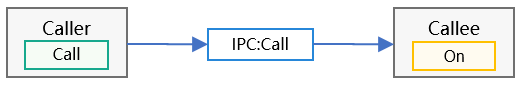

# Ability Call Development
## When to Use
Ability call is an extension of the ability capabilities. It enables an ability to be invoked by external systems. In this way, the ability can be displayed as a UI page on the foreground and created and run on the background. You can use the **Call** APIs to implement data sharing between different abilities through inter-process communication (IPC). There are two roles in the ability call: caller and callee. The following scenarios are involved in the ability call development:
- Creating a callee
- Accessing the callee

The following figure shows the ability call process.



>  **NOTE**<br/>
> The startup mode of the callee must be **singleton**.
> Currently, only system applications and Service Extension abilities can use the **Call** APIs to access the callee.

## Available APIs
The table below describes the ability call APIs. For details, see [Ability](../reference/apis/js-apis-application-ability.md#caller).

**Table 1** Ability call APIs
|API|Description|
|:------|:------|
|startAbilityByCall(want: Want): Promise<Caller>|Obtains the caller interface of the specified ability and, if the specified ability is not running, starts the ability in the background.|
|on(method: string, callback: CaleeCallBack): void|Callback invoked when the callee registers a method.|
|off(method: string): void|Callback invoked when the callee deregisters a method.|
|call(method: string, data: rpc.Sequenceable): Promise<void>|Sends agreed sequenceable data to the callee.|
|callWithResult(method: string, data: rpc.Sequenceable): Promise<rpc.MessageParcel>|Sends agreed sequenceable data to the callee and returns the agreed sequenceable data.|
|release(): void|Releases the caller interface.|
|onRelease(callback: OnReleaseCallBack): void|Registers a callback that is invoked when the caller is disconnected.|

## How to Develop
>  **NOTE**<br/>
> The sample code snippets provided in the **How to Develop** section are used to show specific development steps. They may not be able to run independently. For details about the complete project code, see [Samples](#samples).
### Creating a Callee
For the callee, implement the callback to receive data and the methods to marshal and unmarshal data. When data needs to be received, use the **on** API to register a listener. When data does not need to be received, use the **off** API to deregister the listener.
1. Configure the ability startup mode.

  Set the ability of the callee to **singleton** in the **module.json5** file.

|JSON Field|Description|
|:------|:------|
|"launchType"|Ability startup mode. Set this parameter to **singleton**.|

An example of the ability configuration is as follows:
```json
"abilities":[{
    "name": ".CalleeAbility",
    "srcEntrance": "./ets/CalleeAbility/CalleeAbility.ts",
    "launchType": "singleton",
    "description": "$string:CalleeAbility_desc",
    "icon": "$media:icon",
    "label": "$string:CalleeAbility_label",
    "visible": true
}]
```
2. Import the **Ability** module.
```
import Ability from '@ohos.application.Ability'
```
3. Define the agreed sequenceable data.

  The data formats sent and received by the caller and callee must be consistent. In the following example, the data consists of numbers and strings. The sample code snippet is as follows:
```ts
export default class MySequenceable {
    num: number = 0
    str: String = ""

    constructor(num, string) {
        this.num = num
        this.str = string
    }

    marshalling(messageParcel) {
        messageParcel.writeInt(this.num)
        messageParcel.writeString(this.str)
        return true
    }

    unmarshalling(messageParcel) {
        this.num = messageParcel.readInt()
        this.str = messageParcel.readString()
        return true
    }
}
```
4. Implement **Callee.on** and **Callee.off**.

  The time to register a listener for the callee depends on your application. The data sent and received before the listener is registered and that after the listener is deregistered are not processed. In the following example, the **MSG_SEND_METHOD** listener is registered in **onCreate** of the ability and deregistered in **onDestroy**. After receiving sequenceable data, the application processes the data and returns the data result. You need to implement processing based on service requirements. The sample code snippet is as follows:
```ts
const TAG: string = '[CalleeAbility]'
const MSG_SEND_METHOD: string = 'CallSendMsg'

function sendMsgCallback(data) {
    Logger.log(TAG, 'CalleeSortFunc called')

    // Obtain the sequenceable data sent by the caller.
    let receivedData = new MySequenceable(0, '')
    data.readSequenceable(receivedData)
    Logger.log(TAG, `receiveData[${receivedData.num}, ${receivedData.str}]`)

    // Process the data.
    // Return the sequenceable data result to the caller.
    return new MySequenceable(receivedData.num + 1, `send ${receivedData.str} succeed`)
}

export default class CalleeAbility extends Ability {
    onCreate(want, launchParam) {
        try {
            this.callee.on(MSG_SEND_METHOD, sendMsgCallback)
        } catch (error) {
            Logger.error(TAG, `${MSG_SEND_METHOD} register failed with error ${JSON.stringify(error)}`)
        }
    }

    onDestroy() {
        try {
            this.callee.off(MSG_SEND_METHOD)
        } catch (error) {
            console.error(TAG, `${MSG_SEND_METHOD} unregister failed with error ${JSON.stringify(error)}`)
        }
    }
}
```

### Accessing the Callee
1. Import the **Ability** module.
```
import Ability from '@ohos.application.Ability'
```
2. Obtain the caller interface.

  The **context** attribute of the ability implements **startAbilityByCall** to obtain the caller interface of the ability. The following example uses **this.context** to obtain the **context** attribute of the **Ability** instance, uses **startAbilityByCall** to start the callee, obtain the caller interface, and register the **onRelease** listener of the caller. You need to implement processing based on service requirements. The sample code snippet is as follows:
```ts
async onButtonGetCaller() {
    try {
        this.caller = await context.startAbilityByCall({
            bundleName: 'com.samples.CallApplication',
            abilityName: 'CalleeAbility'
        })
        if (this.caller === undefined) {
            Logger.error(TAG, 'get caller failed')
            return
        }
        Logger.log(TAG, 'get caller success')
        this.regOnRelease(this.caller)
    } catch (error) {
        Logger.error(TAG, `get caller failed with ${error}`)
    }
}.catch((error) => {
    console.error(TAG + 'get caller failed with ' + error)
})
```
  In the cross-device scenario, you need to specify the ID of the peer device. The sample code snippet is as follows:
```ts
let TAG = '[MainAbility] '
var caller = undefined
let context = this.context

context.startAbilityByCall({
    deviceId: getRemoteDeviceId(),
    bundleName: 'com.samples.CallApplication',
    abilityName: 'CalleeAbility'
}).then((data) => {
    if (data != null) {
        caller = data
        console.log(TAG + 'get remote caller success')
        // Register the onRelease listener of the caller.
        caller.onRelease((msg) => {
            console.log(TAG + 'remote caller onRelease is called ' + msg)
        })
        console.log(TAG + 'remote caller register OnRelease succeed')
    }
}).catch((error) => {
    console.error(TAG + 'get remote caller failed with ' + error)
})
```
  Obtain the ID of the peer device from **DeviceManager**. Note that the **getTrustedDeviceListSync** API is open only to system applications. The sample code snippet is as follows:
```ts
import deviceManager from '@ohos.distributedHardware.deviceManager';
var dmClass;
function getRemoteDeviceId() {
    if (typeof dmClass === 'object' && dmClass != null) {
        var list = dmClass.getTrustedDeviceListSync();
        if (typeof (list) == 'undefined' || typeof (list.length) == 'undefined') {
            console.log("MainAbility onButtonClick getRemoteDeviceId err: list is null");
            return;
        }
        console.log("MainAbility onButtonClick getRemoteDeviceId success:" + list[0].deviceId);
        return list[0].deviceId;
    } else {
        console.log("MainAbility onButtonClick getRemoteDeviceId err: dmClass is null");
    }
}
```
  In the cross-device scenario, the application must also apply for the data synchronization permission from end users. The sample code snippet is as follows:
```ts
let context = this.context
let permissions: Array<string> = ['ohos.permission.DISTRIBUTED_DATASYNC']
context.requestPermissionsFromUser(permissions).then((data) => {
    console.log("Succeed to request permission from user with data: "+ JSON.stringify(data))
}).catch((error) => {
    console.log("Failed to request permission from user with error: "+ JSON.stringify(error))
})
```
3. Send agreed sequenceable data.

  The sequenceable data can be sent to the callee with or without a return value. The method and sequenceable data must be consistent with those of the callee. The following example describes how to invoke the **Call** API to send data to the callee. The sample code snippet is as follows:
```ts
const MSG_SEND_METHOD: string = 'CallSendMsg'
async onButtonCall() {
    try {
        let msg = new MySequenceable(1, 'origin_Msg')
        await this.caller.call(MSG_SEND_METHOD, msg)
    } catch (error) {
        Logger.error(TAG, `caller call failed with ${error}`)
    }
}
```

  In the following, **CallWithResult** is used to send data **originMsg** to the callee and assign the data processed by the **CallSendMsg** method to **backMsg**. The sample code snippet is as follows:
```ts
const MSG_SEND_METHOD: string = 'CallSendMsg'
originMsg: string = ''
backMsg: string = ''
async onButtonCallWithResult(originMsg, backMsg) {
    try {
        let msg = new MySequenceable(1, originMsg)
        const data = await this.caller.callWithResult(MSG_SEND_METHOD, msg)
        Logger.log(TAG, 'caller callWithResult succeed')

        let result = new MySequenceable(0, '')
        data.readSequenceable(result)
        backMsg(result.str)
        Logger.log(TAG, `caller result is [${result.num}, ${result.str}]`)
    } catch (error) {
        Logger.error(TAG, `caller callWithResult failed with ${error}`)
    }
}
```
4. Release the caller interface.

  When the caller interface is no longer required, call the **release** API to release it. The sample code snippet is as follows:
```ts
try {
    this.caller.release()
    this.caller = undefined
    Logger.log(TAG, 'caller release succeed')
} catch (error) {
    Logger.error(TAG, `caller release failed with ${error}`)
}
```

## Samples
The following sample is provided to help you better understand how to develop an ability call in the stage model:
- [`StageCallAbility`: Stage Call Ability Creation and Usage (eTS, API version 9)](https://gitee.com/openharmony/app_samples/tree/master/ability/StageCallAbility)
