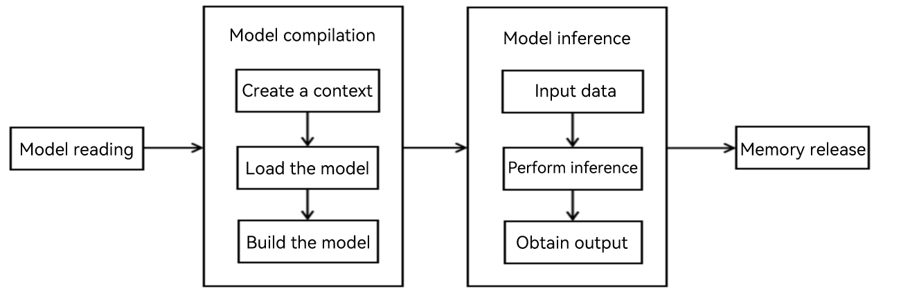

# Introduction to MindSpore Lite Kit

## Use Cases

MindSpore Lite is a lightweight AI engine built in OpenHarmony. Its open AI framework comes with a multi-processor architecture to empower intelligent applications in all scenarios. It brings data scientists, algorithm engineers, and developers with friendly development, efficient running, and flexible deployment, helping to build a prosperous open source ecosystem of AI hardware/software applications.

So far, MindSpore Lite has been widely used in applications such as image classification, target recognition, facial recognition, and character recognition. Typical use cases are as follows:

- Image classification: determines the category to which an image (such as an image of a cat, a dog, an airplane, or a car) belongs. This is the most basic computer vision application and belongs to the supervised learning category.
- Target recognition: uses the preset object detection model to identify objects in the input frames of a camera, add labels to the objects, and mark them with bounding boxes.
- Image segmentation: detects the positions of objects in a graph or the object of a specific pixel in the graph.

## Constraints

- This kit can run and be debugged on real devices, but not on emulators.

## Advantages

MindSpore Lite provides AI model inference capabilities for hardware devices and end-to-end solutions for developers to empower intelligent applications in all scenarios. Its advantages include:

- High performance: Efficient kernel algorithms and assembly-level optimization support high-performance inference on dedicated CPU and NNRt chips, maximizing computing power while minimizing inference latency and power consumption.
- Lightweight: Provides an ultra-lightweight solution, and supports model quantization and compression to enable smaller models to run faster and empower AI model deployment in extreme environments.
- All-scenario support: Supports different types of OS and embedded system to adapt to AI applications on various intelligent devices.
- Efficient deployment: Supports MindSpore, TensorFlow Lite, Caffe, and ONNX models, provides capabilities such as model compression and data processing, and supports unified training and inference IR.

## Development Process

**Figure 1** Development process for MindSpore Lite model inference

The MindSpore Lite development process consists of two phases:

- Model conversion

  MindSpore Lite uses models in `.ms` format for inference. You can use the model conversion tool provided by MindSpore Lite to convert third-party framework models, such as TensorFlow, TensorFlow Lite, Caffe, and ONNX, into `.ms` models. For details, see [Using MindSpore Lite for Model Conversion](./mindspore-lite-converter-guidelines.md).

- Model deployment

  You can call the MindSpore Lite runtime APIs to implement model inference or training. The procedure is as follows:

    1. Create the inference or training context, including the hardware and the number of threads.
    2. Load the `.ms` model file.
    3. Set the model input data.
    4. Perform inference or training and read the output.

## Development Mode

MindSpore Lite is built in the OpenHarmony standard system as a system component. You can develop AI applications based on MindSpore Lite in the following ways:

- Method 1: [Using MindSpore Lite for Image Classification (ArkTS)](./mindspore-guidelines-based-js.md). You can directly call MindSpore Lite ArkTS APIs in the UI code to load the AI model and perform model inference. An advantage of this method is the quick verification of the inference effect.
- Method 2: [Using MindSpore Lite native APIs to develop AI applications](./mindspore-guidelines-based-native.md). You can encapsulate the algorithm models and the code for calling MindSpore Lite native APIs into a dynamic library, and then use N-API to encapsulate the dynamic library into ArkTS APIs for the UI to call.

## Relationship with Other Kits

Neural Network Runtime (NNRt) functions as a bridge to connect the upper-layer AI inference framework and underlying acceleration chips, implementing cross-chip inference computing for AI models.

MindSpore Lite allows you to configure NNRt for AI-dedicated chips (such as NPUs) to accelerate inference. Therefore, you can configure MindSpore Lite to use the NNRt hardware. The focus of this topic is about how to develop AI applications using MindSpore Lite. For details about how to use NNRt, see [Connecting the Neural Network Runtime to an AI Inference Framework](../nnrt/neural-network-runtime-guidelines.md).
