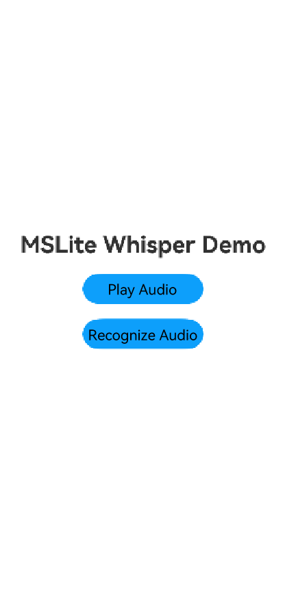
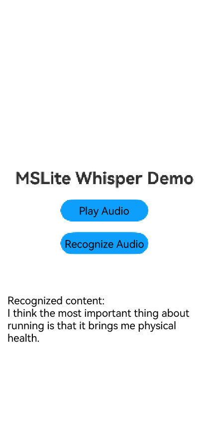

# Using MindSpore Lite for Speech Recognition (C/C++)

## When to Use

You can use [MindSpore](../../reference/apis-mindspore-lite-kit/_mind_spore.md) to quickly deploy AI algorithms into your application to perform AI model inference for speech recognition.

Speech recognition can convert an audio file into text, which is widely used in intelligent voice assistants, voice input, and voice search.

## Basic Concepts

- N-API: a set of native APIs used to build ArkTS components. N-APIs can be used to encapsulate C/C++ libraries into ArkTS modules.

## How to Develop

1. Select a speech recognition model.
2. Use the MindSpore Lite inference model on the device to implement speech recognition.

## Environment Setup

Install DevEco Studio 5.0.2 or later, and update the SDK to API version 14 or later.

## Development Procedure

This section uses the inference of a speech recognition model as an example to demonstrate how to implement a speech recognition application using MindSpore Lite.

### Selecting an Appropriate Model

The speech recognition model files **tiny-encoder.ms**, **tiny-decoder-main.ms**, and **tiny-decoder-loop.ms** used in this sample application are stored in the **entry/src/main/resources/rawfile** directory.


### Writing Code

#### Playing Audio

1. Call [@ohos.multimedia.media](../../reference/apis-media-kit/js-apis-media.md) and [@ohos.multimedia.audio](../../reference/apis-audio-kit/js-apis-audio.md) to play audio.

   ```ts
   // player.ets
   import { media } from '@kit.MediaKit';
   import { common } from '@kit.AbilityKit';
   import { BusinessError } from '@kit.BasicServicesKit';
   import { audio } from '@kit.AudioKit';
   import { UIContext } from '@kit.ArkUI';
   
   export default class AVPlayerDemo {
     private isSeek: boolean = false; // Disable the seek operation.
     // Set the AVPlayer callback.
     setAVPlayerCallback(avPlayer: media.AVPlayer) {
       // Callback for the seek operation.
       avPlayer.on('seekDone', (seekDoneTime: number) => {
         console.info(`MS_LITE_LOG: AVPlayer seek succeeded, seek time is ${seekDoneTime}`);
       });
       // Callback invoked if an error occurs while the AVPlayer is playing audio. In such a case, reset() is called to reset the AVPlayer.
       avPlayer.on('error', (err: BusinessError) => {
         console.error(`MS_LITE_LOG: Invoke avPlayer failed, code is ${err.code}, message is ${err.message}`);
         avPlayer.reset(); // Call reset() to reset the AVPlayer, which enters the idle state.
       });
       // Callback for state changes.
       avPlayer.on('stateChange', async (state: string, reason: media.StateChangeReason) => {
         switch (state) {
           case 'idle': // This state is reported upon a successful callback of reset().
             console.info('MS_LITE_LOG: AVPlayer state idle called.');
             avPlayer.release(); // Call release() to release the instance.
             break;
           case 'initialized': // This state is reported when the AVPlayer sets the playback source.
             console.info('MS_LITE_LOG: AVPlayer state initialized called.');
             avPlayer.audioRendererInfo = {
               usage: audio.StreamUsage.STREAM_USAGE_MUSIC, // Audio stream usage type: music. Set this parameter based on the service scenario.
               rendererFlags: 0 // Audio renderer flag.
             };
             avPlayer.prepare();
             break;
           case 'prepared': // This state is reported upon a successful callback of prepare().
             console.info('MS_LITE_LOG: AVPlayer state prepared called.');
             avPlayer.play(); // Call play() to start playback.
             break;
           case 'playing': // This state is reported upon a successful callback of play().
             console.info('MS_LITE_LOG: AVPlayer state playing called.');
             if (this.isSeek) {
               console.info('MS_LITE_LOG: AVPlayer start to seek.');
               avPlayer.seek(0); // Seek to the end of the audio.
             } else {
               // When the seek operation is not supported, the playback continues until it reaches the end.
               console.info('MS_LITE_LOG: AVPlayer wait to play end.');
             }
             break;
           case 'paused': // This state is reported upon a successful callback of pause().
             console.info('MS_LITE_LOG: AVPlayer state paused called.');
             setTimeout(() => {
               console.info('MS_LITE_LOG: AVPlayer paused wait to play again');
               avPlayer.play(); // After the playback is paused for 3 seconds, call the play API again to start playback.
             }, 3000);
             break;
           case 'completed': // This state is reported upon the completion of the playback.
             console.info('MS_LITE_LOG: AVPlayer state completed called.');
             avPlayer.stop(); // Call stop() to stop the playback.
             break;
           case 'stopped': // This state is reported upon a successful callback of stop().
             console.info('MS_LITE_LOG: AVPlayer state stopped called.');
             avPlayer.reset(); // Call reset() to reset the AVPlayer.
             break;
           case 'released':
             console.info('MS_LITE_LOG: AVPlayer state released called.');
             break;
           default:
             console.info('MS_LITE_LOG: AVPlayer state unknown called.');
             break;
         }
       });
     }
   
     // Use the resource management API to obtain the audio file and play the audio file through the fdSrc attribute.
     async avPlayerFdSrcDemo() {
       // Create an AVPlayer instance.
       let avPlayer: media.AVPlayer = await media.createAVPlayer();
       // Create a callback for state changes.
       this.setAVPlayerCallback(avPlayer);
       // Call getRawFd of the resourceManager member of UIAbilityContext to obtain the media asset URL.
       // The return type is {fd,offset,length}, where fd indicates the file descriptor address of the HAP file, offset indicates the media asset offset, and length indicates the duration of the media asset to play.
       let context = new UIContext().getHostContext() as common.UIAbilityContext;
       let fileDescriptor = await context.resourceManager.getRawFd('zh.wav');
       let avFileDescriptor: media.AVFileDescriptor =
         { fd: fileDescriptor.fd, offset: fileDescriptor.offset, length: fileDescriptor.length };
       this.isSeek = true; // Enable the seek operation.
       // Assign a value to fdSrc to trigger the reporting of the initialized state.
       avPlayer.fdSrc = avFileDescriptor;
     }
   }
   ```


#### Recognizing Audio

Call [MindSpore](../../reference/apis-mindspore-lite-kit/_mind_spore.md) to perform inference on the three models in sequence. The inference process is as follows:

1. Include the corresponding header files. The third-party libraries **librosa**, **libsamplerate**, and **base64.h** are from [LibrosaCpp](https://github.com/ewan-xu/LibrosaCpp), [libsamplerate](https://github.com/libsndfile/libsamplerate), AudioFile.h, and [whisper.axera](https://github.com/ml-inory/whisper.axera/tree/main/cpp/src), respectively.

   ```c++
   #include "AudioFile.h"
   #include "base64.h"
   #include "napi/native_api.h"
   #include "utils.h"
   #include <algorithm>
   #include <cstdlib>
   #include <fstream>
   #include <hilog/log.h>
   #include <iostream>
   #include <librosa/librosa.h>
   #include <mindspore/context.h>
   #include <mindspore/model.h>
   #include <mindspore/status.h>
   #include <mindspore/tensor.h>
   #include <mindspore/types.h>
   #include <numeric> 
   #include <rawfile/raw_file_manager.h>
   #include <sstream>
   #include <vector>
   ```

2. Read related files such as audio files and model files, and converts them to buffer data.

   ```c++
   #define LOGI(...) ((void)OH_LOG_Print(LOG_APP, LOG_INFO, LOG_DOMAIN, "[MSLiteNapi]", __VA_ARGS__))
   #define LOGD(...) ((void)OH_LOG_Print(LOG_APP, LOG_DEBUG, LOG_DOMAIN, "[MSLiteNapi]", __VA_ARGS__))
   #define LOGW(...) ((void)OH_LOG_Print(LOG_APP, LOG_WARN, LOG_DOMAIN, "[MSLiteNapi]", __VA_ARGS__))
   #define LOGE(...) ((void)OH_LOG_Print(LOG_APP, LOG_ERROR, LOG_DOMAIN, "[MSLiteNapi]", __VA_ARGS__))
   
   using BinBuffer = std::pair<void *, size_t>;
   
   BinBuffer ReadBinFile(NativeResourceManager *nativeResourceManager, const std::string &modelName)
   {
       auto rawFile = OH_ResourceManager_OpenRawFile(nativeResourceManager, modelName.c_str());
       if (rawFile == nullptr) {
           LOGE("MS_LITE_ERR: Open model file failed");
           return BinBuffer(nullptr, 0);
       }
       long fileSize = OH_ResourceManager_GetRawFileSize(rawFile);
       if (fileSize <= 0) {
           LOGE("MS_LITE_ERR: FileSize not correct");
           return BinBuffer(nullptr, 0);
       }
       void *buffer = malloc(fileSize);
       if (buffer == nullptr) {
           LOGE("MS_LITE_ERR: OH_ResourceManager_ReadRawFile failed");
           return BinBuffer(nullptr, 0);
       }
       int ret = OH_ResourceManager_ReadRawFile(rawFile, buffer, fileSize);
       if (ret == 0) {
           LOGE("MS_LITE_LOG: OH_ResourceManager_ReadRawFile failed");
           OH_ResourceManager_CloseRawFile(rawFile);
           return BinBuffer(nullptr, 0);
       }
       OH_ResourceManager_CloseRawFile(rawFile);
       return BinBuffer(buffer, fileSize);
   }
   
   BinBuffer ReadTokens(NativeResourceManager *nativeResourceManager, const std::string &modelName) {
       auto rawFile = OH_ResourceManager_OpenRawFile(nativeResourceManager, modelName.c_str());
       if (rawFile == nullptr) {
           LOGE("MS_LITE_ERR: Open model file failed");
       }
       long fileSize = OH_ResourceManager_GetRawFileSize(rawFile);
       if (fileSize <= 0) {
           LOGE("MS_LITE_ERR: FileSize not correct");
       }
       void *buffer = malloc(fileSize);
       if (buffer == nullptr) {
           LOGE("MS_LITE_ERR: OH_ResourceManager_ReadRawFile failed");
       }
       int ret = OH_ResourceManager_ReadRawFile(rawFile, buffer, fileSize);
       if (ret == 0) {
           LOGE("MS_LITE_LOG: OH_ResourceManager_ReadRawFile failed");
           OH_ResourceManager_CloseRawFile(rawFile);
       }
       OH_ResourceManager_CloseRawFile(rawFile);
       BinBuffer res(buffer, fileSize);
       return res;
   }
   ```

3. Create a context, set the device type, and load the model.

   ```c++
   void DestroyModelBuffer(void **buffer)
   {
       if (buffer == nullptr) {
           return;
       }
       free(*buffer);
       *buffer = nullptr;
   }
   
   OH_AI_ModelHandle CreateMSLiteModel(BinBuffer &bin)
   {
       // Create and configure the context for model inference.
       auto context = OH_AI_ContextCreate();
       if (context == nullptr) {
           DestroyModelBuffer(&bin.first);
           LOGE("MS_LITE_ERR: Create MSLite context failed.\n");
           return nullptr;
       }
       auto cpu_device_info = OH_AI_DeviceInfoCreate(OH_AI_DEVICETYPE_CPU);
       OH_AI_DeviceInfoSetEnableFP16(cpu_device_info, false);
       OH_AI_ContextAddDeviceInfo(context, cpu_device_info);
   
       // Create a model.
       auto model = OH_AI_ModelCreate();
       if (model == nullptr) {
           DestroyModelBuffer(&bin.first);
           LOGE("MS_LITE_ERR: Allocate MSLite Model failed.\n");
           return nullptr;
       }
   
       // Load and build the inference model. The model type is OH_AI_MODELTYPE_MINDIR.
       auto build_ret = OH_AI_ModelBuild(model, bin.first, bin.second, OH_AI_MODELTYPE_MINDIR, context);
       DestroyModelBuffer(&bin.first);
       if (build_ret != OH_AI_STATUS_SUCCESS) {
           OH_AI_ModelDestroy(&model);
           LOGE("MS_LITE_ERR: Build MSLite model failed.\n");
           return nullptr;
       }
       LOGI("MS_LITE_LOG: Build MSLite model success.\n");
       return model;
   }
   ```
   
4. Set the model input data, and perform model inference.

   ```c++
   constexpr int K_NUM_PRINT_OF_OUT_DATA = 20;
   
   int FillInputTensor(OH_AI_TensorHandle input, const BinBuffer &bin)
   {
       if (OH_AI_TensorGetDataSize(input) != bin.second) {
           return OH_AI_STATUS_LITE_INPUT_PARAM_INVALID;
       }
       char *data = (char *)OH_AI_TensorGetMutableData(input);
       memcpy(data, (const char *)bin.first, OH_AI_TensorGetDataSize(input));
       return OH_AI_STATUS_SUCCESS;
   }
   
   // Perform model inference.
   int RunMSLiteModel(OH_AI_ModelHandle model, std::vector<BinBuffer> inputBins)
   {
       // Set the model input data.
       auto inputs = OH_AI_ModelGetInputs(model);
       for(int i = 0; i < inputBins.size(); i++)
       {
           auto ret = FillInputTensor(inputs.handle_list[i], inputBins[i]);
           if (ret != OH_AI_STATUS_SUCCESS) {
               LOGE("MS_LITE_ERR: set input %{public}d error.\n", i);
               return OH_AI_STATUS_LITE_ERROR;
           }
       }
   
       // Obtain the output tensor of the model.
       auto outputs = OH_AI_ModelGetOutputs(model);
   
       // Model inference
       auto predict_ret = OH_AI_ModelPredict(model, inputs, &outputs, nullptr, nullptr);
       if (predict_ret != OH_AI_STATUS_SUCCESS) {
           OH_AI_ModelDestroy(&model);
           LOGE("MS_LITE_ERR: MSLite Predict error.\n");
           return OH_AI_STATUS_LITE_ERROR;
       }
       LOGD("MS_LITE_LOG: Run MSLite model Predict success.\n");
   
       // Print the output data.
       LOGD("MS_LITE_LOG: Get model outputs:\n");
       for (size_t i = 0; i < outputs.handle_num; i++) {
           auto tensor = outputs.handle_list[i];
           LOGD("MS_LITE_LOG: - Tensor %{public}d name is: %{public}s.\n", static_cast<int>(i),
                OH_AI_TensorGetName(tensor));
           LOGD("MS_LITE_LOG: - Tensor %{public}d size is: %{public}d.\n", static_cast<int>(i),
                (int)OH_AI_TensorGetDataSize(tensor));
           LOGD("MS_LITE_LOG: - Tensor data is:\n");
           auto out_data = reinterpret_cast<const float *>(OH_AI_TensorGetData(tensor));
           std::stringstream outStr;
           for (int i = 0; (i < OH_AI_TensorGetElementNum(tensor)) && (i <= K_NUM_PRINT_OF_OUT_DATA); i++) {
               outStr << out_data[i] << " ";
           }
           LOGD("MS_LITE_LOG: %{public}s", outStr.str().c_str());
       }
       return OH_AI_STATUS_SUCCESS;
   }
   ```
   
5. Repeat the preceding procedure for the remaining models.

   ```c++
   const float NEG_INF = -std::numeric_limits<float>::infinity();
   const int WHISPER_SOT = 50258;
   const int WHISPER_TRANSCRIBE = 50359;
   const int WHISPER_TRANSLATE = 50358;
   const int WHISPER_NO_TIMESTAMPS = 50363;
   const int WHISPER_EOT = 50257;
   const int WHISPER_BLANK = 220;
   const int WHISPER_NO_SPEECH = 50362;
   const int WHISPER_N_TEXT_CTX = 448;
   const int WHISPER_N_TEXT_STATE = 384;
   constexpr int WHISPER_SAMPLE_RATE = 16000;
   
   BinBuffer GetMSOutput(OH_AI_TensorHandle output) {
       float *outputData = reinterpret_cast<float *>(OH_AI_TensorGetMutableData(output));
       size_t size = OH_AI_TensorGetDataSize(output);
       return {outputData, size};
   }
   
   void SupressTokens(BinBuffer &logits, bool is_initial) {
       auto logits_data = static_cast<float *>(logits.first);
       if (is_initial) {
           logits_data[WHISPER_EOT] = NEG_INF;
           logits_data[WHISPER_BLANK] = NEG_INF;
       }
   
       // Suppress other tokens.
       logits_data[WHISPER_NO_TIMESTAMPS] = NEG_INF;
       logits_data[WHISPER_SOT] = NEG_INF;
       logits_data[WHISPER_NO_SPEECH] = NEG_INF;
       logits_data[WHISPER_TRANSLATE] = NEG_INF;
   }
   
   std::vector<int> LoopPredict(const OH_AI_ModelHandle model, const BinBuffer &n_layer_cross_k,
                                const BinBuffer &n_layer_cross_v, const BinBuffer &logits_init,
                                BinBuffer &out_n_layer_self_k_cache, BinBuffer &out_n_layer_self_v_cache,
                                const BinBuffer &data_embedding, const int loop, const int offset_init) {
       BinBuffer logits{nullptr, 51865 * sizeof(float)};
       logits.first = malloc(logits.second);
       if (!logits.first) {
           LOGE("MS_LITE_LOG: Fail to malloc!\n");
       }
       void *logits_init_src = static_cast<char *>(logits_init.first) + 51865 * 3 * sizeof(float);
       memcpy(logits.first, logits_init_src, logits.second);
       SupressTokens(logits, true);
   
       std::vector<int> output_token;
       float *logits_data = static_cast<float *>(logits.first);
       int max_token_id = 0;
       float max_token = logits_data[0];
       for (int i = 0; i < logits.second / sizeof(float); i++) {
           if (logits_data[i] > max_token) {
               max_token_id = i;
               max_token = logits_data[i];
           }
       }
   
       int offset = offset_init;
       BinBuffer slice{nullptr, 0};
       slice.second = WHISPER_N_TEXT_STATE * sizeof(float);
       slice.first = malloc(slice.second);
       if (!slice.first) {
           LOGE("MS_LITE_LOG: Fail to malloc!\n");
       }
   
       auto out_n_layer_self_k_cache_new = out_n_layer_self_k_cache;
       auto out_n_layer_self_v_cache_new = out_n_layer_self_v_cache;
   
       for (size_t i = 0; i < loop; i++) {
           if (max_token_id == WHISPER_EOT) {
               break;
           }
           output_token.push_back(max_token_id);
           std::vector<float> mask(WHISPER_N_TEXT_CTX, 0.0f);
           for (size_t i = 0; i < WHISPER_N_TEXT_CTX - offset - 1; ++i) {
               mask[i] = NEG_INF;
           }
           BinBuffer tokens{&max_token_id, sizeof(int)};
   
           void *data_embedding_src =
               static_cast<char *>(data_embedding.first) + offset * WHISPER_N_TEXT_STATE * sizeof(float);
           memcpy(slice.first, data_embedding_src, slice.second);
           BinBuffer mask_bin(mask.data(), mask.size() * sizeof(float));
           int ret = RunMSLiteModel(model, {tokens, out_n_layer_self_k_cache_new, out_n_layer_self_v_cache_new,
                                            n_layer_cross_k, n_layer_cross_v, slice, mask_bin});
   
           auto outputs = OH_AI_ModelGetOutputs(model);
           logits = GetMSOutput(outputs.handle_list[0]);
           out_n_layer_self_k_cache_new = GetMSOutput(outputs.handle_list[1]);
           out_n_layer_self_v_cache_new = GetMSOutput(outputs.handle_list[2]);
           offset++;
           SupressTokens(logits, false);
           logits_data = static_cast<float *>(logits.first);
           max_token = logits_data[0];
   
           for (int j = 0; j < logits.second / sizeof(float); j++) {
               if (logits_data[j] > max_token) {
                   max_token_id = j;
                   max_token = logits_data[j];
               }
           }
           LOGI("MS_LITE_LOG: run decoder loop %{public}d ok!\n token = %{public}d", i, max_token_id);
       }
       return output_token;
   }
   
   std::vector<std::string> ProcessDataLines(const BinBuffer token_txt) {
       void *data_ptr = token_txt.first;
       size_t data_size = token_txt.second;
       std::vector<std::string> tokens;
   
       const char *char_data = static_cast<const char *>(data_ptr);
       std::stringstream ss(std::string(char_data, char_data + data_size));
       std::string line;
       while (std::getline(ss, line)) {
           size_t space_pos = line.find(' ');
           tokens.push_back(line.substr(0, space_pos));
       }
       return tokens;
   }
   
   static napi_value RunDemo(napi_env env, napi_callback_info info)
   {
       // Perform sample inference.
       napi_value error_ret;
       napi_create_int32(env, -1, &error_ret);
       size_t argc = 1;
       napi_value argv[1] = {nullptr};
       napi_get_cb_info(env, info, &argc, argv, nullptr, nullptr);
       auto resourcesManager = OH_ResourceManager_InitNativeResourceManager(env, argv[0]);
   
       // Data preprocessing
       AudioFile<float> audioFile;
       std::string filePath = "zh.wav";
       auto audioBin = ReadBinFile(resourcesManager, filePath);
       if (audioBin.first == nullptr) {
           LOGI("MS_LITE_LOG: Fail to read  %{public}s!", filePath.c_str());
       }
       size_t dataSize = audioBin.second;
       uint8_t *dataBuffer = (uint8_t *)audioBin.first;
       bool ok = audioFile.loadFromMemory(std::vector<uint8_t>(dataBuffer, dataBuffer + dataSize));
       if (!ok) {
           LOGI("MS_LITE_LOG: Fail to read  %{public}s!", filePath.c_str());
       }
       std::vector<float> data(audioFile.samples[0]);
       ResampleAudio(data, audioFile.getSampleRate(), WHISPER_SAMPLE_RATE, 1, SRC_SINC_BEST_QUALITY);
       std::vector<float> audio(data);
   
       int padding = 480000;
       int sr = 16000;
       int n_fft = 480;
       int n_hop = 160;
       int n_mel = 80;
       int fmin = 0; // Minimum frequency. The default value is 0.0 Hz.
       int fmax =
           sr /
           2.0; // Maximum frequency. The default value is half of the sampling rate (sr/2.0).
       audio.insert(audio.end(), padding, 0.0f);
       std::vector<std::vector<float>> mels_T =
           librosa::Feature::melspectrogram(audio, sr, n_fft, n_hop, "hann", true, "reflect", 2.f, n_mel, fmin, fmax);
       std::cout << "mels: " << std::endl;
   
       std::vector<std::vector<float>> mels = TransposeMel(mels_T);
       ProcessMelSpectrogram(mels);
   
       std::vector<float> inputMels(mels.size() * mels[0].size(), 0);
       for (int i = 0; i < mels.size(); i++) {
           std::copy(mels[i].begin(), mels[i].end(), inputMels.begin() + i * mels[0].size());
       }
   
       BinBuffer inputMelsBin(inputMels.data(), inputMels.size() * sizeof(float));
   
       // Run inference on tiny-encoder.ms.
       auto encoderBin = ReadBinFile(resourcesManager, "tiny-encoder.ms");
       if (encoderBin.first == nullptr) {
           return error_ret;
       }
   
       auto encoder = CreateMSLiteModel(encoderBin);
   
       int ret = RunMSLiteModel(encoder, {inputMelsBin});
       if (ret != OH_AI_STATUS_SUCCESS) {
           OH_AI_ModelDestroy(&encoder);
           return error_ret;
       }
       LOGI("run encoder ok!\n");
   
       auto outputs = OH_AI_ModelGetOutputs(encoder);
       auto n_layer_cross_k = GetMSOutput(outputs.handle_list[0]);
       auto n_layer_cross_v = GetMSOutput(outputs.handle_list[1]);
   
       // Run inference on tiny-decoder-main.ms.
       std::vector<int> SOT_SEQUENCE = {WHISPER_SOT,
                                        WHISPER_SOT + 1 + 1,
                                        WHISPER_TRANSCRIBE, WHISPER_NO_TIMESTAMPS};
       BinBuffer sotSequence(SOT_SEQUENCE.data(), SOT_SEQUENCE.size() * sizeof(int));
   
       const std::string decoder_main_path = "tiny-decoder-main.ms";
       auto decoderMainBin = ReadBinFile(resourcesManager, decoder_main_path);
       if (decoderMainBin.first == nullptr) {
           return error_ret;
       }
       auto decoder_main = CreateMSLiteModel(decoderMainBin);
       int ret2 = RunMSLiteModel(decoder_main, {sotSequence, n_layer_cross_k, n_layer_cross_v});
   
       if (ret2 != OH_AI_STATUS_SUCCESS) {
           OH_AI_ModelDestroy(&decoder_main);
           return error_ret;
       }
       LOGI("run decoder_main ok!\n");
   
       auto decoderMainOut = OH_AI_ModelGetOutputs(decoder_main);
       auto logitsBin = GetMSOutput(decoderMainOut.handle_list[0]);
       auto out_n_layer_self_k_cache_Bin = GetMSOutput(decoderMainOut.handle_list[1]);
       auto out_n_layer_self_v_cache_Bin = GetMSOutput(decoderMainOut.handle_list[2]);
   
       // Run inference on tiny-decoder-loop.ms.
       const std::string modelName3 = "tiny-decoder-loop.ms";
       auto modelBuffer3 = ReadBinFile(resourcesManager, modelName3);
       auto decoder_loop = CreateMSLiteModel(modelBuffer3);
   
       const std::string dataName_embedding = "tiny-positional_embedding.bin"; // Obtain the input data.
       auto data_embedding = ReadBinFile(resourcesManager, dataName_embedding);
       if (data_embedding.first == nullptr) {
           return error_ret;
       }
   
       int loop_times = WHISPER_N_TEXT_CTX - SOT_SEQUENCE.size();
       int offset_init = SOT_SEQUENCE.size();
       auto output_tokens =
           LoopPredict(decoder_loop, n_layer_cross_k, n_layer_cross_v, logitsBin, out_n_layer_self_k_cache_Bin,
                       out_n_layer_self_v_cache_Bin, data_embedding, loop_times, offset_init);
   
       std::vector<std::string> token_tables = ProcessDataLines(ReadTokens(resourcesManager, "tiny-tokens.txt"));
       std::string result;
       for (const auto i : output_tokens) {
           char str[1024];
           base64_decode((const uint8 *)token_tables[i].c_str(), (uint32)token_tables[i].size(), str);
           result += str;
       }
       LOGI("MS_LITE_LOG: result is -> %{public}s", result.c_str());
   
       OH_AI_ModelDestroy(&encoder);
       OH_AI_ModelDestroy(&decoder_main);
       OH_AI_ModelDestroy(&decoder_loop);
   
       napi_value out_data;
       napi_create_string_utf8(env, result.c_str(), result.length(), &out_data);
       return out_data;
   }
   ```
   
7. Write the **CMake** script to link the MindSpore Lite dynamic library.

   ```c++
   # the minimum version of CMake.
   cmake_minimum_required(VERSION 3.5.0)
   project(test)
   set(CMAKE_CXX_STANDARD 17) # AudioFile.h
   set(CMAKE_CXX_STANDARD_REQUIRED TRUE)
   set(NATIVERENDER_ROOT_PATH ${CMAKE_CURRENT_SOURCE_DIR})
   
   if(DEFINED PACKAGE_FIND_FILE)
       include(${PACKAGE_FIND_FILE})
   endif()
   
   include_directories(${NATIVERENDER_ROOT_PATH}
                       ${NATIVERENDER_ROOT_PATH}/include)
   
   # libsamplerate
   set(LIBSAMPLERATE_DIR ${NATIVERENDER_ROOT_PATH}/third_party/libsamplerate)
   include_directories(${LIBSAMPLERATE_DIR}/include)
   add_subdirectory(${LIBSAMPLERATE_DIR})
   
   include_directories(${NATIVERENDER_ROOT_PATH}/third_party/opencc/include/opencc)
   # src
   aux_source_directory(src SRC_DIR)
   include_directories(${NATIVERENDER_ROOT_PATH}/src)
   
   include_directories(${CMAKE_SOURCE_DIR}/third_party)
   
   file(GLOB SRC src/*.cc)
   
   add_library(entry SHARED mslite_napi.cpp ${SRC})
   target_link_libraries(entry PUBLIC samplerate)
   target_link_libraries(entry PUBLIC mindspore_lite_ndk)
   target_link_libraries(entry PUBLIC hilog_ndk.z)
   target_link_libraries(entry PUBLIC rawfile.z)
   target_link_libraries(entry PUBLIC ace_napi.z)
   ```

#### Use N-APIs to encapsulate the C++ dynamic library into an ArkTS module.

1. In **entry/src/main/cpp/types/libentry/Index.d.ts**, define the ArkTS API `runDemo()` by adding the following content:

   ```ts
   export const runDemo: (a: Object) => string;
   ```

2. In the **oh-package.json5** file, associate the API with the .so file to form a complete ArkTS module.

   ```json
   {
     "name": "entry",
     "version": "1.0.0",
     "description": "MindSpore Lite inference module",
     "main": "",
     "author": "",
     "license": "",
     "dependencies": {
       "libentry.so": "file:./src/main/cpp/types/libentry"
     }
   }
   ```

#### Invoke the encapsulated ArkTS module to perform inference and output the result.

In **entry/src/main/ets/pages/Index.ets**, call the encapsulated ArkTS module to process the inference result.

```ts
// Index.ets

import msliteNapi from 'libentry.so'
import AVPlayerDemo from './player';
import { transverter, TransverterType, TransverterLanguage } from "@nutpi/chinese_transverter"

@Entry
@Component
struct Index {
  @State message: string = 'MSLite Whisper Demo';
  @State wavName: string = 'zh.wav';
  @State content: string = '';

  build() {
    Row() {
      Column() {
        Text(this.message)
          .fontSize(30)
          .fontWeight(FontWeight.Bold);
        Button() {
          Text('Play Audio')
            .fontSize(20)
            .fontWeight(FontWeight.Medium)
        }
        .type(ButtonType.Capsule)
        .margin({
          top: 20
        })
        .backgroundColor('#0D9FFB')
        .width('40%')
        .height('5%')
        .onClick(async () =>{
          // Invoke functions in the avPlayerFdSrcDemo class.
          console.info('MS_LITE_LOG: begin to play wav.');
          let myClass = new AVPlayerDemo();
          myClass.avPlayerFdSrcDemo();
        })
        Button() {
          Text ('Recognize Audio')
            .fontSize(20)
            .fontWeight(FontWeight.Medium)
        }
        .type(ButtonType.Capsule)
        .margin({
          top: 20
        })
        .backgroundColor('#0D9FFB')
        .width('40%')
        .height('5%')
        .onClick(() => {
          let resMgr = this.getUIContext()?.getHostContext()?.getApplicationContext().resourceManager;

          // Call the encapsulated runDemo function.
          console.info('MS_LITE_LOG: *** Start MSLite Demo ***');
          let output = msliteNapi.runDemo(resMgr);
          console.info('MS_LITE_LOG: output length = ', output.length, ';value = ', output.slice(0, 20));
          this.content = output;
          console.info('MS_LITE_LOG: *** Finished MSLite Demo ***');
        })

        // Display the recognized content.
        if (this.content) {
          Text ('Recognized content:\n' + transverter({
            type: TransverterType.SIMPLIFIED,
            str: this.content,
            language: TransverterLanguage.ZH_CN
          }) + '\n').focusable(true).fontSize(20).height('20%')
        }
      }.width('100%')
    }
    .height('100%')
  }
}
```

### Verification

1. On DevEco Studio, connect to the device, click **Run entry**, and build your own HAP. 

   ```shell
   Launching com.samples.mindsporelitecdemoasr
   $ hdc shell aa force-stop com.samples.mindsporelitecdemoasr
   $ hdc shell mkdir data/local/tmp/xxx
   $ hdc file send E:\xxx\entry\build\default\outputs\default\entry-default-signed.hap "data/local/tmp/xxx"
   $ hdc shell bm install -p data/local/tmp/xxx
   $ hdc shell rm -rf data/local/tmp/xxx
   $ hdc shell aa start -a EntryAbility -b com.samples.mindsporelitecdemoasr
   com.samples.mindsporelitecdemoasr successfully launched...
   ```

2. Tap the `Play Audio` button on the device screen to play the sample audio file. Tap the `Recognize Audio` button. The content of the sample audio file is displayed on the device screen. Filter the keyword **MS_LITE_LOG** in the log printing result. The following information is displayed:

   ```verilog
   05-16 14:53:44.200   1679-1679     A03d00/JSAPP                    com.sampl...cdemoasr  I     MS_LITE_LOG: begin to play wav.
   05-16 14:53:44.210   1679-1679     A03d00/JSAPP                    com.sampl...cdemoasr  I     [a92ab1e0f831191, 0, 0] MS_LITE_LOG: AVPlayer state initialized called.
   05-16 14:53:44.228   1679-1679     A03d00/JSAPP                    com.sampl...cdemoasr  I     [a92ab1e0f831191, 0, 0] MS_LITE_LOG: AVPlayer state prepared called.
   05-16 14:53:44.242   1679-1679     A03d00/JSAPP                    com.sampl...cdemoasr  I     MS_LITE_LOG: AVPlayer state playing called.
   05-16 14:53:44.242   1679-1679     A03d00/JSAPP                    com.sampl...cdemoasr  I     MS_LITE_LOG: AVPlayer start to seek.
   05-16 14:53:44.372   1679-1679     A03d00/JSAPP                    com.sampl...cdemoasr  I     MS_LITE_LOG: AVPlayer seek succeeded, seek time is 0
   05-16 14:53:49.621   1679-1679     A03d00/JSAPP                    com.sampl...cdemoasr  I     MS_LITE_LOG: AVPlayer state completed called.
   05-16 14:53:49.646   1679-1679     A03d00/JSAPP                    com.sampl...cdemoasr  I     MS_LITE_LOG: AVPlayer state stopped called.
   05-16 14:53:49.647   1679-1679     A03d00/JSAPP                    com.sampl...cdemoasr  I     MS_LITE_LOG: AVPlayer state idle called.
   05-16 14:53:49.649   1679-1679     A03d00/JSAPP                    com.sampl...cdemoasr  I     MS_LITE_LOG: AVPlayer state released called.
   05-16 14:53:53.282   1679-1679     A03d00/JSAPP                    com.sampl...cdemoasr  I     MS_LITE_LOG: *** Start MSLite Demo ***
   05-16 14:53:53.926   1679-1679     A00000/[MSLiteNapi]             com.sampl...cdemoasr  I     MS_LITE_LOG: Build MSLite model success.
   05-16 14:53:54.260   1679-1679     A00000/[MSLiteNapi]             com.sampl...cdemoasr  D     MS_LITE_LOG: Run MSLite model Predict success.
   05-16 14:53:54.260   1679-1679     A00000/[MSLiteNapi]             com.sampl...cdemoasr  D     MS_LITE_LOG: Get model outputs:
   05-16 14:53:54.260   1679-1679     A00000/[MSLiteNapi]             com.sampl...cdemoasr  D     MS_LITE_LOG: - Tensor 0 name is: n_layer_cross_k.
   05-16 14:53:54.260   1679-1679     A00000/[MSLiteNapi]             com.sampl...cdemoasr  D     MS_LITE_LOG: - Tensor 0 size is: 9216000.
   05-16 14:53:54.260   1679-1679     A00000/[MSLiteNapi]             com.sampl...cdemoasr  D     MS_LITE_LOG: - Tensor data is:
   05-16 14:53:54.260   1679-1679     A00000/[MSLiteNapi]             com.sampl...cdemoasr  D     MS_LITE_LOG: -1.14678 -2.30223 0.868679 0.284441 1.03233 -2.02062 0.688163 -0.732034 -1.10553 1.43459 0.083885 -0.116173 -0.772636 1.5466 -0.631993 -0.897929 -0.0501685 -1.62517 0.375988 -1.77772 -0.432178 
   05-16 14:53:54.260   1679-1679     A00000/[MSLiteNapi]             com.sampl...cdemoasr  D     MS_LITE_LOG: - Tensor 1 name is: n_layer_cross_v.
   05-16 14:53:54.260   1679-1679     A00000/[MSLiteNapi]             com.sampl...cdemoasr  D     MS_LITE_LOG: - Tensor 1 size is: 9216000.
   05-16 14:53:54.260   1679-1679     A00000/[MSLiteNapi]             com.sampl...cdemoasr  D     MS_LITE_LOG: - Tensor data is:
   05-16 14:53:54.260   1679-1679     A00000/[MSLiteNapi]             com.sampl...cdemoasr  D     MS_LITE_LOG: 0.0876085 -0.560317 -0.652518 -0.116969 -0.182608 -9.40531e-05 0.186293 0.123206 0.0127445 0.0708352 -0.489624 -0.226322 -0.0686949 -0.0341293 -0.0719619 0.103588 0.398025 -0.444261 0.396124 -0.347295 0.00541205 
   05-16 14:53:54.430   1679-1679     A00000/[MSLiteNapi]             com.sampl...cdemoasr  I     MS_LITE_LOG: Build MSLite model success.
   05-16 14:53:54.462   1679-1679     A00000/[MSLiteNapi]             com.sampl...cdemoasr  D     MS_LITE_LOG: Run MSLite model Predict success.
   ......
   05-16 14:53:55.272   1679-1679     A00000/[MSLiteNapi]             com.sampl...cdemoasr  I     MS_LITE_LOG: run decoder loop 16 ok!
                                                                                                   token = 50257
   05-16 14:53:55.307   1679-1679     A00000/[MSLiteNapi]             com.sampl...cdemoasr  I     MS_LITE_LOG: result is -> I think the most important thing about running is that it brings me physical health.
   05-16 14:53:55.334   1679-1679     A03d00/JSAPP                    com.sampl...cdemoasr  I     MS_LITE_LOG: output length =  20 ;value =  I think the most important thing about running is that it brings me physical health.
   05-16 14:53:55.334   1679-1679     A03d00/JSAPP                    com.sampl...cdemoasr  I     MS_LITE_LOG: *** Finished MSLite Demo ***
   ```


### Effects

After you tap the `Play Audio` button on the device screen, the sample audio file is played. After you tap the `Recognize Audio` button, the content of the sample audio file is displayed on the device screen.

                                    

                           


