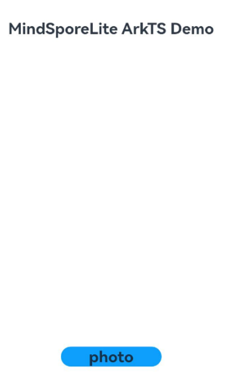
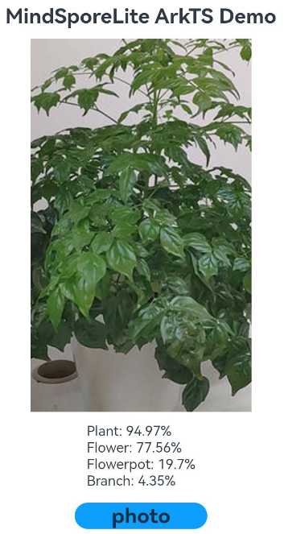

# Using MindSpore Lite for Image Classification (ArkTS)

## When to Use

You can use [@ohos.ai.mindSporeLite](../../reference/apis-mindspore-lite-kit/js-apis-mindSporeLite.md) to quickly deploy AI algorithms into your application to perform AI model inference for image classification.

Image classification can be used to recognize objects in images and is widely used in medical image analysis, auto driving, e-commerce, and facial recognition.

## Basic Concepts

Before getting started, you need to understand the following basic concepts:

**Tensor**: a special data structure that is similar to an array or matrix. It is the basic data structure used in MindSpore Lite network operations.

**Float16 inference mode**: an inference mode in half-precision format, where a number is represented with 16 bits.

## **Available APIs**

APIs involved in MindSpore Lite model inference are categorized into context APIs, model APIs, and tensor APIs. For details about APIs, see [@ohos.ai.mindSporeLite](../../reference/apis-mindspore-lite-kit/js-apis-mindSporeLite.md).

| API                                                      | Description            |
| ------------------------------------------------------------ | ---------------- |
| loadModelFromFile(model: string, context?: Context): Promise&lt;Model&gt; | Loads a model from a file.|
| getInputs(): MSTensor[]                                      | Obtains the model input.|
| predict(inputs: MSTensor[]): Promise&lt;MSTensor[]&gt;       | Performs model inference.      |
| getData(): ArrayBuffer                                       | Obtains tensor data.|
| setData(inputArray: ArrayBuffer): void                       | Sets tensor data.|

## Development Process

1. Select an image classification model.
2. Use the MindSpore Lite inference model on the device to classify the selected images.

## Environment Setup

Install DevEco Studio 4.1 or later, and update the SDK to API version 11 or later.

## How to Develop

The following uses inference on an image in the album as an example to describe how to use MindSpore Lite to implement image classification.

### Selecting a Model

This sample application uses [mobilenetv2.ms](https://download.mindspore.cn/model_zoo/official/lite/mobilenetv2_openimage_lite/1.5/mobilenetv2.ms) as the image classification model. The model file is available in the **entry/src/main/resources/rawfile** project directory.

If you have other pre-trained models for image classification, convert the original model into the .ms format by referring to [Using MindSpore Lite for Model Conversion](mindspore-lite-converter-guidelines.md).

### Writing Code

#### Image Input and Preprocessing

1. Call [@ohos.file.picker](../../reference/apis-core-file-kit/js-apis-file-picker.md) to pick up the desired image in the album.

   ```ts
   import { photoAccessHelper } from '@kit.MediaLibraryKit';
   import { BusinessError } from '@kit.BasicServicesKit';
   
   let uris: Array<string> = [];
   
   // Create an image picker instance.
   let photoSelectOptions = new photoAccessHelper.PhotoSelectOptions();
   
   // Set the media file type to IMAGE and set the maximum number of media files that can be selected.
   photoSelectOptions.MIMEType = photoAccessHelper.PhotoViewMIMETypes.IMAGE_TYPE;
   photoSelectOptions.maxSelectNumber = 1;
   
   // Create an album picker instance and call select() to open the album page for file selection. After file selection is done, the result set is returned through photoSelectResult.
   let photoPicker = new photoAccessHelper.PhotoViewPicker();
   photoPicker.select(photoSelectOptions, async (
     err: BusinessError, photoSelectResult: photoAccessHelper.PhotoSelectResult) => {
     if (err) {
       console.error('MS_LITE_ERR: PhotoViewPicker.select failed with err: ' + JSON.stringify(err));
       return;
     }
     console.info('MS_LITE_LOG: PhotoViewPicker.select successfully, ' +
       'photoSelectResult uri: ' + JSON.stringify(photoSelectResult));
     uris = photoSelectResult.photoUris;
     console.info('MS_LITE_LOG: uri: ' + uris);
   })
   ```

2. Based on the input image size, call [@ohos.multimedia.image](../../reference/apis-image-kit/js-apis-image.md) and [@ohos.file.fs](../../reference/apis-core-file-kit/js-apis-file-fs.md) to perform operations such as cropping the image, obtaining the image buffer, and standardizing the image.

   ```ts
   import { image } from '@kit.ImageKit';
   import { fileIo } from '@kit.CoreFileKit';
   
   let modelInputHeight: number = 224;
   let modelInputWidth: number = 224;
   
   // Based on the specified URI, call fileIo.openSync to open the file to obtain the FD.
   let file = fileIo.openSync(this.uris[0], fileIo.OpenMode.READ_ONLY);
   console.info('MS_LITE_LOG: file fd: ' + file.fd);
   
   // Based on the FD, call fileIo.readSync to read the data in the file.
   let inputBuffer = new ArrayBuffer(4096000);
   let readLen = fileIo.readSync(file.fd, inputBuffer);
   console.info('MS_LITE_LOG: readSync data to file succeed and inputBuffer size is:' + readLen);
   
   // Perform image preprocessing through PixelMap.
   let imageSource = image.createImageSource(file.fd);
   imageSource.createPixelMap().then((pixelMap) => {
     pixelMap.getImageInfo().then((info) => {
       console.info('MS_LITE_LOG: info.width = ' + info.size.width);
       console.info('MS_LITE_LOG: info.height = ' + info.size.height);
       // Crop the image based on the input image size and obtain the image buffer readBuffer.
       pixelMap.scale(256.0 / info.size.width, 256.0 / info.size.height).then(() => {
         pixelMap.crop(
           { x: 16, y: 16, size: { height: modelInputHeight, width: modelInputWidth } }
         ).then(async () => {
           let info = await pixelMap.getImageInfo();
           console.info('MS_LITE_LOG: crop info.width = ' + info.size.width);
           console.info('MS_LITE_LOG: crop info.height = ' + info.size.height);
           // Set the size of readBuffer.
           let readBuffer = new ArrayBuffer(modelInputHeight * modelInputWidth * 4);
           await pixelMap.readPixelsToBuffer(readBuffer);
           console.info('MS_LITE_LOG: Succeeded in reading image pixel data, buffer: ' +
           readBuffer.byteLength);
           // Convert readBuffer to the float32 format, and standardize the image.
           const imageArr = new Uint8Array(
             readBuffer.slice(0, modelInputHeight * modelInputWidth * 4));
           console.info('MS_LITE_LOG: imageArr length: ' + imageArr.length);
           let means = [0.485, 0.456, 0.406];
           let stds = [0.229, 0.224, 0.225];
           let float32View = new Float32Array(modelInputHeight * modelInputWidth * 3);
           let index = 0;
           for (let i = 0; i < imageArr.length; i++) {
             if ((i + 1) % 4 == 0) {
               float32View[index] = (imageArr[i - 3] / 255.0 - means[0]) / stds[0]; // B
               float32View[index+1] = (imageArr[i - 2] / 255.0 - means[1]) / stds[1]; // G
               float32View[index+2] = (imageArr[i - 1] / 255.0 - means[2]) / stds[2]; // R
               index += 3;
             }
           }
           console.info('MS_LITE_LOG: float32View length: ' + float32View.length);
           let printStr = 'float32View data:';
           for (let i = 0; i < 20; i++) {
             printStr += ' ' + float32View[i];
           }
           console.info('MS_LITE_LOG: float32View data: ' + printStr);
         })
       })
     });
   });
   ```

#### Writing Inference Code

1. If the capability set defined by the project does not contain MindSpore Lite, create the **syscap.json** file in the **entry/src/main** directory of the DevEco Studio project. The file content is as follows:

   ```json
   {
     "devices": {
       "general": [
         // The value must be the same as the value of deviceTypes in the module.json5 file.
         "default"
       ]
     },
     "development": {
       "addedSysCaps": [
         "SystemCapability.AI.MindSporeLite"
       ]
     }
   }
   ```

2. Call [@ohos.ai.mindSporeLite](../../reference/apis-mindspore-lite-kit/js-apis-mindSporeLite.md) to implement inference on the device. The operation process is as follows:

   1. Create a context, and set parameters such as the number of runtime threads and device type.
   2. Load the model. In this example, the model is loaded from the memory.
   3. Load data. Before executing a model, you need to obtain the model input and then fill data in the input tensors.
   4. Perform model inference through the **predict** API.

   ```ts
   // model.ets
   import { mindSporeLite } from '@kit.MindSporeLiteKit'
   
   export default async function modelPredict(
     modelBuffer: ArrayBuffer, inputsBuffer: ArrayBuffer[]): Promise<mindSporeLite.MSTensor[]> {
   
     // 1. Create a context, and set parameters such as the number of runtime threads and device type.
     let context: mindSporeLite.Context = {};
     context.target = ['cpu'];
     context.cpu = {}
     context.cpu.threadNum = 2;
     context.cpu.threadAffinityMode = 1;
     context.cpu.precisionMode = 'enforce_fp32';
   
     // 2. Load the model from the memory.
     let msLiteModel: mindSporeLite.Model = await mindSporeLite.loadModelFromBuffer(modelBuffer, context);
   
     // 3. Set the input data.
     let modelInputs: mindSporeLite.MSTensor[] = msLiteModel.getInputs();
     for (let i = 0; i < inputsBuffer.length; i++) {
       let inputBuffer = inputsBuffer[i];
       if (inputBuffer != null) {
         modelInputs[i].setData(inputBuffer as ArrayBuffer);
       }
     }
   
     // 4. Perform inference.
     console.info('=========MS_LITE_LOG: MS_LITE predict start=====');
     let modelOutputs: mindSporeLite.MSTensor[] = await msLiteModel.predict(modelInputs);
     return modelOutputs;
   }
   ```

#### Executing Inference

Load the model file and call the inference function to perform inference on the selected image, and process the inference result.

```ts
import modelPredict from './model';
import { resourceManager } from '@kit.LocalizationKit'

let modelName: string = 'mobilenetv2.ms';
let max: number = 0;
let maxIndex: number = 0;
let maxArray: Array<number> = [];
let maxIndexArray: Array<number> = [];

// The buffer data of the input image is stored in float32View after preprocessing. For details, see Image Input and Preprocessing.
let inputs: ArrayBuffer[] = [float32View.buffer];
let resMgr = this.getUIContext()?.getHostContext()?.getApplicationContext().resourceManager;
resMgr?.getRawFileContent(modelName).then(modelBuffer => {
  // predict
  modelPredict(modelBuffer.buffer.slice(0), inputs).then(outputs => {
    console.info('=========MS_LITE_LOG: MS_LITE predict success=====');
    // Print the result.
    for (let i = 0; i < outputs.length; i++) {
      let out = new Float32Array(outputs[i].getData());
      let printStr = outputs[i].name + ':';
      for (let j = 0; j < out.length; j++) {
        printStr += out[j].toString() + ',';
      }
      console.info('MS_LITE_LOG: ' + printStr);
      // Obtain the maximum number of categories.
      this.max = 0;
      this.maxIndex = 0;
      this.maxArray = [];
      this.maxIndexArray = [];
      let newArray = out.filter(value => value !== max)
      for (let n = 0; n < 5; n++) {
        max = out[0];
        maxIndex = 0;
        for (let m = 0; m < newArray.length; m++) {
          if (newArray[m] > max) {
            max = newArray[m];
            maxIndex = m;
          }
        }
        maxArray.push(Math.round(max * 10000))
        maxIndexArray.push(maxIndex)
        // Call the array filter function.
        newArray = newArray.filter(value => value !== max)
      }
      console.info('MS_LITE_LOG: max:' + maxArray);
      console.info('MS_LITE_LOG: maxIndex:' + maxIndexArray);
    }
    console.info('=========MS_LITE_LOG END=========');
  })
})
```

### Debugging and Verification

1. On DevEco Studio, connect to the device, click **Run entry**, and build your own HAP. 

   ```shell
   Launching com.samples.mindsporelitearktsdemo
   $ hdc shell aa force-stop com.samples.mindsporelitearktsdemo
   $ hdc shell mkdir data/local/tmp/xxx
   $ hdc file send C:\Users\xxx\MindSporeLiteArkTSDemo\entry\build\default\outputs\default\entry-default-signed.hap "data/local/tmp/xxx" 
   $ hdc shell bm install -p data/local/tmp/xxx
   $ hdc shell rm -rf data/local/tmp/xxx
   $ hdc shell aa start -a EntryAbility -b com.samples.mindsporelitearktsdemo
   ```

2. Touch the **photo** button on the device screen, select an image, and touch **OK**. The classification result of the selected image is displayed on the device screen. In the log printing result, filter images by the keyword **MS_LITE**. The following information is displayed:

   ```verilog
   08-06 03:24:33.743   22547-22547  A03d00/JSAPP                   com.sampl...liteark+  I     MS_LITE_LOG: PhotoViewPicker.select successfully, photoSelectResult uri: {"photoUris":["file://media/Photo/13/IMG_1501955351_012/plant.jpg"]}
   08-06 03:24:33.795   22547-22547  A03d00/JSAPP                   com.sampl...liteark+  I     MS_LITE_LOG: readSync data to file succeed and inputBuffer size is:32824
   08-06 03:24:34.147   22547-22547  A03d00/JSAPP                   com.sampl...liteark+  I     MS_LITE_LOG: crop info.width = 224
   08-06 03:24:34.147   22547-22547  A03d00/JSAPP                   com.sampl...liteark+  I     MS_LITE_LOG: crop info.height = 224
   08-06 03:24:34.160   22547-22547  A03d00/JSAPP                   com.sampl...liteark+  I     MS_LITE_LOG: Succeeded in reading image pixel data, buffer: 200704
   08-06 03:24:34.970   22547-22547  A03d00/JSAPP                   com.sampl...liteark+  I     =========MS_LITE_LOG: MS_LITE predict start=====
   08-06 03:24:35.432   22547-22547  A03d00/JSAPP                   com.sampl...liteark+  I     =========MS_LITE_LOG: MS_LITE predict success=====
   08-06 03:24:35.447   22547-22547  A03d00/JSAPP                   com.sampl...liteark+  I     MS_LITE_LOG: Default/head-MobileNetV2Head/Sigmoid-op466:0.0000034338463592575863,0.000014028532859811094,9.119685273617506e-7,0.000049100715841632336,9.502661555416125e-7,3.945370394831116e-7,0.04346757382154465,0.00003971960904891603...
   08-06 03:24:35.499   22547-22547  A03d00/JSAPP                   com.sampl...liteark+  I     MS_LITE_LOG: max:9497,7756,1970,435,46
   08-06 03:24:35.499   22547-22547  A03d00/JSAPP                   com.sampl...liteark+  I     MS_LITE_LOG: maxIndex:323,46,13,6,349
   08-06 03:24:35.499   22547-22547  A03d00/JSAPP                   com.sampl...liteark+  I     =========MS_LITE_LOG END=========
   ```

### Effects

Touch the **photo** button on the device screen, select an image, and touch **OK**. The top 4 categories of the image are displayed below the image.

               


<!--RP1--><!--RP1End-->
