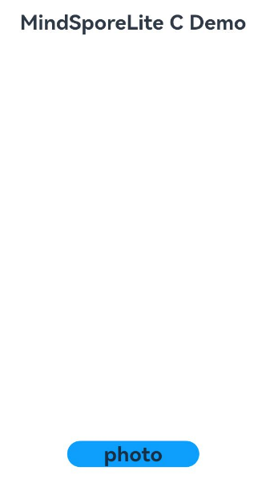
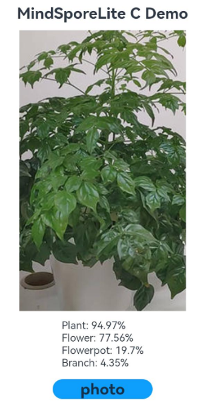

# Using MindSpore Lite for Image Classification (C/C++)

## When to Use

You can use [MindSpore](../../reference/apis-mindspore-lite-kit/_mind_spore.md) to quickly deploy AI algorithms into your application to perform AI model inference for image classification.

Image classification can be used to recognize objects in images and is widely used in medical image analysis, auto driving, e-commerce, and facial recognition.

## Basic Concepts

- N-API: a set of native APIs used to build ArkTS components. N-APIs can be used to encapsulate C/C++ libraries into ArkTS modules.

## Development Process

1. Select an image classification model.
2. Use the MindSpore Lite inference model on the device to classify the selected images.

## Environment Preparation

Install DevEco Studio 4.1 or later, and update the SDK to API version 11 or later.

## How to Develop

The following uses inference on an image in the album as an example to describe how to use MindSpore Lite to implement image classification.

### Selecting a Model

This sample application uses [mobilenetv2.ms](https://download.mindspore.cn/model_zoo/official/lite/mobilenetv2_openimage_lite/1.5/mobilenetv2.ms) as the image classification model. The model file is available in the **entry/src/main/resources/rawfile** project directory.

If you have other pre-trained models for image classification, convert the original model into the .ms format by referring to [Using MindSpore Lite for Model Conversion](mindspore-lite-converter-guidelines.md).

### Writing Code

#### Image Input and Preprocessing

1. Call [@ohos.file.picker](../../reference/apis-core-file-kit/js-apis-file-picker.md) to pick up the desired image in the album.

   ```ts
   import { photoAccessHelper } from '@kit.MediaLibraryKit';
   import { BusinessError } from '@kit.BasicServicesKit';
   
   let uris: Array<string> = [];
   
   // Create an image picker instance.
   let photoSelectOptions = new photoAccessHelper.PhotoSelectOptions();
   
   // Set the media file type to IMAGE and set the maximum number of media files that can be selected.
   photoSelectOptions.MIMEType = photoAccessHelper.PhotoViewMIMETypes.IMAGE_TYPE;
   photoSelectOptions.maxSelectNumber = 1;
   
   // Create an album picker instance and call select() to open the album page for file selection. After file selection is done, the result set is returned through photoSelectResult.
   let photoPicker = new photoAccessHelper.PhotoViewPicker();
   photoPicker.select(photoSelectOptions, async (
     err: BusinessError, photoSelectResult: photoAccessHelper.PhotoSelectResult) => {
     if (err) {
       console.error('MS_LITE_ERR: PhotoViewPicker.select failed with err: ' + JSON.stringify(err));
       return;
     }
     console.info('MS_LITE_LOG: PhotoViewPicker.select successfully, ' +
       'photoSelectResult uri: ' + JSON.stringify(photoSelectResult));
     uris = photoSelectResult.photoUris;
     console.info('MS_LITE_LOG: uri: ' + uris);
   })
   ```

2. Based on the input image size, call [@ohos.multimedia.image](../../reference/apis-image-kit/js-apis-image.md) and [@ohos.file.fs](../../reference/apis-core-file-kit/js-apis-file-fs.md) to perform operations such as cropping the image, obtain the image buffer, and standardizing the image.

   ```ts
   import { image } from '@kit.ImageKit';
   import { fileIo } from '@kit.CoreFileKit';
   
   let modelInputHeight: number = 224;
   let modelInputWidth: number = 224;
   
   // Based on the specified URI, call fileIo.openSync to open the file to obtain the FD.
   let file = fileIo.openSync(this.uris[0], fileIo.OpenMode.READ_ONLY);
   console.info('MS_LITE_LOG: file fd: ' + file.fd);
   
   // Based on the FD, call fileIo.readSync to read the data in the file.
   let inputBuffer = new ArrayBuffer(4096000);
   let readLen = fileIo.readSync(file.fd, inputBuffer);
   console.info('MS_LITE_LOG: readSync data to file succeed and inputBuffer size is:' + readLen);
   
   // Perform image preprocessing through PixelMap.
   let imageSource = image.createImageSource(file.fd);
   imageSource.createPixelMap().then((pixelMap) => {
     pixelMap.getImageInfo().then((info) => {
       console.info('MS_LITE_LOG: info.width = ' + info.size.width);
       console.info('MS_LITE_LOG: info.height = ' + info.size.height);
       // Crop the image based on the input image size and obtain the image buffer readBuffer.
       pixelMap.scale(256.0 / info.size.width, 256.0 / info.size.height).then(() => {
         pixelMap.crop(
           { x: 16, y: 16, size: { height: modelInputHeight, width: modelInputWidth } }
         ).then(async () => {
           let info = await pixelMap.getImageInfo();
           console.info('MS_LITE_LOG: crop info.width = ' + info.size.width);
           console.info('MS_LITE_LOG: crop info.height = ' + info.size.height);
           // Set the size of readBuffer.
           let readBuffer = new ArrayBuffer(modelInputHeight * modelInputWidth * 4);
           await pixelMap.readPixelsToBuffer(readBuffer);
           console.info('MS_LITE_LOG: Succeeded in reading image pixel data, buffer: ' +
           readBuffer.byteLength);
           // Convert readBuffer to the float32 format, and standardize the image.
           const imageArr = new Uint8Array(
             readBuffer.slice(0, modelInputHeight * modelInputWidth * 4));
           console.info('MS_LITE_LOG: imageArr length: ' + imageArr.length);
           let means = [0.485, 0.456, 0.406];
           let stds = [0.229, 0.224, 0.225];
           let float32View = new Float32Array(modelInputHeight * modelInputWidth * 3);
           let index = 0;
           for (let i = 0; i < imageArr.length; i++) {
             if ((i + 1) % 4 == 0) {
               float32View[index] = (imageArr[i - 3] / 255.0 - means[0]) / stds[0]; // B
               float32View[index+1] = (imageArr[i - 2] / 255.0 - means[1]) / stds[1]; // G
               float32View[index+2] = (imageArr[i - 1] / 255.0 - means[2]) / stds[2]; // R
               index += 3;
             }
           }
           console.info('MS_LITE_LOG: float32View length: ' + float32View.length);
           let printStr = 'float32View data:';
           for (let i = 0; i < 20; i++) {
             printStr += ' ' + float32View[i];
           }
           console.info('MS_LITE_LOG: float32View data: ' + printStr);
         })
       })
     });
   });
   ```

#### Writing Inference Code

Call [MindSpore](../../reference/apis-mindspore-lite-kit/_mind_spore.md) to implement inference on the device. The operation process is as follows:

1. Include the corresponding header file.

   ```c++
   #include <iostream>
   #include <sstream>
   #include <stdlib.h>
   #include <hilog/log.h>
   #include <rawfile/raw_file_manager.h>
   #include <mindspore/types.h>
   #include <mindspore/model.h>
   #include <mindspore/context.h>
   #include <mindspore/status.h>
   #include <mindspore/tensor.h>
   #include "napi/native_api.h"
   ```

2. Read the model file.

   ```c++
   #define LOGI(...) ((void)OH_LOG_Print(LOG_APP, LOG_INFO, LOG_DOMAIN, "[MSLiteNapi]", __VA_ARGS__))
   #define LOGD(...) ((void)OH_LOG_Print(LOG_APP, LOG_DEBUG, LOG_DOMAIN, "[MSLiteNapi]", __VA_ARGS__))
   #define LOGW(...) ((void)OH_LOG_Print(LOG_APP, LOG_WARN, LOG_DOMAIN, "[MSLiteNapi]", __VA_ARGS__))
   #define LOGE(...) ((void)OH_LOG_Print(LOG_APP, LOG_ERROR, LOG_DOMAIN, "[MSLiteNapi]", __VA_ARGS__))
   
   void *ReadModelFile(NativeResourceManager *nativeResourceManager, const std::string &modelName, size_t *modelSize) {
       auto rawFile = OH_ResourceManager_OpenRawFile(nativeResourceManager, modelName.c_str());
       if (rawFile == nullptr) {
           LOGE("MS_LITE_ERR: Open model file failed");
           return nullptr;
       }
       long fileSize = OH_ResourceManager_GetRawFileSize(rawFile);
       void *modelBuffer = malloc(fileSize);
       if (modelBuffer == nullptr) {
           LOGE("MS_LITE_ERR: OH_ResourceManager_ReadRawFile failed");
       }
       int ret = OH_ResourceManager_ReadRawFile(rawFile, modelBuffer, fileSize);
       if (ret == 0) {
           LOGI("MS_LITE_LOG: OH_ResourceManager_ReadRawFile failed");
           OH_ResourceManager_CloseRawFile(rawFile);
           return nullptr;
       }
       OH_ResourceManager_CloseRawFile(rawFile);
       *modelSize = fileSize;
       return modelBuffer;
   }
   ```
   
3. Create a context, set parameters such as the number of threads and device type, and load the model.

   ```c++
   void DestroyModelBuffer(void **buffer) {
       if (buffer == nullptr) {
           return;
       }
       free(*buffer);
       *buffer = nullptr;
   }
   
   OH_AI_ModelHandle CreateMSLiteModel(void *modelBuffer, size_t modelSize) {
       // Set executing context for model.
       auto context = OH_AI_ContextCreate();
       if (context == nullptr) {
           DestroyModelBuffer(&modelBuffer);
           LOGE("MS_LITE_ERR: Create MSLite context failed.\n");
           return nullptr;
       }
       auto cpu_device_info = OH_AI_DeviceInfoCreate(OH_AI_DEVICETYPE_CPU);
   
       OH_AI_DeviceInfoSetEnableFP16(cpu_device_info, true);
       OH_AI_ContextAddDeviceInfo(context, cpu_device_info);
   
       // Create model
       auto model = OH_AI_ModelCreate();
       if (model == nullptr) {
           DestroyModelBuffer(&modelBuffer);
           LOGE("MS_LITE_ERR: Allocate MSLite Model failed.\n");
           return nullptr;
       }
   
       // Build model object
       auto build_ret = OH_AI_ModelBuild(model, modelBuffer, modelSize, OH_AI_MODELTYPE_MINDIR, context);
       DestroyModelBuffer(&modelBuffer);
       if (build_ret != OH_AI_STATUS_SUCCESS) {
           OH_AI_ModelDestroy(&model);
           LOGE("MS_LITE_ERR: Build MSLite model failed.\n");
           return nullptr;
       }
       LOGI("MS_LITE_LOG: Build MSLite model success.\n");
       return model;
   }
   ```

4. Set the model input data and perform model inference.

   ```c++
   constexpr int K_NUM_PRINT_OF_OUT_DATA = 20;
   
   // Set the model input data.
   int FillInputTensor(OH_AI_TensorHandle input, std::vector<float> input_data) {
       if (OH_AI_TensorGetDataType(input) == OH_AI_DATATYPE_NUMBERTYPE_FLOAT32) {
           float *data = (float *)OH_AI_TensorGetMutableData(input);
           for (size_t i = 0; i < OH_AI_TensorGetElementNum(input); i++) {
               data[i] = input_data[i];
           }
           return OH_AI_STATUS_SUCCESS;
       } else {
           return OH_AI_STATUS_LITE_ERROR;
       }
   }
   
   // Execute model inference.
   int RunMSLiteModel(OH_AI_ModelHandle model, std::vector<float> input_data) {
       // Set input data for model.
       auto inputs = OH_AI_ModelGetInputs(model);
   
       auto ret = FillInputTensor(inputs.handle_list[0], input_data);
       if (ret != OH_AI_STATUS_SUCCESS) {
           LOGE("MS_LITE_ERR: RunMSLiteModel set input error.\n");
           return OH_AI_STATUS_LITE_ERROR;
       }
       // Get model output.
       auto outputs = OH_AI_ModelGetOutputs(model);
       // Predict model.
       auto predict_ret = OH_AI_ModelPredict(model, inputs, &outputs, nullptr, nullptr);
       if (predict_ret != OH_AI_STATUS_SUCCESS) {
           OH_AI_ModelDestroy(&model);
           LOGE("MS_LITE_ERR: MSLite Predict error.\n");
           return OH_AI_STATUS_LITE_ERROR;
       }
       LOGI("MS_LITE_LOG: Run MSLite model Predict success.\n");
       // Print output tensor data.
       LOGI("MS_LITE_LOG: Get model outputs:\n");
       for (size_t i = 0; i < outputs.handle_num; i++) {
           auto tensor = outputs.handle_list[i];
           LOGI("MS_LITE_LOG: - Tensor %{public}d name is: %{public}s.\n", static_cast<int>(i),
                OH_AI_TensorGetName(tensor));
           LOGI("MS_LITE_LOG: - Tensor %{public}d size is: %{public}d.\n", static_cast<int>(i),
                (int)OH_AI_TensorGetDataSize(tensor));
           LOGI("MS_LITE_LOG: - Tensor data is:\n");
           auto out_data = reinterpret_cast<const float *>(OH_AI_TensorGetData(tensor));
           std::stringstream outStr;
           for (int i = 0; (i < OH_AI_TensorGetElementNum(tensor)) && (i <= K_NUM_PRINT_OF_OUT_DATA); i++) {
               outStr << out_data[i] << " ";
           }
           LOGI("MS_LITE_LOG: %{public}s", outStr.str().c_str());
       }
       return OH_AI_STATUS_SUCCESS;
   }
   ```

5. Implement a complete model inference process.

   ```c++
   static napi_value RunDemo(napi_env env, napi_callback_info info) {
       LOGI("MS_LITE_LOG: Enter runDemo()");
       napi_value error_ret;
       napi_create_int32(env, -1, &error_ret);
       // Process the input data.
       size_t argc = 2;
       napi_value argv[2] = {nullptr};
       napi_get_cb_info(env, info, &argc, argv, nullptr, nullptr);
       bool isArray = false;
       napi_is_array(env, argv[0], &isArray);
       uint32_t length = 0;
       // Obtain the length of the array.
       napi_get_array_length(env, argv[0], &length);
   	LOGI("MS_LITE_LOG: argv array length = %{public}d", length);
       std::vector<float> input_data;
       double param = 0;
       for (int i = 0; i < length; i++) {
           napi_value value;
           napi_get_element(env, argv[0], i, &value);
           napi_get_value_double(env, value, &param);
           input_data.push_back(static_cast<float>(param));
       }
       std::stringstream outstr;
       for (int i = 0; i < K_NUM_PRINT_OF_OUT_DATA; i++) {
           outstr << input_data[i] << " ";
       }
   	LOGI("MS_LITE_LOG: input_data = %{public}s", outstr.str().c_str());
       // Read model file
       const std::string modelName = "mobilenetv2.ms";
       LOGI("MS_LITE_LOG: Run model: %{public}s", modelName.c_str());
       size_t modelSize;
       auto resourcesManager = OH_ResourceManager_InitNativeResourceManager(env, argv[1]);
       auto modelBuffer = ReadModelFile(resourcesManager, modelName, &modelSize);
       if (modelBuffer == nullptr) {
           LOGE("MS_LITE_ERR: Read model failed");
           return error_ret;
       }
       LOGI("MS_LITE_LOG: Read model file success");
       auto model = CreateMSLiteModel(modelBuffer, modelSize);
       if (model == nullptr) {
           OH_AI_ModelDestroy(&model);
           LOGE("MS_LITE_ERR: MSLiteFwk Build model failed.\n");
           return error_ret;
       }
       int ret = RunMSLiteModel(model, input_data);
       if (ret != OH_AI_STATUS_SUCCESS) {
           OH_AI_ModelDestroy(&model);
           LOGE("MS_LITE_ERR: RunMSLiteModel failed.\n");
           return error_ret;
       }
       napi_value out_data;
       napi_create_array(env, &out_data);
       auto outputs = OH_AI_ModelGetOutputs(model);
       OH_AI_TensorHandle output_0 = outputs.handle_list[0];
       float *output0Data = reinterpret_cast<float *>(OH_AI_TensorGetMutableData(output_0));
       for (size_t i = 0; i < OH_AI_TensorGetElementNum(output_0); i++) {
           napi_value element;
           napi_create_double(env, static_cast<double>(output0Data[i]), &element);
           napi_set_element(env, out_data, i, element);
       }
       OH_AI_ModelDestroy(&model);
       LOGI("MS_LITE_LOG: Exit runDemo()");
       return out_data;
   }
   ```

6. Write the **CMake** script to link the MindSpore Lite dynamic library.

   ```c++
   # the minimum version of CMake.
   cmake_minimum_required(VERSION 3.4.1)
   project(MindSporeLiteCDemo)
   
   set(NATIVERENDER_ROOT_PATH ${CMAKE_CURRENT_SOURCE_DIR})
   
   if(DEFINED PACKAGE_FIND_FILE)
       include(${PACKAGE_FIND_FILE})
   endif()
   
   include_directories(${NATIVERENDER_ROOT_PATH}
                       ${NATIVERENDER_ROOT_PATH}/include)
   
   add_library(entry SHARED mslite_napi.cpp)
   target_link_libraries(entry PUBLIC mindspore_lite_ndk)
   target_link_libraries(entry PUBLIC hilog_ndk.z)
   target_link_libraries(entry PUBLIC rawfile.z)
   target_link_libraries(entry PUBLIC ace_napi.z)
   ```

#### Use N-APIs to encapsulate the C++ dynamic library into an ArkTS module.

1. In **entry/src/main/cpp/types/libentry/Index.d.ts**, define the ArkTS API **runDemo ()**. The content is as follows:

   ```ts
   export const runDemo: (a: number[], b:Object) => Array<number>;
   ```

2. In the **oh-package.json5** file, associate the API with the .so file to form a complete ArkTS module.

   ```json
   {
     "name": "libentry.so",
     "types": "./Index.d.ts",
     "version": "1.0.0",
     "description": "MindSpore Lite inference module"
   }
   ```

#### Invoke the encapsulated ArkTS module for inference and output the result.

In **entry/src/main/ets/pages/Index.ets**, call the encapsulated ArkTS module to process the inference result.

```ts
import msliteNapi from 'libentry.so'
import { resourceManager } from '@kit.LocalizationKit';

let resMgr: resourceManager.ResourceManager = getContext().getApplicationContext().resourceManager;
let max: number = 0;
let maxIndex: number = 0;
let maxArray: Array<number> = [];
let maxIndexArray: Array<number> = [];

// Call the runDemo function of C++. The buffer data of the input image is stored in float32View after preprocessing. For details, see Image Input and Preprocessing.
console.info('MS_LITE_LOG: *** Start MSLite Demo ***');
let output: Array<number> = msliteNapi.runDemo(Array.from(float32View), resMgr);
// Obtain the maximum number of categories.
this.max = 0;
this.maxIndex = 0;
this.maxArray = [];
this.maxIndexArray = [];
let newArray = output.filter(value => value !== max);
for (let n = 0; n < 5; n++) {
  max = output[0];
  maxIndex = 0;
  for (let m = 0; m < newArray.length; m++) {
    if (newArray[m] > max) {
      max = newArray[m];
      maxIndex = m;
    }
  }
  maxArray.push(Math.round(this.max * 10000));
  maxIndexArray.push(this.maxIndex);
  // Call the array filter function.
  newArray = newArray.filter(value => value !== max);
}
console.info('MS_LITE_LOG: max:' + this.maxArray);
console.info('MS_LITE_LOG: maxIndex:' + this.maxIndexArray);
console.info('MS_LITE_LOG: *** Finished MSLite Demo ***');
```

### Debugging and Verification

1. On DevEco Studio, connect to the device, click **Run entry**, and build your own HAP. 

   ```shell
   Launching com.samples.mindsporelitecdemo
   $ hdc shell aa force-stop com.samples.mindsporelitecdemo
   $ hdc shell mkdir data/local/tmp/xxx
   $ hdc file send C:\Users\xxx\MindSporeLiteCDemo\entry\build\default\outputs\default\entry-default-signed.hap "data/local/tmp/xxx"
   $ hdc shell bm install -p data/local/tmp/xxx
   $ hdc shell rm -rf data/local/tmp/xxx
   $ hdc shell aa start -a EntryAbility -b com.samples.mindsporelitecdemo
   ```

2. Touch the **photo** button on the device screen, select an image, and touch **OK**. The classification result of the selected image is displayed on the device screen. In the log printing result, filter images by the keyword **MS_LITE**. The following information is displayed:

   ```verilog
   08-05 17:15:52.001   4684-4684    A03d00/JSAPP                   pid-4684              I     MS_LITE_LOG: PhotoViewPicker.select successfully, photoSelectResult uri: {"photoUris":["file://media/Photo/13/IMG_1501955351_012/plant.jpg"]}
   ...
   08-05 17:15:52.627   4684-4684    A03d00/JSAPP                   pid-4684              I     MS_LITE_LOG: crop info.width = 224
   08-05 17:15:52.627   4684-4684    A03d00/JSAPP                   pid-4684              I     MS_LITE_LOG: crop info.height = 224
   08-05 17:15:52.628   4684-4684    A03d00/JSAPP                   pid-4684              I     MS_LITE_LOG: Succeeded in reading image pixel data, buffer: 200704
   08-05 17:15:52.971   4684-4684    A03d00/JSAPP                   pid-4684              I     MS_LITE_LOG: float32View data: float32View data: 1.2385478019714355 1.308123230934143 1.4722440242767334 1.2385478019714355 1.308123230934143 1.4722440242767334 1.2385478019714355 1.308123230934143 1.4722440242767334 1.2385478019714355 1.308123230934143 1.4722440242767334 1.2385478019714355 1.308123230934143 1.4722440242767334 1.2385478019714355 1.308123230934143 1.4722440242767334 1.2385478019714355 1.308123230934143
   08-05 17:15:52.971   4684-4684    A03d00/JSAPP                   pid-4684              I     MS_LITE_LOG: *** Start MSLite Demo ***
   08-05 17:15:53.454   4684-4684    A00000/[MSLiteNapi]            pid-4684              I     MS_LITE_LOG: Build MSLite model success.
   08-05 17:15:53.753   4684-4684    A00000/[MSLiteNapi]            pid-4684              I     MS_LITE_LOG: Run MSLite model Predict success.
   08-05 17:15:53.753   4684-4684    A00000/[MSLiteNapi]            pid-4684              I     MS_LITE_LOG: Get model outputs:
   08-05 17:15:53.753   4684-4684    A00000/[MSLiteNapi]            pid-4684              I     MS_LITE_LOG: - Tensor 0 name is: Default/head-MobileNetV2Head/Sigmoid-op466.
   08-05 17:15:53.753   4684-4684    A00000/[MSLiteNapi]            pid-4684              I     MS_LITE_LOG: - Tensor data is:
   08-05 17:15:53.753   4684-4684    A00000/[MSLiteNapi]            pid-4684              I     MS_LITE_LOG: 3.43385e-06 1.40285e-05 9.11969e-07 4.91007e-05 9.50266e-07 3.94537e-07 0.0434676 3.97196e-05 0.00054832 0.000246202 1.576e-05 3.6494e-06 1.23553e-05 0.196977 5.3028e-05 3.29346e-05 4.90475e-07 1.66109e-06 7.03273e-06 8.83677e-07 3.1365e-06
   08-05 17:15:53.781   4684-4684    A03d00/JSAPP                   pid-4684              W     MS_LITE_WARN: output length =  500 ;value =  0.0000034338463592575863,0.000014028532859811094,9.119685273617506e-7,0.000049100715841632336,9.502661555416125e-7,3.945370394831116e-7,0.04346757382154465,0.00003971960904891603,0.0005483203567564487,0.00024620210751891136,0.000015759984307806008,0.0000036493988773145247,0.00001235533181898063,0.1969769448041916,0.000053027983085485175,0.000032934600312728435,4.904751449430478e-7,0.0000016610861166554969,0.000007032729172351537,8.836767619868624e-7
   08-05 17:15:53.831   4684-4684    A03d00/JSAPP                   pid-4684              I     MS_LITE_LOG: max:9497,7756,1970,435,46
   08-05 17:15:53.831   4684-4684    A03d00/JSAPP                   pid-4684              I     MS_LITE_LOG: maxIndex:323,46,13,6,349
   08-05 17:15:53.831   4684-4684    A03d00/JSAPP                   pid-4684              I     MS_LITE_LOG: *** Finished MSLite Demo ***
   ```


### Effects

Touch the **photo** button on the device screen, select an image, and touch **OK**. The top 4 categories of the image are displayed below the image.

               


