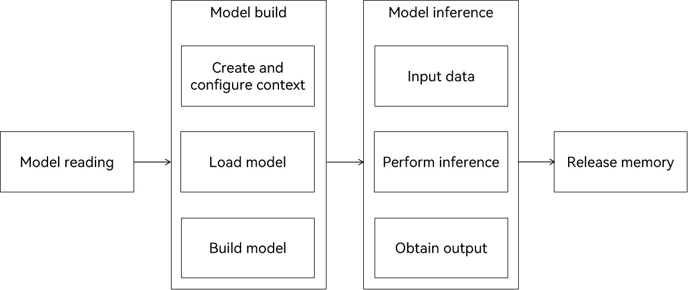

# Using MindSpore Lite for Model Inference (C/C++)

## When to Use

MindSpore Lite is an AI engine that provides AI model inference for different hardware devices. It has been used in a wide range of fields, such as image classification, target recognition, facial recognition, and character recognition.

This document describes the general development process for MindSpore Lite model inference.

## Basic Concepts

Before getting started, you need to understand the following basic concepts:

**Tensor**: a special data structure that is similar to arrays and matrices. It is basic data structure used in MindSpore Lite network operations.

**Float16 inference mode**: an inference mode in half-precision format, where a number is represented with 16 bits.


## Available APIs

APIs involved in MindSpore Lite model inference are categorized into context APIs, model APIs, and tensor APIs.

### Context APIs

| API       | Description       |
| ------------------ | ----------------- |
|OH_AI_ContextHandle OH_AI_ContextCreate()|Creates a context object. This API must be used together with **OH_AI_ContextDestroy**.|
|void OH_AI_ContextSetThreadNum(OH_AI_ContextHandle context, int32_t thread_num)|Sets the number of runtime threads.|
| void OH_AI_ContextSetThreadAffinityMode(OH_AI_ContextHandle context, int mode)|Sets the affinity mode for binding runtime threads to CPU cores, which are classified into large, medium, and small cores based on the CPU frequency. You only need to bind the large or medium cores, but not small cores.
|OH_AI_DeviceInfoHandle OH_AI_DeviceInfoCreate(OH_AI_DeviceType device_type)|Creates a runtime device information object.|
|void OH_AI_ContextDestroy(OH_AI_ContextHandle *context)|Destroys a context object.|
|void OH_AI_DeviceInfoSetEnableFP16(OH_AI_DeviceInfoHandle device_info, bool is_fp16)|Sets whether to enable float16 inference. This function is available only for CPU and GPU devices.|
|void OH_AI_ContextAddDeviceInfo(OH_AI_ContextHandle context, OH_AI_DeviceInfoHandle device_info)|Adds a runtime device information object.|

### Model APIs

| API       | Description       |
| ------------------ | ----------------- |
|OH_AI_ModelHandle OH_AI_ModelCreate()|Creates a model object.|
|OH_AI_Status OH_AI_ModelBuildFromFile(OH_AI_ModelHandle model, const char *model_path,OH_AI_ModelType odel_type, const OH_AI_ContextHandle model_context)|Loads and builds a MindSpore model from a model file.|
|void OH_AI_ModelDestroy(OH_AI_ModelHandle *model)|Destroys a model object.|

### Tensor APIs

| API       | Description       |
| ------------------ | ----------------- |
|OH_AI_TensorHandleArray OH_AI_ModelGetInputs(const OH_AI_ModelHandle model)|Obtains the input tensor array structure of a model.|
|int64_t OH_AI_TensorGetElementNum(const OH_AI_TensorHandle tensor)|Obtains the number of tensor elements.|
|const char *OH_AI_TensorGetName(const OH_AI_TensorHandle tensor)|Obtains the name of a tensor.|
|OH_AI_DataType OH_AI_TensorGetDataType(const OH_AI_TensorHandle tensor)|Obtains the tensor data type.|
|void *OH_AI_TensorGetMutableData(const OH_AI_TensorHandle tensor)|Obtains the pointer to mutable tensor data.|

## How to Develop

The following figure shows the development process for MindSpore Lite model inference.

**Figure 1** Development process for MindSpore Lite model inference



Before moving to the development process, you need to reference related header files and compile functions to generate random input. The sample code is as follows:

```c
#include <stdlib.h>
#include <stdio.h>
#include "mindspore/model.h"

// Generate random input.
int GenerateInputDataWithRandom(OH_AI_TensorHandleArray inputs) {
  for (size_t i = 0; i < inputs.handle_num; ++i) {
    float *input_data = (float *)OH_AI_TensorGetMutableData(inputs.handle_list[i]);
    if (input_data == NULL) {
      printf("MSTensorGetMutableData failed.\n");
      return OH_AI_STATUS_LITE_ERROR;
    }
    int64_t num = OH_AI_TensorGetElementNum(inputs.handle_list[i]);
    const int divisor = 10;
    for (size_t j = 0; j < num; j++) {
      input_data[j] = (float)(rand() % divisor) / divisor;  // 0--0.9f
    }
  }
  return OH_AI_STATUS_SUCCESS;
}
```

The development process consists of the following main steps:

1. Prepare the required model.

    The required model can be downloaded directly or obtained using the model conversion tool.
  
     - If the downloaded model is in the `.ms` format, you can use it directly for inference. The following uses the **mobilenetv2.ms** model as an example.
     - If the downloaded model uses a third-party framework, such as TensorFlow, TensorFlow Lite, Caffe, or ONNX, you can use the [model conversion tool](https://www.mindspore.cn/lite/docs/en/master/use/downloads.html#1-8-1) to convert it to the `.ms` format.

2. Create a context, and set parameters such as the number of runtime threads and device type.

    The following describes two typical scenarios:

    Scenario 1: Only the CPU inference context is created.
  
    ```c
    // Create a context, and set the number of runtime threads to 2 and the thread affinity mode to 1 (big cores first).
    OH_AI_ContextHandle context = OH_AI_ContextCreate();
    if (context == NULL) {
      printf("OH_AI_ContextCreate failed.\n");
      return OH_AI_STATUS_LITE_ERROR;
    }
    const int thread_num = 2;
    OH_AI_ContextSetThreadNum(context, thread_num);
    OH_AI_ContextSetThreadAffinityMode(context, 1);
    // Set the device type to CPU, and disable Float16 inference.
    OH_AI_DeviceInfoHandle cpu_device_info = OH_AI_DeviceInfoCreate(OH_AI_DEVICETYPE_CPU);
    if (cpu_device_info == NULL) {
      printf("OH_AI_DeviceInfoCreate failed.\n");
      OH_AI_ContextDestroy(&context);
      return OH_AI_STATUS_LITE_ERROR;
    }
    OH_AI_DeviceInfoSetEnableFP16(cpu_device_info, false);
    OH_AI_ContextAddDeviceInfo(context, cpu_device_info);
    ```

    Scenario 2: The neural network runtime (NNRT) and CPU heterogeneous inference contexts are created.

    NNRT is the runtime for cross-chip inference computing in the AI field. Generally, the acceleration hardware connected to NNRT, such as the NPU, has strong inference capabilities but supports only a limited number of operators, whereas the general-purpose CPU has weak inference capabilities but supports a wide range of operators. MindSpore Lite supports NNRT and CPU heterogeneous inference. Model operators are preferentially scheduled to NNRT for inference. If certain operators are not supported by NNRT, then they are scheduled to the CPU for inference. The following is the sample code for configuring NNRT/CPU heterogeneous inference:
   <!--Del-->
   > **NOTE**
   >
   > NNRT/CPU heterogeneous inference requires access of NNRT hardware. For details, see [OpenHarmony/ai_neural_network_runtime](https://gitee.com/openharmony/ai_neural_network_runtime).
   <!--DelEnd-->
    ```c
    // Create a context, and set the number of runtime threads to 2 and the thread affinity mode to 1 (big cores first).
    OH_AI_ContextHandle context = OH_AI_ContextCreate();
    if (context == NULL) {
      printf("OH_AI_ContextCreate failed.\n");
      return OH_AI_STATUS_LITE_ERROR;
    }
    // Preferentially use NNRT inference.
    // Use the NNRT hardware of the first ACCELERATORS class to create the NNRT device information and configure the high-performance inference mode for the NNRT hardware. You can also use OH_AI_GetAllNNRTDeviceDescs() to obtain the list of NNRT devices in the current environment, search for a specific device by device name or type, and use the device as the NNRT inference hardware.
    OH_AI_DeviceInfoHandle nnrt_device_info = OH_AI_CreateNNRTDeviceInfoByType(OH_AI_NNRTDEVICE_ACCELERATOR);
    if (nnrt_device_info == NULL) {
      printf("OH_AI_DeviceInfoCreate failed.\n");
      OH_AI_ContextDestroy(&context);
      return OH_AI_STATUS_LITE_ERROR;
    }
    OH_AI_DeviceInfoSetPerformanceMode(nnrt_device_info, OH_AI_PERFORMANCE_HIGH);
    OH_AI_ContextAddDeviceInfo(context, nnrt_device_info);

    // Configure CPU inference.
    OH_AI_DeviceInfoHandle cpu_device_info = OH_AI_DeviceInfoCreate(OH_AI_DEVICETYPE_CPU);
    if (cpu_device_info == NULL) {
      printf("OH_AI_DeviceInfoCreate failed.\n");
      OH_AI_ContextDestroy(&context);
      return OH_AI_STATUS_LITE_ERROR;
    }
    OH_AI_ContextAddDeviceInfo(context, cpu_device_info);
    ```

    

3. Create, load, and build the model.

    Call **OH_AI_ModelBuildFromFile** to load and build the model.

    In this example, the **argv[1]** parameter passed to **OH_AI_ModelBuildFromFile** indicates the specified model file path.

    ```c
    // Create a model.
    OH_AI_ModelHandle model = OH_AI_ModelCreate();
    if (model == NULL) {
      printf("OH_AI_ModelCreate failed.\n");
      OH_AI_ContextDestroy(&context);
      return OH_AI_STATUS_LITE_ERROR;
    }

    // Load and build the inference model. The model type is OH_AI_MODELTYPE_MINDIR.
    int ret = OH_AI_ModelBuildFromFile(model, argv[1], OH_AI_MODELTYPE_MINDIR, context);
    if (ret != OH_AI_STATUS_SUCCESS) {
      printf("OH_AI_ModelBuildFromFile failed, ret: %d.\n", ret);
      OH_AI_ModelDestroy(&model);
      OH_AI_ContextDestroy(&context);
      return ret;
    }
    ```

4. Input data.

    Before executing model inference, you need to populate data to the input tensor. In this example, random data is used to populate the model.

    ```c
    // Obtain the input tensor.
    OH_AI_TensorHandleArray inputs = OH_AI_ModelGetInputs(model);
    if (inputs.handle_list == NULL) {
      printf("OH_AI_ModelGetInputs failed, ret: %d.\n", ret);
      OH_AI_ModelDestroy(&model);
      OH_AI_ContextDestroy(&context);
      return ret;
    }
    // Use random data to populate the tensor.
    ret = GenerateInputDataWithRandom(inputs);
    if (ret != OH_AI_STATUS_SUCCESS) {
      printf("GenerateInputDataWithRandom failed, ret: %d.\n", ret);
      OH_AI_ModelDestroy(&model);
      OH_AI_ContextDestroy(&context);
      return ret;
    }
   ```

5. Execute model inference.

    Call **OH_AI_ModelPredict** to perform model inference.

    ```c
    // Execute model inference.
    OH_AI_TensorHandleArray outputs;
    ret = OH_AI_ModelPredict(model, inputs, &outputs, NULL, NULL);
    if (ret != OH_AI_STATUS_SUCCESS) {
      printf("OH_AI_ModelPredict failed, ret: %d.\n", ret);
      OH_AI_ModelDestroy(&model);
      OH_AI_ContextDestroy(&context);
      return ret;
    }
    ```

6. Obtain the output.

    After model inference is complete, you can obtain the inference result through the output tensor.

    ```c
    // Obtain the output tensor and print the information.
    for (size_t i = 0; i < outputs.handle_num; ++i) {
      OH_AI_TensorHandle tensor = outputs.handle_list[i];
      long long element_num = OH_AI_TensorGetElementNum(tensor);
      printf("Tensor name: %s, tensor size is %zu ,elements num: %lld.\n", OH_AI_TensorGetName(tensor),
            OH_AI_TensorGetDataSize(tensor), element_num);
      const float *data = (const float *)OH_AI_TensorGetData(tensor);
      printf("output data is:\n");
      const int max_print_num = 50;
      for (int j = 0; j < element_num && j <= max_print_num; ++j) {
        printf("%f ", data[j]);
      }
      printf("\n");
    }
    ```

7. Destroy the model.

    If the MindSpore Lite inference framework is no longer needed, you need to destroy the created model.

    ```c
    // Release the model and context.
    OH_AI_ModelDestroy(&model);
    OH_AI_ContextDestroy(&context);
    ```

## Verification

1. Write **CMakeLists.txt**.

    ```cmake
    cmake_minimum_required(VERSION 3.14)
    project(Demo)

    add_executable(demo main.c)

    target_link_libraries(
            demo
            mindspore_lite_ndk
            pthread
            dl
    )
    ```
   - To use ohos-sdk for cross compilation, you need to set the native toolchain path for the CMake tool as follows: `-DCMAKE_TOOLCHAIN_FILE="/xxx/native/build/cmake/ohos.toolchain.cmake"`.

   - The toolchain builds a 64-bit application by default. To build a 32-bit application, add the following configuration: `-DOHOS_ARCH="armeabi-v7a"`.

2. Run the CMake tool.

    - Use hdc_std to connect to the device and put **demo** and **mobilenetv2.ms** to the same directory on the device.
    - Run the hdc_std shell command to access the device, go to the directory where **demo** is located, and run the following command:

    ```shell
    ./demo mobilenetv2.ms
    ```

    The inference is successful if the output is similar to the following:

    ```shell
    # ./demo ./mobilenetv2.ms                                            
    Tensor name: Softmax-65, tensor size is 4004 ,elements num: 1001.
    output data is:
    0.000018 0.000012 0.000026 0.000194 0.000156 0.001501 0.000240 0.000825 0.000016 0.000006 0.000007 0.000004 0.000004 0.000004 0.000015 0.000099 0.000011 0.000013 0.000005 0.000023 0.000004 0.000008 0.000003 0.000003 0.000008 0.000014 0.000012 0.000006 0.000019 0.000006 0.000018 0.000024 0.000010 0.000002 0.000028 0.000372 0.000010 0.000017 0.000008 0.000004 0.000007 0.000010 0.000007 0.000012 0.000005 0.000015 0.000007 0.000040 0.000004 0.000085 0.000023 
    ```

