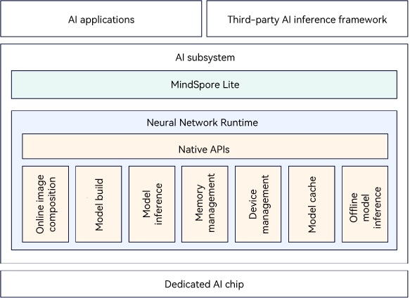

# Introduction to Neural Network Runtime Kit

## Usage Scenario
Neural Network Runtime (NNRt) functions as a bridge to connect the upper-layer AI inference framework and underlying acceleration chips, implementing cross-chip inference computing for AI models.

NNRt native APIs are intended for developers of the AI inference framework or application developers who want to directly use AI acceleration hardware to accelerate model inference.

The AI inference framework can call the NNRt image composition API to convert its model image into an NNRt internal model image, and then call the NNRt build and execution APIs to perform model inference on the AI acceleration hardware connected to NNRt. This implementation realizes unperceivable cross-AI hardware inference, but model loading is slow at first use.

The AI inference framework or application can also directly use the offline model dedicated to the specific AI hardware to perform model inference on NNRt, without the need to call the NNRt image composition API. This implementation realizes only inference on the specific AI hardware, but the model loading is fast at first use.

## NNRt Architecture

As shown in Figure 1, in addition to native APIs, NNRt logically consists of the following functional modules:
1. **Online image composition**: Have the AI inference framework call the NNRt image composition API to convert its model image into an NNRt internal model image. The built-in MindSpore Lite inference framework connects to NNRt through MindIR. For details, see [MindSpore Lite Kit](../mindspore/mindspore-lite-guidelines.md). The format of MindIR model images is compatible with that of the NNRt internal model images. Therefore, MindSpore Lite can connect to NNRt without calling the NNRt image composition API.
2. **Model build**: Build NNRt internal model images or offline model files into hardware-specific model objects on the underlying AI hardware driver through the NNRt build API. This way, model inference can be performed on the AI hardware subsequently.
3. **Model inference**: Create an executor based on the built model object, set the input and output tensors for inference, and execute model inference on the AI hardware.
4. **Memory management**: Apply for shared memory on the AI hardware driver and assign the shared memory to tensors. The input and output tensors must contain the corresponding data memory for inference. When a tensor is destroyed, release the shared memory. The shared memory on the AI hardware driver can help implement zero copy of input and output data, improving the inference performance.
5. **Device management**: Display information about the AI hardware connected to NNRt and allow for selection of the AI hardware.
6. **Model cache**: Save the built model objects into a file or a segment of memory in the cache. During next model build, model objects can be directly loaded from the file or segment of memory in the cache, greatly improving the build speed.
7. **Offline model inference**: Directly use model files (offline models for short) dedicated to the AI hardware for inference. Specifically, use the model converter provided by the AI hardware vendor to convert the original training model into the offline model file corresponding to the AI hardware, deploy the offline model file in the application, and pass the model file to the NNRt offline model build API for inference. Offline models can be used only for build and inference on the corresponding AI hardware. That is, inference across AI hardware is not supported. The offline models are specific to the AI hardware and therefore, the build speed is usually fast.

**Figure 1** NNRt architecture

## Features

- Opens unified AI acceleration hardware inference APIs for the AI inference framework to implement unperceivable cross-AI hardware inference.
- Provides image composition APIs for the AI inference framework to pass internal model images to NNRt.
- Provides the model cache function. Model objects can be saved as cached files, greatly accelerating model loading.
- Provides the hardware-specific offline model loading function, which shortens the model build time. However, inference can only be executed on the corresponding AI hardware.
- Provides common hardware attributes such as the inference priority, performance mode, and FP16 mode, and supports custom extended attributes of specific hardware.
- Implements zero copy of data by applying for shared memory on the AI hardware driver, improving the inference performance.

## Available Capabilities

- NNRt provides only the AI inference capability of the underlying AI acceleration hardware, but not common hardware such as the CPU.
- NNRt provides only the basic AI inference capabilities and hardware attribute configurations commonly shared by AI hardware, such as build, execution, memory management, priority, and performance mode. If you want to configure the hardware attributes specific to dedicated AI hardware, you can use the custom extended attributes provided by NNRt. For details about the attribute names and values, see the documents provided by the hardware vendor.
- Currently, NNRt supports 56 common operators. More operators will be supported in later versions. Note that there is no specific implementation for NNRt operators. They are only used as the elements of the internal model image to connect to the underlying AI hardware. The specific operators are implemented in the AI hardware driver.
- NNRt supports only synchronous inference. Asynchronous inference will be supported in later versions.
- NNRt does not support multi-thread concurrent image composition. Whether NNRt supports concurrent build and execution depends on underlying hardware driver.

## Related Kits

Neural Network Runtime Kit supports the built-in MindSpore Lite inference framework, that is, MindSpore Lite Kit, which has opened native APIs for NNRt configuration.

Image composition is not required for interconnection between MindSpore Lite and NNRt. They share the same model image format, that is, MindIR. Therefore, using MindSpore Lite to load models on NNRt is faster than using any other AI inference frameworks.

In addition, MindSpore Lite supports heterogeneous model inference between general-purpose computing hardware (CPUs/GPUs) and dedicated AI acceleration hardware.
