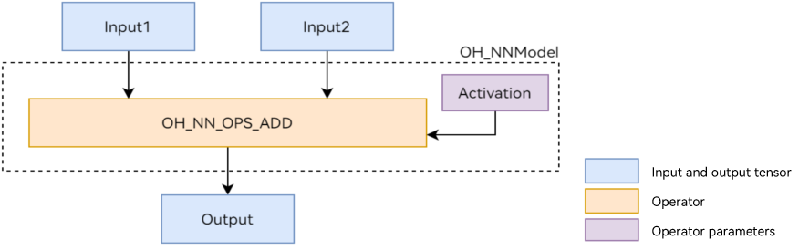

# Connecting NNRt to an AI Inference Framework

## When to Use

As a bridge between the AI inference engine and acceleration chip, Neural Network Runtime (NNRt) provides simplified native APIs for the AI inference engine to perform end-to-end inference through the acceleration chip.

This topic uses the `Add` single-operator model shown in Figure 1 as an example to describe the NNRt development process. The `Add` operator involves two inputs, one parameter, and one output. Wherein, the `activation` parameter is used to specify the type of the activation function in the `Add` operator.

**Figure 1** Add single-operator model<br>


## Preparing the Environment

### Environment Requirements

The environment requirements for NNRt are as follows:

- Development environment: Ubuntu 18.04 or later.
- Access device: a standard device whose built-in hardware accelerator driver has been connected to NNRt.

The Neural Network Runtime is opened to external systems through OpenHarmony native APIs. Therefore, you need to use the Native development suite of the OpenHarmony to compile Neural Network Runtime applications. You can download the ohos-sdk package of the corresponding version from the daily build in the OpenHarmony community and then decompress the package to obtain the native development suite of the corresponding platform. Take Linux as an example. The package of the native development suite is named `native-linux-{version number}.zip`.

### Environment Setup

1. Start the Ubuntu server.
2. Copy the downloaded package of the Native development suite to the root directory of the current user.
3. Decompress the package of the native development suite.
    ```shell
    unzip native-linux-{version number}.zip
    ```

    The directory structure after decompression is as follows. The content in the directory may vary depending on the version. Use the native APIs of the latest version.
    ```text
    native/
    ├── build // Cross-compilation toolchain
    ├── build-tools // Compilation and build tools
    ├── docs
    ├── llvm
    ├── nativeapi_syscap_config.json
    ├── ndk_system_capability.json
    ├── NOTICE.txt
    ├── oh-uni-package.json
    └── sysroot // Native API header files and libraries
    ```
## Available APIs

This section describes the common APIs used in the NNRt development process.

### Structs

| Name| Description|
| --------- | ---- |
| typedef struct OH_NNModel OH_NNModel | Model handle of NNRt. It is used to construct a model.|
| typedef struct OH_NNCompilation OH_NNCompilation | Compiler handle of NNRt. It is used to compile an AI model.|
| typedef struct OH_NNExecutor OH_NNExecutor | Executor handle of NNRt. It is used to perform inference computing on a specified device.|
| typedef struct NN_QuantParam NN_QuantParam | Quantization parameter handle, which is used to specify the quantization parameter of the tensor during model construction.|
| typedef struct NN_TensorDesc NN_TensorDesc | Tensor description handle, which is used to describe tensor attributes, such as the data format, data type, and shape.|
| typedef struct NN_Tensor NN_Tensor | Tensor handle, which is used to set the inference input and output tensors of the executor.|

### Model Construction APIs

| Name| Description|
| ------- | --- |
| OH_NNModel_Construct() | Creates a model instance of the OH_NNModel type.|
| OH_NN_ReturnCode OH_NNModel_AddTensorToModel(OH_NNModel *model, const NN_TensorDesc *tensorDesc) | Adds a tensor to a model instance.|
| OH_NN_ReturnCode OH_NNModel_SetTensorData(OH_NNModel *model, uint32_t index, const void *dataBuffer, size_t length) | Sets the tensor value.|
| OH_NN_ReturnCode OH_NNModel_AddOperation(OH_NNModel *model, OH_NN_OperationType op, const OH_NN_UInt32Array *paramIndices, const OH_NN_UInt32Array *inputIndices, const OH_NN_UInt32Array *outputIndices) | Adds an operator to a model instance.|
| OH_NN_ReturnCode OH_NNModel_SpecifyInputsAndOutputs(OH_NNModel *model, const OH_NN_UInt32Array *inputIndices, const OH_NN_UInt32Array *outputIndices) | Sets an index value for the input and output tensors of a model.|
| OH_NN_ReturnCode OH_NNModel_Finish(OH_NNModel *model) | Completes model composition.|
| void OH_NNModel_Destroy(OH_NNModel **model) | Destroys a model instance.|


### Model Compilation APIs

| Name| Description|
| ------- | --- |
| OH_NNCompilation *OH_NNCompilation_Construct(const OH_NNModel *model) | Creates an **OH_NNCompilation** instance based on the specified model instance.|
| OH_NNCompilation *OH_NNCompilation_ConstructWithOfflineModelFile(const char *modelPath) | Creates an **OH_NNCompilation** instance based on the specified offline model file path.|
| OH_NNCompilation *OH_NNCompilation_ConstructWithOfflineModelBuffer(const void *modelBuffer, size_t modelSize) | Creates an **OH_NNCompilation** instance based on the specified offline model buffer.|
| OH_NNCompilation *OH_NNCompilation_ConstructForCache() | Creates an empty model building instance for later recovery from the model cache.|
| OH_NN_ReturnCode OH_NNCompilation_ExportCacheToBuffer(OH_NNCompilation *compilation, const void *buffer, size_t length, size_t *modelSize) | Writes the model cache to the specified buffer.|
| OH_NN_ReturnCode OH_NNCompilation_ImportCacheFromBuffer(OH_NNCompilation *compilation, const void *buffer, size_t modelSize) | Reads the model cache from the specified buffer.|
| OH_NN_ReturnCode OH_NNCompilation_AddExtensionConfig(OH_NNCompilation *compilation, const char *configName, const void *configValue, const size_t configValueSize) | Adds extended configurations for custom device attributes. For details about the extended attribute names and values, see the documentation that comes with the device.|
| OH_NN_ReturnCode OH_NNCompilation_SetDevice(OH_NNCompilation *compilation, size_t deviceID) | Sets the Device for model building and computing, which can be obtained through the device management APIs.|
| OH_NN_ReturnCode OH_NNCompilation_SetCache(OH_NNCompilation *compilation, const char *cachePath, uint32_t version) | Sets the cache directory and version for model building.|
| OH_NN_ReturnCode OH_NNCompilation_SetPerformanceMode(OH_NNCompilation *compilation, OH_NN_PerformanceMode performanceMode) | Sets the performance mode for model computing.|
| OH_NN_ReturnCode OH_NNCompilation_SetPriority(OH_NNCompilation *compilation, OH_NN_Priority priority) | Sets the priority for model computing.|
| OH_NN_ReturnCode OH_NNCompilation_EnableFloat16(OH_NNCompilation *compilation, bool enableFloat16) | Enables float16 for computing.|
| OH_NN_ReturnCode OH_NNCompilation_Build(OH_NNCompilation *compilation) | Performs model building.|
| void OH_NNCompilation_Destroy(OH_NNCompilation **compilation) | Destroys a model building instance.|

### Tensor Description APIs

| Name| Description|
| ------- | --- |
| NN_TensorDesc *OH_NNTensorDesc_Create() | Creates an **NN_TensorDesc** instance for creating an **NN_Tensor** instance at a later time.|
| OH_NN_ReturnCode OH_NNTensorDesc_SetName(NN_TensorDesc *tensorDesc, const char *name) | Sets the name of the **NN_TensorDesc** instance.|
| OH_NN_ReturnCode OH_NNTensorDesc_GetName(const NN_TensorDesc *tensorDesc, const char **name) | Obtains the name of the **NN_TensorDesc** instance.|
| OH_NN_ReturnCode OH_NNTensorDesc_SetDataType(NN_TensorDesc *tensorDesc, OH_NN_DataType dataType) | Sets the data type of the **NN_TensorDesc** instance.|
| OH_NN_ReturnCode OH_NNTensorDesc_GetDataType(const NN_TensorDesc *tensorDesc, OH_NN_DataType *dataType) | Obtains the data type of the **NN_TensorDesc** instance.|
| OH_NN_ReturnCode OH_NNTensorDesc_SetShape(NN_TensorDesc *tensorDesc, const int32_t *shape, size_t shapeLength) | Sets the shape of the **NN_TensorDesc** instance.|
| OH_NN_ReturnCode OH_NNTensorDesc_GetShape(const NN_TensorDesc *tensorDesc, int32_t **shape, size_t *shapeLength) | Obtains the shape of the **NN_TensorDesc** instance.|
| OH_NN_ReturnCode OH_NNTensorDesc_SetFormat(NN_TensorDesc *tensorDesc, OH_NN_Format format) | Sets the data format of the **NN_TensorDesc** instance.|
| OH_NN_ReturnCode OH_NNTensorDesc_GetFormat(const NN_TensorDesc *tensorDesc, OH_NN_Format *format) | Obtains the data format of the **NN_TensorDesc** instance.|
| OH_NN_ReturnCode OH_NNTensorDesc_GetElementCount(const NN_TensorDesc *tensorDesc, size_t *elementCount) | Obtains the number of elements in the **NN_TensorDesc** instance.|
| OH_NN_ReturnCode OH_NNTensorDesc_GetByteSize(const NN_TensorDesc *tensorDesc, size_t *byteSize) | Obtains the number of bytes occupied by the tensor data obtained through calculation based on the shape and data type of an **NN_TensorDesc** instance.|
| OH_NN_ReturnCode OH_NNTensorDesc_Destroy(NN_TensorDesc **tensorDesc) | Destroys an **NN_TensorDesc** instance.|

### Tensor APIs

| Name| Description|
| ------- | --- |
| NN_Tensor* OH_NNTensor_Create(size_t deviceID, NN_TensorDesc *tensorDesc) | Creates an **NN_Tensor** instance based on the specified tensor description. This API will request for device shared memory.|
| NN_Tensor* OH_NNTensor_CreateWithSize(size_t deviceID, NN_TensorDesc *tensorDesc, size_t size) | Creates an **NN_Tensor** instance based on the specified memory size and tensor description. This API will request for device shared memory.|
| NN_Tensor* OH_NNTensor_CreateWithFd(size_t deviceID, NN_TensorDesc *tensorDesc, int fd, size_t size, size_t offset) | Creates an **NN_Tensor** instance based on the specified file descriptor of the shared memory and tensor description. This way, the device shared memory of other tensors can be reused.|
| NN_TensorDesc* OH_NNTensor_GetTensorDesc(const NN_Tensor *tensor) | Obtains the pointer to the **NN_TensorDesc** instance in a tensor to read tensor attributes, such as the data type and shape.|
| void* OH_NNTensor_GetDataBuffer(const NN_Tensor *tensor) | Obtains the memory address of tensor data to read or write tensor data.|
| OH_NN_ReturnCode OH_NNTensor_GetFd(const NN_Tensor *tensor, int *fd) | Obtains the file descriptor of the shared memory where the tensor data is located. A file descriptor corresponds to a device shared memory block.|
| OH_NN_ReturnCode OH_NNTensor_GetSize(const NN_Tensor *tensor, size_t *size) | Obtains the size of the shared memory where tensor data is located.|
| OH_NN_ReturnCode OH_NNTensor_GetOffset(const NN_Tensor *tensor, size_t *offset) | Obtains the offset of the tensor data in the shared memory. The available size of the tensor data is the size of the shared memory minus the offset.|
| OH_NN_ReturnCode OH_NNTensor_Destroy(NN_Tensor **tensor) | Destroys an **NN_Tensor** instance.|

### Inference APIs

| Name| Description|
| ------- | --- |
| OH_NNExecutor *OH_NNExecutor_Construct(OH_NNCompilation *compilation) | Creates an **OH_NNExecutor** instance.|
| OH_NN_ReturnCode OH_NNExecutor_GetOutputShape(OH_NNExecutor *executor, uint32_t outputIndex, int32_t **shape, uint32_t *shapeLength) | Obtains the dimension information about the output tensor. This API is applicable only if the output tensor has a dynamic shape.|
| OH_NN_ReturnCode OH_NNExecutor_GetInputCount(const OH_NNExecutor *executor, size_t *inputCount) | Obtains the number of input tensors.|
| OH_NN_ReturnCode OH_NNExecutor_GetOutputCount(const OH_NNExecutor *executor, size_t *outputCount) | Obtains the number of output tensors.|
| NN_TensorDesc* OH_NNExecutor_CreateInputTensorDesc(const OH_NNExecutor *executor, size_t index) | Creates an **NN_TensorDesc** instance for an input tensor based on the specified index value. This instance will be used to read tensor attributes or create **NN_Tensor** instances.|
| NN_TensorDesc* OH_NNExecutor_CreateOutputTensorDesc(const OH_NNExecutor *executor, size_t index) | Creates an **NN_TensorDesc** instance for an output tensor based on the specified index value. This instance will be used to read tensor attributes or create **NN_Tensor** instances.|
| OH_NN_ReturnCode OH_NNExecutor_GetInputDimRange(const OH_NNExecutor *executor, size_t index, size_t **minInputDims, size_t **maxInputDims, size_t *shapeLength) |Obtains the dimension range of all input tensors. If the input tensor has a dynamic shape, the dimension range supported by the tensor may vary according to device. |
| OH_NN_ReturnCode OH_NNExecutor_SetOnRunDone(OH_NNExecutor *executor, NN_OnRunDone onRunDone) | Sets the callback function invoked when the asynchronous inference ends. For the definition of the callback function, see the *API Reference*.|
| OH_NN_ReturnCode OH_NNExecutor_SetOnServiceDied(OH_NNExecutor *executor, NN_OnServiceDied onServiceDied) | Sets the callback function invoked when the device driver service terminates unexpectedly during asynchronous inference. For the definition of the callback function, see the *API Reference*.|
| OH_NN_ReturnCode OH_NNExecutor_RunSync(OH_NNExecutor *executor, NN_Tensor *inputTensor[], size_t inputCount, NN_Tensor *outputTensor[], size_t outputCount) | Performs synchronous inference.|
| OH_NN_ReturnCode OH_NNExecutor_RunAsync(OH_NNExecutor *executor, NN_Tensor *inputTensor[], size_t inputCount, NN_Tensor *outputTensor[], size_t outputCount, int32_t timeout, void *userData) | Performs asynchronous inference.|
| void OH_NNExecutor_Destroy(OH_NNExecutor **executor) | Destroys an **OH_NNExecutor** instance.|

### Device Management APIs

| Name| Description|
| ------- | --- |
| OH_NN_ReturnCode OH_NNDevice_GetAllDevicesID(const size_t **allDevicesID, uint32_t *deviceCount) | Obtains the ID of the device connected to NNRt.|
| OH_NN_ReturnCode OH_NNDevice_GetName(size_t deviceID, const char **name) | Obtains the name of the specified device.|
| OH_NN_ReturnCode OH_NNDevice_GetType(size_t deviceID, OH_NN_DeviceType *deviceType) | Obtains the type of the specified device.|


## How to Develop

The development process of NNRt consists of three phases: model construction, model compilation, and inference execution. The following uses the `Add` single-operator model as an example to describe how to call NNRt APIs during application development.

1. Create an application sample file.

    Create the source file of the NNRt application sample. Run the following commands in the project directory to create the `nnrt_example/` directory and create the `nnrt_example.cpp` source file in the directory:

    ```shell
    mkdir ~/nnrt_example && cd ~/nnrt_example
    touch nnrt_example.cpp
    ```

2. Import the NNRt module.

    Add the following code at the beginning of the `nnrt_example.cpp` file to import NNRt:

    ```cpp
    #include <iostream>
    #include <cstdarg>
    #include "hilog/log.h"
    #include "neural_network_runtime/neural_network_runtime.h"
    ```

3. Defines auxiliary functions, such as log printing, input data setting, and data printing.

    ```cpp
    #define LOG_DOMAIN 0xD002101
    #define LOG_TAG "NNRt"
    #define LOGD(...) OH_LOG_DEBUG(LOG_APP, __VA_ARGS__)
    #define LOGI(...) OH_LOG_INFO(LOG_APP, __VA_ARGS__)
    #define LOGW(...) OH_LOG_WARN(LOG_APP, __VA_ARGS__)
    #define LOGE(...) OH_LOG_ERROR(LOG_APP, __VA_ARGS__)
    #define LOGF(...) OH_LOG_FATAL(LOG_APP, __VA_ARGS__)

    // Macro for checking the return value
    #define CHECKNEQ(realRet, expectRet, retValue, ...) \
        do { \
            if ((realRet) != (expectRet)) { \
                printf(__VA_ARGS__); \
                return (retValue); \
            } \
        } while (0)

    #define CHECKEQ(realRet, expectRet, retValue, ...) \
        do { \
            if ((realRet) == (expectRet)) { \
                printf(__VA_ARGS__); \
                return (retValue); \
            } \
        } while (0)

    // Set the input data for inference.
    OH_NN_ReturnCode SetInputData(NN_Tensor* inputTensor[], size_t inputSize)
    {
        OH_NN_DataType dataType(OH_NN_FLOAT32);
        OH_NN_ReturnCode ret{OH_NN_FAILED};
        size_t elementCount = 0;
        for (size_t i = 0; i < inputSize; ++i) {
            // Obtain the data memory of the tensor.
            auto data = OH_NNTensor_GetDataBuffer(inputTensor[i]);
            CHECKEQ(data, nullptr, OH_NN_FAILED, "Failed to get data buffer.");
            // Obtain the tensor description.
            auto desc = OH_NNTensor_GetTensorDesc(inputTensor[i]);
            CHECKEQ(desc, nullptr, OH_NN_FAILED, "Failed to get desc.");
            // Obtain the data type of the tensor.
            ret = OH_NNTensorDesc_GetDataType(desc, &dataType);
            CHECKNEQ(ret, OH_NN_SUCCESS, OH_NN_FAILED, "Failed to get data type.");
            // Obtain the number of elements in the tensor.
            ret = OH_NNTensorDesc_GetElementCount(desc, &elementCount);
            CHECKNEQ(ret, OH_NN_SUCCESS, OH_NN_FAILED, "Failed to get element count.");
            switch(dataType) {
                case OH_NN_FLOAT32: {
                    float* floatValue = reinterpret_cast<float*>(data);
                    for (size_t j = 0; j < elementCount; ++j) {
                        floatValue[j] = static_cast<float>(j);
                    }
                    break;
                }
                case OH_NN_INT32: {
                    int* intValue = reinterpret_cast<int*>(data);
                    for (size_t j = 0; j < elementCount; ++j) {
                        intValue[j] = static_cast<int>(j);
                    }
                    break;
                }
                default:
                    return OH_NN_FAILED;
            }
        }
        return OH_NN_SUCCESS;
    }

    OH_NN_ReturnCode Print(NN_Tensor* outputTensor[], size_t outputSize)
    {
        OH_NN_DataType dataType(OH_NN_FLOAT32);
        OH_NN_ReturnCode ret{OH_NN_FAILED};
        size_t elementCount = 0;
        for (size_t i = 0; i < outputSize; ++i) {
            auto data = OH_NNTensor_GetDataBuffer(outputTensor[i]);
            CHECKEQ(data, nullptr, OH_NN_FAILED, "Failed to get data buffer.");
            auto desc = OH_NNTensor_GetTensorDesc(outputTensor[i]);
            CHECKEQ(desc, nullptr, OH_NN_FAILED, "Failed to get desc.");
            ret = OH_NNTensorDesc_GetDataType(desc, &dataType);
            CHECKNEQ(ret, OH_NN_SUCCESS, OH_NN_FAILED, "Failed to get data type.");
            ret = OH_NNTensorDesc_GetElementCount(desc, &elementCount);
            CHECKNEQ(ret, OH_NN_SUCCESS, OH_NN_FAILED, "Failed to get element count.");
            switch(dataType) {
                case OH_NN_FLOAT32: {
                    float* floatValue = reinterpret_cast<float*>(data);
                    for (size_t j = 0; j < elementCount; ++j) {
                        std::cout << "Output index: " << j << ", value is: " << floatValue[j] << "." << std::endl;
                    }
                    break;
                }
                case OH_NN_INT32: {
                    int* intValue = reinterpret_cast<int*>(data);
                    for (size_t j = 0; j < elementCount; ++j) {
                        std::cout << "Output index: " << j << ", value is: " << intValue[j] << "." << std::endl;
                    }
                    break;
                }
                default:
                    return OH_NN_FAILED;
            }
        }

        return OH_NN_SUCCESS;
    }
    ```

4. Construct a model.

    Use the model construction APIs to construct a single `Add` operator model.

    ```cpp
    OH_NN_ReturnCode BuildModel(OH_NNModel** pmodel)
    {
        // Create a model instance and construct a model.
        OH_NNModel* model = OH_NNModel_Construct();
        CHECKEQ(model, nullptr, -1, "Create model failed.");

        // Add the first input tensor of the float32 type for the Add operator. The tensor shape is [1, 2, 2, 3].
        NN_TensorDesc* tensorDesc = OH_NNTensorDesc_Create();
        CHECKEQ(tensorDesc, nullptr, -1, "Create TensorDesc failed.");

        int32_t inputDims[4] = {1, 2, 2, 3};
        returnCode = OH_NNTensorDesc_SetShape(tensorDesc, inputDims, 4);
        CHECKNEQ(returnCode, OH_NN_SUCCESS, -1, "Set TensorDesc shape failed.");

        returnCode = OH_NNTensorDesc_SetDataType(tensorDesc, OH_NN_FLOAT32);
        CHECKNEQ(returnCode, OH_NN_SUCCESS, -1, "Set TensorDesc data type failed.");

        returnCode = OH_NNTensorDesc_SetFormat(tensorDesc, OH_NN_FORMAT_NONE);
        CHECKNEQ(returnCode, OH_NN_SUCCESS, -1, "Set TensorDesc format failed.");

        returnCode = OH_NNModel_AddTensorToModel(model, tensorDesc);
        CHECKNEQ(returnCode, OH_NN_SUCCESS, -1, "Add first TensorDesc to model failed.");

        returnCode = OH_NNModel_SetTensorType(model, 0, OH_NN_TENSOR);
        CHECKNEQ(returnCode, OH_NN_SUCCESS, -1, "Set model tensor type failed.");

        // Add the second input tensor of the float32 type for the Add operator. The tensor shape is [1, 2, 2, 3].
        tensorDesc = OH_NNTensorDesc_Create();
        CHECKEQ(tensorDesc, nullptr, -1, "Create TensorDesc failed.");

        returnCode = OH_NNTensorDesc_SetShape(tensorDesc, inputDims, 4);
        CHECKNEQ(returnCode, OH_NN_SUCCESS, -1, "Set TensorDesc shape failed.");

        returnCode = OH_NNTensorDesc_SetDataType(tensorDesc, OH_NN_FLOAT32);
        CHECKNEQ(returnCode, OH_NN_SUCCESS, -1, "Set TensorDesc data type failed.");

        returnCode = OH_NNTensorDesc_SetFormat(tensorDesc, OH_NN_FORMAT_NONE);
        CHECKNEQ(returnCode, OH_NN_SUCCESS, -1, "Set TensorDesc format failed.");

        returnCode = OH_NNModel_AddTensorToModel(model, tensorDesc);
        CHECKNEQ(returnCode, OH_NN_SUCCESS, -1, "Add second TensorDesc to model failed.");

        returnCode = OH_NNModel_SetTensorType(model, 1, OH_NN_TENSOR);
        CHECKNEQ(returnCode, OH_NN_SUCCESS, -1, "Set model tensor type failed.");

        // Add the parameter tensor of the int8 type for the Add operator. The parameter tensor is used to specify the type of the activation function.
        tensorDesc = OH_NNTensorDesc_Create();
        CHECKEQ(tensorDesc, nullptr, -1, "Create TensorDesc failed.");

        int32_t activationDims = 1;
        returnCode = OH_NNTensorDesc_SetShape(tensorDesc, &activationDims, 1);
        CHECKNEQ(returnCode, OH_NN_SUCCESS, -1, "Set TensorDesc shape failed.");

        returnCode = OH_NNTensorDesc_SetDataType(tensorDesc, OH_NN_INT8);
        CHECKNEQ(returnCode, OH_NN_SUCCESS, -1, "Set TensorDesc data type failed.");

        returnCode = OH_NNTensorDesc_SetFormat(tensorDesc, OH_NN_FORMAT_NONE);
        CHECKNEQ(returnCode, OH_NN_SUCCESS, -1, "Set TensorDesc format failed.");

        returnCode = OH_NNModel_AddTensorToModel(model, tensorDesc);
        CHECKNEQ(returnCode, OH_NN_SUCCESS, -1, "Add second TensorDesc to model failed.");

        returnCode = OH_NNModel_SetTensorType(model, 2, OH_NN_ADD_ACTIVATIONTYPE);
        CHECKNEQ(returnCode, OH_NN_SUCCESS, -1, "Set model tensor type failed.");

        // Set the type of the activation function to OH_NNBACKEND_FUSED_NONE, indicating that no activation function is added to the Add operator.
        int8_t activationValue = OH_NN_FUSED_NONE;
        returnCode = OH_NNModel_SetTensorData(model, 2, &activationValue, sizeof(int8_t));
        CHECKNEQ(returnCode, OH_NN_SUCCESS, -1, "Set model tensor data failed.");

        // Add the output tensor of the float32 type for the Add operator. The tensor shape is [1, 2, 2, 3].
        tensorDesc = OH_NNTensorDesc_Create();
        CHECKEQ(tensorDesc, nullptr, -1, "Create TensorDesc failed.");

        returnCode = OH_NNTensorDesc_SetShape(tensorDesc, inputDims, 4);
        CHECKNEQ(returnCode, OH_NN_SUCCESS, -1, "Set TensorDesc shape failed.");

        returnCode = OH_NNTensorDesc_SetDataType(tensorDesc, OH_NN_FLOAT32);
        CHECKNEQ(returnCode, OH_NN_SUCCESS, -1, "Set TensorDesc data type failed.");

        returnCode = OH_NNTensorDesc_SetFormat(tensorDesc, OH_NN_FORMAT_NONE);
        CHECKNEQ(returnCode, OH_NN_SUCCESS, -1, "Set TensorDesc format failed.");

        returnCode = OH_NNModel_AddTensorToModel(model, tensorDesc);
        CHECKNEQ(returnCode, OH_NN_SUCCESS, -1, "Add forth TensorDesc to model failed.");

        returnCode = OH_NNModel_SetTensorType(model, 3, OH_NN_TENSOR);
        CHECKNEQ(returnCode, OH_NN_SUCCESS, -1, "Set model tensor type failed.");

        // Specify index values of the input tensor, parameter tensor, and output tensor for the Add operator.
        uint32_t inputIndicesValues[2] = {0, 1};
        uint32_t paramIndicesValues = 2;
        uint32_t outputIndicesValues = 3;
        OH_NN_UInt32Array paramIndices = {&paramIndicesValues, 1 * 4};
        OH_NN_UInt32Array inputIndices = {inputIndicesValues, 2 * 4};
        OH_NN_UInt32Array outputIndices = {&outputIndicesValues, 1 * 4};

        // Add the Add operator to the model instance.
        returnCode = OH_NNModel_AddOperation(model, OH_NN_OPS_ADD, &paramIndices, &inputIndices, &outputIndices);
        CHECKNEQ(returnCode, OH_NN_SUCCESS, -1, "Add operation to model failed.");

        // Set the index values of the input tensor and output tensor for the model instance.
        returnCode = OH_NNModel_SpecifyInputsAndOutputs(model, &inputIndices, &outputIndices);
        CHECKNEQ(returnCode, OH_NN_SUCCESS, -1, "Specify model inputs and outputs failed.");

        // Complete the model instance construction.
        returnCode = OH_NNModel_Finish(model);
        CHECKNEQ(returnCode, OH_NN_SUCCESS, -1, "Build model failed.");

        // Return the model instance.
        *pmodel = model;
        return OH_NN_SUCCESS;
    }
    ```

5. Query the AI acceleration chips connected to NNRt.

    NNRt can connect to multiple AI acceleration chips through HDIs. Before model building, you need to query the AI acceleration chips connected to NNRt on the current device. Each AI acceleration chip has a unique ID. In the compilation phase, you need to specify the chip for model compilation based on the ID.
    ```cpp
    void GetAvailableDevices(std::vector<size_t>& availableDevice)
    {
        availableDevice.clear();

        // Obtain the available hardware IDs.
        const size_t* devices = nullptr;
        uint32_t deviceCount = 0;
        OH_NN_ReturnCode ret = OH_NNDevice_GetAllDevicesID(&devices, &deviceCount);
        if (ret != OH_NN_SUCCESS) {
            std::cout << "GetAllDevicesID failed, get no available device." << std::endl;
            return;
        }

        for (uint32_t i = 0; i < deviceCount; i++) {
            availableDevice.emplace_back(devices[i]);
        }
    }
    ```

6. Compile a model on the specified device.

    NNRt uses abstract model expressions to describe the topology structure of an AI model. Before inference execution on an AI acceleration chip, the build module provided by NNRt needs to deliver the abstract model expressions to the chip driver layer and convert the abstract model expressions into a format that supports inference and computing.
    ```cpp
    OH_NN_ReturnCode CreateCompilation(OH_NNModel* model, const std::vector<size_t>& availableDevice,
                                       OH_NNCompilation** pCompilation)
    {
        // Create an OH_NNCompilation instance and pass the image composition model instance or the MindSpore Lite model instance to it.
        OH_NNCompilation* compilation = OH_NNCompilation_Construct(model);
        CHECKEQ(compilation, nullptr, -1, "OH_NNCore_ConstructCompilationWithNNModel failed.");

        // Set compilation options, such as the compilation hardware, cache path, performance mode, computing priority, and whether to enable float16 low-precision computing.
        // Choose to perform model compilation on the first device.
        returnCode = OH_NNCompilation_SetDevice(compilation, availableDevice[0]);
        CHECKNEQ(returnCode, OH_NN_SUCCESS, -1, "OH_NNCompilation_SetDevice failed.");

        // Have the model compilation result cached in the /data/local/tmp directory, with the version number set to 1.
        returnCode = OH_NNCompilation_SetCache(compilation, "/data/local/tmp", 1);
        CHECKNEQ(returnCode, OH_NN_SUCCESS, -1, "OH_NNCompilation_SetCache failed.");

        // Set the performance mode of the device.
        returnCode = OH_NNCompilation_SetPerformanceMode(compilation, OH_NN_PERFORMANCE_EXTREME);
        CHECKNEQ(returnCode, OH_NN_SUCCESS, -1, "OH_NNCompilation_SetPerformanceMode failed.");

        // Set the inference priority.
        returnCode = OH_NNCompilation_SetPriority(compilation, OH_NN_PRIORITY_HIGH);
        CHECKNEQ(returnCode, OH_NN_SUCCESS, -1, "OH_NNCompilation_SetPriority failed.");

        // Specify whether to enable FP16 computing.
        returnCode = OH_NNCompilation_EnableFloat16(compilation, false);
        CHECKNEQ(returnCode, OH_NN_SUCCESS, -1, "OH_NNCompilation_EnableFloat16 failed.");

        // Perform model building
        returnCode = OH_NNCompilation_Build(compilation);
        CHECKNEQ(returnCode, OH_NN_SUCCESS, -1, "OH_NNCompilation_Build failed.");

        *pCompilation = compilation;
        return OH_NN_SUCCESS;
    }
    ```

7. Create an executor.

    After the model building is complete, you need to call the NNRt execution module to create an executor. In the inference phase, operations such as setting the model input, obtaining the model output, and triggering inference computing are performed through the executor.
    ```cpp
    OH_NNExecutor* CreateExecutor(OH_NNCompilation* compilation)
    {
        // Create an executor based on the specified OH_NNCompilation instance.
        OH_NNExecutor *executor = OH_NNExecutor_Construct(compilation);
        CHECKEQ(executor, nullptr, -1, "OH_NNExecutor_Construct failed.");
        return executor;
    }
    ```

8. Perform inference computing, and print the inference result.

    The input data required for inference computing is passed to the executor through the API provided by the execution module. This way, the executor is triggered to perform inference computing once to obtain and print the inference computing result.
    ```cpp
    OH_NN_ReturnCode Run(OH_NNExecutor* executor, const std::vector<size_t>& availableDevice)
    {
        // Obtain information about the input and output tensors from the executor.
        // Obtain the number of input tensors.
        size_t inputCount = 0;
        returnCode = OH_NNExecutor_GetInputCount(executor, &inputCount);
        CHECKNEQ(returnCode, OH_NN_SUCCESS, -1, "OH_NNExecutor_GetInputCount failed.");
        std::vector<NN_TensorDesc*> inputTensorDescs;
        NN_TensorDesc* tensorDescTmp = nullptr;
        for (size_t i = 0; i < inputCount; ++i) {
            // Create the description of the input tensor.
            tensorDescTmp = OH_NNExecutor_CreateInputTensorDesc(executor, i);
            CHECKEQ(tensorDescTmp, nullptr, -1, "OH_NNExecutor_CreateInputTensorDesc failed.");
            inputTensorDescs.emplace_back(tensorDescTmp);
        }
        // Obtain the number of output tensors.
        size_t outputCount = 0;
        returnCode = OH_NNExecutor_GetOutputCount(executor, &outputCount);
        CHECKNEQ(returnCode, OH_NN_SUCCESS, -1, "OH_NNExecutor_GetOutputCount failed.");
        std::vector<NN_TensorDesc*> outputTensorDescs;
        for (size_t i = 0; i < outputCount; ++i) {
            // Create the description of the output tensor.
            tensorDescTmp = OH_NNExecutor_CreateOutputTensorDesc(executor, i);
            CHECKEQ(tensorDescTmp, nullptr, -1, "OH_NNExecutor_CreateOutputTensorDesc failed.");
            outputTensorDescs.emplace_back(tensorDescTmp);
        }

        // Create input and output tensors.
        NN_Tensor* inputTensors[inputCount];
        NN_Tensor* tensor = nullptr;
        for (size_t i = 0; i < inputCount; ++i) {
            tensor = nullptr;
            tensor = OH_NNTensor_Create(availableDevice[0], inputTensorDescs[i]);
            CHECKEQ(tensor, nullptr, -1, "OH_NNTensor_Create failed.");
            inputTensors[i] = tensor;
        }
        NN_Tensor* outputTensors[outputCount];
        for (size_t i = 0; i < outputCount; ++i) {
            tensor = nullptr;
            tensor = OH_NNTensor_Create(availableDevice[0], outputTensorDescs[i]);
            CHECKEQ(tensor, nullptr, -1, "OH_NNTensor_Create failed.");
            outputTensors[i] = tensor;
        }

        // Set the data of the input tensor.
        returnCode = SetInputData(inputTensors, inputCount);
        CHECKNEQ(returnCode, OH_NN_SUCCESS, -1, "SetInputData failed.");

        // Perform inference
        returnCode = OH_NNExecutor_RunSync(executor, inputTensors, inputCount, outputTensors, outputCount);
        CHECKNEQ(returnCode, OH_NN_SUCCESS, -1, "OH_NNExecutor_RunSync failed.");

        // Print the data of the output tensor.
        Print(outputTensors, outputCount);

        // Clear the input and output tensors and tensor description.
        for (size_t i = 0; i < inputCount; ++i) {
            returnCode = OH_NNTensor_Destroy(&inputTensors[i]);
            CHECKNEQ(returnCode, OH_NN_SUCCESS, -1, "OH_NNTensor_Destroy failed.");
            returnCode = OH_NNTensorDesc_Destroy(&inputTensorDescs[i]);
            CHECKNEQ(returnCode, OH_NN_SUCCESS, -1, "OH_NNTensorDesc_Destroy failed.");
        }
        for (size_t i = 0; i < outputCount; ++i) {
            returnCode = OH_NNTensor_Destroy(&outputTensors[i]);
            CHECKNEQ(returnCode, OH_NN_SUCCESS, -1, "OH_NNTensor_Destroy failed.");
            returnCode = OH_NNTensorDesc_Destroy(&outputTensorDescs[i]);
            CHECKNEQ(returnCode, OH_NN_SUCCESS, -1, "OH_NNTensorDesc_Destroy failed.");
        }

        return OH_NN_SUCCESS;
    }
    ```

9. Build an end-to-end process from model construction to model compilation and execution.

    Steps 4 to 8 implement the model construction, compilation, and execution processes and encapsulates them into multiple functions to facilitate modular development. The following sample code shows how to apply these functions into a complete NNRt development process.
    ```cpp
    int main()
    {
        OH_NNModel* model = nullptr;
        OH_NNCompilation* compilation = nullptr;
        OH_NNExecutor* executor = nullptr;
        std::vector<size_t> availableDevices;

        // Construct a model.
        OH_NNModel* model = nullptr;
        OH_NN_ReturnCode ret = BuildModel(&model);
        if (ret != OH_NN_SUCCESS) {
            std::cout << "BuildModel failed." << std::endl;
            OH_NNModel_Destroy(&model);
            return -1;
        }

        // Obtain the available devices.
        GetAvailableDevices(availableDevices);
        if (availableDevices.empty()) {
            std::cout << "No available device." << std::endl;
            OH_NNModel_Destroy(&model);
            return -1;
        }

        // Build the model.
        ret = CreateCompilation(model, availableDevices, &compilation);
        if (ret != OH_NN_SUCCESS) {
            std::cout << "CreateCompilation failed." << std::endl;
            OH_NNModel_Destroy(&model);
            OH_NNCompilation_Destroy(&compilation);
            return -1;
        }

        // Destroy the model instance.
        OH_NNModel_Destroy(&model);

        // Create an inference executor for the model.
        executor = CreateExecutor(compilation);
        if (executor == nullptr) {
            std::cout << "CreateExecutor failed, no executor is created." << std::endl;
            OH_NNCompilation_Destroy(&compilation);
            return -1;
        }

        // Destroy the model building instance.
        OH_NNCompilation_Destroy(&compilation);

        // Use the created executor to perform inference.
        ret = Run(executor, availableDevices);
        if (ret != OH_NN_SUCCESS) {
            std::cout << "Run failed." << std::endl;
            OH_NNExecutor_Destroy(&executor);
            return -1;
        }

        // Destroy the executor instance.
        OH_NNExecutor_Destroy(&executor);

        return 0;
    }
    ```

## Verification

1. Prepare the compilation configuration file of the application sample.

    Create a `CMakeLists.txt` file, and add compilation configurations to the application sample file `nnrt_example.cpp`. The following is a simple example of the `CMakeLists.txt` file:
    ```text
    cmake_minimum_required(VERSION 3.16)
    project(nnrt_example C CXX)

    add_executable(nnrt_example
        ./nnrt_example.cpp
    )

    target_link_libraries(nnrt_example
        neural_network_runtime
        neural_network_core
    )
    ```

2. Compile the application sample.

    Create the **build/** directory in the current directory, and compile `nnrt\_example.cpp` in the **build/** directory to obtain the binary file `nnrt\_example`:
    ```shell
    mkdir build && cd build
    cmake -DCMAKE_TOOLCHAIN_FILE={Path of the cross-compilation toolchain}/build/cmake/ohos.toolchain.cmake -DOHOS_ARCH=arm64-v8a -DOHOS_PLATFORM=OHOS -DOHOS_STL=c++_static ..
    make
    ```

3. Push the application sample to the device for execution.
    ```shell
    # Push the `nnrt_example` obtained through compilation to the device, and execute it.
    hdc_std file send ./nnrt_example /data/local/tmp/.

    # Grant required permissions to the executable file of the test case.
    hdc_std shell "chmod +x /data/local/tmp/nnrt_example"

    # Execute the test case.
    hdc_std shell "/data/local/tmp/nnrt_example"
    ```

    If the execution is normal, information similar to the following is displayed:
    ```text
    Output index: 0, value is: 0.000000.
    Output index: 1, value is: 2.000000.
    Output index: 2, value is: 4.000000.
    Output index: 3, value is: 6.000000.
    Output index: 4, value is: 8.000000.
    Output index: 5, value is: 10.000000.
    Output index: 6, value is: 12.000000.
    Output index: 7, value is: 14.000000.
    Output index: 8, value is: 16.000000.
    Output index: 9, value is: 18.000000.
    Output index: 10, value is: 20.000000.
    Output index: 11, value is: 22.000000.
    ```

4. (Optional) Check the model cache.

    If the HDI service connected to NNRt supports the model cache function, you can find the generated cache file in the `/data/local/tmp` directory after the `nnrt_example` is executed successfully.

    > **NOTE**
    >
    > The IR graphs of the model need to be passed to the hardware driver layer, so that the HDI service compiles the IR graphs into a computing graph dedicated to hardware. The compilation process is time-consuming. The NNRt supports the computing graph cache feature. It can cache the computing graphs compiled by the HDI service to the device storage. If the same model is compiled on the same acceleration chip next time, you can specify the cache path so that NNRt can directly load the computing graphs in the cache file, reducing the compilation time.

    Check the cached files in the cache directory.
    ```shell
    ls /data/local/tmp
    ```

    The command output is as follows:
    ```text
    # 0.nncache 1.nncache 2.nncache cache_info.nncache
    ```

    If the cache is no longer used, manually delete the cache files.
    ```shell
    rm /data/local/tmp/*nncache
    ```
