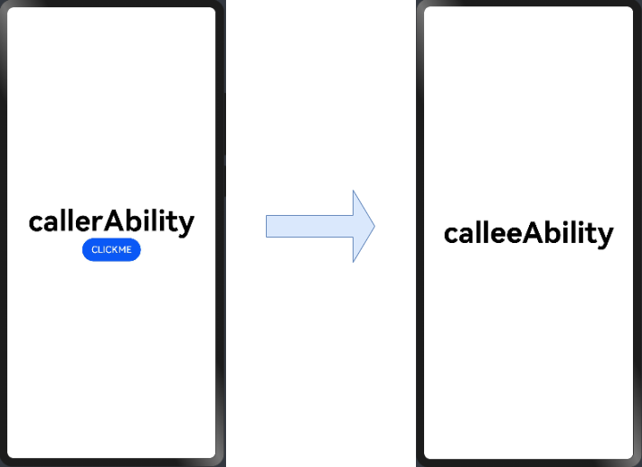

# Using Explicit Want to Start an Ability


When a user touches a button in an application, the application often needs to start a UIAbility component to complete a specific task. The following describes how to use explicit Want to start a UIAbility component in an application.


## How to Develop

1. In a project of the stage model, create an ability and a page, named **callerAbility** and **Index.ets**, respectively. Use the **windowStage.loadContent()** method in the **onWindowStageCreate** function in the **callerAbility.ts** file to bind the two.
   
   ```ts
   // ...
       // callerAbility.ts
       onWindowStageCreate(windowStage) {
           // Main window is created. Set a main page for this ability.
           console.info('[Demo] EntryAbility onWindowStageCreate')
           // Bind callerAbility with the page named Index.
           windowStage.loadContent('pages/Index')
       }
   // ...
   ```

2. Repeat the preceding operation to create another ability named **calleeAbility**.

3. Add a button to the **Index.ets** page of **callerAbility**.
   
   ```ts
   // ...
     build() {
       Row() {
         Column() {
           Text('hello')
           .fontSize(50)
           .fontWeight(FontWeight.Bold)
           // The new button will call explicitStartAbility() when being touched.
           Button("CLICKME")
           .onClick(this.explicitStartAbility) // For details about explicitStartAbility, see the sample code below.
           // ...
         }
         .width('100%')
       }
       .height('100%')
     }
   // ...
   ```

4. Override the **onClick** method and use explicit Want to start **calleeAbility** in the method. The **bundleName** field can be obtained from the **AppScope > app.json5** file of the project. The **abilityName** field can be obtained from the **yourModuleName &gt; src &gt; main &gt; module.json5** file of the corresponding module.
   
   ```ts
   import common from '@ohos.app.ability.common';
   
   // ...
     async explicitStartAbility() {
       try {
         // Explicit Want with abilityName specified.
         let want = {
           deviceId: "",
           bundleName: "com.example.myapplication",
           abilityName: "calleeAbility"
         };
         let context = getContext(this) as common.UIAbilityContext;
         await context.startAbility(want);
         console.info(`explicit start ability succeed`);
       } catch (error) {
         console.info(`explicit start ability failed with ${error.code}`);
       }
     }
   // ...
   ```

5. When you touch **CLICKME**, the corresponding page is displayed.
   

