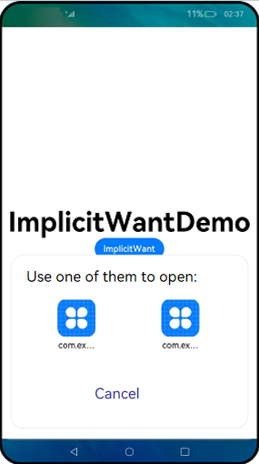

# Using Implicit Want to Open a Website


## Prerequisites

One or more browsers are installed on your device.

The **module.json5** of a browser application is as follows:

```json
"skills": [
  {
    "entities": [
      "entity.system.browsable"
      // ...
    ],
    "actions": [
        "ohos.want.action.viewData"
        // ...
    ],
    "uris": [
      {
        "scheme": "https",
        "host": "www.test.com",
        "port": "8080",
        // Prefix matching is used.
        "pathStartWith": "query",
        "type": "text/*"
      },
      {
        "scheme": "http",
        // ...
      }
      // ...
    ]
  },
]
```


## How to Develop

1. Use the custom function **implicitStartAbility** to start an ability.

   ```ts
       async implicitStartAbility() {
           try {
               let want = {
                   // Uncomment the line below if you want to implicitly query data only in the specific bundle.
                   // bundleName: "com.example.myapplication",
                   "action": "ohos.want.action.viewData",
                   // entities can be omitted.
                   "entities": [ "entity.system.browsable" ],
                   "uri": "https://www.test.com:8080/query/student",
                   "type": "text/plain"
               }
               let context = getContext(this) as common.UIAbilityContext;
               await context.startAbility(want)
               console.info(`explicit start ability succeed`)
           } catch (error) {
               console.info(`explicit start ability failed with ${error.code}`)
           }
           let context = getContext(this) as common.UIAbilityContext;
           await context.startAbility(want)
           console.info(`explicit start ability succeed`)
       } catch (error) {
           console.info(`explicit start ability failed with ${error.code}`)
       }
   }
   ```

     The matching process is as follows:
   1. If **action** in the passed **want** parameter is specified and is included in **actions** under **skills**, the matching is successful.

   2. If **entities** in the passed **want** parameter is specified and is included in **entities** under **skills**, the matching is successful.

   3. If **uri** in the passed **want** parameter is included in **uris** under **skills**, which is concatenated into https://www.test.com:8080/query\* (where \* is a wildcard), the matching is successful.

   4. If **type** in the passed **want** parameter is specified and is included in **type** under **skills**, the matching is successful.

2. When there are multiple matching applications, a dialog box is displayed for you to select one of them. 

   
