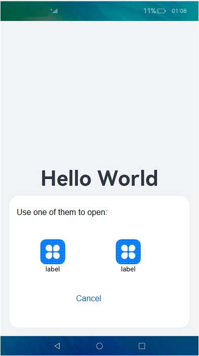

# Using Implicit Want to Open a Website

This section uses the operation of using a browser to open a website as an example. It is assumed that one or more browser applications are installed on the device. To ensure that the browser application can work properly, configure the [module.json5 file](../quick-start/module-configuration-file.md) as follows:

```json
{
  "module": {
    "abilities": [
      {
        // Entry configuration
        "skills": [
          {
            "actions": [
              "action.system.home"
            ],
            "entities": [
              "entity.system.home"
            ]
          },
        // Browser configuration
          {
            "actions": [
              "ohos.want.action.viewData"
            ],
            "entities": [
              "entity.system.browsable"
            ],
            "uris": [{
                "scheme": "https",
                "host": "www.test.com",
                "port": "8080",
                "pathStartWith": "query"
              },
              {
                "scheme": "http"
              }
            ]
          }
        ]
      }
    ]
  }
}
```

In the initiator UIAbility, use implicit Want to start the browser application.

```ts
import common from '@ohos.app.ability.common';
import Want from '@ohos.app.ability.Want';
import { BusinessError } from '@ohos.base';

let context = getContext(this) as common.UIAbilityContext;
let wantInfo: Want = {
  // Uncomment the line below if you want to implicitly query data only in the specific bundle.
  // bundleName: 'com.example.myapplication',
  action: 'ohos.want.action.viewData',
  // entities can be omitted.
  entities: ['entity.system.browsable'],
  uri: 'https://www.test.com:8080/query/student'
}
context.startAbility(wantInfo).then(() => {
  // ...
}).catch((err: BusinessError) => {
  // ...
})
```

The matching process is as follows:

1. If **action** in the passed **want** parameter is specified and is included in **actions** under **skills** of the application component to match, the matching is successful.
2. If **entities** in the passed **want** parameter is specified and is included in **entities** under **skills** of the application component to match, the matching is successful.
3. If **uri** in the passed **want** parameter is included in **uris** under **skills** of the application component to match, which is concatenated into https://www.test.com:8080/query* (where * is a wildcard), the matching is successful.

If there are multiple matching applications, the system displays a dialog box for you to select one of them. The following figure shows an example. 

