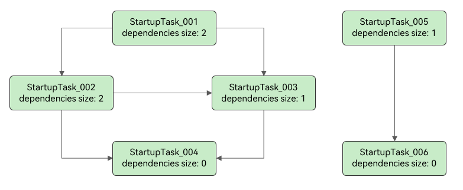

# AppStartup


## Overview

During application launch, a series of startup tasks are often required. If all these tasks are placed within the [onCreate](../reference/apis-ability-kit/js-apis-app-ability-uiAbility.md#uiabilityoncreate) lifecycle of the [UIAbility](../reference/apis-ability-kit/js-apis-app-ability-uiAbility.md) in the application's main module ([module](../quick-start/application-package-overview.md#module-types) of the entry type), they can only be executed sequentially on the main thread, which significantly affects the application launch speed. In addition, when there are too many tasks, complex dependencies between them make the code difficult to maintain.

AppStartup offers an efficient approach to application launch. By supporting asynchronous initiation of startup tasks, it ensures a smoother startup process. The centralized configuration of execution order and dependencies of multiple startup tasks in a single file simplifies and clarifies the startup codebase, enhancing maintainability.

## Working Mechanism

AppStartup supports startup tasks in automatic or manual mode. By default, automatic mode is used. During the creation of an [AbilityStage](../reference/apis-ability-kit/js-apis-app-ability-abilityStage.md), the configured startup tasks are loaded and executed in automatic mode. You can also call [startupManager.run](../reference/apis-ability-kit/js-apis-app-appstartup-startupManager.md#startupmanagerrun) to execute the startup tasks in manual mode after an AbilityStage is created.

**Figure 1** Startup procedure


## Supported Scope

- AppStartup is only triggered when the entry UIAbility is launched. It is not triggered when ExtensionAbility or non-entry UIAbility are launched.

- Starting from API version 18, AppStartup supports configuring startup tasks in [HSP](../quick-start/har-package.md) and [HAR](../quick-start/in-app-hsp.md) modules. However, startup tasks and .so file preloading tasks in the HSP and HAR modules cannot be explicitly set to automatic mode. They can be initiated by startup tasks and .so file preloading tasks of the entry module that are in automatic mode.

- Starting from API version 18, AppStartup supports the configuration of .so file preloading tasks. For details about how to develop .so files, refer to [Node-API](../napi/use-napi-process.md) to create a native C++ project.


## Constraints

- AppStartup must be enabled in the [module.json5 file](../quick-start/module-configuration-file.md) of the entry-type [module](../quick-start/application-package-overview.md#module-types) before being used.

- Circular dependencies between startup tasks or .so file preloading tasks are not allowed.


## Development Process

1. [Defining an AppStartup Configuration File](#defining-an-appstartup-configuration-file): Create an AppStartup configuration file in the resource file directory, add the configuration about startup tasks, and reference this configuration file in [module.json5](../quick-start/module-configuration-file.md).
2. [Setting Startup Parameters](#setting-startup-parameters): In the startup parameter file, set parameters such as the timeout interval and startup task listener.
3. [Adding a Startup Task for Each Component to Be Initialized](#adding-a-startup-task-for-each-component-to-be-initialized): Implement the [StartupTask](../reference/apis-ability-kit/js-apis-app-appstartup-startupTask.md) interface.

## How to Develop

### Defining an AppStartup Configuration File

1. Create an AppStartup configuration file in the **resources/base/profile** directory of the application's main module ([module](../quick-start/application-package-overview.md#module-types) of the entry type). The file name can be customized. The following uses **startup_config.json** as an example.

2. In the **startup_config.json** file, add the configuration for each startup task and .so file preloading task in sequence.

    It is assumed that the application has six startup tasks and six .so file preloading tasks. The dependencies between the tasks are shown in the figure below. To facilitate concurrent execution of startup tasks, a startup task file should contain only one startup task. In this example, each startup task corresponds to a startup task file. You are not advised to run code logic in the loading callback of .so files, as prolonged .so file loading can adversely affect the main thread's operation.

    **Figure 2** Dependencies between the startup tasks and .so file preloading tasks 
    
     
    
    1. In the **ets/startup** directory, create six startup task files and a common startup parameter file. The file names must be unique.
    
        1. Create six startup task files. In this example, the six files are named from **StartupTask_001.ets** to **StartupTask_006.ets**.
        2. Create.so files by referring to [Node-API](../napi/use-napi-process.md). In this example, the six files are named from **libentry_001.so** to **libentry_006.so**.
        3. Create a startup parameter file. In this example, the file name is **StartupConfig.ets**.
        
    2. Add the information about the startup task files and startup parameter file to the **startup_config.json** file.
    
        The following is an example of the **startup_config.json** file of the application's main module:
        
        ```json
        {
          "startupTasks": [
            {
              "name": "StartupTask_001",
              "srcEntry": "./ets/startup/StartupTask_001.ets",
              "dependencies": [
                "StartupTask_002",
                "StartupTask_003"
              ],
              "runOnThread": "taskPool",
              "waitOnMainThread": false
            },
            {
              "name": "StartupTask_002",
              "srcEntry": "./ets/startup/StartupTask_002.ets",
              "dependencies": [
                "StartupTask_003",
                "StartupTask_004"
              ],
              "runOnThread": "taskPool",
              "waitOnMainThread": false
            },
            {
              "name": "StartupTask_003",
              "srcEntry": "./ets/startup/StartupTask_003.ets",
              "dependencies": [
                "StartupTask_004"
              ],
              "runOnThread": "taskPool",
              "waitOnMainThread": false
            },
            {
              "name": "StartupTask_004",
              "srcEntry": "./ets/startup/StartupTask_004.ets",
              "runOnThread": "taskPool",
              "waitOnMainThread": false
            },
            {
              "name": "StartupTask_005",
              "srcEntry": "./ets/startup/StartupTask_005.ets",
              "dependencies": [
                "StartupTask_006"
              ],
              "runOnThread": "mainThread",
              "waitOnMainThread": true,
              "excludeFromAutoStart": true
            },
            {
              "name": "StartupTask_006",
              "srcEntry": "./ets/startup/StartupTask_006.ets",
              "runOnThread": "mainThread",
              "waitOnMainThread": false,
              "excludeFromAutoStart": true
            }
          ],
          "appPreloadHintStartupTasks": [
            {
              "name": "libentry_001",
              "srcEntry": "libentry_001.so",
              "dependencies": [
                "libentry_002",
                "libentry_003"
              ],
              "runOnThread": "taskPool"
            },
            {
              "name": "libentry_002",
              "srcEntry": "libentry_002.so",
              "dependencies": [
                "libentry_003",
                "libentry_004"
              ],
              "runOnThread": "taskPool"
            },
            {
              "name": "libentry_003",
              "srcEntry": "libentry_003.so",
              "dependencies": [
                "libentry_004"
              ],
              "runOnThread": "taskPool"
            },
            {
              "name": "libentry_004",
              "srcEntry": "libentry_004.so",
              "runOnThread": "taskPool"
            },
            {
              "name": "libentry_005",
              "srcEntry": "libentry_005.so",
              "dependencies": [
                "libentry_006"
              ],
              "runOnThread": "taskPool",
              "excludeFromAutoStart": true
            },
            {
              "name": "libentry_006",
              "srcEntry": "libentry_006.so",
              "runOnThread": "taskPool",
              "excludeFromAutoStart": true
            }
          ],
          "configEntry": "./ets/startup/StartupConfig.ets"
        }
        ```
        
    
        **Table 1** Fields in the startup_config.json file

        | Field| Description| Data Type| Optional|
        | -------- | -------- | -------- | -------- |
        | startupTasks | Configuration about the startup tasks. For details, see the following table.| Object array| Optional, defaults to an empty array|
        | appPreloadHintStartupTasks | Configuration about the .so file preloading tasks. For details, see the following table.| Object array| Optional, defaults to an empty array|
        | configEntry | Path of the startup parameter file.<br>**NOTE**<br> Do not configure this field for the HSP and HAR.| String| Mandatory|
        
        
        **Table 2** Description of startupTasks

        | Field| Description| Data Type| Optional|
        | -------- | -------- | -------- | -------- |
        | name | Name of the startup task, which can be customized. It is recommended that the name be the same as the class name.| String| Mandatory|
        | srcEntry | Path of the file corresponding to the startup task.| String| Mandatory|
        | dependencies | Array holding the class names of other startup tasks on which this task depends.| Object array| Optional, defaults to an empty array|
        | excludeFromAutoStart | Whether to exclude automatic mode. For details, see [Changing the Startup Mode](#optional-changing-the-startup-mode).<br>- **true**: manual mode.<br>- **false**: automatic mode.<br>**NOTE**<br> This field must be set to **true** for the HSP and HAR.| Boolean| Optional, defaults to **false**|
        | runOnThread | Thread where the startup task is executed.<br>- **mainThread**: executed in the main thread.<br>- **taskPool**: executed in an asynchronous thread.| String| Optional, defaults to **mainThread**|
        | waitOnMainThread | Whether the main thread needs to wait until the startup task finishes execution. This parameter is valid only when **runOnThread** is set to **taskPool**.<br>- **true**: The main thread loads the application home page only the startup task finishes execution.<br>- **false**: The main thread does not wait for the startup task to finish execution.| Boolean| Optional, defaults to **true**|
        
        **Table 3** appPreloadHintStartupTasks

        | Field| Description| Data Type| Optional|
        | -------- | -------- | -------- | -------- |
        | name | Name of the .so file to preload.| String| Mandatory|
        | srcEntry | File name of the .so file, including the extension.| String| Mandatory|
        | dependencies | Array holding the .so file names of other preloading tasks on which this task depends.| Object array| Optional, defaults to an empty array|
        | excludeFromAutoStart | Whether to exclude automatic mode. For details, see [Changing the Startup Mode](#optional-changing-the-startup-mode).<br>- **true**: manual mode.<br>- **false**: automatic mode.<br>**NOTE**<br> This field must be set to **true** for the HSP and HAR.| Boolean| Optional, defaults to **false**|
        | runOnThread | Thread where preloading is performed.<br>- **taskPool**: executed in an asynchronous thread.<br>**NOTE**<br> Preloading of .so files can be executed only in TaskPool threads.| String| Mandatory|
        

3. Add the index of the AppStartup configuration file to the **appStartup** tag in the [module.json5 file](../quick-start/module-configuration-file.md).

    The following is an example of the **module.json5** file:

    ```json
    {
    "module": {
    "name": "entry",
    "type": "entry",
    // ...
    "appStartup": "$profile:startup_config," // AppStartup configuration file
    // ...
    }
    }
    ```

### Setting Startup Parameters

In the startup parameter file (**ets/startup/StartupConfig.ets** in this example), call [StartupConfigEntry](../reference/apis-ability-kit/js-apis-app-appstartup-startupConfigEntry.md) to set the common AppStartup parameters, including the timeout interval and listener.

- [StartupConfig](../reference/apis-ability-kit/js-apis-app-appstartup-startupConfig.md): sets the task timeout interval and AppStartup listener.
- [StartupListener](../reference/apis-ability-kit/js-apis-app-appstartup-startupListener.md): listens for the execution result of the startup task.

```ts
import { StartupConfig, StartupConfigEntry, StartupListener } from '@kit.AbilityKit';
import { hilog } from '@kit.PerformanceAnalysisKit';
import { BusinessError } from '@kit.BasicServicesKit';

export default class MyStartupConfigEntry extends StartupConfigEntry {
  onConfig() {
    hilog.info(0x0000, 'testTag', `onConfig`);
    let onCompletedCallback = (error: BusinessError<void>) => {
      hilog.info(0x0000, 'testTag', `onCompletedCallback`);
      if (error) {
        hilog.info(0x0000, 'testTag', 'onCompletedCallback: %{public}d, message: %{public}s', error.code, error.message);
      } else {
        hilog.info(0x0000, 'testTag', `onCompletedCallback: success.`);
      }
    };
    let startupListener: StartupListener = {
      'onCompleted': onCompletedCallback
    };
    let config: StartupConfig = {
      'timeoutMs': 10000,
      'startupListener': startupListener
    };
    return config;
  }
}
```

### Adding a Startup Task for Each Component to Be Initialized

Through the preceding operations, you have configured the AppStartup configuration file and startup parameters. Now you need to implement [StartupTask](../reference/apis-ability-kit/js-apis-app-appstartup-startupTask.md) in each startup task file by calling the following two APIs:

- [init](../reference/apis-ability-kit/js-apis-app-appstartup-startupTask.md#startuptaskinit): starts task initialization. Call **init** to initialize a task only after all startup tasks on which the task depends are executed, that is, after **onDependencyCompleted** is invoked.
- [onDependencyCompleted](../reference/apis-ability-kit/js-apis-app-appstartup-startupTask.md#startuptaskondependencycompleted): invoked when the startup task on which the current task depends is complete.


The following uses the **StartupTask_001.ets** file in [startup_config.json](#defining-an-appstartup-configuration-file) as an example. You must add a startup task for each component to be initialized.

> **NOTE**
> 
> **StartupTask** follows the [Sendable protocol](../arkts-utils/arkts-sendable.md#sendable-protocol). Therefore, the Sendable annotation must be added when this API is inherited.

```ts
import { StartupTask, common } from '@kit.AbilityKit';
import { hilog } from '@kit.PerformanceAnalysisKit';

@Sendable
export default class StartupTask_001 extends StartupTask {
  constructor() {
    super();
  }

  async init(context: common.AbilityStageContext) {
    hilog.info(0x0000, 'testTag', 'StartupTask_001 init.');
    return 'StartupTask_001';
  }

  onDependencyCompleted(dependence: string, result: Object): void {
    hilog.info(0x0000, 'testTag', 'StartupTask_001 onDependencyCompleted, dependence: %{public}s, result: %{public}s',
      dependence, JSON.stringify(result));
  }
}
```

 ### (Optional) Using AppStartup in the HSP and HAR

 Large applications often consist of multiple [HSP](../quick-start/har-package.md) and [HAR](../quick-start/in-app-hsp.md) modules. This section provides an example to demonstrate how to use AppStartup in HSP and HAR packages. This example application includes two HSP packages (hsp1, hsp2) and one HAR package (har1), with startup tasks and .so file preloading tasks.

 Perform the following steps:

  1. Create an AppStartup configuration file under the **resources/base/profile** directory for each HSP and HAR, in addition to the main module. Different modules can use the same file name. The following uses **startup_config.json** as an example.
  
  2. Configure the **startup_config.json** file for each module.
     
        The table below lists the startup tasks and .so file preloading tasks available for the application.
        
        **Table 4** Startup tasks and .so file preloading tasks
        | Module| Startup Task| Preloading Task|
        | ------- | -------------------------------- | -------------------------------- |
        | entry | HAP_Task_01 | libentry_01 |
        | hsp1 | HSP1_Task_01 <br> HSP1_Task_02 | libhsp1_01 <br> libhsp1_02 |
        | hsp2 | HSP2_Task_01 | libhsp2_01 |
        | har | HAR1_Task_01 | libhar1_01 |
        
        **Figure 3** Dependencies between the startup tasks and .so file preloading tasks

         
        
        For details about the **startup_config.json** file of the entry module, see [Defining an AppStartup Configuration File](#defining-an-appstartup-configuration-file). For the HSP and HAR, do not configure the **configEntry** field in the **startup_config.json** file. The following uses the configuration file of **hsp1** as an example:
        
        ```json
        {
          "startupTasks": [
            {
              "name": "HSP1_Task_01",
              "srcEntry": "./ets/startup/HSP1_Task_01.ets",
              "dependencies": [
                "HSP1_Task_02",
                "HAR1_Task_01"
              ],
              "runOnThread": "taskPool",
              "waitOnMainThread": false,
              "excludeFromAutoStart": true
            }
          ],
          "appPreloadHintStartupTasks": [
            {
              "name": "libhsp1_01",
              "srcEntry": "libhsp1_01.so",
              "dependencies": [
                "libhsp1_02",
                "libhar1_01"
              ],
              "runOnThread": "taskPool",
              "excludeFromAutoStart": true
            }
          ]
        }
        ```

  3. Add the index of the AppStartup configuration file to the **appStartup** tag in the [module.json5 file](../quick-start/module-configuration-file.md) of each module.

        The following are examples of **module.json5** for **hsp1**, **hsp2**, and **har1**:

        ```json
        {
          "module": {
            "name": "hsp1",
            "type": "shared",
            // ...
            "appStartup": "$profile:startup_config," // AppStartup configuration file
            // ...
          }
        }
        ```
        ```json
        {
          "module": {
            "name": "hsp2",
            "type": "shared",
            // ...
            "appStartup": "$profile:startup_config," // AppStartup configuration file
            // ...
          }
        }
        ```
        ```json
        {
          "module": {
            "name": "har1",
            "type": "har",
            // ...
            "appStartup": "$profile:startup_config," // AppStartup configuration file
            // ...
          }
        }
        ```

  For details about other steps, see [Setting Startup Parameters](#setting-startup-parameters) and [Adding a Startup Task for Each Component to Be Initialized](#adding-a-startup-task-for-each-component-to-be-initialized).


### (Optional) Changing the Startup Mode

AppStartup provides two modes for executing startup tasks: automatic and manual. The entry module defaults to automatic mode, but you can change it to manual mode if needed. The HSP and HAR support the configuration of manual mode only.

- Automatic mode: After an AbilityStage is created, startup tasks are automatically executed.
- Manual mode: After a UIAbility is created, you need to manually call the API to execute the startup tasks and .so file preloading tasks. Modules that are infrequently used do not need to be initialized when the application is launched. You can change the startup mode of these modules to manual. After the application finishes launching, you can call [startupManager.run](../reference/apis-ability-kit/js-apis-app-appstartup-startupManager.md#startupmanagerrun) to execute the startup tasks and .so file preloading tasks.

The following uses the **onCreate** lifecycle of the UIAbility as an example to describe how to manually trigger a startup task. The sample code is as follows:

```ts
import { AbilityConstant, UIAbility, Want, startupManager } from '@kit.AbilityKit';
import { hilog } from '@kit.PerformanceAnalysisKit';
import { BusinessError } from '@kit.BasicServicesKit';

export default class EntryAbility extends UIAbility {
  onCreate(want: Want, launchParam: AbilityConstant.LaunchParam): void {
    hilog.info(0x0000, 'testTag', '%{public}s', 'Ability onCreate');
    let startParams = ["StartupTask_005", "StartupTask_006"];
    try {
      startupManager.run(startParams).then(() => {
        console.log('StartupTest startupManager run then, startParams = ');
      }).catch((error: BusinessError) => {
        console.info('StartupTest promise catch error, error = ' + JSON.stringify(error));
        console.info('StartupTest promise catch error, startParams = '
          + JSON.stringify(startParams));
      })
    } catch (error) {
      let errMsg = JSON.stringify(error);
      let errCode: number = error.code;
      console.log('Startup catch error , errCode= ' + errCode);
      console.log('Startup catch error ,error= ' + errMsg);
    }
  }

  // ...
}
```

You can also call the API to trigger the manual mode after a page is loaded. The sample code is as follows:

```ts
import { startupManager } from '@kit.AbilityKit';

@Entry
@Component
struct Index {
  @State message: string = "Manual Mode";
  @State startParams1: Array<string> = ["StartupTask_006"];
  @State startParams2: Array<string> = ["libentry_006"];

  build() {
    RelativeContainer() {
      Button(this.message)
        .id('AppStartup')
        .fontSize(20)
        .fontWeight(FontWeight.Bold)
        .onClick(() => {
          if (!startupManager.isStartupTaskInitialized("StartupTask_006") ) { // Check whether the startup task finishes execution.
            startupManager.run(this.startParams1)
          }
          if (!startupManager.isStartupTaskInitialized("libentry_006") ) {
            startupManager.run(this.startParams2)
          }
        })
        .alignRules({
          center: {anchor: '__container__', align: VerticalAlign.Center},
          middle: {anchor: '__container__', align: HorizontalAlign.Center}
        })
    }
    .height('100%')
    .width('100%')
  }
}
```
