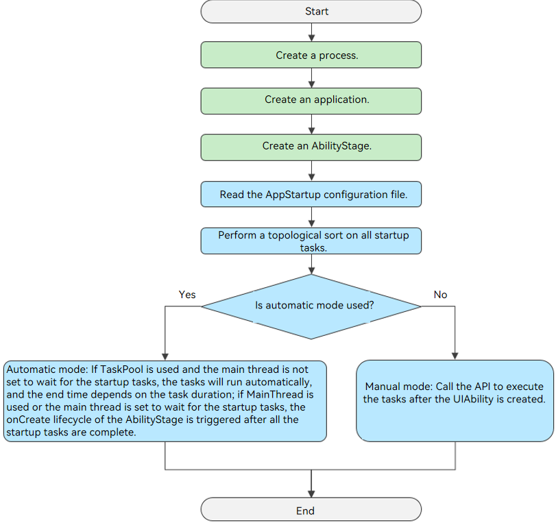
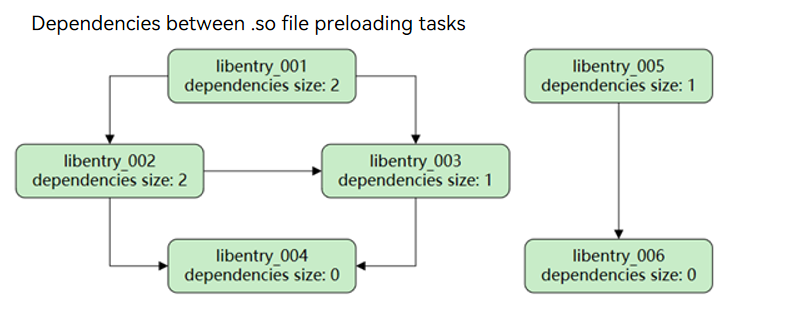
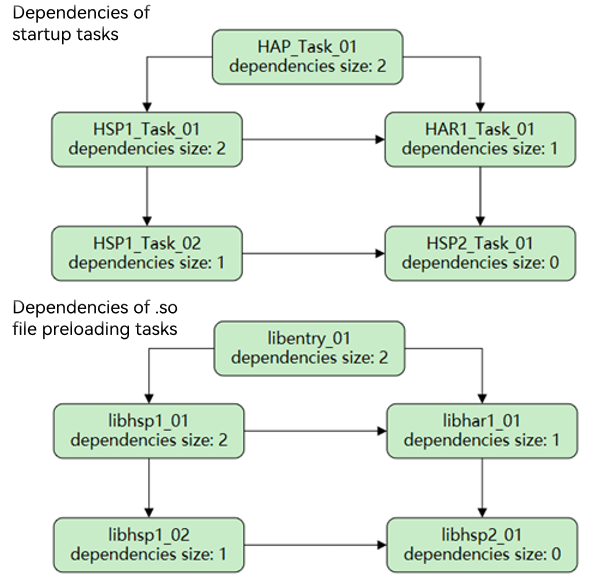

# AppStartup
<!--Kit: Ability Kit-->
<!--Subsystem: Ability-->
<!--Owner: @yzkp-->
<!--Designer: @yzkp-->
<!--Tester: @lixueqing513-->
<!--Adviser: @huipeizi-->

## Overview

During application launch, a series of startup tasks are often required. If all these tasks are placed within the [onCreate](../reference/apis-ability-kit/js-apis-app-ability-uiAbility.md#oncreate) lifecycle of the [UIAbility](../reference/apis-ability-kit/js-apis-app-ability-uiAbility.md) in the [HAP](../quick-start/hap-package.md), they can only be executed sequentially on the main thread, which significantly affects the application launch speed. In addition, when there are too many tasks, complex dependencies between them make the code difficult to maintain.

AppStartup offers an efficient approach to application launch. By supporting asynchronous initiation of startup tasks, it ensures a smoother startup process. The centralized configuration of execution order and dependencies of multiple startup tasks in a single file simplifies and clarifies the startup codebase, enhancing maintainability.

## Working Mechanism

AppStartup supports startup tasks in automatic or manual mode. By default, automatic mode is used. During the creation of an [AbilityStage](ability-terminology.md#abilitystage), the configured startup tasks are loaded and executed in automatic mode. You can also call [startupManager.run](../reference/apis-ability-kit/js-apis-app-appstartup-startupManager.md#startupmanagerrun) to execute the startup tasks in manual mode after an AbilityStage is created.

**Figure 1** Startup procedure




## Supported Scope

- An entry-type HAP can be started in automatic or manual mode. Starting from API version 20, a feature-type HAP can be started in automatic or manual mode.

- Starting from API version 18, startup tasks can be configured in the [HSP](../quick-start/in-app-hsp.md) and [HAR](../quick-start/har-package.md). However, startup tasks and .so file preloading tasks in the HSP and HAR cannot be set to automatic mode. Instead, they can be initiated by the automatic startup tasks and .so file preloading tasks in the HAP.

- Starting from API version 18, AppStartup supports the configuration of .so file preloading tasks. For details about how to develop .so files, refer to [Node-API](../napi/use-napi-process.md) to create a native C++ project.


## Constraints

- AppStartup must be enabled in the [module.json5](../quick-start/module-configuration-file.md) file of the [HAP](../quick-start/hap-package.md).

- Given that the ExtensionAbility have a single launch scenario and using AppStartup will add unnecessary overhead, it is not supported to trigger AppStartup when starting the ExtensionAbility.

- Circular dependencies between startup tasks or .so file preloading tasks are not allowed.


## Development Process

1. [Defining an AppStartup Configuration File](#defining-an-appstartup-configuration-file): Create and define an AppStartup configuration file in the resource file directory.
   1. [Creating an AppStartup Configuration File](#creating-an-appstartup-configuration-file): Create an AppStartup configuration file in the resource file directory, and reference this configuration file in [module.json5](../quick-start/module-configuration-file.md).
   2. [Defining Startup Parameter Configuration](#defining-startup-parameter-configuration): Add startup parameter configuration information to the AppStartup configuration file.
   3. [Defining Startup Task Configuration](#defining-startup-task-configuration): Add startup task configuration information to the AppStartup configuration file.
   4. [Defining .so File Preloading Task Configuration](#defining-so-file-preloading-task-configuration): Add configuration information of .so file preloading tasks to the AppStartup configuration file.

2. [Setting Startup Parameters](#setting-startup-parameters): In the startup parameter file, set parameters such as the timeout interval and startup task listener.
3. [Adding a Startup Task for Each Component to Be Initialized](#adding-a-startup-task-for-each-component-to-be-initialized): Implement the [StartupTask](../reference/apis-ability-kit/js-apis-app-appstartup-startupTask.md) interface.
4. [Optional Operations](optional-operations): You can finely control the behavior of AppStartup in complex scenarios.
   - [Using AppStartup in the HSP and HAR](#using-appstartup-in-the-hsp-and-har): Configure startup tasks and .so file preloading tasks in the HSP and HAR to manage dependencies across modules, making large applications start faster and be easier to maintain.
   - [Changing Startup Mode](#changing-startup-mode): Switch the startup task and .so file preloading task to manual mode to decide exactly when they run, cutting down on startup time.
   - [Adding Task Matching Rules](#adding-task-matching-rules): Use rules to filter which tasks run, ensuring only relevant tasks load based on the situation.


## Defining an AppStartup Configuration File

### Creating an AppStartup Configuration File

1. Create an AppStartup configuration file in **resources/base/profile** of the [HAP](../quick-start/hap-package.md). The file name can be customized. The following uses **startup_config.json** as an example.

2. Add the index of the AppStartup configuration file to the **appStartup** tag in the [module.json5 file](../quick-start/module-configuration-file.md).

   The following is an example of the **module.json5** file:

   ```json
   {
     "module": {
       "name": "entry",
       "type": "entry",
       // ...
       "appStartup": "$profile:startup_config," // AppStartup configuration file
       // ...
     }
   }
   ```

### Defining Startup Parameter Configuration

In the **startup_config.json** file, add the configuration for the startup parameters.

1. Create the startup parameter configuration file in the **ets/startup** directory. In this example, the file name is **StartupConfig.ets**.
2. Add the information about the startup parameter configuration file to the **startup_config.json** file.

   The following is an example of the **startup_config.json** file:

   ```json
   {
     "startupTasks": [
       // A startup task.
     ],
     "appPreloadHintStartupTasks": [
       // A .so file preloading task.
     ],
     "configEntry": "./ets/startup/StartupConfig.ets" // Startup parameter configuration.
   }
   ```

**Table 1** Fields in the startup_config.json file

| Field| Description| Data Type| Optional|
| -------- | -------- | -------- | -------- |
| startupTasks | Configuration information about a startup task. For details, see [Defining Startup Task Configuration](#defining-startup-task-configuration).| Object array| Optional, defaults to an empty array|
| appPreloadHintStartupTasks | Configuration information about a .so file preloading task configuration. For details, see [Defining .so File Preloading Task Configuration](#defining-so-file-preloading-task-configuration).| Object array| Optional, defaults to an empty array|
| configEntry | Path of the startup parameter file. For details, see [Setting Startup Parameters](#setting-startup-parameters).<br>**NOTE**<br>- Do not configure this field for the HSP and HAR.<br>- If [file name obfuscation](../arkts-utils/source-obfuscation.md#-enable-filename-obfuscation) is enabled, the file path must be added to the trustlist. For details, see [-keep-file-name](../arkts-utils/source-obfuscation.md#-keep-file-name).| String| Mandatory|

### Defining Startup Task Configuration

It is assumed that the application has six startup tasks. The dependencies between the tasks are shown in the figure below. To facilitate concurrent execution of startup tasks, a startup task file should contain only one startup task. In this example, each startup task corresponds to a startup task file.

**Figure 2** Dependencies between startup tasks


1. Create six startup task files in the **ets/startup** directory. The file names must be unique. In this example, the six files are named from **StartupTask_001.ets** to **StartupTask_006.ets**.
2. Add the startup task configuration information to the **startup_config.json** file.

   The following is an example of the **startup_config.json** file:

   ```json
   {
     "startupTasks": [
       {
         "name": "StartupTask_001",
         "srcEntry": "./ets/startup/StartupTask_001.ets",
         "dependencies": [
           "StartupTask_002",
           "StartupTask_003"
         ],
         "runOnThread": "taskPool",
         "waitOnMainThread": false
       },
       {
         "name": "StartupTask_002",
         "srcEntry": "./ets/startup/StartupTask_002.ets",
         "dependencies": [
           "StartupTask_003",
           "StartupTask_004"
         ],
         "runOnThread": "taskPool",
         "waitOnMainThread": false
       },
       {
         "name": "StartupTask_003",
         "srcEntry": "./ets/startup/StartupTask_003.ets",
         "dependencies": [
           "StartupTask_004"
         ],
         "runOnThread": "taskPool",
         "waitOnMainThread": false
       },
       {
         "name": "StartupTask_004",
         "srcEntry": "./ets/startup/StartupTask_004.ets",
         "runOnThread": "taskPool",
         "waitOnMainThread": false
       },
       {
         "name": "StartupTask_005",
         "srcEntry": "./ets/startup/StartupTask_005.ets",
         "dependencies": [
           "StartupTask_006"
         ],
         "runOnThread": "mainThread",
         "waitOnMainThread": true,
         "excludeFromAutoStart": true
       },
       {
         "name": "StartupTask_006",
         "srcEntry": "./ets/startup/StartupTask_006.ets",
         "runOnThread": "mainThread",
         "waitOnMainThread": false,
         "excludeFromAutoStart": true
       }
     ],
     "appPreloadHintStartupTasks": [
       // A .so file preloading file.
     ],
     "configEntry": "./ets/startup/StartupConfig.ets"
   }
   ```

**Table 2** Description of startupTasks

| Field| Description| Data Type| Optional|
| -------- | -------- | -------- | -------- |
| name | Name of the startup task, which can be customized. It is recommended that the name be the same as the class name.| String| Mandatory|
| srcEntry | Path of the file corresponding to the startup task.<br>**NOTE**<br> If [file name obfuscation](../arkts-utils/source-obfuscation.md#-enable-filename-obfuscation) is enabled, the file path must be added to the trustlist. For details, see [-keep-file-name](../arkts-utils/source-obfuscation.md#-keep-file-name).| String| Mandatory|
| dependencies | Array holding the class names of other startup tasks on which this task depends.| Object array| Optional, defaults to an empty array|
| excludeFromAutoStart | Whether to exclude automatic mode. For details, see [Changing Startup Mode](#changing-startup-mode).<br>- **true**: manual mode.<br>- **false**: automatic mode.<br>**NOTE**<br> This field must be set to **true** for the HSP and HAR.| Boolean| Optional, defaults to **false**|
| runOnThread | Thread where the startup task is executed.<br>- **mainThread**: executed in the main thread.<br>- **taskPool**: executed in an asynchronous thread.| String| Optional, defaults to **mainThread**|
| waitOnMainThread | Whether the main thread needs to wait until the startup task finishes execution. This parameter is valid only when **runOnThread** is set to **taskPool**.<br>- **true**: The main thread loads the application home page only the startup task finishes execution.<br>- **false**: The main thread does not wait for the startup task to finish execution.| Boolean| Optional, defaults to **true**|
| matchRules | Used to filter startup tasks that should be initiated in automatic mode to expedite the application launch process. It is ideal for scenarios where you need to quickly pull up a particular page, such as transitions triggered by home screen widgets, notifications, or intent calls, to provide a seamless one-step experience for accessing functional services. For details, see [Adding Task Matching Rules](#adding-task-matching-rules).<br>**NOTE**<br>- This field is supported since API version 20 and can be configured only in HAPs.<br>- This field takes precedence over **excludeFromAutoStart**. If none of the startup tasks match, the tasks are processed according to their **excludeFromAutoStart** settings.| Object| Optional|

### Defining .so File Preloading Task Configuration

It is assumed that AppStartup has six .so file preloading tasks. The dependencies between the tasks are shown in the figure below. You are not advised to run code logic in the loading callback of .so files, as prolonged .so file loading can adversely affect the main thread's operation.

**Figure 3** Dependencies between .so file preloading tasks



1. Create.so files by referring to [Node-API](../napi/use-napi-process.md). In this example, the six files are named from **libentry_001.so** to **libentry_006.so**.
2. Add the configuration information of the .so file preloading tasks to the **startup_config.json** file.

   The following is an example of the **startup_config.json** file:

   ```json
   {
     "startupTasks": [
       // A startup task.
     ],
     "appPreloadHintStartupTasks": [
       {
         "name": "libentry_001",
         "srcEntry": "libentry_001.so",
         "dependencies": [
           "libentry_002",
           "libentry_003"
         ],
         "runOnThread": "taskPool"
       },
       {
         "name": "libentry_002",
         "srcEntry": "libentry_002.so",
         "dependencies": [
           "libentry_003",
           "libentry_004"
         ],
         "runOnThread": "taskPool"
       },
       {
         "name": "libentry_003",
         "srcEntry": "libentry_003.so",
         "dependencies": [
           "libentry_004"
         ],
         "runOnThread": "taskPool"
       },
       {
         "name": "libentry_004",
         "srcEntry": "libentry_004.so",
         "runOnThread": "taskPool"
       },
       {
         "name": "libentry_005",
         "srcEntry": "libentry_005.so",
         "dependencies": [
           "libentry_006"
         ],
         "runOnThread": "taskPool",
         "excludeFromAutoStart": true
       },
       {
         "name": "libentry_006",
         "srcEntry": "libentry_006.so",
         "runOnThread": "taskPool",
         "excludeFromAutoStart": true
       }
     ],
     "configEntry": "./ets/startup/StartupConfig.ets"
   }
   ```

**Table 3** appPreloadHintStartupTasks

| Field| Description| Data Type| Optional|
| -------- | -------- | -------- | -------- |
| name | Name of the .so file to preload.| String| Mandatory|
| srcEntry | File name of the .so file, including the extension.| String| Mandatory|
| dependencies | Array holding the .so file names of other preloading tasks on which this task depends.| Object array| Optional, defaults to an empty array|
| excludeFromAutoStart | Whether to exclude automatic mode. For details, see [Changing Startup Mode](#changing-startup-mode).<br>- **true**: manual mode.<br>- **false**: automatic mode.<br>**NOTE**<br> This field must be set to **true** for the HSP and HAR.| Boolean| Optional, defaults to **false**|
| runOnThread | Thread where preloading is performed.<br>- **taskPool**: executed in an asynchronous thread.<br>**NOTE**<br> Preloading of .so files can be executed only in TaskPool threads.| String| Mandatory|
| matchRules | Used to filter the .so file preloading tasks that should be initiated in automatic mode to expedite the application launch process. It is ideal for scenarios where you need to quickly pull up a particular page, such as transitions triggered by home screen widgets, notifications, or intent calls, to provide a seamless one-step experience for accessing functional services. For details, see [Adding Task Matching Rules](#adding-task-matching-rules).<br>**NOTE**<br>- This field is supported since API version 20 and can be configured only in HAPs.<br>- The priority of this field is higher than that of **excludeFromAutoStart**. If none of the .so file preloading tasks match, the tasks are processed according to their **excludeFromAutoStart** settings.| Object| Optional|

## Setting Startup Parameters

In the startup parameter file (**ets/startup/StartupConfig.ets** in this example), call [StartupConfigEntry](../reference/apis-ability-kit/js-apis-app-appstartup-startupConfigEntry.md) to set the common AppStartup parameters, including the timeout interval and listener.

- [StartupConfig](../reference/apis-ability-kit/js-apis-app-appstartup-startupConfig.md): sets the task timeout interval and AppStartup listener.
- [StartupListener](../reference/apis-ability-kit/js-apis-app-appstartup-startupListener.md): listens for the execution result of the startup task.

```ts
import { StartupConfig, StartupConfigEntry, StartupListener } from '@kit.AbilityKit';
import { hilog } from '@kit.PerformanceAnalysisKit';
import { BusinessError } from '@kit.BasicServicesKit';

export default class MyStartupConfigEntry extends StartupConfigEntry {
  onConfig() {
    hilog.info(0x0000, 'testTag', `onConfig`);
    let onCompletedCallback = (error: BusinessError<void>) => {
      hilog.info(0x0000, 'testTag', `onCompletedCallback`);
      if (error) {
        hilog.error(0x0000, 'testTag', 'onCompletedCallback: %{public}d, message: %{public}s', error.code, error.message);
      } else {
        hilog.info(0x0000, 'testTag', `onCompletedCallback: success.`);
      }
    };
    let startupListener: StartupListener = {
      'onCompleted': onCompletedCallback
    };
    let config: StartupConfig = {
      'timeoutMs': 10000,
      'startupListener': startupListener
    };
    return config;
  }
}
```


## Adding a Startup Task for Each Component to Be Initialized

Through the preceding operations, you have configured the AppStartup configuration file and startup parameters. Now you need to implement [StartupTask](../reference/apis-ability-kit/js-apis-app-appstartup-startupTask.md) in each startup task file by calling the following two APIs:

- [init](../reference/apis-ability-kit/js-apis-app-appstartup-startupTask.md#init): starts task initialization. Call **init** to initialize a task only after all startup tasks on which the task depends are executed, that is, after **onDependencyCompleted** is invoked.
- [onDependencyCompleted](../reference/apis-ability-kit/js-apis-app-appstartup-startupTask.md#ondependencycompleted): invoked when the startup task on which the current task depends is complete.


The following uses the **StartupTask_001.ets** file in [startup_config.json](#defining-startup-task-configuration) as an example. You must add a startup task for each component to be initialized.

> **NOTE**
> 
> **StartupTask** follows the [Sendable protocol](../arkts-utils/arkts-sendable.md#sendable-protocol). Therefore, the Sendable annotation must be added when this API is inherited.

```ts
import { StartupTask, common } from '@kit.AbilityKit';
import { hilog } from '@kit.PerformanceAnalysisKit';

@Sendable
export default class StartupTask_001 extends StartupTask {
  constructor() {
    super();
  }

  async init(context: common.AbilityStageContext) {
    hilog.info(0x0000, 'testTag', 'StartupTask_001 init.');
    return 'StartupTask_001';
  }

  onDependencyCompleted(dependence: string, result: Object): void {
    hilog.info(0x0000, 'testTag', 'StartupTask_001 onDependencyCompleted, dependence: %{public}s, result: %{public}s',
      dependence, JSON.stringify(result));
  }
}
```

## Optional Operations

 ### Using AppStartup in the HSP and HAR

 Large applications often consist of multiple [HSP](../quick-start/in-app-hsp.md) and [HAR](../quick-start/har-package.md) modules. This section provides an example to demonstrate how to use AppStartup in HSP and HAR packages. This example application includes two HSP packages (hsp1, hsp2) and one HAR package (har1), with startup tasks and .so file preloading tasks.

 Perform the following steps:

  1. Create an AppStartup configuration file under the **resources/base/profile** directory for each HSP and HAR, in addition to the [HAP](../quick-start/hap-package.md). Different modules can use the same file name. The following uses **startup_config.json** as an example.
  
  2. Configure the **startup_config.json** file for each module.
     
        The table below lists the startup tasks and .so file preloading tasks available for the application.
        
        **Table 4** Startup tasks and .so file preloading tasks
        | Module| Startup Task| .so File Preloading Task|
        | ------- | -------------------------------- | -------------------------------- |
        | entry | HAP_Task_01 | libentry_01 |
        | hsp1 | HSP1_Task_01 <br> HSP1_Task_02 | libhsp1_01 <br> libhsp1_02 |
        | hsp2 | HSP2_Task_01 | libhsp2_01 |
        | har | HAR1_Task_01 | libhar1_01 |
        
        **Figure 4** Dependencies between the startup tasks and .so file preloading tasks

        
  
        For details about the **startup_config.json** file of the [HAP](../quick-start/hap-package.md), see [Defining Startup Task Configuration](#defining-startup-task-configuration). For the HSP and HAR, do not configure the **configEntry** field in the **startup_config.json** file. The following uses the configuration file of **hsp1** as an example:
        
        ```json
        {
          "startupTasks": [
            {
              "name": "HSP1_Task_01",
              "srcEntry": "./ets/startup/HSP1_Task_01.ets",
              "dependencies": [
                "HSP1_Task_02",
                "HAR1_Task_01"
              ],
              "runOnThread": "taskPool",
              "waitOnMainThread": false,
              "excludeFromAutoStart": true
            }
          ],
          "appPreloadHintStartupTasks": [
            {
              "name": "libhsp1_01",
              "srcEntry": "libhsp1_01.so",
              "dependencies": [
                "libhsp1_02",
                "libhar1_01"
              ],
              "runOnThread": "taskPool",
              "excludeFromAutoStart": true
            }
          ]
        }
        ```

  3. Add the index of the AppStartup configuration file to the **appStartup** tag in the [module.json5 file](../quick-start/module-configuration-file.md) of each module.

        The following are examples of **module.json5** for **hsp1**, **hsp2**, and **har1**:

        ```json
        {
          "module": {
            "name": "hsp1",
            "type": "shared",
            // ...
            "appStartup": "$profile:startup_config," // AppStartup configuration file
            // ...
          }
        }
        ```
        ```json
        {
          "module": {
            "name": "hsp2",
            "type": "shared",
            // ...
            "appStartup": "$profile:startup_config," // AppStartup configuration file
            // ...
          }
        }
        ```
        ```json
        {
          "module": {
            "name": "har1",
            "type": "har",
            // ...
            "appStartup": "$profile:startup_config," // AppStartup configuration file
            // ...
          }
        }
        ```

For details about other steps, see [Setting Startup Parameters](#setting-startup-parameters) and [Adding a Startup Task for Each Component to Be Initialized](#adding-a-startup-task-for-each-component-to-be-initialized).


### Changing Startup Mode

AppStartup provides two modes for executing startup tasks: automatic and manual. The entry module defaults to automatic mode, but you can change it to manual mode if needed. The HSP and HAR support the configuration of manual mode only.

- Automatic mode: After an AbilityStage is created, startup tasks are automatically executed.
- Manual mode: After a UIAbility is created, you need to manually call the API to execute the startup tasks and .so file preloading tasks. Modules that are infrequently used do not need to be initialized when the application is launched. You can change the startup mode of these modules to manual. After the application finishes launching, you can call [startupManager.run](../reference/apis-ability-kit/js-apis-app-appstartup-startupManager.md#startupmanagerrun) to execute the startup tasks and .so file preloading tasks.

The following uses the **onCreate** lifecycle of the UIAbility as an example to describe how to manually trigger a startup task. The sample code is as follows:

```ts
import { AbilityConstant, UIAbility, Want, startupManager } from '@kit.AbilityKit';
import { hilog } from '@kit.PerformanceAnalysisKit';
import { BusinessError } from '@kit.BasicServicesKit';

export default class EntryAbility extends UIAbility {
  onCreate(want: Want, launchParam: AbilityConstant.LaunchParam): void {
    hilog.info(0x0000, 'testTag', '%{public}s', 'Ability onCreate');
    let startParams = ['StartupTask_005', 'StartupTask_006'];
    try {
      startupManager.run(startParams).then(() => {
        console.log(`StartupTest startupManager run then, startParams = ${JSON.stringify(startParams)}.`);
      }).catch((error: BusinessError) => {
        console.error(`StartupTest promise catch error, error = ${JSON.stringify(error)}.`);
        console.error(`StartupTest promise catch error, startParams = ${JSON.stringify(startParams)}.`);
      })
    } catch (error) {
      let errMsg = (error as BusinessError).message;
      let errCode = (error as BusinessError).code;
      console.error(`Startup catch error, errCode= ${errCode}.`);
      console.error(`Startup catch error, errMsg= ${errMsg}.`);
    }
  }

  // ...
}
```

You can also call the API to trigger the manual mode after a page is loaded. The sample code is as follows:

```ts
import { startupManager } from '@kit.AbilityKit';

@Entry
@Component
struct Index {
  @State message: string = "Manual Mode";
  @State startParams1: Array<string> = ["StartupTask_006"];
  @State startParams2: Array<string> = ["libentry_006"];

  build() {
    RelativeContainer() {
      Button(this.message)
        .id('AppStartup')
        .fontSize(20)
        .fontWeight(FontWeight.Bold)
        .onClick(() => {
          if (!startupManager.isStartupTaskInitialized("StartupTask_006") ) { // Check whether the startup task finishes execution.
            startupManager.run(this.startParams1)
          }
          if (!startupManager.isStartupTaskInitialized("libentry_006") ) {
            startupManager.run(this.startParams2)
          }
        })
        .alignRules({
          center: {anchor: '__container__', align: VerticalAlign.Center},
          middle: {anchor: '__container__', align: HorizontalAlign.Center}
        })
    }
    .height('100%')
    .width('100%')
  }
}
```

### Adding Task Matching Rules

To achieve a one-step direct experience for functional services when launching a specific page via methods such as widgets, notifications, or intent calls, you can use **matchRules** to load only the relevant startup tasks for the current scenario, instead of loading all default auto-start tasks. This approach enhances startup performance.

You can add match rules in either of the following ways:

* Using **uris**, **actions**, and **insightIntents** fields in **matchRules**: Match different startup tasks and .so file preloading tasks based on the URI, action, or intent name when the UIAbility is launched.
* Using **customization** in **matchRules**: If the above methods do not meet your needs, you can define custom matching rule.

  **Table 5** Description of matchRules fields

  | Field| Description| Data Type| Optional| Scenario|
  | -------- | -------- | -------- | -------- | -------- |
  | uris | Range of URIs for tasks executed in automatic mode. When the UIAbility is launched, **uri** in the [Want](../reference/apis-ability-kit/js-apis-app-ability-want.md) is matched against the configured **uris** array. The format is `scheme://host/path`, and other parts of the URI (such as port and fragment) are ignored.| String array| Optional, defaults to empty| The UIAbility is started through a specific URI.|
  | actions | Range of actions for tasks executed in automatic mode. When the UIAbility is launched, **action** in the [Want](../reference/apis-ability-kit/js-apis-app-ability-want.md) is matched against the configured **actions** array.| String array| Optional, defaults to empty| The UIAbility is started through a specific action.|
  | insightIntents | Range of intent names for tasks executed in automatic mode. When the UIAbility is launched, **intentName** is matched against the configured **insightIntents** array.| String array| Optional, defaults to empty| The UIAbility is started through a specific intent name.|
  | customization | Range of custom rules for tasks executed in automatic mode. Custom rules are returned by [onRequestCustomMatchRule](../reference/apis-ability-kit/js-apis-app-appstartup-startupConfigEntry.md#startupconfigentryonrequestcustommatchrule20) of StartupConfigEntry. When the UIAbility is started, the custom rule is matched against the configured **customization** array.<br>**NOTE**<br>Only tasks in **startupTasks** are supported.| String array| Optional, defaults to empty| If the **uris**, **actions**, and **insightIntents** fields do not meet your needs, you can use **customization** to customize rules.|

  > **NOTE**
  >
  > * If any of **uris**, **actions**, **insightIntents**, or **customization** match, the task is considered matched.
  > * If any task matches, the task and its dependent tasks will be executed in automatic mode.
  > * If all tasks fail to match, they are handled according to their **excludeFromAutoStart** configuration.

The following uses URI matching (similar to action and intent name matching) and customization matching as examples to describe how to add task matching rules to filter tasks.

**Scenario 1: URI Matching**

Suppose you want to automatically execute StartupTask_004 and libentry_006 tasks when a user taps a notification to jump to the notification details page. If **uri** in the Want when launching the notification details UIAbility is `test://com.example.startupdemo/notification`, you can match it via URI. Here is an example:

1. Modify the **startup_config.json** file in [Defining Startup Task Configuration](#defining-startup-task-configuration) to add **matchRules** for StartupTask_004 and libentry_006.

    ```json
    {
      "startupTasks": [
        {
          "name": "StartupTask_004",
          "srcEntry": "./ets/startup/StartupTask_004.ets",
          "runOnThread": "taskPool",
          "waitOnMainThread": false,
          "matchRules": {
            "uris": [
              "test://com.example.startupdemo/notification"
            ]
          }
        },
      ],
      "appPreloadHintStartupTasks": [
        {
          "name": "libentry_006",
          "srcEntry": "libentry_006.so",
          "runOnThread": "taskPool",
          "excludeFromAutoStart": true,
          "matchRules": {
            "uris": [
              "test://com.example.startupdemo/notification"
            ]
          }
        }
      ],
      "configEntry": "./ets/startup/StartupConfig.ets"
    }
    ```

**Scenario 2: Customization Matching**

Suppose you want to automatically execute StartupTask_006 and .so file preloading tasks with **excludeFromAutoStart=false** when a user taps a weather widget to jump to the weather screen. If the custom parameter **fromType** in the Want when launching the weather UIAbility is **card**, you can match it via customization. Here is an example:

  1. Modify the **MyStartupConfigEntry.ets** file in [Setting Startup Parameters](#setting-startup-parameters) and add [onRequestCustomMatchRule](../reference/apis-ability-kit/js-apis-app-appstartup-startupConfigEntry.md#startupconfigentryonrequestcustommatchrule20).

      ```ts
      import { StartupConfig, StartupConfigEntry, StartupListener, Want } from '@kit.AbilityKit';
      import { hilog } from '@kit.PerformanceAnalysisKit';
      import { BusinessError } from '@kit.BasicServicesKit';

      export default class MyStartupConfigEntry extends StartupConfigEntry {

        // onConfig ...

        onRequestCustomMatchRule(want: Want): string {
          if (want?.parameters?.fromType == 'card') {
            return 'ruleCard';
          }
          return '';
        }

      }
      ```

  2. Modify the **startup_config.json** file in [Defining Startup Task Configuration](#defining-startup-task-configuration) to add **matchRules** for StartupTask_006. The .so file preloading task does not support the **customization** field and is handled according to the **excludeFromAutoStart** configuration.

      ```json
      {
        "startupTasks": [
          {
            "name": "StartupTask_006",
            "srcEntry": "./ets/startup/StartupTask_006.ets",
            "runOnThread": "mainThread",
            "waitOnMainThread": false,
            "excludeFromAutoStart": true,
            "matchRules": {
              "customization": [
                "ruleCard"
              ]
            }
          }
        ],
        "configEntry": "./ets/startup/StartupConfig.ets"
      }
      ```
