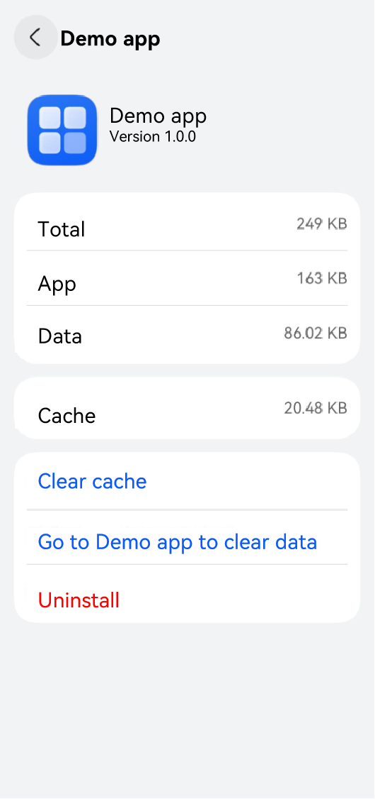

# Application Link Description

## Description of uris
**uris** declared in [skills](../quick-start/module-configuration-file.md#skills) of the [module.json5 file](../quick-start/module-configuration-file.md) contains the following fields.

> **NOTE**
>
> - When an application page is opened using a browser, the browser automatically converts uppercase letters in **scheme** and **host** in **uris** to lowercase letters, causing a failure to match the application. Therefore, it is recommended that **scheme** and **host** do not contain uppercase letters.
> - Do not add slashes (/) before and after the values of **path**, **pathStartWith**, and **pathRegex**. For example, for the application link **https://developer.huawei.com/consumer/en/support**, set **path** to **consumer/en/support**.

- **scheme**: scheme name, for example, **http**, **https**, **file**, and **ftp**. Custom values are also supported.
- **host**: domain name or IP address, for example, developer.huawei.com or 127.0.0.1.
- **port**: port number, for example, 80 in developer.huawei.com:80.
- **path**: directory or file path on the DNS. It is valid only when the scheme exists. The **path** field does not support wildcards. If wildcards are required, use **pathRegex**.
- **pathStartWith**: prefix of the directory or file path on the DNS. It is used for prefix matching.
- **pathRegex**: regular expression of the directory or file path on the DNS. It is used for regular expression matching. It is valid only when the scheme exists.
- [linkFeature](#description-of-linkfeature): application's function type (such as file opening, sharing, and navigation). The value is a string with a maximum of 127 bytes.

### Basic URL Format

URIs can be expressed in different formats based on the available fields. Among them, **scheme** is mandatory. Other fields are valid only when **scheme** is configured.

- Only **scheme** is configured: **scheme://**
- The combination of **scheme** and **host** is configured: **scheme://host**
- The combination of **scheme**, **host**, and **port** is configured: **scheme://host:port**
- When **path**, **pathStartWith**, or **pathRegex** is configured, the formats are as follows.
    The scheme of a third-party application cannot be the same as that of a system application. Otherwise, the third-party application cannot be started using the URI.
    - **Full path expression**: scheme://host:port/path
    - **Prefix expression**: scheme://host:port/pathStartWith
    - **Regular expression**: scheme://host:port/pathRegex

> **NOTE**
> - The scheme of a third-party application cannot be the same as that of a system application. Otherwise, the third-party application cannot be started using the URI.
> - If multiple applications are configured with the same URLs, these applications will be matched during application redirection, and a dialog box will be displayed for users to select. For better user experience, you can use the **path** field to distinguish the application to start. For example, use **https://www.example.com/path1** to start target application 1 and use **https://www.example.com/path2** to start target application 2.


### Description of linkFeature

> **NOTE**
>
> The number of **linkFeature** declared in a bundle cannot exceed 150.


The use of the **linkFeature** field enables an application to deliver a more user-friendly redirection experience. (The declaration of the **linkFeature** field must be reviewed by the application market before being released.) The use scenarios are as follows:

1. Identification of applications of the same type: When the caller starts a vertical application (for example, navigation applications), the system identifies the matched applications based on the **linkFeature** field and displays the applications on the vertical domain panel.

    |Value|Description|
    |---|---|
    |AppStorageMgmt|Clears cache data in the application sandbox directory.|
    |FileOpen|Opens a file.|
    |Navigation|Provides navigation.|
    |RoutePlan|Plans a route.|
    |PlaceSearch|Searches a location.|

2. One-touch return: When a user switches from application A to application B, application B calls the [quick return API](../reference/apis-ability-kit/js-apis-inner-application-uiAbilityContext.md#backtocallerabilitywithresult12) to return to application A. For example, if application A is redirected to the payment page of application B and application B has applied for the linkfeature of payment, the user can return to application A at one touch after finishing the payment in application B.

    |Value|Description|
    |---|---|
    |Login|Common login and authorized login.|
    |Pay|Payment and cashier.|
    |Share|Sharing.|

## Examples


### Authorization Login

```json
"uris": [
    {
        "scheme": "https",
        "host": "developer.huawei.com",
        "path": "consumer",
        "linkFeature": "Login"  
    }
]
```

### Clearing Application Sandbox Cache Data

You can go to **Settings > Storage** to access the application details page of a specific application. By default, this page includes a **Clear cache** option to clear all cached data of the current application.

If you have implemented a custom data clearing page and want to provide a redirection entry on the application details page, you can configure the **linkFeature** field.

1. In the [module.json5 file](../quick-start/module-configuration-file.md), add the following skills configuration to the ability that implements data clearing.

   The **linkFeature** field must be set to **AppStorageMgmt**, and other field values should be set based on project requirements.

    ```json
    {
      "name": "ClearAbility",
      "srcEntry": "./ets/clearability/ClearAbility.ets",
      "description": "$string:ClearAbility_desc",
      "icon": "$media:layered_image",
      "label": "$string:ClearAbility_label",
      "skills": [
        {
          "uris": [
            {
              "scheme": "storage",
              "host": "developer.huawei.com",
              "path": "clearcache",
              "linkFeature": "AppStorageMgmt"
            }
          ]
        }
      ]
    }
    ```

2. Verify the function.

   1. On the phone, go to **Settings > Storage**, and select the current application to access the application details page.
   2. Tap **Clear data in *xx*** to go to the corresponding cache data clearing page.

The following figures show the effects.


