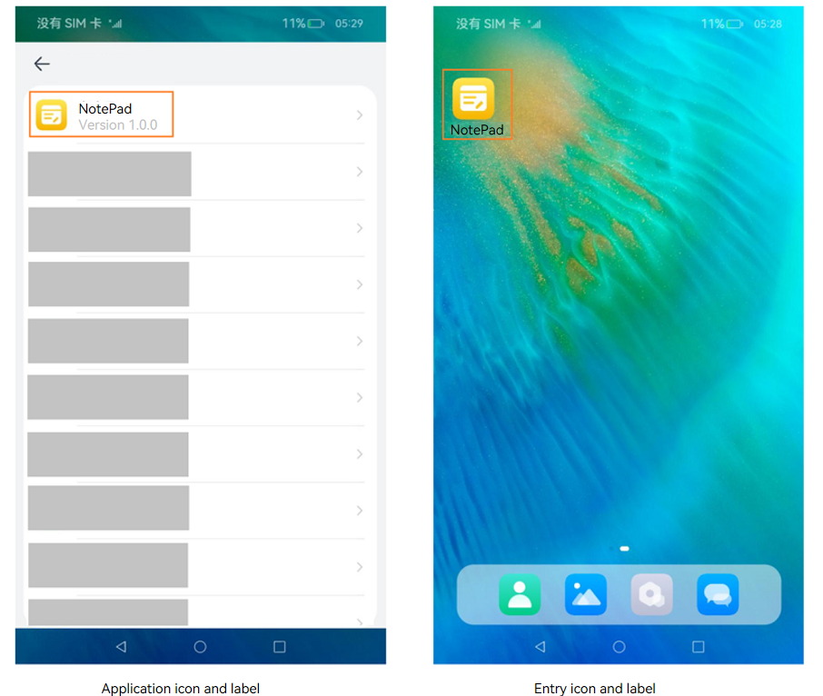

# Application- or Component-Level Configuration (Stage Model)

When developing an application, you may need to configure certain tags to identify the application, such as the bundle name and application icon. This topic describes key tags that need to be configured during application development.

Icons and labels are usually configured together. There is the application icon, application label, entry icon, and entry label, which correspond to the **icon** and **label** fields in the [app.json5 file](../quick-start/app-configuration-file.md) and [module.json5 file](../quick-start/module-configuration-file.md).

The application icon and label are used in **Settings**. For example, they are displayed in the application list in **Settings**. The entry icon is displayed on the device's home screen after the application is installed. The entry icon maps to a [UIAbility](uiability-overview.md) component. Therefore, an application can have multiple entry icons and entry labels. When you touch one of them, the corresponding UIAbility page is displayed.

**Figure 1** Icons and labels




- **Configuring the bundle name**
  
  The bundle name is specified by the **bundleName** field in the [app.json5 file](../quick-start/app-configuration-file.md) in the **AppScope** directory of the project. This field uniquely identifies an application. You are advised to use the reverse domain name notion, for example, *com.example.demo*, where the first part is the domain suffix **com**, the second part is the vendor/individual name, and the third part is the application name, which can be of multiple levels.
  
- **Configuring the application icon and label**

  You must configure an icon and label for an application on the stage model.  

  The application icon is specified by the **icon** field in the [app.json5 file](../quick-start/app-configuration-file.md) in the **AppScope** directory of the project. The **icon** field must be set to the index of an image so that the image is displayed as the application icon.

  The application label is specified by the **label** field in the [app.json5 file](../quick-start/app-configuration-file.md) in the **AppScope** module of the project. The **label** field specifies the application name displayed to users. It must be set to the index of a string resource.

  ```json
  {
    "app": {
      "icon": "$media:app_icon",
      "label": "$string:app_name"
      ...
    }
  }
  ```

- **Configuring the entry icon and label**
  
    On the stage model, you can configure an entry icon and label for each application component. The entry icon and label are displayed on the home screen.

    The entry icon is configured by specifying **icon** under **abilities** in the [module.json5 file](../quick-start/module-configuration-file.md). For example, if you want to display the icon of the UIAbility component on the home screen, add **entity.system.home** to **entities** and **ohos.want.action.home** to **actions** under **skills**. If this field is configured for multiple UIAbility components of an application, multiple icons are displayed on the home screen, corresponding to their respective UIAbility component.
  
  ```json
  {
    "module": {
      ...
      "abilities": [
        {
          // The information starting with $ is the resource value.
          "icon": "$media:icon",
          "label": "$string:EntryAbility_label",
          "skills": [
            {
              "entities": [
                "entity.system.home"
              ],
              "actions": [
                "ohos.want.action.home"
              ]
            }
          ],
        }
      ]
    }
  }
  ```
  OpenHarmony strictly controls applications without icons to prevent malicious applications from deliberately configuring no icon to block uninstall attempts.

  To hide an application icon from the home screen, you must configure the **AllowAppDesktopIconHide** privilege. For details, see [Application Privilege Configuration Guide](../../device-dev/subsystems/subsys-app-privilege-config-guide.md). The rules for displaying the entry icon and entry label are as follows:

  1. The HAP file contains UIAbility configuration.
    * An entry icon is set in the **abilities** field of the **module.json5** file.
      * The application does not have the privilege to hide its icon from the home screen.
        * The system uses the icon configured for the UIAbility as the entry icon and displays it on the home screen. Touching this icon will direct the user to the home page of the UIAbility.
        * The system uses the label configured for the UIAbility as the entry label and displays it on the home screen. If no label is configured, the system uses the label specified in the **app.json5** file as the entry label and displays it on the home screen.
      * The application has the privilege to hide its icon from the home screen.
        * The application information is not returned when the home screen queries the information, and the entry icon and label of the application are not displayed on the home screen.
    * No entry icon is set in the **abilities** field of the **module.json5** file.
      * The application does not have the privilege to hide its icon from the home screen.
        * The system uses the icon specified in the **app.json5** file as the entry icon and displays it on the home screen. Touching this icon will direct the user to the application details page, as shown below.
        * The system uses the label specified in the **app.json5** file as the entry label and displays it on the home screen.
      * The application has the privilege to hide its icon from the home screen.
        * The application information is not returned when the home screen queries the information, and the entry icon and label of the application are not displayed on the home screen.

  2. The HAP file does not contain UIAbility configuration.
    * The application does not have the privilege to hide its icon from the home screen.
      * The system uses the icon specified in the **app.json5** file as the entry icon and displays it on the home screen. Touching this icon will direct the user to the application details page, as shown below.
      * The system uses the label specified in the **app.json5** file as the entry label and displays it on the home screen.
    * The application has the privilege to hide its icon from the home screen.
      * The application information is not returned when the home screen queries the information, and the entry icon and label of the application are not displayed on the home screen.

  **Figure 2** Application details page

  

- **Configuring application version declaration**
  
  To declare the application version, configure the **versionCode** and **versionName** fields in the [app.json5 file](../quick-start/app-configuration-file.md) in the **AppScope** directory of the project. **versionCode** specifies the version number of the application. The value is a 32-bit non-negative integer. It is used only to determine whether a version is later than another version. A larger value indicates a later version. **versionName** provides the text description of the version number.
  
- **Configuring device types supported by the module**

  To configure the device types supported by the module, set the **deviceTypes** field in the [module.json5 file](../quick-start/module-configuration-file.md). If a certain device type is added to **deviceTypes**, the module can run on that device.

- **Configuring the module permission**

  The **requestPermission** field in the [module.json5 file](../quick-start/module-configuration-file.md) is used to configure the permission information required by the module to access the protected part of the system or other applications. This field declares the name of the permission to request, the reason for requesting the permission, and the scenario where the permission is used.
