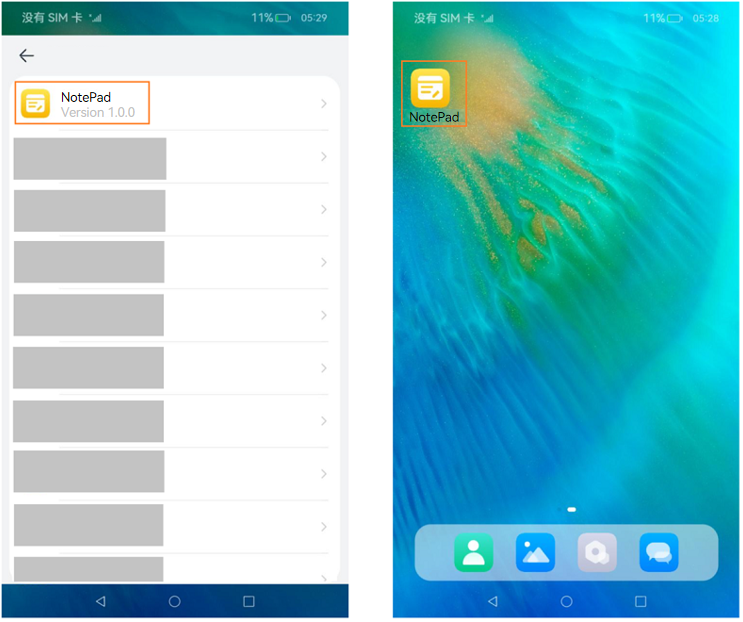

# Application- or Component-Level Configuration (Stage Model)

During application development, you must configure tags to identify an application, such as the bundle name and application icon. This topic describes some critical tags.

## Configuring the Bundle Name

The bundle name is specified by the **bundleName** field in the [app.json5 file](../quick-start/app-configuration-file.md) in the **AppScope** directory of the project. This field identifies an application and must be globally unique. You are advised to use the reverse domain name notation, for example, *com.example.demo*, where the first part is the domain suffix **com**, the second part is the vendor/individual name, and the third part is the application name, which can be of multiple levels.

## Configuring Icons and Labels
Icons and labels are usually configured together. They correspond to the **icon** and **label** fields in the [app.json5 file](../quick-start/app-configuration-file.md) and [module.json5 file](../quick-start/module-configuration-file.md). In DevEco Studio 5.0.3.800 and later versions, the **icon** and **label** fields are optional in the **module.json5** file, but mandatory in the **app.json5** file. This means that you can skip **icons** and **labels** in the **module.json5** file.

### Generation Mechanism
* If the HAP file contains UIAbility configuration, the following scenarios are possible:

  * If the **icon** and **label** fields under **abilities** of the **module.json5** file are configured, and under **skills** of the corresponding ability, **entities** contains **entity.system.home** and **actions** contains **ohos.want.action.home** or **action.system.home**, the system returns the icon and label configured in **module.json5**. If there are multiple abilities that meet the requirements, the system returns the icon and label specified for the ability corresponding to **mainElement** in **module.json5**.

  * If the **icon** and **label** fields under **abilities** of the **module.json5** file are not configured, the system returns the icon and label configured in **app.json5**.

* If the HAP file does not contain UIAbility configuration, the system returns the icon and label configured in **app.json5**.


### Use Scenarios
<!--RP1-->
- Used to display an application on an application screen, for example, application list in **Settings**, or permissions requested by the application in **Settings > Privacy manager**.
- Used to display an application on the home screen. for example, applications displayed on the home screen or in **Recents**.
<!--RP1End-->

The following figure shows the effect.
<!--RP2-->

<!--RP2End-->

### Configuration Example

- **Method 1: configuring app.json5 (recommended)**

  ```json
  {
    "app": {
      "icon": "$media:app_icon",
      "label": "$string:app_name"
      // ...
    }
  }
  ```

- **Method 2: configuring module.json5**

  To display a UIAbility icon on the home screen, you must configure the **icon** and **label** fields, and under the **skills** tag, add **entity.system.home** to **entities** and **ohos.want.action.home** to **actions**.

  ```json
  {
    "module": {
      // ...
      "abilities": [
        {
          "icon": "$media:icon",
          "label": "$string:EntryAbility_label",
          "skills": [
            {
              "entities": [
                "entity.system.home"
              ],
              "actions": [
                "ohos.want.action.home"
              ]
            }
          ],
        }
      ]
    }
  }
  ```
### Management Rules
The system strictly controls applications without icons to prevent malicious applications from deliberately displaying no icon on the home screen to block uninstall attempts.

To hide an icon of a pre-installed application on the home screen, you must configure the **AllowAppDesktopIconHide** privilege.<!--Del--> For details, see [Application Privilege Configuration Guide](../../device-dev/subsystems/subsys-app-privilege-config-guide.md).<!--DelEnd--> After this privilege is granted, the application icon will not be displayed on the home screen. Home screen icons cannot be hidden for applications except pre-installed ones.


## Configuring Application Version Declaration

To declare the application version, configure the **versionCode** and **versionName** fields in the [app.json5 file](../quick-start/app-configuration-file.md) in the **AppScope** directory of the project. **versionCode** specifies the version number of the application. The value is a 32-bit non-negative integer. It is used only to determine whether a version is later than another version. A larger value indicates a later version. **versionName** provides the text description of the version number.

## Configuring Device Types Supported by the Module

To configure the device types supported by the module, set the [deviceTypes](../quick-start/module-configuration-file.md#devicetypes) field in the [module.json5 file](../quick-start/module-configuration-file.md). If a certain device type is added to **deviceTypes**, the module can run on that device.

## Configuring the Module Permission

The [requestPermissions](../security/AccessToken/declare-permissions.md) field in the [module.json5 file](../quick-start/module-configuration-file.md) is used to configure the permission information required by the module to access the protected part of the system or other applications. This field declares the name of the permission to request, the reason for requesting the permission, and the scenario where the permission is used.
