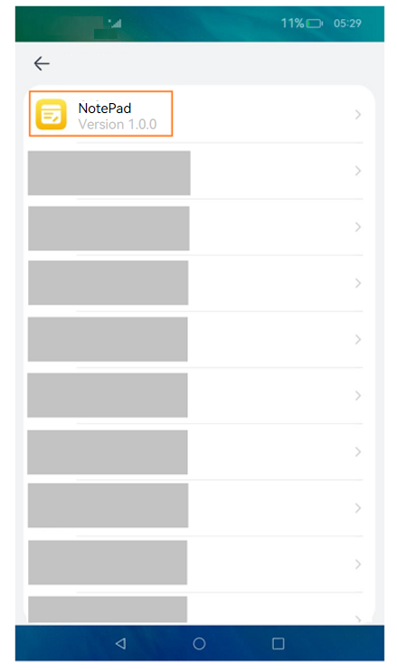
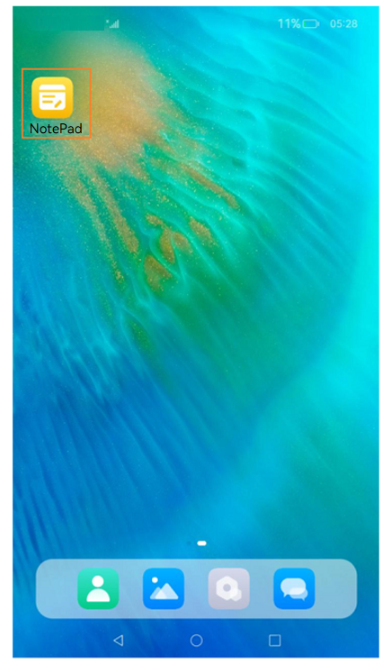
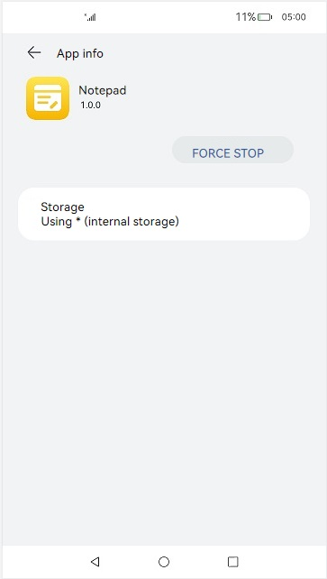

# Application- or Component-Level Configuration (Stage Model)

During application development, you must configure tags to identify an application, such as the bundle name and application icon. This topic describes some critical tags.

## Configuring the Bundle Name

The bundle name is specified by the **bundleName** field in the [app.json5 file](../quick-start/app-configuration-file.md) in the **AppScope** directory of the project. This field identifies an application and must be globally unique. You are advised to use the reverse domain name notation, for example, *com.example.demo*, where the first part is the domain suffix **com**, the second part is the vendor/individual name, and the third part is the application name, which can be of multiple levels.

## Configuring Icons and Labels
Icons and labels are usually configured together. They correspond to the **icon** and **label** fields in the [app.json5 file](../quick-start/app-configuration-file.md) and [module.json5 file](../quick-start/module-configuration-file.md).

### Icon and Label Configuration in the app.json5 File

#### Use Scenarios

The icon and label configured in the **app.json5** file are displayed on an application screen, for example:
* Application list in Settings
* Applications with permissions granted in the privacy management screen

**Figure 1** Icon and label configuration in the app.json5 file



#### Configuration Example

```json
{
  "app": {
    "icon": "$media:app_icon",
    "label": "$string:app_name"
    ...
  }
}
```

### Icon and Label Configuration in the module.json5 File

#### Use Scenarios
The icon and label configured in the **module.json5** file are displayed on the home screen after the application is installed. The scenarios are as follows:
* Applications displayed on the device's home screen
* Applications displayed in Recents

**Figure 2** Icon and label configuration of the module.json5 file




#### Configuration Example

To display the UIAbility icon on the home screen, you must configure the **icon** and **label** fields, and under the **skills** tag, add **entity.system.home** to **entities** and **ohos.want.action.home** to **actions**.

```json
{
  "module": {
    ...
    "abilities": [
      {
        "icon": "$media:icon",
        "label": "$string:EntryAbility_label",
        "skills": [
          {
            "entities": [
              "entity.system.home"
            ],
            "actions": [
              "ohos.want.action.home"
            ]
          }
        ],
      }
    ]
  }
}
```
#### Management Rules
The system strictly controls applications without icons to prevent malicious applications from deliberately displaying no icon on the home screen to block uninstall attempts.

To hide an icon of a pre-installed application on the home screen, you must configure the **AllowAppDesktopIconHide** privilege.<!--Del--> For details, see [Application Privilege Configuration Guide](../../device-dev/subsystems/subsys-app-privilege-config-guide.md).<!--DelEnd--> After this privilege is granted, the application icon will not be displayed on the home screen.

Home screen icons can be hidden only for pre-installed applications. The icon display rules are as follows:
* The HAP file contains UIAbility configuration.
  * If both an icon and a label are configured in the **abilities** tag of the **module.json5** file, the system displays that icon and label on the home screen. Touching this icon will direct the user to the home page of the UIAbility. If only an icon is configured, the system displays the label configured in the **app.json5** file on the home screen.

  * If no icon is configured in the **abilities** tag of the **module.json5** file, the system displays the icon and label configured in the **app.json5** file on the home screen. Touching this icon will direct the user to the application details page.

* The HAP file does not contain UIAbility configuration. The system displays the icon and label configured in the **app.json5** file on the home screen. Touching this icon will direct the user to the application details page.


  **Figure 3** Application details page

  

## Configuring Application Version Declaration

To declare the application version, configure the **versionCode** and **versionName** fields in the [app.json5 file](../quick-start/app-configuration-file.md) in the **AppScope** directory of the project. **versionCode** specifies the version number of the application. The value is a 32-bit non-negative integer. It is used only to determine whether a version is later than another version. A larger value indicates a later version. **versionName** provides the text description of the version number.

## Configuring Device Types Supported by the Module

To configure the device types supported by the module, set the [deviceTypes](../quick-start/module-configuration-file.md#devicetypes) field in the [module.json5 file](../quick-start/module-configuration-file.md). If a certain device type is added to **deviceTypes**, the module can run on that device.

## Configuring the Module Permission

The [requestPermissions](../quick-start/module-configuration-file.md#requestpermissions) field in the [module.json5 file](../quick-start/module-configuration-file.md) is used to configure the permission information required by the module to access the protected part of the system or other applications. This field declares the name of the permission to request, the reason for requesting the permission, and the scenario where the permission is used.
