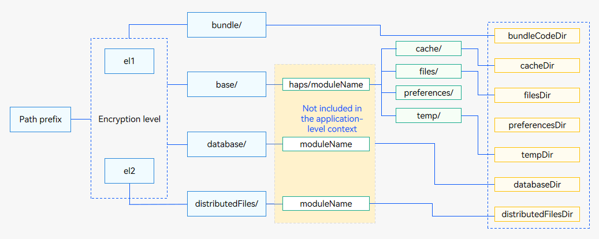

# Context (Stage Model)

## Overview

[Context](../reference/apis/js-apis-inner-application-context.md) is the context of an object in an application. It provides basic information about the application, for example, **resourceManager**, **applicationInfo**, **dir** (application development path), and **area** (encrypted level). It also provides basic methods such as **createBundleContext()** and **getApplicationContext()**. The UIAbility component and ExtensionAbility derived class components have their own **Context** classes, for example, the base class **Context**, **ApplicationContext**, **AbilityStageContext**, **UIAbilityContext**, **ExtensionContext**, and **ServiceExtensionContext**.

- The figure below illustrates the inheritance relationship of contexts.
  
  
- The figure below illustrates the holding relationship of contexts.
  

The following describes the information provided by different contexts.
  - [UIAbilityContext](../reference/apis/js-apis-inner-application-uiAbilityContext.md): Each UIAbility has the **Context** attribute, which provides APIs to operate an application component, obtain the application component configuration, and more.
    
     ```ts
     import UIAbility from '@ohos.app.ability.UIAbility';
     export default class EntryAbility extends UIAbility {
       onCreate(want, launchParam) {
         let uiAbilityContext = this.context;
         ...
       }
     }
     ```
     
     > **NOTE**
     >
     > For details about how to obtain the context of a **UIAbility** instance on the page, see [Obtaining the Context of UIAbility](uiability-usage.md#obtaining-the-context-of-uiability).
  - Scenario-specific [ExtensionContext](../reference/apis/js-apis-inner-application-extensionContext.md): For example, ServiceExtensionContext, inherited from ExtensionContext, provides APIs related to background services.
    
     ```ts
     import ServiceExtensionAbility from '@ohos.app.ability.ServiceExtensionAbility';
     export default class MyService extends ServiceExtensionAbility {
       onCreate(want) {
         let serviceExtensionContext = this.context;
         ...
       }
     }
     ```
  - [AbilityStageContext](../reference/apis/js-apis-inner-application-abilityStageContext.md): module-level context. It provides **HapModuleInfo** and **Configuration** in addition to those provided by the base class **Context**.
    
     ```ts
     import AbilityStage from '@ohos.app.ability.AbilityStage';
     export default class MyAbilityStage extends AbilityStage {
       onCreate() {
         let abilityStageContext = this.context;
         ...
       }
     }
     ```
  - [ApplicationContext](../reference/apis/js-apis-inner-application-applicationContext.md): application-level context. It provides APIs for subscribing to application component lifecycle changes, system memory changes, and system environment changes. The application-level context can be obtained from UIAbility, ExtensionAbility, and AbilityStage.
    
     ```ts
     import UIAbility from '@ohos.app.ability.UIAbility';
     export default class EntryAbility extends UIAbility {
       onCreate(want, launchParam) {
         let applicationContext = this.context.getApplicationContext();
         ...
       }
     }
     ```


## Typical Usage Scenarios of Context


This topic describes how to use the context in the following scenarios:


- [Obtaining the Application Development Path](#obtaining-the-application-development-path)
- [Obtaining and Modifying Encryption Levels](#obtaining-and-modifying-encryption-levels)
- [Creating Context of Another Application or Module](#creating-context-of-another-application-or-module)
- [Subscribing to UIAbility Lifecycle Changes in a Process](#subscribing-to-uiability-lifecycle-changes-in-a-process)


### Obtaining the Application Development Path

The following table describes the application development paths obtained from context.

**Table 1** Application development paths

| Name| Type| Readable| Writable| Description|
| -------- | -------- | -------- | -------- | -------- |
| bundleCodeDir       | string   | Yes  | No  | Path for storing the application's installation package, that is, installation directory of the application on the internal storage.                  |
| cacheDir | string | Yes| No| Path for storing the cache files, that is, cache directory of the application on the internal storage.<br>It is the content of **Storage** of an application under **Settings > Apps & services > Apps**.|
| filesDir            | string   | Yes  | No  | Path for storing the common files, that is, file directory of the application on the internal storage.<br>Files in this directory may be synchronized to other directories during application migration or backup.|
| preferencesDir      | string   | Yes  | Yes  | Path for storing the preference files, that is, preferences directory of the application.                |
| tempDir             | string   | Yes  | No  | Path for storing the temporary files.<br>Files in this directory are deleted after the application is uninstalled.|
| databaseDir         | string   | Yes  | No  | Path for storing the application's database, that is, storage directory of the local database.                        |
| distributedFilesDir | string | Yes| No| Path for storing the distributed files.|

The capability of obtaining the application development path is provided by the base class **Context**. This capability is also provided by **ApplicationContext**, **AbilityStageContext**, **UIAbilityContext**, and **ExtensionContext**. However, the paths obtained from different contexts may differ, as shown below.

**Figure 1** Application development paths obtained from context



- Obtain the application-level path through **ApplicationContext**. It is recommended that global application information be stored in this path. Files stored in this path will be deleted only when the application is uninstalled.
    | Name| Path|
  | -------- | -------- |
  | bundleCodeDir | {Path prefix}/el1/bundle/|
  | cacheDir | {Path prefix}/{Encryption level}/base/cache/|
  | filesDir | {Path prefix}/{Encryption level}/base/files/|
  | preferencesDir | {Path prefix}/{Encryption level}/base/preferences/|
  | tempDir | {Path prefix}/{Encryption level}/base/temp/|
  | databaseDir | {Path prefix}/{Encryption level}/database/|
  | distributedFilesDir | {Path prefix}/el2/distributedFiles/|

- Obtain the HAP level path through **AbilityStageContext**, **UIAbilityContext**, and **ExtensionContext**. It is recommended that the HAP information be stored in this path. The file content stored in this path will be deleted when the HAP is uninstalled. The file content in the application-level path will be deleted only after all the HAPs of the application are uninstalled.
    | Name| Path|
  | -------- | -------- |
  | bundleCodeDir | {Path prefix}/el1/bundle/|
  | cacheDir | {Path prefix}/{Encryption level}/base/**haps/{moduleName}**/cache/|
  | filesDir | {Path prefix}/{Encryption level}/base/**haps/{moduleName}**/files/|
  | preferencesDir | {Path prefix}/{Encryption level}/base/**haps/{moduleName}**/preferences/|
  | tempDir | {Path prefix}/{Encryption level}/base/**haps/{moduleName}**/temp/|
  | databaseDir | {Path prefix}/{Encryption level}/database/**{moduleName}**/|
  | distributedFilesDir | {Path prefix}/el2/distributedFiles/**{moduleName}**/|

The sample code for obtaining the application development paths is as follows:


```ts
import UIAbility from '@ohos.app.ability.UIAbility';

export default class EntryAbility extends UIAbility {
  onCreate(want, launchParam) {
    let cacheDir = this.context.cacheDir;
    let tempDir = this.context.tempDir;
    let filesDir = this.context.filesDir;
    let databaseDir = this.context.databaseDir;
    let bundleCodeDir = this.context.bundleCodeDir;
    let distributedFilesDir = this.context.distributedFilesDir;
    let preferencesDir = this.context.preferencesDir;
    ...
  }
}
```

> **NOTE**
>
> The sample code obtains the sandbox path of the application development path. The absolute path can be obtained by running the **find / -name <fileName>** command in the hdc shell after file creation or modification.

### Obtaining and Modifying Encryption Levels

Encrypting application files enhances data security by preventing files from unauthorized access. Different application files require different levels of protection. For private files, such as alarms and wallpapers, the application must place them in a directory with the device-level encryption (EL1) to ensure that they can be accessed before the user enters the password. For sensitive files, such as personal privacy data, the application must place them in a directory with the user-level encryption (EL2).

In practice, you need to select a proper encryption level based on scenario-specific requirements to protect application data security. The proper use of EL1 and the EL2 can efficiently improve the security.

> **NOTE**
>
> - AreaMode.EL1: device-level encryption. Directories with this encryption level are accessible after the device is powered on.
>
> - AreaMode.EL2: user-level encryption. Directories with this encryption level are accessible only after the device is powered on and the password is entered (for the first time).

You can obtain and set the encryption level by reading and writing the [area attribute in Context](../reference/apis/js-apis-inner-application-context.md).

```ts
import UIAbility from '@ohos.app.ability.UIAbility';

export default class EntryAbility extends UIAbility {
  onCreate(want, launchParam) {
    // Before storing common information, switch the encryption level to EL1.
    if (this.context.area === 1) {// Obtain the area.
      this.context.area = 0; // Modify the area.
    }
    // Store common information.

    // Before storing sensitive information, switch the encryption level to EL2.
    if (this.context.area === 0) { // Obtain the area.
      this.context.area = 1; // Modify the area.
    }
    // Store sensitive information.
  }
}
```


### Creating Context of Another Application or Module

The base class **Context** provides [createBundleContext(bundleName:string)](../reference/apis/js-apis-inner-application-context.md#contextcreatebundlecontext), [createModuleContext(moduleName:string)](../reference/apis/js-apis-inner-application-context.md#contextcreatemodulecontext), and [createModuleContext(bundleName:string, moduleName:string)](../reference/apis/js-apis-inner-application-context.md#contextcreatemodulecontext-1) to create the context of other applications or modules, so as to obtain the resource information, for example, [obtaining the application development paths](#obtaining-the-application-development-path) of other modules.

- Call **createBundleContext(bundleName:string)** to create the context of another application.
  > **NOTE**
  >
  > To obtain the context of another application:
  >
  > - Request the **ohos.permission.GET_BUNDLE_INFO_PRIVILEGED** permission. For details, see [Declaring Permissions in the Configuration File](../security/accesstoken-guidelines.md#declaring-permissions-in-the-configuration-file).
  >
  > - This is a system API and cannot be called by third-party applications.

  For example, application information displayed on the home screen includes the application name and icon. The home screen application calls the foregoing method to obtain the context information, so as to obtain the resource information including the application name and icon.

  ```ts
  import UIAbility from '@ohos.app.ability.UIAbility';
  
  export default class EntryAbility extends UIAbility {
    onCreate(want, launchParam) {
      let bundleName2 = 'com.example.application';
      let context2 = this.context.createBundleContext(bundleName2);
      let label2 = context2.applicationInfo.label;
      ...
    }
  }
  ```

- Call **createModuleContext(bundleName:string, moduleName:string)** to obtain the context of a specified module of another application. After obtaining the context, you can obtain the resource information of that module.
  > **NOTE**
  >
  > To obtain the context of a specified module of another application:
  >
  > - Request the **ohos.permission.GET_BUNDLE_INFO_PRIVILEGED** permission. For details, see [Declaring Permissions in the Configuration File](../security/accesstoken-guidelines.md#declaring-permissions-in-the-configuration-file).
  >
  > - This is a system API and cannot be called by third-party applications.
  
  ```ts
  import UIAbility from '@ohos.app.ability.UIAbility';
  
  export default class EntryAbility extends UIAbility {
    onCreate(want, launchParam) {
      let bundleName2 = 'com.example.application';
      let moduleName2 = 'module1';
      let context2 = this.context.createModuleContext(bundleName2, moduleName2);
      ...
    }
  }
  ```
  
- Call **createModuleContext(moduleName:string)** to obtain the context of another module in the current application. After obtaining the context, you can obtain the resource information of that module.
  
  ```ts
  import UIAbility from '@ohos.app.ability.UIAbility';
  
  export default class EntryAbility extends UIAbility {
    onCreate(want, launchParam) {
      let moduleName2 = 'module1';
      let context2 = this.context.createModuleContext(moduleName2);
      ...
    }
  }
  ```


### Subscribing to UIAbility Lifecycle Changes in a Process

In the DFX statistics scenario of an application, if you need to collect statistics on the stay duration and access frequency of a page, you can subscribe to UIAbility lifecycle changes in a process.

[ApplicationContext](../reference/apis/js-apis-inner-application-applicationContext.md) provides APIs for subscribing to UIAbility lifecycle changes in a process. When the UIAbility lifecycle changes in a process, for example, being created or destroyed, becoming visible or invisible, or gaining or losing focus, the corresponding callback is triggered. Each time the callback is registered, a listener lifecycle ID is returned, with the value incremented by 1 each time. When the number of listeners exceeds the upper limit (2^63-1), **-1** is returned. The following uses [UIAbilityContext](../reference/apis/js-apis-inner-application-uiAbilityContext.md) as an example.


```ts
import UIAbility from '@ohos.app.ability.UIAbility';
import window from '@ohos.window';

const TAG: string = '[Example].[Entry].[EntryAbility]';

export default class EntryAbility extends UIAbility {
  // Define a lifecycle ID.
  lifecycleId: number;

  onCreate(want, launchParam) {
    // Define a lifecycle callback object.
    let abilityLifecycleCallback = {
      // Called when a UIAbility is created.
      onAbilityCreate(uiAbility) {
        console.info(TAG, `onAbilityCreate uiAbility.launchWant: ${JSON.stringify(uiAbility.launchWant)}`);
      },
      // Called when a window is created.
      onWindowStageCreate(uiAbility, windowStage: window.WindowStage) {
        console.info(TAG, `onWindowStageCreate uiAbility.launchWant: ${JSON.stringify(uiAbility.launchWant)}`);
        console.info(TAG, `onWindowStageCreate windowStage: ${JSON.stringify(windowStage)}`);
      },
      // Called when the window becomes active.
      onWindowStageActive(uiAbility, windowStage: window.WindowStage) {
        console.info(TAG, `onWindowStageActive uiAbility.launchWant: ${JSON.stringify(uiAbility.launchWant)}`);
        console.info(TAG, `onWindowStageActive windowStage: ${JSON.stringify(windowStage)}`);
      },
      // Called when the window becomes inactive.
      onWindowStageInactive(uiAbility, windowStage: window.WindowStage) {
        console.info(TAG, `onWindowStageInactive uiAbility.launchWant: ${JSON.stringify(uiAbility.launchWant)}`);
        console.info(TAG, `onWindowStageInactive windowStage: ${JSON.stringify(windowStage)}`);
      },
      // Called when the window is destroyed.
      onWindowStageDestroy(uiAbility, windowStage: window.WindowStage) {
        console.info(TAG, `onWindowStageDestroy uiAbility.launchWant: ${JSON.stringify(uiAbility.launchWant)}`);
        console.info(TAG, `onWindowStageDestroy windowStage: ${JSON.stringify(windowStage)}`);
      },
      // Called when the UIAbility is destroyed.
      onAbilityDestroy(uiAbility) {
        console.info(TAG, `onAbilityDestroy uiAbility.launchWant: ${JSON.stringify(uiAbility.launchWant)}`);
      },
      // Called when the UIAbility is switched from the background to the foreground.
      onAbilityForeground(uiAbility) {
        console.info(TAG, `onAbilityForeground uiAbility.launchWant: ${JSON.stringify(uiAbility.launchWant)}`);
      },
      // Called when the UIAbility is switched from the foreground to the background.
      onAbilityBackground(uiAbility) {
        console.info(TAG, `onAbilityBackground uiAbility.launchWant: ${JSON.stringify(uiAbility.launchWant)}`);
      },
      // Called when UIAbility is continued on another device.
      onAbilityContinue(uiAbility) {
        console.info(TAG, `onAbilityContinue uiAbility.launchWant: ${JSON.stringify(uiAbility.launchWant)}`);
      }
    }
    // Obtain the application context.
    let applicationContext = this.context.getApplicationContext();
    // Register the application lifecycle callback.
    this.lifecycleId = applicationContext.on('abilityLifecycle', abilityLifecycleCallback);
    console.info(TAG, `register callback number: ${this.lifecycleId}`);
  }

  ...

  onDestroy() {
    // Obtain the application context.
    let applicationContext = this.context.getApplicationContext();
    // Deregister the application lifecycle callback.
    applicationContext.off('abilityLifecycle', this.lifecycleId);
  }
}
```
