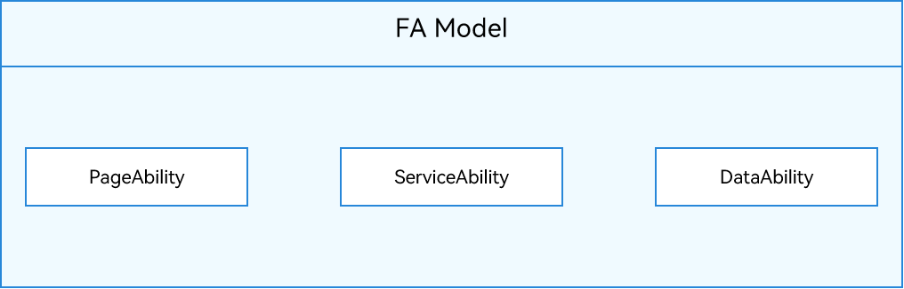

# Application Models

## Elements of the Application Model

An application model is the abstraction of capabilities required by an application. It provides components and mechanisms required for running the application. You can develop applications based on a unified set of models, which makes your development simpler and more efficient.

The application model consists of the following elements:

- Application component
   
   An application component is the basic unit and entry for the running of an application. When a user starts, uses, or exits an application, the application component transits in different states. This is called the application component lifecycle. The application component provides lifecycle callbacks, through which you can detect application [status changes](uiability-lifecycle.md). When writing an application, you needs to compile application components and their lifecycle callbacks, and configure related information in the application configuration file. In this way, the operating system creates an application component instance based on the configuration file during running, and schedules the lifecycle callbacks to execute your code.

- Process model

   The process model defines how application processes are created, destroyed, and communicate with each other.

- Thread model

   The thread model defines how a thread in an application process is created and destroyed, how the main thread and UI thread are created, and how the threads communicate with each other.

- Mission Management Model (for System Applications Only)

   The mission management model defines how a mission is created and destroyed, and the relationship between missions and application components. A mission is a record about the use of an application component instance. Each time a user starts an application component instance, a mission is generated. For example, when a user starts a video application, the video application mission is displayed on the **Recents** page. When the user clicks the mission, the system switches the mission to the foreground. If the video editing feature in the video application is coded based on an application component, an application component instance for video editing is created when the user starts video editing. In this case, both the video application mission and video editing mission are displayed on **Recents**.

- Configuration file

   The configuration file contains information about the application's configuration, components, and permissions, as well as custom information. The information will be provided for the compiler, application market, and operating system in the build, distribution, and running phases.

## Application Model Overview

Along its evolution, the system has provided two application models:

- Feature Ability (FA) model: This model is supported by API versions 7 and 8, and no longer recommended.

- Stage model: This model is supported since API version 9. It is the mainstream model with a long evolution plan. In this model, classes such as **AbilityStage** and **WindowStage** are provided as the stage of application components and windows. That's why it is named stage model.

## Differences Between the FA Model and Stage Model

In the FA model, each application component exclusively uses an ArkTS engine instance. However, in the stage model, multiple application components share the same ArkTS engine instance. This allows application components to share objects and statuses with less memory required. With the stage model, you can easily develop complex applications in distributed scenarios.

The table below describes their differences in detail.

**Table 1** Differences between the FA model and stage model

| Item| FA model| Stage model|
| -------- | -------- | -------- |
| **Application component**| 1. Component classification  - PageAbility: supports user interaction via the UI. For details, see [PageAbility Component Overview](pageability-overview.md). - ServiceAbility: provides background services without the UI. For details, see [ServiceAbility Component Overview](serviceability-overview.md). - DataAbility: provides the data sharing capability without the UI. For details, see [DataAbility Component Overview](dataability-overview.md). 2. Development mode Application components are specified by exporting anonymous objects and fixed entry files. You cannot perform derivation. It is inconvenient for capability expansion.| 1. Component classification  - UIAbility: supports user interaction with the UI. For details, see [UIAbility Component Overview](uiability-overview.md). - ExtensionAbility: provides scenario-specific extension capabilities (such as widget and input methods). For details, see [ExtensionAbility Component Overview](extensionability-overview.md). 2. Development mode The object-oriented mode is used to provide open application components as classes. You can derive application components for capability expansion.|
| **Process model**| There are two types of processes: 1. Main process 2. Render process For details, see [Process Model](process-model-fa.md).| There are three types of processes: 1. Main process 2. ExtensionAbility process 3. Render process For details, see [Process Model](process-model-stage.md).|
| **Thread model**| 1. ArkTS engine instance creation A process can run multiple application component instances, and each application component instance runs in an independent ArkTS engine instance. 2. Thread model Each ArkTS engine instance is created on an independent thread (non-main thread). The main thread does not have an ArkTS engine instance. 3. Intra-process object sharing: not supported. For details, see [Thread Model](thread-model-fa.md).| 1. ArkTS engine instance creation A process can run multiple application component instances, and all application component instances share one ArkTS engine instance. 2. Thread model The ArkTS engine instance is created on the main thread. 3. Intra-process object sharing: supported. For details, see [Thread Model](thread-model-stage.md).|
|<!--DelRow-->**Mission management model**| - A mission is created for each PageAbility component instance. - Missions are stored persistently until they are deleted by users or the number of missions exceeds the maximum (customized based on the product configuration). - PageAbility components do not form a stack structure.| - A mission is created for each UIAbility component instance. - Missions are stored persistently until they are deleted by users or the number of missions exceeds the maximum (customized based on the product configuration). - UIAbility components do not form a stack structure.|
| **Configuration file**| The **config.json** file contains the application, HAP, and application component information. For details, see [Application Configuration File Overview (FA Model)](../quick-start/application-configuration-file-overview-fa.md).| The **app.json5** file contains the application information, and the **module.json5** file contains the HAP and application component information. For details, see [Application Configuration File Overview (Stage Model)](../quick-start/application-configuration-file-overview-stage.md).|
