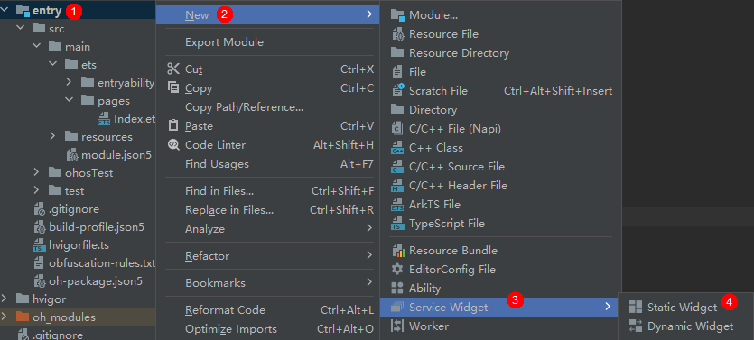

# Creating an ArkTS Widget

To create an ArkTS widget in an existing application project, perform the following steps:

1. Create a widget.

   

2. Select a widget template based on the actual service scenario.

   

3. Set **Language** to **ArkTS** and click **Finish**.

   

After an ArkTS widget is created, the following widget-related files are added to the project directory: **EntryFormAbility.ts** (widget lifecycle management file), **WidgetCard.ets** (widget page file), and **form_config.json** (widget configuration file).

