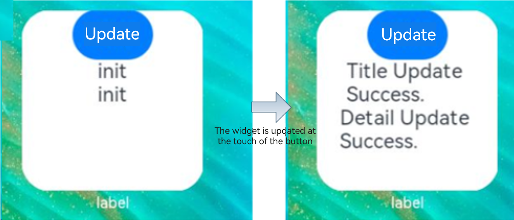

# Updating Widget Content Through the message Event


On the widget page, the **postCardAction** API can be used to trigger a message event to start a FormExtensionAbility, which then updates the widget content. The following is an example of this widget update mode.


- On the widget page, register the **onClick** event callback of the button and call the **postCardAction** API in the callback to trigger the event to the FormExtensionAbility.
  
  ```ts
  let storage = new LocalStorage();
  @Entry(storage)
  @Component
  struct WidgetCard {
    @LocalStorageProp('title') title: string = 'init';
    @LocalStorageProp('detail') detail: string = 'init';
  
    build() {
      Column() {
        Button ('Update')
          .onClick(() => {
            postCardAction(this, {
              'action': 'message',
              'params': {
                'msgTest': 'messageEvent'
              }
            });
          })
        Text(`${this.title}`)
        Text(`${this.detail}`)
      }
      .width('100%')
      .height('100%')
    }
  }
  ```
  
- Call the [updateForm](../reference/apis/js-apis-app-form-formProvider.md#updateform) API to update the widget in the **onFormEvent** callback of the FormExtensionAbility.
  
  ```ts
  import formBindingData from '@ohos.app.form.formBindingData';
  import FormExtensionAbility from '@ohos.app.form.FormExtensionAbility';
  import formProvider from '@ohos.app.form.formProvider';
  
  export default class EntryFormAbility extends FormExtensionAbility {
    onFormEvent(formId, message) {
      // Called when a specified message event defined by the form provider is triggered.
      console.info(`FormAbility onEvent, formId = ${formId}, message: ${JSON.stringify(message)}`);
      let formData = {
        'title':'Title Update Success.', // Matches the widget layout.
        'detail':'Detail Update Success.', // Matches the widget layout.
      };
      let formInfo = formBindingData.createFormBindingData(formData)
      formProvider.updateForm(formId, formInfo).then((data) => {
        console.info('FormAbility updateForm success.' + JSON.stringify(data));
      }).catch((error) => {
        console.error('FormAbility updateForm failed: ' + JSON.stringify(error));
      })
    }
  
    ...
  }
  ```

  The figure below shows the effect.
  
  
