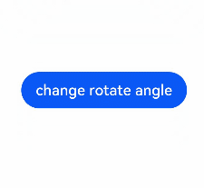

# Using Animations in the Widget


To make your ArkTS widget more engaging, you can apply animations to it, including [explicit animation](../reference/arkui-ts/ts-explicit-animation.md), [attribute animation](../reference/arkui-ts/ts-animatorproperty.md), and [component transition](../reference/arkui-ts/ts-transition-animation-component.md). Just note the following restrictions when using the animations in ArkTS widgets.


**Table 1** Restrictions on animation parameters

| Name| Description| Description|
| -------- | -------- | -------- |
| duration | Animation playback duration| The maximum value is 1 second. If a larger value is set, the animation is still played for 1 second.|
| tempo | Animation playback speed.| Do not set this parameter in the widget. Use the default value 1.|
| delay | Animation delay duration.| Do not set this parameter in the widget. Use the default value 0.|
| iterations | Number of times that the animation is played.| Do not set this parameter in the widget. Use the default value 1.|

The following sample code implements the animation effect of button rotation:



```ts
@Entry
@Component
struct AttrAnimationExample {
  @State rotateAngle: number = 0;

  build() {
    Column() {
      Button('change rotate angle')
        .onClick(() => {
          this.rotateAngle = 90;
        })
        .margin(50)
        .rotate({ angle: this.rotateAngle })
        .animation({
          curve: Curve.EaseOut,
          playMode: PlayMode.AlternateReverse
        })
    }.width('100%').margin({ top: 20 })
  }
}
```
