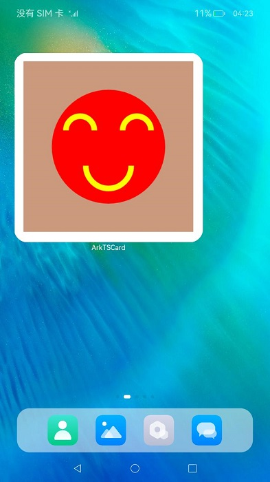

# Applying Custom Drawing in the Widget


You can apply custom drawing in your ArkTS widget to create a more vibrant experience. Use the [Canvas](../reference/arkui-ts/ts-components-canvas-canvas.md) component to create a canvas on the widget, and then use the [CanvasRenderingContext2D](../reference/arkui-ts/ts-canvasrenderingcontext2d.md) object to draw custom graphics on the canvas. The following code snippet draws a smiling face in the center of a canvas.

```ts
@Entry
@Component
struct Card {
  private canvasWidth: number = 0;
  private canvasHeight: number = 0;
  // Initialize CanvasRenderingContext2D and RenderingContextSettings.
  private settings: RenderingContextSettings = new RenderingContextSettings(true);
  private context: CanvasRenderingContext2D = new CanvasRenderingContext2D(this.settings);

  build() {
    Column() {
      Row() {
        Canvas(this.context)
          .margin('5%')
          .width('90%')
          .height('90%')
          .onReady(() => {
            console.info('[ArkTSCard] onReady for canvas draw content');
            // Obtain the actual width and height of the canvas in the onReady callback.
            this.canvasWidth = this.context.width;
            this.canvasHeight = this.context.height;
            // Draw the background of the canvas.
            this.context.fillStyle = 'rgba(203, 154, 126, 1.00)';
            this.context.fillRect(0, 0, this.canvasWidth, this.canvasHeight);
            // Draw a red circle in the center of the canvas.
            this.context.beginPath();
            let radius = this.context.width / 3;
            let circleX = this.context.width / 2;
            let circleY = this.context.height / 2;
            this.context.moveTo(circleX - radius, circleY);
            this.context.arc(circleX, circleY, radius, 2 * Math.PI, 0, true);
            this.context.closePath();
            this.context.fillStyle = 'red';
            this.context.fill();
            // Draw the left eye of the smiling face.
            let leftR = radius / 4;
            let leftX = circleX - (radius / 2);
            let leftY = circleY - (radius / 3.5);
            this.context.beginPath();
            this.context.arc(leftX, leftY, leftR, 0, Math.PI, true);
            this.context.strokeStyle = '#ffff00';
            this.context.lineWidth = 10;
            this.context.stroke();
            // Draw the right eye of the smiling face.
            let rightR = radius / 4;
            let rightX = circleX + (radius / 2);
            let rightY = circleY - (radius / 3.5);
            this.context.beginPath();
            this.context.arc(rightX, rightY, rightR, 0, Math.PI, true);
            this.context.strokeStyle = '#ffff00';
            this.context.lineWidth = 10;
            this.context.stroke();
            // Draw the mouth of the smiling face.
            let mouthR = radius / 2.5;
            let mouthX = circleX;
            let mouthY = circleY + (radius / 3);
            this.context.beginPath();
            this.context.arc(mouthX, mouthY, mouthR, Math.PI, 0, true);
            this.context.strokeStyle = '#ffff00';
            this.context.lineWidth = 10;
            this.context.stroke();
          })
      }
    }.height('100%').width('100%')
  }
}
```

The figure below shows the effect.

