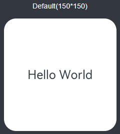
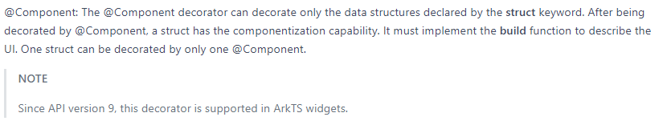

# Widget Page Capability Overview

You can leverage the ArkUI declarative paradigm to develop ArkTS widget pages. The following widget pages are automatically generated by a DevEco Studio template. You can adjust the pages based on the real-world service scenarios.

ArkTS widgets have full capabilities of JS widgets, with added animation and custom drawing capabilities plus partial support for components, events, animations, data management, and state management capabilities of the [declarative paradigm](../reference/arkui-ts/ts-components-summary.md). For details, see [Page Capabilities Supported by ArkTS Widgets](#page-capabilities-supported-by-arkts-widgets).

## Page Capabilities Supported by ArkTS Widgets

For details about the page capabilities supported by ArkTS widgets, see [Learning ArkTS](../quick-start/arkts-create-custom-components.md) and [ArkTS-based Declarative Development Paradigm](../reference/arkui-ts/ts-components-summary.md).

Only the APIs marked with "supported in ArkTS widgets" can be used for ArkTS widgets. Pay special attention to the capability differences with applications.

For example, the following description indicates that the @Component decorator can be used in ArkTS widgets.

