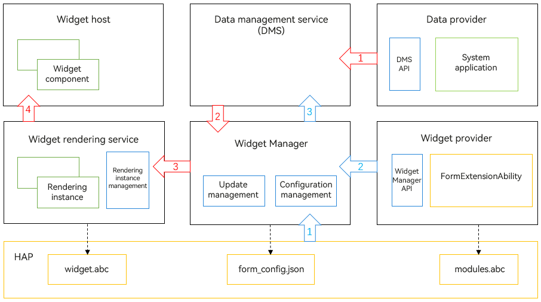

# Updating Widget Content Through a Proxy

A widget can be updated through a proxy – a system application that has data sharing enabled – when the widget provider is not running.

## Implementation Principles

**Figure 1** Updating widget content through a proxy


Compared with the [implementation of the ArkTS widget](../application-models/arkts-ui-widget-working-principles.md#implementation-principles) alone, updating through a proxy involves the data management service and data provider.

- Data management service: provides a mechanism for data sharing among multiple applications.
- Data provider: must be a system application that has data sharing enabled. The shared data is identified through the defined **key** + **subscriberId** combination.

> **NOTE**
>
> This feature can be used when the system provides applications as data providers and publicly available shared data identifiers.

Processing flow of the widget provider (indicated by the blue arrows in the figure):

1. The widget provider sets the **dataProxyEnabled** field to **true** in the **form_config.json** file to enable the update-through-proxy feature.
> **NOTE**
>
> After the update-through-proxy feature is enabled, the settings for [updating periodically](../application-models/arkts-ui-widget-update-by-time.md) do not work.

2. In the [onAddForm](../reference/apis/js-apis-app-form-formExtensionAbility.md#onaddform) callback, the widget provider returns the **key** + **subscriberId** combination defined by the data provider to the Widget Manager.

3. The Widget Manager parses the subscription information of the widget provider and registers a subscription instance with the data management service.

Processing flow of the widget update proxy (indicated by the red arrows in the figure):

1. The data provider uses the **key** + **subscriberId** combination as the data ID to store data to the database.
2. The data management service detects the change in the database and publishes the new data to all currently registered subscription instances.
3. The Widget Manager parses data from the subscription instance and sends the data to the widget rendering service.
4. The widget rendering service runs the widget page code **widgets.abc**, which implements rendering based on the new data and sends the rendered data to the [FormComponent](../reference/arkui-ts/ts-basic-components-formcomponent.md) corresponding to the widget host.

There are two types of shared data provided by the data provider:

- Ephemeral data: data that exists only for a specific period of time and can be subscribed to by system and non-system applications alike.

- Persistent data: data that persists over time and can only be subscribed to by system applications.

The update-through-proxy configuration varies by the type of shared data.


## Widget Provider Development (Ephemeral Data)

- Set the **dataProxyEnabled** field to **true** in the **form_config.json** file to enable the update-through-proxy feature.
  ```json
  {
    "forms": [
      {
        "name": "widget",
        "description": "This is a service widget.",
        "src": "./ets/widget/pages/WidgetCard.ets",
        "uiSyntax": "arkts",
        "window": {
          "designWidth": 720,
          "autoDesignWidth": true
        },
        "colorMode": "auto",
        "isDefault": true,
        "updateEnabled": true,
        "scheduledUpdateTime": "10:30",
        "defaultDimension": "2*2",
        "supportDimensions": ["2*2"],
        "dataProxyEnabled": true
      }
    ]
  }
  ```

- Configure the subscription information [proxyData](../reference/apis/js-apis-app-form-formBindingData.md#proxydata10) in the [onAddForm](../reference/apis/js-apis-app-form-formExtensionAbility.md#onaddform) callback and return the information to the Widget Manager through [formBinding](../reference/apis/js-apis-app-form-formBindingData.md#formbindingdata). In this example, **key** is set to **detail** and **subscriberId** is set to **11**.
  > **NOTE**
  >
  > The value of **key** can be a URI or a simple string. The default value of **subscriberId** is the value of **formId**. The actual value depends on the definition of the data provider.
  ```ts
  import formBindingData from '@ohos.app.form.formBindingData';
  import Want from '@ohos.app.ability.Want';
  import FormExtensionAbility from '@ohos.app.form.FormExtensionAbility';

  export default class EntryFormAbility extends FormExtensionAbility {
    onAddForm(want: Want) {
      let formData: Record<string, Object> = {};
      let proxies: formBindingData.ProxyData[] = [
        {
          "key": "detail",
          "subscriberId": "11"
        }
      ]
      let formBinding = formBindingData.createFormBindingData(formData);
      formBinding["proxies"] = proxies;
      return formBinding;
    }
  }
  ```

- In the [widget page code file](arkts-ui-widget-creation.md), use the variable in LocalStorage to obtain the subscribed data. The variable in LocalStorage is bound to a string and updates the subscribed data in the key:value pair format. The key must be the same as that subscribed to by the widget provider. In this example, the subscribed data is obtained through **'detail'** and displayed in the **\<Text>** component.
  ```ts
  let storage = new LocalStorage();
  @Entry(storage)
  @Component
  struct Index {
    @LocalStorageProp('detail') detail: string = 'Loading...';

    build() {
      Row() {
        Column() {
          Text(this.detail)
            .fontSize('12vp')
            .textAlign(TextAlign.Center)
            .width('100%')
            .height('15%')
        }
  	  .width('100%')
      }
  	.height('100%')
    }
  }
  ```

## Widget Provider Development (Persistent Data; for System Applications Only)
- Set the **dataProxyEnabled** field to **true** in the **form_config.json** file to enable the update-through-proxy feature.
  ```json
  {
    "forms": [
      {
        "name": "widget",
        "description": "This is a service widget.",
        "src": "./ets/widget/pages/WidgetCard.ets",
        "uiSyntax": "arkts",
        "window": {
          "designWidth": 720,
          "autoDesignWidth": true
        },
        "colorMode": "auto",
        "isDefault": true,
        "updateEnabled": true,
        "scheduledUpdateTime": "10:30",
        "defaultDimension": "2*2",
        "supportDimensions": ["2*2"],
        "dataProxyEnabled": true
      }
    ]
  }
  ```

- Add a subscription template ([addTemplate](../reference/apis/js-apis-data-dataShare.md#addtemplate10)) to the [onAddForm](../reference/apis/js-apis-app-form-formExtensionAbility.md#onaddform) callback and use the template predicates to notify the database of the subscribed data conditions. Then, configure the subscription information [proxyData](../reference/apis/js-apis-app-form-formBindingData.md#proxydata10) and return it to the Widget Manager through [formBinding](../reference/apis/js-apis-app-form-formBindingData.md#formbindingdata). In the example, the predicate is set to **"list": "select type from TBL00 limit 0,1"**, indicating that the first data record in the **type** column is obtained from the **TBL00** database. The data is returned to the widget page code file **widgets.abc** in {"list":[{"type":"value0"}]} format.

  > **NOTE**
  >
  > - The value of **key** is a URI, which depends on the definition of the data release party.
  > - The value of **subscriberId** can be customized. Ensure that the value of **subscriberId** in **addTemplate** is the same as that of **proxies.subscriberId**.
  ```ts
  import formBindingData from '@ohos.app.form.formBindingData';
  import FormExtensionAbility from '@ohos.app.form.FormExtensionAbility';
  import dataShare from '@ohos.data.dataShare';
  import Want from '@ohos.app.ability.Want';

  let dataShareHelper: dataShare.DataShareHelper;
  export default class EntryFormAbility extends FormExtensionAbility {
    onAddForm(want: Want) {
      let template: dataShare.Template = {
        predicates: {
          "list": "select type from TBL00 limit 0,1"
        },
        scheduler: ""
      }
      let subscriberId: string = "111";
      dataShare.createDataShareHelper(this.context, "datashareproxy://com.example.myapplication", {
        isProxy: true
      }).then((data: dataShare.DataShareHelper) => {
        dataShareHelper = data;
        dataShareHelper.addTemplate("datashareproxy://com.example.myapplication/test", subscriberId, template);
      })

      let formData: Record<string, Object> = {};
      let proxies: formBindingData.ProxyData[] = [
        {
          "key": "datashareproxy://com.example.myapplication/test",
          "subscriberId": subscriberId
        }
      ]
      let formBinding = formBindingData.createFormBindingData(formData);
      formBinding["proxies"] = proxies;

      return formBinding;
    }
  }
  ```

- In the [widget page code file](arkts-ui-widget-creation.md), use the variable in LocalStorage to obtain the subscribed data. The variable in LocalStorage is bound to a string and updates the subscribed data in the key:value pair format. The key must be the same as that subscribed to by the widget provider. In the example, the subscribed data is obtained through **'list'**, and the value of the first element is displayed on the **\<Text>** component.
  ```ts
  let storage = new LocalStorage();
  @Entry(storage)
  @Component
  struct WidgetCard {
    readonly ACTION_TYPE: string = 'router';
    readonly ABILITY_NAME: string = 'EntryAbility';
    readonly MESSAGE: string = 'add detail';
    readonly FULL_WIDTH_PERCENT: string = '100%';
    readonly FULL_HEIGHT_PERCENT: string = '100%';
    @LocalStorageProp('list') list: Record<string, string>[] = [{"type": "a"}];

    build() {
      Row() {
        Column() {
          Text((this.list[0]["type"]))
            .fontSize($r('app.float.font_size'))
        }
        .width(this.FULL_WIDTH_PERCENT)
      }
      .height(this.FULL_HEIGHT_PERCENT)
      .onClick(() => {
        postCardAction(this, {
          action: this.ACTION_TYPE,
          abilityName: this.ABILITY_NAME,
          params: {
            message: this.MESSAGE
          }
        })
      })
    }
  }
  ```

## Data Provider Development

For details, see [Data Management](../database/share-data-by-silent-access.md).
