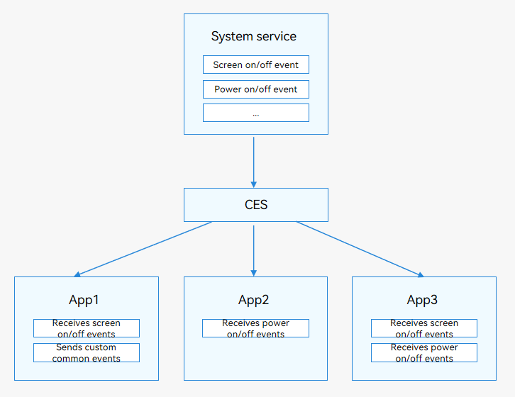

# Introduction to Common Events

OpenHarmony provides Common Event Service (CES) for applications to subscribe to, publish, and unsubscribe from common events.

Common events are classified into system common events and custom common events.

- System common events: defined in CES. Only system applications and system services can publish system common events, such as HAP installation, update, and uninstall. For details about the supported system common events, see [Support](../reference/apis/js-apis-commonEventManager.md#support).

- Custom common events: customized by applications to implement cross-process event communication.

Common events are also classified into unordered, ordered, and sticky common events.

- Unordered common events: common events that CES forwards based on the subscription sequence, regardless of whether subscribers receive the events.

- Ordered common events: common events that CES forwards based on the subscriber priority. CES forwards common events to the subscriber with lower priority only after receiving a reply from the previous subscriber with higher priority.

- Sticky common events: common events that can be sent to a subscriber before they initiate a subscription.  Only system applications and system services can send sticky common events, and they must request the **ohos.permission.COMMONEVENT_STICKY** permission. For details about the configuration, see [Permission Application Guide](../security/accesstoken-guidelines.md#declaring-permissions-in-the-configuration-file).

Each application can subscribe to common events as required. After your application subscribes to a common event, the system sends it to your application every time the event is published. Such an event may be published by the system, other applications, or your own application.

**Figure 1** Common events
