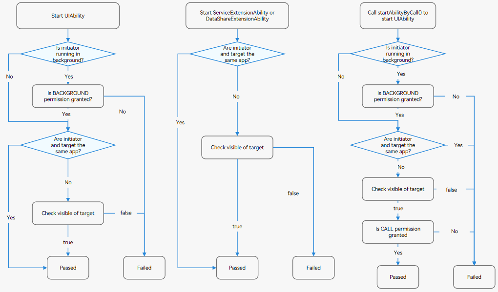
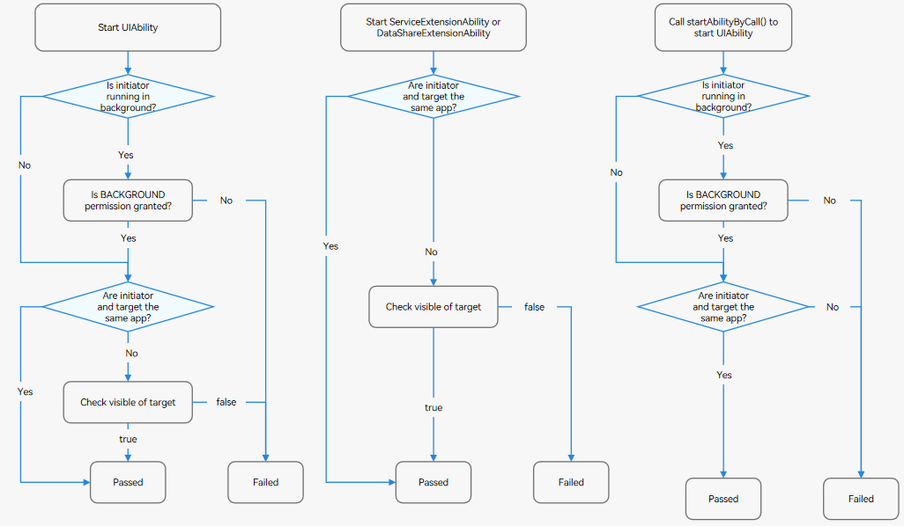

# Component Startup Rules (Stage Model)

Component startup refers to the behavior of starting or connecting to an application component.

- Start the UIAbility, ServiceExtensionAbility, and DataShareExtensionAbility components. For example, you can use **startAbility()**, **startServiceExtensionAbility()**, and **startAbilityByCall()**.

- Connect to the ServiceExtensionAbility and DataShareExtensionAbility components. For example, you can use **connectServiceExtensionAbility()** and **createDataShareHelper()**.

To deliver a better user experience, OpenHarmony restricts the following behavior:

- A background application randomly displays a dialog box, such as an ads pop-up.

- Background applications wake up each other. This type of behavior occupies system resources and increases power consumption, or even causes system frozen.

- A foreground application randomly redirects to another application, for example, redirecting to the payment page of another application. This type of behavior poses security risks.

In view of this, OpenHarmony formulates a set of component startup rules, as follows:

- **Before starting a component of another application, verify the visible field of the target component.**
  - If the **exported** field of the target component is **false**, verify the **ohos.permission.START_INVISIBLE_ABILITY** permission.
  - For details, see [Component exported Configuration](../quick-start/module-configuration-file.md#abilities).

- **Before starting a component of a background application, verify the BACKGROUND permission.**
  - An application is considered as a foreground application only when the application process gains focus or its UIAbility component is running in the foreground.
  - Verify the **ohos.permission.START_ABILITIES_FROM_BACKGROUND** permission.

- **When the startAbilityByCall() method is used, verify the call permission.** For details, see [Using Call to Implement UIAbility Interaction](uiability-intra-device-interaction.md#using-call-to-implement-uiability-interaction) and [Using Cross-Device Call](hop-multi-device-collaboration.md#using-cross-device-call).
  - Verify the **ohos.permission.ABILITY_BACKGROUND_COMMUNICATION** permission.

> **NOTE**
>
> - Component startup control has been implemented since OpenHarmony v3.2 Release.
> 
> - The new component startup rules are more strict than the original ones. You must be familiar with the new startup rules to prevent service exceptions.

## Intra-Device Component Startup Rules

  The rules for starting components on the same device vary in the following scenarios:

- Starting or connecting to the UIAbility, ServiceExtensionAbility, and DataShareExtensionAbility components

- Using **startAbilityByCall()** to start the UIAbility component

## Inter-Device Component Startup Rules

  The rules for starting components on a different device vary in the following scenarios:

- Starting or connecting to the UIAbility, ServiceExtensionAbility, and DataShareExtensionAbility components

- Using **startAbilityByCall()** to start the UIAbility component

