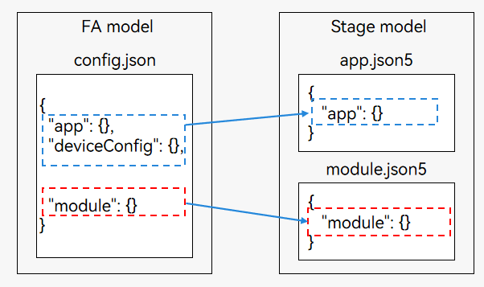

# Differences in Configuration Files

The FA model uses the [config.json file](../quick-start/application-configuration-file-overview-fa.md) to describe the basic information about an application. An application can have multiple modules, and each module has a **config.json** file. The **config.json** file consists of three parts: **app**, **deviceConfig**, and **module**. The **app** tag is used to configure application-level attributes. If an application has multiple modules, the **app** configuration in each **config.json** file must be consistent.

The stage model uses the [app.json5](../quick-start/app-configuration-file.md) and [module.json](../quick-start/module-configuration-file.md) files to describe the basic information about an application. An application can have multiple modules but only one **app.json5** file. This file is used to configure application-level attributes and the configuration applies to all the modules. Each module has a **module.json5** file, which is used to configure module-level attributes and the configuration applies only for the current module.

**Figure 1** Configuration file differences

