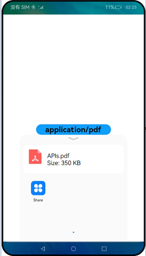

# Using Want to Share Data Between Applications


Users often need to share data (such as a text or an image) from one application to another. The following uses PDF file sharing as an example to describe how to use Want to share data between applications.


## Prerequisites

1. There are two UIAbility components (one for the sharing party and the other for the shared party) and one system component (used as the application selector). When the sharing party initiates data sharing through **startAbility()**, the application selector is started. The system implicitly matches and displays all applications that support the type of data to share. After the user selects an application, the system starts that application to complete data sharing.

2. In this section, data sharing is triggered by touching a button. You can use other ways to trigger data sharing during application development. This section focuses on the Want configuration used for data sharing.

3. The following actions are involved in this section:
   - **ACTION_SELECT (ohos.want.action.select)**: action of displaying the application selector.  
   - **ACTION_SEND_DATA (ohos.want.action.sendData)**: action of launching the UI for sending a single data record. It is used to transfer data to the shared party.


## How to Develop

- Sharing party
  1. In the stage mode, the [File Descriptor (FD)](../reference/apis/js-apis-fileio.md#fileioopensync) is used for file transfer. This example assumes that the path of the file to share is obtained.
     
      ```ts
      import fileIO from '@ohos.fileio';
      
      // let path = ...
      // Open the file whose path is a variable.
      let fileFd = fileIO.openSync(path, 0o102, 0o666);
      ```
      
  2. As described in the prerequisites, the sharing party starts an application selector and shares the data to the selector, and the selector transfers the data to the shared party. Want of the sharing party must be nested at two layers. At the first layer, implicit Want is used together with the **ohos.want.action.select** action to display the application selector. At the second layer, complete Want is declared in the custom field **parameters** to transfer the data to share.
     
      ```ts
      import wantConstant from '@ohos.app.ability.wantConstant';
      
      // let path = ...
      // let fileFd = ...
      // let fileSize = ...
      let want = {
          / This action is used to implicitly match the application selector.
          action: wantConstant.Action.ACTION_SELECT,
          // This is the custom parameter in the first layer of Want,
          / which is intended to add information to the application selector.
          parameters: {
              // MIME type of PDF.
              "ability.picker.type": "application/pdf",
              "ability.picker.fileNames": [path],
              "ability.picker.fileSizes": [fileSize],
              // This nested Want ,which will be directly sent to the selected application.        
              "ability.want.params.INTENT": {
                  "action": "ohos.want.action.sendData",
                  "type": "application/pdf",
                  "parameters": {
                     "keyFd": {"type": "FD", "value": fileFd}
                  }
              }
          }
      }
    ```
  
    In the preceding code, the custom field **parameters** is used. The **ability.picker.\*** fields in the first-layer **parameters** are used to pass the information to be displayed on the application selector. The following fields are involved:
  
      - **"ability.picker.type"**: The application selector renders the file type icon based on this field.
      - **"ability.picker.fileNames"**: The application selector displays the file name based on this field.
      - **"ability.picker.fileSizes"**: The application selector displays the file size based on this field. The unit is byte.
    - **"ability.picker.fileNames"** and **"ability.picker.fileSizes"** are arrays and have a one-to-one mapping.
  
      For example, when **"ability.picker.type"** is **"application/pdf"**, **"ability.picker.fileNames"** is **"["APIs.pdf"]"**, and **"ability.picker.fileSizes"** is **"[350 \* 1024]"**, the application selector is displayed as follows:
      
      
      
      In the preceding code, the **ability.want.params.INTENT** field is nested Want. In this field, **action** and **type** are used for implicit matching by the application selector. For details about implicit matching, see [Implicit Want Matching Rules](explicit-implicit-want-mappings.md#interpretation-of-implicit-want-matching-rules). After the user selects an application, the nested Want of the **ability.want.params.INTENT** field is passed to that application.
  
- Shared party
  1. As mentioned above, the application selector performs implicit matching based on the **ability.want.params.INTENT** field. Therefore, you must set **skills** in the ability configuration file (**module.json5** file in the stage model) of the shared party as follows:
     
      ```ts
      "skills": [
        {
          "entities": [
            // ...
          ],
          "actions": [
              "ohos.want.action.sendData"
              // ...
          ],
          "uris": [
            {
              "type": "application/pdf"
            },
            // ...
          ]
        },
      ]
      ```

      The **actions** and **type** fields in **uris** match the **action** and **type** fields in **ability.want.params.INTENT**, respectively.

      Files can be transferred in FD mode, but not URI mode. In implicit matching, the **type** field in Want must match the **type** field in **uris** under **skills** of the shared party. Therefore, specify only the **type** field in **uris**. If **host** and **port** are specified, the matching fails. The application selector initiates implicit matching based on **ability.want.params.INTENT**. Therefore, when the **uri** field added to **ability.want.params.INTENT** matches the **uris** field under **skills**, the matching is successful and additional data can be transferred.
  2. After the application selector starts the shared party, the system calls **onCreate** and passes **ability.want.params.INTENT** to the **want** parameter.
     
      ```ts
      onCreate(want, launchParam) {
        // When keyFd is undefined, the application crashes.
        if (want["parameters"]["keyFd"] !== undefined) {
          // Receive the file descriptor.
          let fd = want["parameters"]["keyFd"].value;
          // ...
        }
      }
      ```
