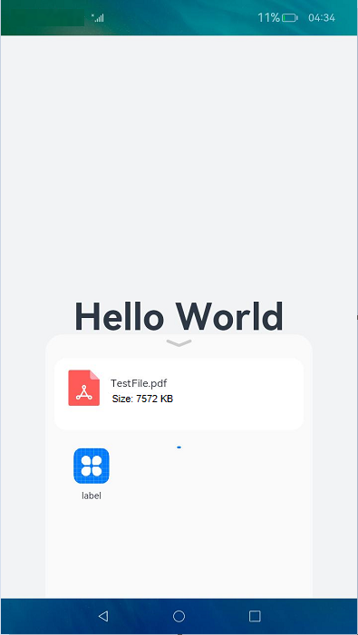

# Using Want to Share Data Between Applications

Users often need to share data (such as a text or an image) from one application to another. The following uses PDF file sharing as an example to describe how to use Want to share data between applications.

Data sharing requires two UIAbility components (one for the sharing party and the other for the shared party) and one system component (used as the application sharing box). When the sharing party initiates data sharing by calling **startAbility()**, the system implicitly matches and displays all applications that support the type of data to share. After the user selects an application, the system starts the application to complete data sharing.

In this section, data sharing is triggered by touching a button. You can use other ways to trigger data sharing during application development. This section focuses on how to configure Want to implement data sharing.

The following actions are involved for data sharing:

- **ohos.want.action.select**: action of starting the application sharing box.
- **ohos.want.action.sendData**: action of sending a single data record, that is, transferring data to the shared party.

## Sharing Party

The sharing party starts an application sharing box and transfers the data to the shared party. Therefore, Want of the sharing party must be nested at two layers. In the first layer, implicit Want is used together with the **ohos.want.action.select** action to display the application sharing box. In the second layer, the data to share is declared

in the custom field **parameters**, and then the Want that includes the **ohos.want.action.sendData** action and the **parameters** field is transferred to the application sharing box. The shared party obtains the shared data from **parameters**.

```ts
import common from '@ohos.app.ability.common';

let fileType = 'application/pdf';
let fileName = 'TestFile.pdf';
let fileFd = -1; // Obtain the file descriptor (FD) of the file to share.
let fileSize; // Obtain the size of the file to share.

function implicitStartAbility() {
  let context = getContext(this) as common.UIAbilityContext;
  let wantInfo = {
    / This action is used to implicitly match the application sharing box.
    action: 'ohos.want.action.select',
    // This is the custom parameter in the first layer of Want,
    / which is intended to add information to the application sharing box.
    parameters: {
      // MIME type of PDF.
      'ability.picker.type': fileType,
      'ability.picker.fileNames': [fileName],
      'ability.picker.fileSizes': [fileSize],
      // This is nested Want ,which will be directly sent to the selected application.
      'ability.want.params.INTENT': {
        'action': 'ohos.want.action.sendData',
        'type': 'application/pdf',
        'parameters': {
          'keyFd': { 'type': 'FD', 'value': fileFd }
        }
      }
    }
  }
  context.startAbility(wantInfo).then(() => {
    ...
  }).catch((err) => {
    ...
  })
}
```

> **NOTE**
>
> Data sharing can be implemented only in FD format. For details about how to obtain the FD and file name, see [File Management](../reference/apis/js-apis-file-fs.md).

In the preceding code, under the custom field **parameters**, the following **ability.picker.*** fields are used to pass the information to be displayed on the application sharing box:

- **ability.picker.type**: file type icon.
- **ability.picker.fileNames**: file name.
- **ability.picker.fileSizes**: file size, in bytes.
- **ability.picker.fileNames** and **ability.picker.fileSizes** are arrays and have a one-to-one mapping.

The following figure shows an example.  


## Shared Party

To enable the shared party to identify the shared content, configure **skills** in the [module.json5 file](../quick-start/module-configuration-file.md) of the UIAbility of the shared party. The **actions** and **type** fields in **uris** match the **action** and **type** fields in **ability.want.params.INTENT** of the sharing party, respectively.

```json
{
  "module": {
    ...
    "abilities": [
      {
        ...
        "skills": [
          {
            ...
            "actions": [
              "action.system.home",
              "ohos.want.action.sendData"
              ...
            ],
            "uris": [
              {
                "type": "application/pdf"
              },
            ]
          }
        ]
      }
    ]
  }
}
```

After the user selects an application, the Want nested in the **ability.want.params.INTENT** field is passed to that application. After the UIAbility of the application starts, the application obtains **want** information from [**onCreate()**](../reference/apis/js-apis-app-ability-uiAbility.md#uiabilityoncreate) or [**onNewWant()**](../reference/apis/js-apis-app-ability-uiAbility.md#uiabilityonnewwant).

The following is an example of the Want obtained. You can use the FD of the shared file to perform required operations.

```json
{
    "deviceId": "",
    "bundleName": "com.example.myapplication",
    "abilityName": "EntryAbility",
    "moduleName": "entry",
    "uri": "",
    "type": "application/pdf",
    "flags": 0,
    "action": "ohos.want.action.sendData",
    "parameters": {
        "component.startup.newRules": true,
        "keyFd": {
            "type": "FD",
            "value": 36
        },
        "mime-type": "application/pdf",
        "moduleName": "entry",
        "ohos.aafwk.param.callerPid": 3488,
        "ohos.aafwk.param.callerToken": 537379209,
        "ohos.aafwk.param.callerUid": 20010014
    },
    "entities": []
}
```
